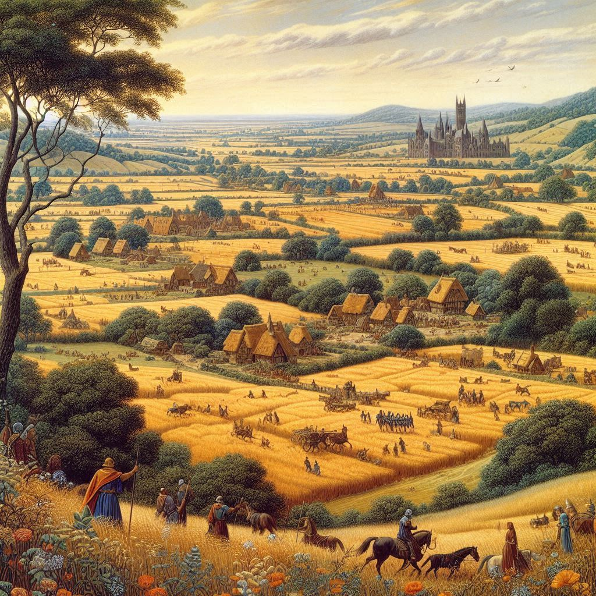

## Chapter 1

Imagine yourself in medieval England, the year 1086. You are one of the newly conquered subjects of King William the Conqueror, who has recently seized the English throne. The land is still reeling from the bloody Battle of Hastings, and the air is thick with the tension of a kingdom in transition. Amidst this backdrop, you hear rumors of a grand undertaking that is about to unfold.

King William, determined to consolidate his power, has commissioned the Domesday Book, a complete inventory of his new kingdom’s wealth, resources, and populace. Its purpose is clear — to create an authoritative record that will ensure effective taxation and control.

As a villager in one of the countless small hamlets scattered across England, you watch the royal commissioners arrive. They are here to speak with the local lords, who, in turn, summon you and your neighbors for gathering information for the Book.

The commissioners ask lots of difficult questions. How much land does your lord hold? What resources are available on this land? How many cattle, sheep, and pigs are there? They want to know about the number of villagers, smallholders, and slaves in your community. The value of the land before and after the Norman conquest. The types of crops grown. The presence of mills, fisheries, and woodlands. Every thing, small and big, becomes ink on parchment; and just like that, unbeknownst to you, enters history.

Months pass, and the information from every village, town, and manor is compiled into the Book. The sheer scope of this project is staggering, and yet, by the end, the deed is done. Finally, the Book is complete. Disputes over land ownership and taxes can now be settled with reference to this authoritative document. Definitions of obligations and rights are now clearer and more structured. For the kingdom, it signifies a move towards more structured governance.

## Chapter 2

If you think about it, the Domesday Book is one of many very early examples of the transformation of everyday life into data, aiming to better understand, organize and control the world. We call this process **_dataification_**.

Centuries passed. Societies evolved, new technologies emerged, industrialization took hold. The need for efficient management of burgeoning urban populations and complex economic systems became crucial. Governments and businesses started collecting and crunching data on an unprecedented scale. Census data, economic indicators, health statistics, and more began to be systematically gathered and analyzed to inform decision-making processes. This practice not only improved efficiency, but also enabled more precise targeting of resources and services.

Fast forward to the 20th century, and the emergence of computers and the internet exponentially increased the capacity to collect, store, and manipulate data. The 21st century, with its advent of big data, artificial intelligence, and the Internet of Things (IoT), has taken this to new heights. Every click, every purchase, every social media post is now a data point, feeding into vast databases that drive decisions in real-time. 

Companies like Google, Amazon, and Facebook have built empires on the ability to turn data into actionable insights. Governments use data to shape public policy, improve services, and enhance security. Health professionals leverage data to predict outbreaks, tailor treatments, and improve patient outcomes. Researchers rely on a range of digital tools and data-oriented methodologies for gathering, presenting, analyzing, and drawing conclusions from data to advance their research projects.

## Chapter 3 

Scientific research, in particular, has been revolutionized by dataification and digital technology. In fields like physics, biology, and environmental science, the ability to process large datasets has led to breakthroughs that were previously unimaginable. Genomic research, for instance, relies heavily on data from millions of DNA sequences to uncover patterns and develop new treatments for diseases. Climate scientists use vast amounts of data from satellites, weather stations, and ocean buoys to model and predict climate change. Physicists explore the fundamental laws of nature by conducting large-scale experiments that generate petabytes of data.

However, the impact of dataification is not limited to the natural sciences. Indeed, slowly but surely, humanities research has also seen its fair share of transformations. Scholars in fields such as history, literature, and linguistics, have always produced data during their endeavors, probably without even realizing it: texts, comments, interpretations, audio, video, images, tables, methodologies, and the list goes on. Now they have access to digital tools and computational approaches  -- text mining, digital libraries, geographic information systems, etc. -- that allow them to explore and use these data in new ways. 

Of course, these new approaches and tools are not only an opportunity, but also a _challenge_. They challenge researchers to embrace interdisciplinary approaches. They encourage the exploration of non-traditional sources. Most importantly, they demand a re-evaluation of established methodologies in scholarly enquiry. This is a difficult, complex, and fascinating endeavor, that demanded for the emergence of a new field, at the heart of the intersection between dataification, technology and humanities: **_Digital Humanities_** (or DH for short).

## Chapter 4

Coined in the early 2000s, the term encompasses various concepts and has been the center of many debates. But what exactly _are_ they? This very question represents, in itself, a gordian knot, since apparently _nobody_ seems to be able to agree on a single defintion. As frustrating as it can be, this cannot be helped: the debate about what DH are truly mirrors their own capricious nature. Is it a community, a research endeavor, a set of methodologies? _Digital Humanities_ isn't a fixed label; it's more like a **_floating signifier_**, an open invitation to constantly question and redefine itself.

Kathleen Fitzpatrick, in defining DH, offers an insightful perspective:

> a nexus of fields within which scholars use computing technologies to investigate the kinds of questions that are traditional to the humanities, or [...] ask traditional kinds of humanities-oriented questions about computing technologies.

I consider this definition to be extremely valuable because, in its brevity, it perfectly recognizes the interplay between _digital_ and _humanities_. On the one hand, _digital_ is about hardware, software, and algorithms. On the other hand, _humanities_ bring in their interpretive, speculative, and comparative flair. The digital tends to _abstraction_, cutting superfluous details in order to simplify things, and ultimately focuses on implementation. The humanities, by contrast, naturally tend to _complexity_, the valorization of the unique nature of their objects of study, and the irreducibility of human culture and art to any computational process, mechanism or representation.

## Chapter 5
In addition, humanities inject a unique richness into computational endeavors by incorporating critical inquiries about diversity, complexity, materiality, context, and situated perspectives in the research discourse, exposing structural assumptions of our reality. However, a growing number of people (hailing from both academia and society at large) feel either consciously or unconsciously that humanities' contribution should extend beyond pure thought and delve into pragmatic action, addressing the needs of diverse audiences and effecting meaningful change in academic and public communities. Here is where computation truly shines: computers, software, applications are tools that can turn these _data_ into tangible impact. We can design technical solutions for research questions informed by a nuanced understanding of cultural, historical, and societal contexts. By applying digital methods, we don't just analyze conquer the world to conquer it; we actively _engage_ with it.

Therefore, the defining goal (and struggle) of Digital Humanities should be providing literacy for the contemporary world. By _literacy_, I like to refer to the definition provided by UNESCO:

> a continuum of learning and proficiency in reading, writing and using numbers throughout life and is part of a larger set of skills, which include digital skills, media literacy, education for sustainable development and global citizenship as well as job-specific skills

In the case of humanities, the objective is encouraging (i.e. "educating") in the "construction" (intellectual, social, ideological process) of something that generates knowledge within the academic, public, and private debate around the intellectual productions of human thought, integrating it into other increasingly relevant themes defining our times, such as data, scientific reproducibility, accessibility, artificial intelligence, and so on.

In my opinion, the pillars on which such objective should be built are:
* Development of practical data-related skills
* Interpretive approaches to traditional and digital data
* Enhancement, dissemination, and use of research results

And where should we hone these skills, approaches, and communication methods, if not through projects?

## Chapter 6

What is a Project? --> one-off, non-repeated set of tasks, which achieves clearly stated objectives within a time limit

choose two --> good - fast - cheap

triple constraints --> schedule - scope - cost

before jumping into the cycle --> study the audience (think like an editor/indexer/cataloguer): who will use the resource? what they will do with it? what questions can you ask of your digital creation? (persona, scenario, use case) - set project goals and a plan - manage the project  and acheve those goals - take a look around and do benchmarks - document everything

--- (https://www.digitalhumanities.org/dhq/vol/11/1/000284/000284.html)

A project is a basic unit of digital humanities (DH) scholarship 
Digital Humanities (DH) is scholarship that is commonly practiced through collaborative work, organised in projects.

DH projects involve building (or at least using) digital tools, which brings the complex tensions between digital and humanistic aspects of these projects.

As project-based scholarship of DH differs from traditional scholarship in being experimental, modular and incremental, and involving many dimensions of digital design and technology

DH is project-oriented scholarship. DH scholars organise their undertakings in terms of projects as collaborative research endeavours, which are, as the verb 'to project' suggests, future-oriented

Burdick et al. point out that despite many difference between projects of digital and traditional humanities, there are many similarities among them [Burdick et al. 2012]. Both digital and traditional humanities involve practices of analysis, critics, interpretations, editing, historical research, relations between individual and society, etc. DH also deal with qualitative features of human experience such as complexity, ambiguity, media specificity, and subjectivity. Although DH extends beyond textual media, the aim of DH is to be based on values of the humanistic tradition: tendency for analytical rigour and clarity, building of effective arguments, rigourous use of evidence, and communicative expression.

DH projects are considered more as process-based rather than product-based.

DH projects frequently involve building (or at least using) digital tools, which foregrounds the embedded tensions between digital and humanistic in DH discipline itself. Svensson argues that DH is dominated by two basic trends: one focusing on building digital technology tools, and another, focusing on using digital technology as a communication tool in the humanities

The clash of assumptions between traditional and digital humanities is marked by tensions between digital and humanistic, thus between different ways of thinking and practice of computing and the humanities.

scholars from the humanities have different information behaviour than scholars from natural and physical sciences, and that it is more difficult to design digital tools for the humanities scholars.

The most typical roles in DH projects are technical expertise (we could identify it as D in DH) and subject matter expertise (H in DH)

Project-based scholarship of DH differs from traditional scholarship in being experimental, team-based, iterative and ongoing, rather than fixed or final, in its outcome, involving “many dimensions of conception, design, coordination, and resource use that build extra layers of complexity onto the traditional approach to humanities research”

Balancing between the digital (technical problems) and the humanities (stakeholders) is a significant issue in DH discipline, and perhaps a major reason for renaming humanities computing into digital humanities.

---

Again, let us focus on research. In an academic context, a DH project uses computational methods and technologies as an integral part of the research process, the dissemination of research results, and interaction with a wide audience of users. Examples include digital editions, bibliographic databases, data analysis applications, GIS applications, and many others.

Despite their huge variety in type and scope, DH projects tend to be characterized as follows:
* Use of data-based tools and methods
* Need to manage digital resources (e.g. a collection of documents or data saved in one or more files in a specific format)
* structured, informative, and interpretable organization of resources
* digital publication of resources

The common and most important goal of any DH project is to create a scientifically valid, reliable, and reusable resource that addresses one or more research questions, methodologies, and themes relevant to the humanities (text, interpretation, uncertainty, human experience, etc.).

### Selecting and Creating

The first step in the process involves the careful selection of resources that are relevant to the research objectives. These resources are then digitally acquired or transcribed to create a digital version. This phase also includes the production or reuse of datasets, which are essential for further analysis. For example, a project might involve collecting and transcribing a series of historical documents to create a digital edition that can be easily accessed and analyzed.

### Describing

Once the resources are gathered, the next step is to thoroughly analyze their content, context, and potential users. This involves selecting or designing appropriate metadata schemas, controlled vocabularies, and other standards to ensure the resources are accurately described and easily searchable. For instance, one might define a markup schema to outline the structure of the documents and develop ontologies to categorize the content and relationships within the data.

### Managing and Preserving

Managing and preserving digital resources is crucial to ensure their longevity and accessibility. This involves reflecting on the archiving service to be used, conducting quality control checks, and implementing measures to guarantee long-term access. For example, choosing a reliable server to host the digital edition and publishing the dataset on platforms like Zenodo are critical steps in this phase.

### Discovering

The discovery phase focuses on processing, analyzing, and querying the resources to extract meaningful insights. It requires developing an infrastructure capable of hosting and managing the results effectively. An example of this would be the semi-automatic conversion of documents into formats that are suitable for semantic publication, facilitated by specialized applications and scripts.

### Using and Reusing

The final step involves designing and developing user-friendly interfaces, as well as creating query and download services to make the data accessible and useful. This phase also includes developing policies for sharing data and applications. For example, implementing robust search mechanisms, creating data visualizations, and providing download options are all essential for ensuring that the digital resources can be used and reused effectively by researchers and the public alike.

## Conclusion

As we have seen, the journey from the Domesday Book to the digital age highlights the profound impact of dataification on society. The Domesday Book was a groundbreaking effort to transform everyday life into data, laying the groundwork for systematic governance. Fast forward to today, and dataification permeates every aspect of our lives, driving decisions in industries, governments, and research. This transformation is particularly evident in the realm of scientific and humanities research, where the integration of digital tools and methodologies has revolutionized the way we gather, analyze, and disseminate knowledge.

In the humanities, the emergence of Digital Humanities (DH) represents a significant shift in how scholars approach their work. By leveraging computational methods, digital resources, and interdisciplinary collaboration, DH projects bridge the gap between traditional humanities and modern technology. This integration allows for deeper insights, broader accessibility, and more dynamic interactions with the research community and the public.

The process of selecting and creating resources, describing them with appropriate metadata, managing and preserving them for long-term access, discovering meaningful patterns and insights, and designing user-friendly interfaces for their use and reuse are all crucial steps in any DH project. These steps ensure that digital resources are not only scientifically valid and reliable but also accessible and reusable for future research.

## References
- https://whatisdigitalhumanities.com/
- https://dhdebates.gc.cuny.edu/projects/debates-in-the-digital-humanities
- https://dhdebates.gc.cuny.edu/projects/debates-in-the-digital-humanities-2016
- https://cmu-lib.github.io/dhlg/

### Did you find this page helpful? Consider sharing it 🙌
