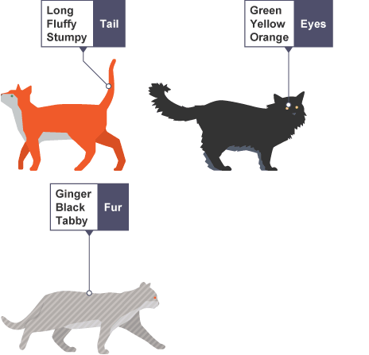

# Pensiero Computazionale

## Lezione 02 del corso di _Abilità Informatiche_ (2024/2025)

###### Sebastian Barzaghi | [sebastian.barzaghi2@unibo.it](mailto:sebastian.barzaghi2@unibo.it) | [https://orcid.org/0000-0002-0799-1527](https://orcid.org/0000-0002-0799-1527) | [https://www.unibo.it/sitoweb/sebastian.barzaghi2/](https://www.unibo.it/sitoweb/sebastian.barzaghi2/)

---



## L'incantatrice dei numeri

<!--
Marlyn Wescoff (standing) and Ruth Lichterman reprogram the ENIAC in 1946. https://www.messynessychic.com/2021/11/02/human-computer-the-forgotten-womens-profession/
-->

---

### The kilo-girls

  

    <figure>
      
        <figcaption>
            Fonte: <a href="https://www.bbc.co.uk/bitesize/guides/zp92mp3/revision/1">https://www.bbc.co.uk/bitesize/guides/zp92mp3/revision/1</a>.
        </figcaption>
    </figure>
  

  

    

      Prima degli anni ‘40: il computer è una persona che effettua calcoli numerici a mano (es. posizioni dei pianeti, conversioni al sistema metrico).
    

  

Copeland, B. Jack, "The Modern History of Computing", The Stanford Encyclopedia of Philosophy (Winter 2020 Edition), Edward N. Zalta (ed.), URL: <a href="https://plato.stanford.edu/archives/win2020/entries/computing-history/">https://plato.stanford.edu/archives/win2020/entries/computing-history/</a>.

---

### Machine of the year

  

    <figure>
      
        <figcaption>
            Fonte: <a href="https://www.computerhistory.org/timeline/1982/">https://www.computerhistory.org/timeline/1982/</a>.
        </figcaption>
    </figure>
  

  

    

      Dopo gli anni '40: sistema elettronico (programmabile o non programmabile) di elaborazione delle informazioni.
    

  

Copeland, B. Jack, "The Modern History of Computing", The Stanford Encyclopedia of Philosophy (Winter 2020 Edition), Edward N. Zalta (ed.), URL: <a href="https://plato.stanford.edu/archives/win2020/entries/computing-history/">https://plato.stanford.edu/archives/win2020/entries/computing-history/</a>.

---

### Una definizione generale

  

    <figure>
      
        <figcaption>
            Fonte: <a href="https://www.computerhistory.org/timeline/1986/">https://www.computerhistory.org/timeline/1986/</a>.
        </figcaption>
    </figure>
  

  

    

      Un agente che, se istruito correttamente, esegue calcoli a partire da qualche informazione iniziale (detta input) per produrre una risposta (detta output).
    

  

Copeland, B. Jack, "The Modern History of Computing", The Stanford Encyclopedia of Philosophy (Winter 2020 Edition), Edward N. Zalta (ed.), URL: <a href="https://plato.stanford.edu/archives/win2020/entries/computing-history/">https://plato.stanford.edu/archives/win2020/entries/computing-history/</a>.

---

### Componenti: Hardware

  

    <figure>
      
        <figcaption>
            Fonte: <a href="https://www.britannica.com/facts/computer#/media/1/130429/94239">https://www.britannica.com/facts/computer#/media/1/130429/94239</a>.
        </figcaption>
    </figure>
  

  

    

      L'insieme delle componenti fisiche (alimentatori, elementi circuitali fissi, unità di memoria, ecc.), di un computer.
    

  

Hemmendinger, D. , Pottenger, . William Morton , Freiberger, . Paul A. and Swaine, . Michael R. (2023, December 28). computer. Encyclopedia Britannica. <a href="https://www.britannica.com/technology/computer">https://www.britannica.com/technology/computer</a>.

---

### Alcuni elementi hardware

Piccoli chip di silicio che contengono innumerevoli transistor che funzionano come interruttori elettrici:
* Central Processing Unit (CPU): componente che coordina tutte le operazioni da eseguire;
* Random Access Memory (RAM): memoria volatile per registrare temporaneamente i dati;
* Read-Only Memory (ROM): memoria di sola lettura che contiene informazioni fisse e immodificabili;
* Memoria di massa (hard disk): memoria dove vengono conservati i dati in modo permanente;
* Scheda madre: connettore di tutti gli altri componenti interni.

Periferiche (Input/Output): tastiera, monitor, mouse...

Hemmendinger, D. , Pottenger, . William Morton , Freiberger, . Paul A. and Swaine, . Michael R. (2023, December 28). computer. Encyclopedia Britannica. <a href="https://www.britannica.com/technology/computer">https://www.britannica.com/technology/computer</a>.

---

### Componenti: Software

  

    <figure>
      
        <figcaption>
            Fonte: <a href="https://www.britannica.com/technology/computer/images-videos#/media/1/130429/19612">https://www.britannica.com/technology/computer/images-videos#/media/1/130429/19612</a>.
        </figcaption>
    </figure>
  

  

    

      L’insieme delle componenti digitali (es. programmi, procedure, applicativi) assiociate alle operazioni effettuate da un computer.
    

    <ul>
      <li>Software di sistema: controlla il funzionamento interno del computer (es. sistema operativo) e gestisce anche dispositivi esterni;</li>
      <li>Software applicativo: fa eseguire ai computer i comandi dell'utente e include programmi che elaborano dati.</li>
    </ul>
  

Hemmendinger, D. , Pottenger, . William Morton , Freiberger, . Paul A. and Swaine, . Michael R. (2023, December 28). computer. Encyclopedia Britannica. <a href="https://www.britannica.com/technology/computer">https://www.britannica.com/technology/computer</a>.

---



## Pensare ~~come un computer~~ computazionalmente

<!--
Photo by <a href="https://unsplash.com/@museumsvictoria?utm_content=creditCopyText&utm_medium=referral&utm_source=unsplash">Museums Victoria</a> on <a href="https://unsplash.com/photos/woman-in-black-coat-standing-in-front-of-mirror-WGeO6dW5GZM?utm_content=creditCopyText&utm_medium=referral&utm_source=unsplash">Unsplash</a>
-->

---

### I computer servono a risolvere problemi

Tuttavia, prima che un problema possa essere affrontato, è necessario comprendere il problema stesso e i modi in cui potrebbe essere risolto.

Il pensiero computazionale ci permette di prendere un problema complesso, capire di che si tratta e sviluppare possibili soluzioni. 

Possiamo poi presentare queste soluzioni in un modo che un computer, un essere umano, o entrambi, possano comprendere.

---

### Mindstorms (Papert, 1980)

Impariamo costruendo iterativamente conoscenza.

Le _rappresentazioni potenti_ consentono un apprendimento efficace.

Il computer come _meta-strumento_ per “rendere l’astratto concreto” tramite un apprendimento per tentativi, sbagli, e correzioni.

Il pensiero computazionale come strumento di apprendimento basato sulla costruzione socialmente ed emotivamente partecipata di un artefatto.

Lodi, M., & Martini, S. (2021). Computational thinking, between Papert and Wing. Science & education, 30(4), 883-908. <a href="https://doi.org/10.1007/s11191-021-00202-5">https://doi.org/10.1007/s11191-021-00202-5</a>. 

---

### Computational Thinking (Wing, 2006)

Esiste una disponibilità enorme di strumenti digitali, soprattutto sul World Wide Web.

La maggior parte delle discipline diventano “computazionali”.

Diventa quindi necessario assumere un approccio basato sulla computazione che aiuta a risolvere problemi e progettare soluzioni.

Lodi, M., & Martini, S. (2021). Computational thinking, between Papert and Wing. Science & education, 30(4), 883-908. <a href="https://doi.org/10.1007/s11191-021-00202-5">https://doi.org/10.1007/s11191-021-00202-5</a>. 

---

### I principi della computazione

  

    <figure>
      
        <figcaption>
            Fonte: <a href="https://www.bbc.co.uk/bitesize/guides/zp92mp3/revision/1">https://www.bbc.co.uk/bitesize/guides/zp92mp3/revision/1</a>.
        </figcaption>
    </figure>
  

  

    <ul>
      <li><strong>Decomposizione</strong>: dividere un problema in parti più piccole e gestibili;</li>
      <li><strong>Riconoscimento di pattern</strong>: cercare somiglianze e tendenze nei componenti del problema;</li>
      <li><strong>Astrazione</strong>: focalizzarsi solo sulle informazioni rilevanti, rimuovendo dettagli non necessari;</li>
      <li><strong>Algoritmi</strong>: sviluppare una soluzione sequenziale al problema.</li>
    </ul>
  

---

### Un approccio di risoluzione dei problemi basato sui principi della computazione

Il pensiero computazionale consiste nel prendere un problema complesso e suddividerlo in una serie di problemi più piccoli e gestibili (decomposizione). 

Ognuno di questi problemi più piccoli può essere esaminato singolarmente, considerando come problemi simili sono stati risolti in passato (riconoscimento di pattern) e concentrandosi solo sui dettagli importanti, ignorando le informazioni irrilevanti (astrazione). 

Successivamente, si possono progettare passi o regole semplici per risolvere ciascuno di questi problemi più piccoli (algoritmi).

Infine, questi semplici passi o regole vengono utilizzati per programmare un computer che aiuti a risolvere il problema complesso nel miglior modo possibile.

Lodi, M., & Martini, S. (2021). Computational thinking, between Papert and Wing. Science & education, 30(4), 883-908. a href="https://doi.org/10.1007/s11191-021-00202-5">https://doi.org/10.1007/s11191-021-00202-5</a>. 

---

### Attenzione

Pensare in modo computazionale non è programmazione.

Non significa nemmeno pensare come un computer, poiché i computer non pensano, e non possono pensare.

In parole semplici, la programmazione dice a un computer cosa fare e come farlo. Il pensiero computazionale ti permette di capire esattamente cosa dire al computer di fare.

---



## Un puzzle al contrario

<!--
Photo by <a href="https://unsplash.com/@melpoole?utm_content=creditCopyText&utm_medium=referral&utm_source=unsplash">Mel Poole</a> on <a href="https://unsplash.com/photos/white-blue-and-red-stars-print-textile-i6NcIJXdK10?utm_content=creditCopyText&utm_medium=referral&utm_source=unsplash">Unsplash</a>
-->

---

### Decomposizione

  

    <figure>
      
        <figcaption>
            Fonte: <a href="https://www.bbc.co.uk/bitesize/guides/zqqfyrd/revision/1">https://www.bbc.co.uk/bitesize/guides/zqqfyrd/revision/1</a>.
        </figcaption>
    </figure>
  

  

    

      Affrontare più fasi diverse contemporaneamente è molto più complicato che suddividere il problema in parti più piccole e risolverle una alla volta. 
    

    

      La decomposizione è la suddivisione di di un problema complesso o di un sistema in parti più piccole, che sono più gestibili e facili da comprendere.
    

  

---

### Esempio: risolvere un crimine

Risolvere un crimine può essere un problema molto complesso, poiché ci sono molte cose da considerare.

* quale crimine è stato commesso;
* quando è stato commesso il crimine;
* dove è stato commesso il crimine;
* quali solo le prove rilevanti;
* se ci sono stati testimoni;
* se ci sono stati recentemente crimini simili.

---

### Esempio: sviluppo di un videogioco

Immaginiamo di voler creare un videogioco. 

Domanda: _come possiamo usare la decomposizione per affrontare questo problema?_

---

### Esempio: sviluppo di un videogioco

Decomponiamo il problema in una serie di problemi più piccoli:

* che tipo di videogioco vogliamo creare;
* chi sarà il pubblico target del videogioco;
* come sono gli asset grafici;
* quali strumenti utilizziamo per svilupparlo;
* com'è l'esperienza dell'utente;
* come lo testiamo;
* dove lo distribuiamo e/o vendiamo.

---



## Schemi ovunque

<!--
Photo by <a href="https://unsplash.com/@magicpattern?utm_content=creditCopyText&utm_medium=referral&utm_source=unsplash">MagicPattern</a> on <a href="https://unsplash.com/photos/blue-and-white-checkered-pattern-KfFmwa7m5VQ?utm_content=creditCopyText&utm_medium=referral&utm_source=unsplash">Unsplash</a>
-->

---

### Riconoscimento di pattern

  

    <figure>
      
        <figcaption>
            Fonte: <a href="https://www.bbc.co.uk/bitesize/guides/zqqfyrd/revision/1">https://www.bbc.co.uk/bitesize/guides/zqqfyrd/revision/1</a>.
        </figcaption>
    </figure>
  

  

    

      Quando decomponiamo un problema complesso, spesso troviamo pattern tra i sotto-problemi. I pattern sono somiglianze o caratteristiche condivise che si ripetono.
    

    

      Trovare somiglianze tra i problemi decomposti ci permette di risolverli in modo più efficiente.
    

  

---

### Esempio: disegnare gatti

  

    <figure>
      
        <figcaption>
            Fonte: <a href="https://www.bbc.co.uk/bitesize/guides/zxxbgk7/revision/1">https://www.bbc.co.uk/bitesize/guides/zxxbgk7/revision/1</a>.
        </figcaption>
    </figure>
  

  

    

      Tutti i gatti condividono caratteristiche comuni (es. occhi, code e pelliccia). Queste caratteristiche sono pattern.
    

    

      Una volta che sappiamo come descrivere un gatto, possiamo descriverne altri, semplicemente seguendo questo schema. L'unica cosa che cambia sono i dettagli specifici.
    

  

---

### Perché dobbiamo cercare i pattern?

  

    <figure>
      
        <figcaption>
            Fonte: <a href="https://www.bbc.co.uk/bitesize/guides/zxxbgk7/revision/2">https://www.bbc.co.uk/bitesize/guides/zxxbgk7/revision/2</a>.
        </figcaption>
    </figure>
  

  

    

      Trovare pattern è fondamentale perché semplifica la risoluzione dei problemi, potendo applicare la stessa soluzione ovunque si presenti lo stesso pattern.
    

    

      Se vogliamo disegnare gatti, sapendo che tendenzialmente tutti i gatti hanno occhi, code e pelliccia, possiamo disegnarli rapidamente senza dover ripensare ogni volta le stesse caratteristiche.
    

  

---

### Pattern tra problemi diversi

  

    <figure>
      
        <figcaption>
            Fonte: <a href="https://www.bbc.co.uk/bitesize/guides/zxxbgk7/revision/3">https://www.bbc.co.uk/bitesize/guides/zxxbgk7/revision/3</a>.
        </figcaption>
    </figure>
  

  

    

      Preparare una torta implica risolvere vari problemi, come scegliere gli ingredienti e il tempo di cottura. Una volta che conosciamo il processo per una torta, possiamo applicarlo anche ad altre, poiché esistono schemi comuni, come le quantità precise di ingredienti e i tempi di cottura.
    

    

      Identificando questi pattern, possiamo trovare soluzioni comuni per problemi simili.
    

  

---

### Pattern nello stesso problema

Durante la preparazione di una torta, possiamo trovare pattern anche nei problemi più piccoli. 

Ad esempio, sapendo che "ogni torta avrà bisogno di una quantità precisa di ingredienti specifici", ogni ingrediente deve:

* essere identificato con un nome;
* avere una misura specifica.

Una volta che sappiamo come identificare ogni ingrediente e la sua quantità, possiamo applicare questo pattern a tutti gli ingredienti. 

Di nuovo, ciò che cambia sono i dettagli specifici.

---



## Non possediamo nient'altro che metafore

<!--
Photo by <a href="https://unsplash.com/@googledeepmind?utm_content=creditCopyText&utm_medium=referral&utm_source=unsplash">Google DeepMind</a> on <a href="https://unsplash.com/photos/diagram-schematic-OFt3fSN2qV4?utm_content=creditCopyText&utm_medium=referral&utm_source=unsplash">Unsplash</a>
-->

---

### Astrazione

  

    <figure>
      
        <figcaption>
            Fonte: <a href="https://www.bbc.co.uk/bitesize/guides/zttrcdm/revision/1">https://www.bbc.co.uk/bitesize/guides/zttrcdm/revision/1</a>.
        </figcaption>
    </figure>
  

  

    

      Quando decomponiamo i problemi, cerchiamo pattern tra e all'interno dei problemi più piccoli che compongono il problema complesso.
    

    

      L'astrazione è il processo di eliminare le caratteristiche dei pattern che non ci servono, per concentrarci su quelle che ci sono utili e creare così una rappresentazione di ciò che stiamo cercando di risolvere.
    

  

---



### Questa è Londra

<!--
Photo by <a href="https://unsplash.com/@bendavisual?utm_content=creditCopyText&utm_medium=referral&utm_source=unsplash">Benjamin Davies</a> on <a href="https://unsplash.com/photos/aerial-photography-of-london-skyline-during-daytime-Oja2ty_9ZLM?utm_content=creditCopyText&utm_medium=referral&utm_source=unsplash">Unsplash</a>
-->

---



### Questa è Londra?

<!--
Photo by <a href="https://unsplash.com/@londonschoolofeconomics?utm_content=creditCopyText&utm_medium=referral&utm_source=unsplash">LSE Library</a> on <a href="https://unsplash.com/photos/white-and-brown-city-buildings-sketch-yzrdcOgEs6c?utm_content=creditCopyText&utm_medium=referral&utm_source=unsplash">Unsplash</a>
-->

---

### La mappa non è il territorio, ma una sua interpretazione

Un’astrazione, che rappresenta qualcosa, non è quella cosa (ma può essere utile)!

Quando facciamo un'astrazione, stiamo esplicitando le nostre supposizioni sulla natura della cosa che stiamo semplificando.

Siegert, B. (2011). The map is the territory. Radical Philosophy, (5), 13-16. <a href="https://mediarep.org/server/api/core/bitstreams/d803e812-bda2-46c2-b798-e5f6a6c0431f/content">https://mediarep.org/server/api/core/bitstreams/d803e812-bda2-46c2-b798-e5f6a6c0431f/content</a>.

---

### Esempio: disegnare gatti (di nuovo)

  

    <figure>
      
        <figcaption>
            Fonte: <a href="https://www.bbc.co.uk/bitesize/guides/zttrcdm/revision/1">https://www.bbc.co.uk/bitesize/guides/zttrcdm/revision/1</a>.
        </figcaption>
    </figure>
  

  

    

      I gatti hanno caratteristiche generali comuni, come occhi, coda e pelliccia, che sono rilevanti per disegnarli. Tuttavia, dettagli specifici come il colore o la dimensione possono essere irrilevanti (e quindi eliminabili).
    

    

      L'astrazione ci permette di concentrarci solo sulle caratteristiche essenziali, creando così un'idea di base di cosa sia un gatto, che ci aiuta a disegnarlo.
    

  

---

### Esempio: preparazione di una torta

Quando si prepara una torta, ci sono alcune caratteristiche generali che accomunano le torte. 

Ad esempio, sappiamo che:

* Una torta ha bisogno di ingredienti;
* Ogni ingrediente necessita di una quantità specifica;
* Una torta necessita di un preciso tempo di cottura.

Di contro, se pensiamo ad un livello più generale, non dobbiamo sapere:

* Quali sono questi ingredienti;
* Quale sia la quantità dell'ingrediente;
* Quanto dura il tempo di cottura.

---

### Creare un modello

Un modello è un'idea generale, un'astrazione. 

Ad esempio, un modello di gatto rappresenta tutti i gatti, un modello di torta rappresenta tutte le torte, e così via.

I modelli ci permettono di comprendere gli schemi comuni tra gli oggetti o situazioni e di applicarli per risolvere il problema. 

Una volta creato un modello, possiamo progettare un algoritmo per risolverlo.

---



## Il nuovo dio

<!--
Photo by <a href="https://unsplash.com/@alpridephoto?utm_content=creditCopyText&utm_medium=referral&utm_source=unsplash">Андрей Сизов</a> on <a href="https://unsplash.com/photos/a-book-with-a-diagram-on-it-nuz3rK5iiKg?utm_content=creditCopyText&utm_medium=referral&utm_source=unsplash">Unsplash</a>
-->

---



### Una ricetta

<!--
Photo by <a href="https://unsplash.com/@picsbyjameslee?utm_content=creditCopyText&utm_medium=referral&utm_source=unsplash">James Lee</a> on <a href="https://unsplash.com/photos/text-Mfjq1hi-lVg?utm_content=creditCopyText&utm_medium=referral&utm_source=unsplash">Unsplash</a>
-->  

---



### Una carta di istruzioni

<!--
Photo by <a href="https://unsplash.com/@callemac?utm_content=creditCopyText&utm_medium=referral&utm_source=unsplash">Calle Macarone</a> on <a href="https://unsplash.com/photos/white-and-blue-instruction-guide-15wIddvL5dU?utm_content=creditCopyText&utm_medium=referral&utm_source=unsplash">Unsplash</a>
-->  

---



### Una mappa concettuale

<!--
Photo by <a href="https://unsplash.com/@charlesdeluvio?utm_content=creditCopyText&utm_medium=referral&utm_source=unsplash">charlesdeluvio</a> on <a href="https://unsplash.com/photos/a-couple-of-people-standing-in-front-of-a-wall-OWkXt1ikC5g?utm_content=creditCopyText&utm_medium=referral&utm_source=unsplash">Unsplash</a>
-->  

---

### Cosa hanno in comune?

---

### Cosa hanno in comune?

* Sequenziali;
* Finiti;
* Generali;
* Non ambigui;
* Corretti;
* Efficienti.

---

### Algoritmo

  

    <figure>
      
        <figcaption>
            Fonte: <a href="https://www.bbc.co.uk/bitesize/guides/zqqfyrd/revision/2">https://www.bbc.co.uk/bitesize/guides/zqqfyrd/revision/2</a>.
        </figcaption>
    </figure>
  

  

    

      Una sequenza finita di procedure precise per produrre un risultato (output) a partire da uno stato iniziale (input).
    

    

      Gli algoritmi sono spesso usati come base per sviluppare software. Possono essere espressi come diagrammi di flusso oppure come pseudocodice.
    

  

---

### Garbage in, garbage out

Se vogliamo dire a un computer di fare qualcosa, dobbiamo scrivere un programma che indichi, passo dopo passo, esattamente cosa vogliamo che faccia e come vogliamo che lo faccia. 

Questo programma necessita di pianificazione, e per farlo utilizziamo un algoritmo.

I computer sono tanto bravi quanto gli algoritmi che vengono loro forniti: un algoritmo scadente porta ad un risultato scadente.

---

### Un algoritmo deve essere chiaro

Possiamo suddividere il problema in parti più piccole e poi pianificare come queste si combinano di nuovo in un ordine appropriato per risolvere il problema.

Questo ordine può essere rappresentato come un algoritmo. 

Deve avere un punto di partenza, un punto di arrivo e un insieme di istruzioni chiare nel mezzo.

---

### Diagramma di flusso

  

    <figure>
      
        <figcaption>
            Fonte: <a href="https://www.lospaziodirosanna.it/testo-e-testi/algoritmi-diagrammi-di-flusso-esempi-e-attivita/">https://www.lospaziodirosanna.it/testo-e-testi/algoritmi-diagrammi-di-flusso-esempi-e-attivita/</a>.
        </figcaption>
    </figure>
  

  

    

      Rappresentazione grafica di un algoritmo.
    

    

      Non ci sono molte regole precise riguardo al livello di dettaglio necessario in un diagramma di flusso.
    

  

---

# Fine

## Lezione 02 del corso di _Abilità Informatiche_ (2024/2025)

###### Sebastian Barzaghi | [sebastian.barzaghi2@unibo.it](mailto:sebastian.barzaghi2@unibo.it) | [https://orcid.org/0000-0002-0799-1527](https://orcid.org/0000-0002-0799-1527) | [https://www.unibo.it/sitoweb/sebastian.barzaghi2/](https://www.unibo.it/sitoweb/sebastian.barzaghi2/)