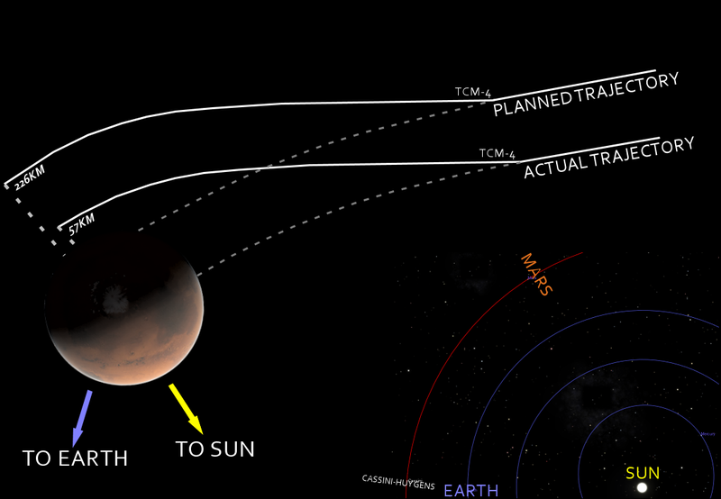
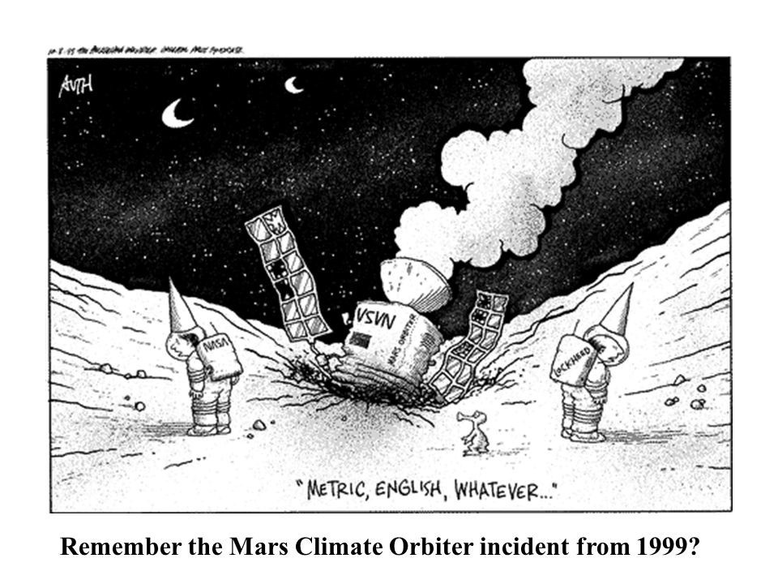
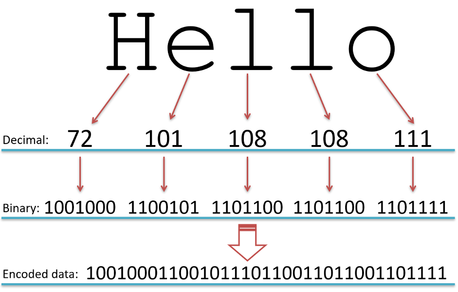

# Rappresentare l'informazione

## Lezione 03 del corso di _Abilità Informatiche_ (2024/2025)

###### Sebastian Barzaghi | [sebastian.barzaghi2@unibo.it](mailto:sebastian.barzaghi2@unibo.it) | [https://orcid.org/0000-0002-0799-1527](https://orcid.org/0000-0002-0799-1527) | [https://www.unibo.it/sitoweb/sebastian.barzaghi2/](https://www.unibo.it/sitoweb/sebastian.barzaghi2/)

---

### Una sonda nell'orbita di Marte

<div style="display: flex; align-items: center;">
  <div style="flex: 1;">
    <figure>
      
        <figcaption>
            Fonte: <a href="https://www.bbc.co.uk/bitesize/guides/zp92mp3/revision/1">https://www.bbc.co.uk/bitesize/guides/zp92mp3/revision/1</a>.
        </figcaption>
    </figure>
  </div>
  <div style="flex: 1;">
    <p>
      1988, Cape Canaveral, 2 settimane a Natale.
    </p>
    <p>
      La NASA lancia la missione Mars Climate Orbiter, con l'obiettivo di inserire una sonda nell'orbita di Marte per effettuare investigazioni scientifiche sul clima del pianeta rosso e per fare da ponte radio con la Terra.
    </p>
  </div>
</div>

https://www.astrospace.it/2022/09/23/il-disastro-del-mars-climate-orbiter/

---

### L'errore da 125 milioni di dollari

<div style="display: flex; align-items: center;">
  <div style="flex: 1;">
    <figure>
      
        <figcaption>
            Fonte: <a href="https://www.bbc.co.uk/bitesize/guides/zp92mp3/revision/1">https://www.bbc.co.uk/bitesize/guides/zp92mp3/revision/1</a>.
        </figcaption>
    </figure>
  </div>
  <div style="flex: 1;">
    <p>
      Il 23 settembre 1999, dopo 283 giorni di viaggio nello spazio, la sonda, dal valore di 125 milioni di dollari, eseguì una manovra ad alta quota nell'orbita di Marte con 49 secondi di anticipo: in altre parole, non stava seguendo la traiettoria prevista.
    </p>
    <p>
      Alle 2:27 del mattino, la sonda scompare dietro Marte per non riapparire mai più.
    </p>
  </div>
</div>

---

### Il motivo del fallimento

<div style="display: flex; align-items: center;">
  <div style="flex: 1;">
    <figure>
      
        <figcaption>
            Fonte: <a href="https://www.bbc.co.uk/bitesize/guides/zp92mp3/revision/1">https://www.bbc.co.uk/bitesize/guides/zp92mp3/revision/1</a>.
        </figcaption>
    </figure>
  </div>
  <div style="flex: 1;">
    <p>
      Una settimana dopo la perdita della sonda, la NASA rilascia una dichiarazione, attribuendo l'incidente a un errore legato al sistema usato per ricalcolare la posizione della sonda nello spazio. 
    </p>
    <p>
      Tra la sonda e la NASA c'era uno scambio continuo di dati, che permetteva il ricalcolo della traiettoria della sonda rispetto all'obiettivo finale.
    </p>
  </div>
</div>

---

### Due lingue diverse

La Lockheed Martin, azienda incaricata di realizzare la sonda e alcuni strumenti usati dai tecnici per gestirla, aveva adottato la **libbra-forza per secondo** come unità di misura per il ricalcolo.

La NASA, invece, utilizzava il **Newton per secondo**.

---

### Tra codifiche e metadati

Senza le unità di misura, i dati numerici non hanno significato, e assumere erroneamente determinate unità può portare a gravi problemi.

I comandi di navigazione dovevano essere codificati correttamente nelle unità appropriate per essere compresi da entrambi i sistemi.

---



<div class="dark-overlay"></div>

## Una questione di linguaggio

<!--

-->

---

### Un linguaggio naturale è quello parlato da noi

<div style="display: flex; align-items: center;">
  <div style="flex: 1;">
    <figure>
      
        <figcaption>
            Fonte: Foto di <a href="https://unsplash.com/@mikham?utm_content=creditCopyText&utm_medium=referral&utm_source=unsplash">Mikayla Storms</a> su <a href="https://unsplash.com/photos/man-in-black-helmet-riding-brown-horse-during-daytime-9h_bJdGqzCk?utm_content=creditCopyText&utm_medium=referral&utm_source=unsplash">Unsplash</a>
        </figcaption>
    </figure>
  </div>
  <div style="flex: 1;">
    <p>
      Linguaggio caratterizzato da ricchezza espressiva, ambiguità e ridondanza, per cui un qualsiasi costrutto formulato è potenzialmente polisemico.
    </p>
    <p>
      Esempio: "Sposto il cavallo".
    </p>
  </div>
</div>

<div class="footer">
Formal and Natural Languages. In How To Think Like A Computer Scientist: Interactive Edition.  
 <a href="https://runestone.academy/ns/books/published/thinkcspy/GeneralIntro/FormalandNaturalLanguages.html">https://runestone.academy/ns/books/published/thinkcspy/GeneralIntro/FormalandNaturalLanguages.html</a>.
</div>

---

### Un linguaggio naturale è quello parlato da noi

<div style="display: flex; align-items: center;">
  <div style="flex: 1;">
    <figure>
      
        <figcaption>
            Fonte: Foto di <a href="https://unsplash.com/@vdphotography?utm_content=creditCopyText&utm_medium=referral&utm_source=unsplash">VD Photography</a> su <a href="https://unsplash.com/photos/a-group-of-chess-pieces-sitting-on-top-of-a-chess-board-qHv3EowYEk0?utm_content=creditCopyText&utm_medium=referral&utm_source=unsplash">Unsplash</a>
        </figcaption>
    </figure>
  </div>
  <div style="flex: 1;">
    <p>
      Linguaggio caratterizzato da ricchezza espressiva, ambiguità e ridondanza, per cui un qualsiasi costrutto formulato è potenzialmente polisemico.
    </p>
    <p>
      Esempio: "Sposto il cavallo".
    </p>
  </div>
</div>

<div class="footer">
Formal and Natural Languages. In How To Think Like A Computer Scientist: Interactive Edition.  
 <a href="https://runestone.academy/ns/books/published/thinkcspy/GeneralIntro/FormalandNaturalLanguages.html">https://runestone.academy/ns/books/published/thinkcspy/GeneralIntro/FormalandNaturalLanguages.html</a>.
</div>

---

### Un linguaggio formale è quello usato per ridurre al minimo l'incertezza

<div style="display: flex; align-items: center;">
  <div style="flex: 1;">
    <figure>
      
        <figcaption>
            Fonte: Foto di <a href="https://unsplash.com/@thisisengineering?utm_content=creditCopyText&utm_medium=referral&utm_source=unsplash">ThisisEngineering</a> su <a href="https://unsplash.com/photos/woman-in-black-long-sleeve-shirt-GzDrm7SYQ0g?utm_content=creditCopyText&utm_medium=referral&utm_source=unsplash">Unsplash</a>
      .
        </figcaption>
    </figure>
  </div>
  <div style="flex: 1;">
    <p>
      Linguaggio per formulare costrutti dotati di significato in modo preciso e non ambiguo.
    </p>
    <p>
      Per comunicare con un computer, l'ambiguità del linguaggio naturale è un problema (servono altre informazioni relative al contesto e alla pragmatica che un computer, di base, non recepisce), quindi vengono usati linguaggi formali.
    </p>
  </div>
</div>

<div class="footer">
Formal and Natural Languages. In How To Think Like A Computer Scientist: Interactive Edition.  
 <a href="https://runestone.academy/ns/books/published/thinkcspy/GeneralIntro/FormalandNaturalLanguages.html">https://runestone.academy/ns/books/published/thinkcspy/GeneralIntro/FormalandNaturalLanguages.html</a>.
</div>

---

### Un linguaggio formale è costituito da tre elementi

* **Alfabeto**: insieme finito di simboli;
  * Esempio: `{a, b, c}` (un alfabeto costituito da tre simboli: `a`, `b` e `c`);
* **Grammatica**: insieme di regole sintattiche che specificano combinazioni valide di simboli;
  * Esempio: `G → a ∣ b ∣ c` (`G` è una grammatica che stabilisce che possiamo solo usare `a`, `b` o `c` separatamente);
* **Semantica**: insieme di significati attribuiti ai simboli e alle loro combinazioni;
  * Esempio: `a: "rosso" ; b: "blu" ; c: "verde"` (ad ogni simbolo ed eventuali combinazioni viene associato un significato).

<div class="footer">
Formal and Natural Languages. In How To Think Like A Computer Scientist: Interactive Edition.  
 <a href="https://runestone.academy/ns/books/published/thinkcspy/GeneralIntro/FormalandNaturalLanguages.html">https://runestone.academy/ns/books/published/thinkcspy/GeneralIntro/FormalandNaturalLanguages.html</a>.
</div>

---



<div class="dark-overlay"></div>

### Il linguaggio di un semaforo!

<!--
Photo by <a href="https://unsplash.com/@thealmani?utm_content=creditCopyText&utm_medium=referral&utm_source=unsplash">almani ماني</a> on <a href="https://unsplash.com/photos/red-stop-light-on-green-background-g6mxlM-h0jQ?utm_content=creditCopyText&utm_medium=referral&utm_source=unsplash">Unsplash</a>
-->

---



<div class="dark-overlay"></div>

## La codifica

<!--
Photo by <a href="https://unsplash.com/@gabiontheroad?utm_content=creditCopyText&utm_medium=referral&utm_source=unsplash">Gabriella Clare Marino</a> on <a href="https://unsplash.com/photos/gray-and-white-abstract-painting-J5zIt97NYxQ?utm_content=creditCopyText&utm_medium=referral&utm_source=unsplash">Unsplash</a>
-->

---

### Una codifica è un processo di trasformazione di un'informazione da un alfabeto ad un altro

Tecnica con la quale un dato viene rappresentato mediante un definito insieme di simboli.

Con tali simboli è possibile formare sequenze che possono essere messe in relazione biunivoca con gli elementi costituenti l'informazione.

Esempi:
* Numero di matricola
* Braille
* Codice fiscale
* Morse
* ...

---

### L'informazione quantitativa, analogica e digitale

Esistono due principali approcci per rappresentare quantitativamente l'informazione:

* Codifica analogica: si basa sull'associare una grandezza fisica continua a quella che si vuole rappresentare. Ogni variazione della grandezza originale (ad esempio, un cambiamento in volume o intensità) corrisponde direttamente a una variazione della grandezza rappresentativa;
* Codifica digitale: utilizza un alfabeto finito e regole di codifica per rappresentare i valori di una grandezza tramite una sequenza di simboli discreti, come numeri o lettere. Ogni possibile valore della grandezza è rappresentato da una combinazione di simboli.

Es. quantità di caramelle:
* rappresentazione analogica: sassolini (una caramella = un sassolino);
* rappresentazione digitale: sequenza di simboli (una caramella = 1).

---

### vantaggi e svantaggi

L'approccio digitale è più compatto ed economico.

L'approccio analogico porta con sé una ricchezza implicita di meta-informazioni:

* Ci consente di capire se un valore è uguale, maggiore o minore rispetto a un altro;
* Ci consente di quantificare le differenze tra i valori.

Con i sassolini è facile comprendere che tre sassolini rappresentano una quantità maggiore rispetto a due, o che sottraendo quattro sassolini da dieci, rimarremmo con sei. 

Nel caso della codifica digitale, invece, non è possibile intuire che la sequenza "31" sia maggiore di "13" o che la differenza tra "5" e "3" sia rappresentata dal numero "2" senza conoscere le regole di codifica che stabiliscono il significato dei simboli.

---

### La codifica dei numeri

---

### Partiamo dalla notazione decimale posizionale

La codifica più comunemente adottata oggi per la rappresentazione dei numeri interi.

Il termine **decimale** indica il numero di simboli utilizzati (**cifre**): `{0, 1, 2, 3, 4, 5, 6, 7, 8, 9}`.

Il termine **posizionale** indica che il significato dei simboli cambia in base alla loro posizione. Il numero rappresentato da ogni simbolo è moltiplicato per una potenza di 10 (il numero di simboli che cotituiscono l'alfabeto, la **base**).

Con `N` cifre è possibile rappresentare `10^N` numeri naturali: da 0 a 10^N-1.

Es. con 4 cifre possiamo rappresentare 10^4 numeri (da 0 a 9999).

<div class="footer">
Rappresentazione posizionale degli interi. <a href="http://www-dft.ts.infn.it/~pastore/DIDA/MNF/posizionale.html">http://www-dft.ts.infn.it/~pastore/DIDA/MNF/posizionale.html </a>.
</div>

---

### Esempio: il numero 2465

Il significato di ogni simbolo dipende dalla posizione di questo all'interno della sequenza di simboli creata in base alla loro combinazione. 

`2 X 10^3 + 4 X 10^2 + 6 X 10^1 + 5 X 10^0`

Che equivale a 2 _migliaia_ + 4 _centinaia_ + 6 _decine_ + 5 _unità_.

<div class="footer">
Rappresentazione posizionale degli interi. <a href="http://www-dft.ts.infn.it/~pastore/DIDA/MNF/posizionale.html">http://www-dft.ts.infn.it/~pastore/DIDA/MNF/posizionale.html</a>.
</div>

---

### Esistono codifiche non posizionali?

Il sistema di numerazione romano!

Si tratta di un **sistema additivo** basato su:

* Un alfabeto di simboli letterari a ciascuno dei quali viene assegnato un valore numerico;
* Un numero è rappresentato da una sequenza di tali simboli;
* Il valore di un numero è dato dalla somma dei valori corrispondenti ai simboli ottenuti, se in ordine decrescente; altrimenti, li si sottrae.

Esempi:
* `VIII = 5 + 1 + 1 + 1 = 8`;
* `IV = 5 - 1 = 4`.

---

### Esistono codifiche non decimali?

---

### L'informazione va codificata per il computer

<div style="display: flex; align-items: center;">
  <div style="flex: 1;">
    <figure>
      
        <figcaption>
            Fonte: Foto di <a href="https://unsplash.com/@aler?utm_content=creditCopyText&utm_medium=referral&utm_source=unsplash">alerkiv</a> su <a href="https://unsplash.com/photos/close-up-photography-of-green-motherboard--9jmFkN-_U4?utm_content=creditCopyText&utm_medium=referral&utm_source=unsplash">Unsplash</a>
        </figcaption>
    </figure>
  </div>
  <div style="flex: 1;">
    <p>
      Il computer memorizza ed elabora vari tipi di informazioni (numeri, testi, immagini, suoni, ecc.).
    </p>
    <p>
      Occorre rappresentare tale informazione in un formato facilmente manipolabile dal computer.
    </p>
  </div>
</div>

---

### Di fatto, un computer è una grande collezione di dispositivi _bistabili_

<div style="display: flex; align-items: center;">
  <div style="flex: 1;">
    <figure>
      
        <figcaption>
            Fonte: Foto di <a href="https://unsplash.com/@mk__s?utm_content=creditCopyText&utm_medium=referral&utm_source=unsplash">mk. s</a> su <a href="https://unsplash.com/photos/a-light-switch-cover-on-a-white-wall-Ual1Obieofc?utm_content=creditCopyText&utm_medium=referral&utm_source=unsplash">Unsplash</a>
        </figcaption>
    </figure>
  </div>
  <div style="flex: 1;">
    <p>
      "Bistabile" indica qualcosa che può assumere nel tempo solo due stati stabili (es. interruttore). Nel caso del computer, si tratta della presenza / assenza di corrente elettrica.
    </p>
    <p>
       Per ogni tipo di informazione (numerica, testuale, grafica, sonora, ecc.) che vogliamo trattare con un computer, dobbiamo individuare una codifica che si avvalga esclusivamente di questa caratteristica.
    </p>
  </div>
</div>

---

### Consideriamo un alfabeto binario

Alfabeto: `{0, 1}`.

**Bit**: cifra binaria, ovvero uno dei due simboli del sistema numerico binario, classicamente chiamati _zero_ (0) e _uno_ (1).

Allo _zero_ sono spesso associate le idee di "chiuso", "spento", "assente", "falso".

All'_uno_ sono spesso associate le idee di "aperto", "acceso", "presente", "vero".

<div class="footer">
History of the Binary System. In Cut The Knot.
 <a href="https://www.cut-the-knot.org/do_you_know/BinaryHistory.shtml">https://www.cut-the-knot.org/do_you_know/BinaryHistory.shtml</a>.
</div>

---

### Con 1 bit rappresentiamo poco...

Solo 2 diverse informazioni:

* 0 → No / Falso / Off;
* 1 → Si / Vero / On.

---

### ... Ma se usassimo più bit?

Proviamo a rappresentare le stagioni con una codifica binaria. Le stagioni sono 4, quindi ci servono 2 bit (2^2 sequenze possibili).

* 00 → Primavera;
* 10 → Estate;
* 01 → Autunno; 
* 11 → Inverno.

Mettendo insieme più bit possiamo rappresentare più informazioni e quindi più complessità.

---

### La binarietà è conveniente

2 bit : 4 (2^2) sequenze possibili: 00, 01, 10, 11.

3 bit: 8 (2^3) sequenze possibili: 000, 001, 010, 100, 011, 101, 110, 111.

...

Con `N bit` possiamo rappresentare `2^N sequenze`: da 0 a 2^N-1.

8 bit costituiscono un **byte**.

---

### Codifica numerica da base 2 a base 10

Moltiplicare ogni bit per il suo peso (attenzione a partire da 2^n-1!) e sommare le potenze.

```
10100  

1 X 2^4 + 0 X 2^3 + 1 X 2^2 + 0 X 2^1 + 0 X 2^0  
= 1 X 16 + 0 X 8 + 1 X 4 + 0 X 2 + 0 X 1  
= 16 + 0 + 4 + 0 + 0  

= 20  
```

---

### Codifica numerica da base 10 a base 2

Dividere il numero per 2 ripetutamente fino ad arrivare a zero e disporre i resti in ordine inverso.

```
12

12 / 2 → resto 0       ^
= 6 / 2 → resto 0      |
= 3 / 2 → resto 1      |
= 1 / 2 → resto 1      |

= 1100
```

---

### Quindi…

* Conosciamo la numerazione in base 2;
* Conosciamo la numerazione in base 10;
* Sappiamo passare da una base di numerazione all'altra (cioé convertire i numeri in bit).

Come digitalizziamo invece la lettera “a”?

---

### La rappresentazione del testo

Viene realizzata con codici binari corrispondenti a caratteri.

L'alfabeto anglosassone ha circa 120 caratteri (maiuscole + minuscole + numeri + interpunzione + ...)

Quanti bit ci servono per coprirli tutti?

Bastano 7 bit = 2^7 = 128 simboli.

---

### American Standard Code for Information Interchange (ASCII)

Codifica sencondo la quale ogni carattere è rappresentato da una sequenza di 7 bit.

Esempi:
* A →  1000001
* B →  1000010 
* BABA → 1000010 1000001 1000010 1000001

---

### ASCII esteso

* Estensione di ASCII a 8 bit (2^8 = 256 simboli);
* Codifica quasi tutti i linguaggi occidentali;
* Include molti altri simboli utili.

Esempi:
* CAT → 01000011 01000001 01010100;
* cat → 01100011 01100001 01110100.

---

### altro esempio di ascii, utf, ecc

<figure>
  
    <figcaption>
        Fonte: <a href="https://computerscienceiseasy.com/an-introduction-to-ascii-and-unicode/">https://computerscienceiseasy.com/an-introduction-to-ascii-and-unicode/</a>.
    </figcaption>
</figure>

---

### L'altra metà del problema

La digitalizzazione - cioé codificare contenuto informativo in binario - è solo metà del problema.

Dobbiamo anche codificare le caratteristiche del contenuto, incluso quanto segue:

* Come è strutturato il contenuto?
* A quali altri contenuti è collegato?
* Dove è stato raccolto?
* In quali unità è dato?
* Come dovrebbe essere visualizzato?
* Quando è stato creato o catturato?

---

## I dati sopra (e oltre) i dati

---

### Cosa sono i metadati?

<figure>
  
    <figcaption>
        Fonte: <a href="https://dataedo.com/kb/data-glossary/what-is-metadata">https://dataedo.com/kb/data-glossary/what-is-metadata</a>.
    </figcaption>
</figure>

---

### Cosa sono i metadati?

<figure>
  
    <figcaption>
        Fonte: <a href="https://dataedo.com/kb/data-glossary/what-is-metadata">https://dataedo.com/kb/data-glossary/what-is-metadata</a>.
    </figcaption>
</figure>

---

### Cosa sono i metadati?

<figure>
  
    <figcaption>
        Fonte: <a href="https://dataedo.com/kb/data-glossary/what-is-metadata">https://dataedo.com/kb/data-glossary/what-is-metadata</a>.
    </figcaption>
</figure>

---

### Un termine ampiamente utilizzato ma variamente interpretato

Fino agli anni '90, erano associati alla gestione dei dati geospaziali e alla progettazione dei sistemi.

Standard, documentazione e dati necessari per l'identificazione, la gestione, l'interoperabilità e l'uso dei dati in un sistema informativo.

Baca, M. (Ed.). (2016). Introduction to metadata. Getty Publications. https://www.getty.edu/publications/intrometadata/

---

### Dati su dati

I metadati possono essere visti come l'insieme di tutto ciò che si può dire su un dato (oggetto informativo) in un determinato momento, a qualsiasi livello di aggregazione.

Es. una pagina, un capitolo, un libro, una collezione possono avere tutti i propri metadati bibliografici.

I dati hanno tre caratteristiche che dovrebbero riflettersi nei metadati che li descrivono:

* Contenuto: ciò che l'oggetto contiene o rappresenta (intrinseco all'oggetto);
* Contesto: informazioni su chi, cosa, quando, dove e come l'oggetto è stato creato e utilizzato (estrinseco all'oggetto):
* Struttura: le relazioni formali tra gli oggetti informativi, che possono essere intrinseche, estrinseche o entrambe.

---

### Funzioni dei metadati

* Organizzazione e descrizione dei dati;
* Validazione e autenticazione dei dati;
* Ricerca e recupero delle informazioni;
* Utilizzo e conservazione dei dati.

---

### Caratteristiche (non ovvie) dei metadati

I metadati:
- Non devono essere per forza digitali;
- Riguardano più della semplice descrizione dei dati;
- Possono provenire da diverse fonti;
- Continuano ad accumularsi durante la vita di un dato;
- Possono contemporaneamente essere dati per qualcun'altro.

---

### Esistono diverse tipologie di metadati (e diversi modi di classificarli)

- **Descrittivi**: permettono la scoperta, l'identificazione e la selezione della risorsa. Includono elementi come "titolo", "autore", ecc.;
- **Tecnici**: forniscono informazioni sul funzionamento o comportamento della risorsa. Includono elementi come "formato", "compression ratio", "password", ecc.;
- **Amministrativi**: facilitano la gestione della risorsa. Includono elementi come "identificativo", "licenza", _provenance_, ecc.

<div class="footer">
Australian Research Data Commons (ARDC). (2020). ARDC Metadata Guide. Zenodo. <a href="https://doi.org/10.5281/zenodo.6459832">https://doi.org/10.5281/zenodo.6459832</a>. 
</div>

## STANDARD

---

### In cosa dovrebbero consistere dei metadati per essere "buoni" metadati?

I metadati dovrebbero focalizzarsi su:
* Cosa
* Quando
* Dove
* Chi
* Come
* Da quale
* Perché

https://www.researchgate.net/publication/220144233_A_Semiotics_Framework_for_Analyzing_Data_Provenance_Research

---

### In principio, l'idea è semplice

L'applicazione dei metadati in un caso concreto, però, è complessa: da dove partiamo? Come descriviamo i dati in modo tale da renderli consistenti e gestibili da me e altre persone? Come lo facciamo in una maniera scalabile?

Fortunatamente, esistono gli schemi di metadati.

https://www.opendatasoft.com/en/blog/what-is-metadata-and-why-is-it-important-data/

---

### I metadati seguono degli schemi

Strutture concettuali che specificano quali metadati utilizzare e secondo quali regole.

Stabiliscono un significato unico e non ambiguo per i metadati, costituendo una vera e propria lingua comune dei dati descritti.

Spesso specifici per ambito disciplinare, consolidati a livello delle comunità di ricerca, e implementati da piattaforme online (es. cataloghi, registri, basi di dati, portali, ecc.).

<div class="footer">
Australian Research Data Commons (ARDC). (2020). ARDC Metadata Guide. Zenodo. <a href="https://doi.org/10.5281/zenodo.6459832">https://doi.org/10.5281/zenodo.6459832</a>. 
</div>

---

### Esempio: decidiamo di descrivere un libro

Per farlo, usiamo una serie di metadati come:

* Titolo: "Neuromante"
* Autore: "William Gibson"
* Data di pubblicazione: 1984
* Genere: "cyberpunk"
* ...

I termini, molto comuni, li abbiamo decisi noi.

Volendo, li possiamo ri-utilizzare per descrivere anche altri libri.

Abbiamo creato uno schema di metadati per i libri.

---

### Se formalmente validati e riconosciuti, diventano standard

* MARC (standard per la rappresentazione di informazioni bibliografiche)

* Dublin Core (standard per la rappresentazione di risorse sul Web)

---

### Esempio: Dublin Core

Schema di metadati per descrivere risorse pubblicate sul Web.

Include quindici elementi (poi estesi ulteriormente) ritenuti fondamentali.

→ è un minimo comun denominatore: semplice, economico, facile da imparare e da usare.

---

### Schemi di codifica

Insieme di regole che specificano sintassi o lessico utilizzati dai metadati di uno schema di metadati.

* Schema di codifica sintattica: definisce come rappresentare uno specifico tipo di dati a partire dal formato (es. ISO 8601 per le date)
* Vocabolario controllato: definisce come rappresentare uno specifico tipo di dati a partire da un insieme finito e controllato di opzioni (es. AAT)
* Authority file: definisce come rappresentare le varianti di un valore stabilito come autoritativo (es. VIAF)

---

### L'elemento umano
---

### "Il 62% delle persone a Bruxelles non è nato in Belgio"

https://data.europa.eu/apps/data-visualisation-guide/pitfalls-in-metadata-3-stories

Una statistica piuttosto interessante. 

Merita di essere in prima pagina in un articolo di giornale, no?

---

Secondo l'articolo, Bruxelles è la città con la seconda percentuale più alta di residenti nati all'estero, dopo Dubai (83%), ma prima di Toronto, Auckland e Sydney.

Anche considerando che Bruxelles è la sede delle istituzioni dell'Unione Europea, questa percentuale rimane notevolmente alta.

L'autore ha trovato questa statistica in una fonte molto affidabile: il World Migration Report 2015, pubblicato dall'Organizzazione Internazionale per le Migrazioni delle Nazioni Unite (IOM).

---

### Troppo bello per essere vero

La fonte riportata sotto il grafico ("Compilato dall'IOM da varie fonti") avrebbe dovuto essere un campanello d'allarme.

La fonte per la percentuale di popolazione nata all'estero a Bruxelles è l'articolo Belgium: A Country of Permanent Immigration, che menziona:

Nelle due città più grandi, i dati demografici dimostrano la natura permanentemente diversificata del Belgio: ad Anversa, quasi il 38% della popolazione ha origini straniere, mentre circa il 18% ha una nazionalità straniera; a Bruxelles, quasi il 62% ha origini straniere e circa il 31% ha una nazionalità straniera.

---

### Un'interpretazione sbagliata delle fonti

La fonte originale utilizzava l'espressione "di origine straniera" e non "nato all'estero", con una definizione in Belgio che include chi ha almeno un genitore senza nazionalità belga.

Questo ha portato a un errore nel World Migration Report, che ha erroneamente interpretato i dati come relativi alla popolazione nata all'estero.

Gli autori del rapporto non avevano esaminato correttamente i metadati della fonte.

---

### Il rapimento a Chibok

https://data.europa.eu/apps/data-visualisation-guide/pitfalls-in-metadata-3-stories

76 ragazze furono rapite da una scuola a Chibok, nell'est della Nigeria, dal gruppo terroristico Boko Haram.

FiveThirtyEight cercò di inserire questo orribile evento in un contesto storico, esaminando il quadro generale in un articolo.

---

### Rapimenti o _notizie_ sui rapimenti?

L'articolo ha subito critiche per la fonte utilizzata per i dati nel grafico e per l'analisi nel contenuto. 

I numeri provengono dal Global Database of Events, Language and Tone (GDELT), un database che raccoglie quotidianamente dati su eventi e località in modo automatizzato da migliaia di fonti di notizie, tra cui televisione, stampa e online.

Invece di mostrare i "rapimenti giornalieri in Nigeria", il grafico mostra i "rapporti giornalieri di notizie sui rapimenti in Nigeria".

---

### Due metriche diverse

Una tendenza in aumento potrebbe essere dovuta a un numero maggiore di rapimenti, ma anche a un numero maggiore di notizie in generale o a una maggiore attenzione dei media verso il fenomeno.

Il problema maggiore è l'assunzione che un singolo evento o luogo nel database corrisponda a un singolo rapimento. È molto probabile che più rapporti di notizie nel database facciano riferimento allo stesso evento.

---

### Di nuovo, un'interpretazione sbagliata

Di conseguenza, l'articolo è stato aggiornato, precisando: "Questo post dovrebbe fare riferimento ai rapporti dei media sui rapimenti, non ai rapimenti stessi".

Il giornalista di FiveThirtyEight ha preso i dati nel database GDELT per ciò che erano, senza considerare come i dati vengano raccolti e cosa rappresenta ogni record nel database. Questa è un'informazione cruciale sui dati (= metadati) per interpretare correttamente le informazioni.

---

### Le persone vengono uccise sulla base dei metadati

https://www.cambridge.org/core/books/privacy-and-power/metadeath/A0943FA90B2F321B10F83EB2629D4AFB

---

# Fine

## Lezione 03 del corso di _Abilità Informatiche_ (2024/2025)

###### Sebastian Barzaghi | [sebastian.barzaghi2@unibo.it](mailto:sebastian.barzaghi2@unibo.it) | [https://orcid.org/0000-0002-0799-1527](https://orcid.org/0000-0002-0799-1527) | [https://www.unibo.it/sitoweb/sebastian.barzaghi2/](https://www.unibo.it/sitoweb/sebastian.barzaghi2/)