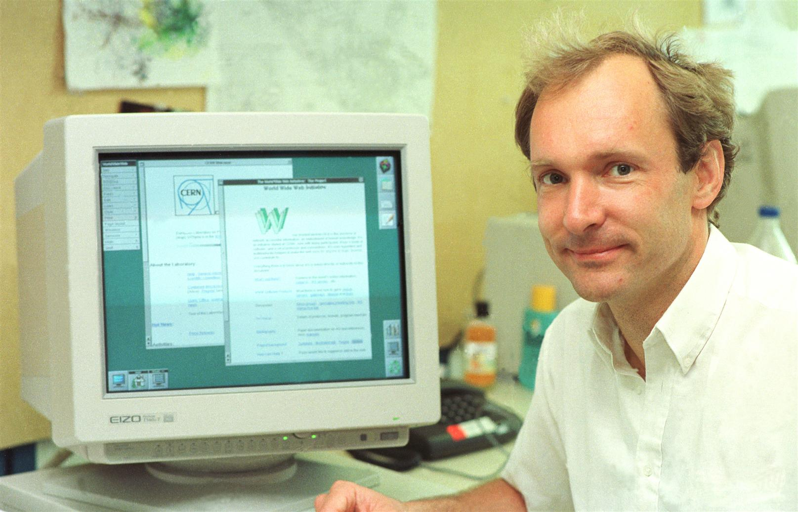

# Internet e World Wide Web

## Lezione 04 del corso di _Abilità Informatiche_ (2024/2025)

###### Sebastian Barzaghi | [sebastian.barzaghi2@unibo.it](mailto:sebastian.barzaghi2@unibo.it) | [https://orcid.org/0000-0002-0799-1527](https://orcid.org/0000-0002-0799-1527) | [https://www.unibo.it/sitoweb/sebastian.barzaghi2/](https://www.unibo.it/sitoweb/sebastian.barzaghi2/)

---

## Ipertesti

<!--
By Gregory Lloyd - Self-photographed, <a href="https://creativecommons.org/licenses/by/2.0" title="Creative Commons Attribution 2.0">CC BY 2.0</a>, <a href="https://commons.wikimedia.org/w/index.php?curid=89019">Link</a>
-->

---

  

    <figure>
      
        <figcaption>
            Fonte: <a href="https://www.bbc.co.uk/bitesize/guides/zp92mp3/revision/1">https://www.bbc.co.uk/bitesize/guides/zp92mp3/revision/1</a>.
        </figcaption>
    </figure>
  

  

    

      Termine coniato da Nelson nel 1965, da hyper (“oltre”) e testo.
    

    

      Ipotizza un sistema in grado di memorizzare documenti e consentire all’utente di costruire percorsi preferenziali e di navigare nella rete informativa costituita dall’insieme di documenti interconnessi.
    

  

Ridi, Riccardo. 2018. “Hypertext”. Knowledge Organization 45, no. 5: 393-424. Also available in ISKO Encyclopedia of Knowledge Organization, ed. Birger Hjørland, coed. Claudio Gnoli, https://www.isko.org/cyclo/hypertext 

---

### Cos'è un ipertesto?

  

    <figure>
      
        <figcaption>
            Fonte: Di <a href="//commons.wikimedia.org/w/index.php?title=User:RobertCailliau&amp;action=edit&amp;redlink=1" class="new" title="User:RobertCailliau (page does not exist)">Robert Cailliau</a> - <a rel="nofollow" class="external free" href="https://www.cailliau.org/IMG_20231124_230228.jpg">https://www.cailliau.org/IMG_20231124_230228.jpg</a>, <a href="https://creativecommons.org/licenses/by-sa/3.0" title="Creative Commons Attribution-Share Alike 3.0">CC BY-SA 3.0</a>, <a href="https://commons.wikimedia.org/w/index.php?curid=26140236">Link</a>.
        </figcaption>
    </figure>
  

  

    

      Un modo non lineare di presentazione dell’informazione tramite un insieme di unità informative (dette nodi), connesse tra loro da collegamenti (detti link).
    

  

Ridi, Riccardo. 2018. “Hypertext”. Knowledge Organization 45, no. 5: 393-424. Also available in ISKO Encyclopedia of Knowledge Organization, ed. Birger Hjørland, coed. Claudio Gnoli, <a href="https://www.isko.org/cyclo/hypertext">https://www.isko.org/cyclo/hypertext</a>.

---

### Cos'è un ipertesto?

  

    <figure>
      
        <figcaption>
            Fonte: Di <a href="//commons.wikimedia.org/w/index.php?title=User:RobertCailliau&amp;action=edit&amp;redlink=1" class="new" title="User:RobertCailliau (page does not exist)">Robert Cailliau</a> - <a rel="nofollow" class="external free" href="https://www.cailliau.org/IMG_20231124_230228.jpg">https://www.cailliau.org/IMG_20231124_230228.jpg</a>, <a href="https://creativecommons.org/licenses/by-sa/3.0" title="Creative Commons Attribution-Share Alike 3.0">CC BY-SA 3.0</a>, <a href="https://commons.wikimedia.org/w/index.php?curid=26140236">Link</a>.
        </figcaption>
    </figure>
  

  

    

      Un grafo orientato composto da un insieme di elementi (nodi) collegati tra loro da relazioni (archi) unidirezionali.
    

  

Ridi, Riccardo. 2018. “Hypertext”. Knowledge Organization 45, no. 5: 393-424. Also available in ISKO Encyclopedia of Knowledge Organization, ed. Birger Hjørland, coed. Claudio Gnoli, <a href="https://www.isko.org/cyclo/hypertext">https://www.isko.org/cyclo/hypertext</a>.

---

### Cos'è un ipertesto?

  

    <figure>
      
        <figcaption>
            Fonte: Di <a href="//commons.wikimedia.org/w/index.php?title=User:RobertCailliau&amp;action=edit&amp;redlink=1" class="new" title="User:RobertCailliau (page does not exist)">Robert Cailliau</a> - <a rel="nofollow" class="external free" href="https://www.cailliau.org/IMG_20231124_230228.jpg">https://www.cailliau.org/IMG_20231124_230228.jpg</a>, <a href="https://creativecommons.org/licenses/by-sa/3.0" title="Creative Commons Attribution-Share Alike 3.0">CC BY-SA 3.0</a>, <a href="https://commons.wikimedia.org/w/index.php?curid=26140236">Link</a>.
        </figcaption>
    </figure>
  

  

    

      Ha diversi percorsi logici, ciascuno dotato di autonomia di significato.
    

    

      I percorsi sono scelti a priori dal creatore del documento e a posteriori dall’utilizzatore, in base alla situazione o alle sue personali esigenze.
    

  

Ridi, Riccardo. 2018. “Hypertext”. Knowledge Organization 45, no. 5: 393-424. Also available in ISKO Encyclopedia of Knowledge Organization, ed. Birger Hjørland, coed. Claudio Gnoli, <a href="https://www.isko.org/cyclo/hypertext">https://www.isko.org/cyclo/hypertext</a>.

---

### Elementi principali dell'ipertesto

* Nodo: unità minima di informazione, dotata di autonomia e completezza;
* Ancora: frammento di un nodo da cui un link viene orientato verso un altro frammento di un nodo;
* Link: connessione tra una coppia di ancore.

Ridi, Riccardo. 2018. “Hypertext”. Knowledge Organization 45, no. 5: 393-424. Also available in ISKO Encyclopedia of Knowledge Organization, ed. Birger Hjørland, coed. Claudio Gnoli, <a href="https://www.isko.org/cyclo/hypertext">https://www.isko.org/cyclo/hypertext</a>.

---

### Caratteristiche dell'ipertesto

* **Granularità**: decomponibile in parti più piccole e autosufficienti, dotate di senso, e utilizzabili;
* **Interattività**: dà la possibilità al lettore di rapportarsi non-linearmente con esso;
* **Integrabilità**: estendibile in maniera potenzialmente infinita;
* **Multimedialità**: compresenza di molteplici mezzi di comunicazione differenti.

Ridi, Riccardo. 2018. “Hypertext”. Knowledge Organization 45, no. 5: 393-424. Also available in ISKO Encyclopedia of Knowledge Organization, ed. Birger Hjørland, coed. Claudio Gnoli, <a href="https://www.isko.org/cyclo/hypertext">https://www.isko.org/cyclo/hypertext</a>.

---

### L'ipertesto ha una lunga storia alle spalle

  

    <figure>
      
        <figcaption>
            Fonte: Di <a href="//commons.wikimedia.org/w/index.php?title=User:RobertCailliau&amp;action=edit&amp;redlink=1" class="new" title="User:RobertCailliau (page does not exist)">Robert Cailliau</a> - <a rel="nofollow" class="external free" href="https://www.cailliau.org/IMG_20231124_230228.jpg">https://www.cailliau.org/IMG_20231124_230228.jpg</a>, <a href="https://creativecommons.org/licenses/by-sa/3.0" title="Creative Commons Attribution-Share Alike 3.0">CC BY-SA 3.0</a>, <a href="https://commons.wikimedia.org/w/index.php?curid=26140236">Link</a>.
        </figcaption>
    </figure>
  

  

    

      Ipertestualità - in quanto testualità con struttura reticolare e navigazione non lineare - è sempre esistita (es. note, indici, commenti, sperimentazioni letterarie).
    

  

Ridi, Riccardo. 2018. “Hypertext”. Knowledge Organization 45, no. 5: 393-424. Also available in ISKO Encyclopedia of Knowledge Organization, ed. Birger Hjørland, coed. Claudio Gnoli, <a href="https://www.isko.org/cyclo/hypertext">https://www.isko.org/cyclo/hypertext</a>.

---

### Il Memory extender di Vannevar Bush ('30)

  

    <figure>
      
        <figcaption>
            Fonte: Di <a href="//commons.wikimedia.org/w/index.php?title=User:RobertCailliau&amp;action=edit&amp;redlink=1" class="new" title="User:RobertCailliau (page does not exist)">Robert Cailliau</a> - <a rel="nofollow" class="external free" href="https://www.cailliau.org/IMG_20231124_230228.jpg">https://www.cailliau.org/IMG_20231124_230228.jpg</a>, <a href="https://creativecommons.org/licenses/by-sa/3.0" title="Creative Commons Attribution-Share Alike 3.0">CC BY-SA 3.0</a>, <a href="https://commons.wikimedia.org/w/index.php?curid=26140236">Link</a>.
        </figcaption>
    </figure>
  

  

    

      Concezione moderna (cioè digitale) di ipertesto: un dispositivo teorico impiantato in una struttura a scrivania tramite cui era possibile conservare, annotare, connettere, e leggere documenti registrati su microfilm.
    

  

Ridi, Riccardo. 2018. “Hypertext”. Knowledge Organization 45, no. 5: 393-424. Also available in ISKO Encyclopedia of Knowledge Organization, ed. Birger Hjørland, coed. Claudio Gnoli, <a href="https://www.isko.org/cyclo/hypertext">https://www.isko.org/cyclo/hypertext</a>.

---

### Xanadu di Nelson (1967)

  

    <figure>
      
        <figcaption>
            Fonte: Di <a href="//commons.wikimedia.org/w/index.php?title=User:RobertCailliau&amp;action=edit&amp;redlink=1" class="new" title="User:RobertCailliau (page does not exist)">Robert Cailliau</a> - <a rel="nofollow" class="external free" href="https://www.cailliau.org/IMG_20231124_230228.jpg">https://www.cailliau.org/IMG_20231124_230228.jpg</a>, <a href="https://creativecommons.org/licenses/by-sa/3.0" title="Creative Commons Attribution-Share Alike 3.0">CC BY-SA 3.0</a>, <a href="https://commons.wikimedia.org/w/index.php?curid=26140236">Link</a>.
        </figcaption>
    </figure>
  

  

    

      una delle principali fonti di ispirazione per il World Wide Web
    

  

Ridi, Riccardo. 2018. “Hypertext”. Knowledge Organization 45, no. 5: 393-424. Also available in ISKO Encyclopedia of Knowledge Organization, ed. Birger Hjørland, coed. Claudio Gnoli, <a href="https://www.isko.org/cyclo/hypertext">https://www.isko.org/cyclo/hypertext</a>.

---

### Altro contesto storico

* Sistemi ipertestuali di prima generazione (ZOG, Xerox Alto, ecc.)
* Dopo il 1983 (anno della messa a disposizione massiva dei personal computer sul mercato): sistemi ipertestuali di seconda generazione (KMS, NoteCards, HyperCard, ecc.)
1987: prima conferenza internazionale sugli ipertesti
* 1987: prima conferenza internazionale sugli ipertesti

Ridi, Riccardo. 2018. “Hypertext”. Knowledge Organization 45, no. 5: 393-424. Also available in ISKO Encyclopedia of Knowledge Organization, ed. Birger Hjørland, coed. Claudio Gnoli, <a href="https://www.isko.org/cyclo/hypertext">https://www.isko.org/cyclo/hypertext</a>.

---

### Fine anni Ottanta: l'ipertesto nel mondo

  

    <figure>
      
        <figcaption>
            Fonte: <a href="https://home.cern/science/computing/birth-web/short-history-web">https://home.cern/science/computing/birth-web/short-history-web</a>.
        </figcaption>
    </figure>
  

  

    

      L’ipertesto è estremamente popolare e testato.
    

    

      Un fisico trentenne col compito di progettare un sistema di gestione dei documenti dell’istituto di ricerca per cui lavorava trae ispirazione da questa tecnologia, finendo per creare il più ampio, utilizzato e influente sistema ipertestuale di tutti i tempi.
    

  

Ridi, Riccardo. 2018. “Hypertext”. Knowledge Organization 45, no. 5: 393-424. Also available in ISKO Encyclopedia of Knowledge Organization, ed. Birger Hjørland, coed. Claudio Gnoli, <a href="https://www.isko.org/cyclo/hypertext">https://www.isko.org/cyclo/hypertext</a>.

---



## Il World Wide Web (e Internet, che è una cosa diversa)

<!--

-->

---

### Cos'è Internet?

  

    <figure>
      
        <figcaption>
            Fonte: <a href="https://rubenverborgh.github.io/WebFundamentals/">https://rubenverborgh.github.io/WebFundamentals/</a>.
        </figcaption>
    </figure>
  

  

    

      Una rete di comunicazione tra dispositivi distribuiti a livello globale.
    

    

      Tecnologie su chui si basa: TCP, IP, DNS, ecc...
    

  

How the web works. In MDN Web Docs.   
 <a href="https://developer.mozilla.org/en-US/docs/Learn/Getting_started_with_the_web/How_the_Web_works">https://developer.mozilla.org/en-US/docs/Learn/Getting_started_with_the_web/How_the_Web_works</a>.

---

### Cos'è il World Wide Web?

  

    <figure>
      
        <figcaption>
            Fonte: <a href="https://rubenverborgh.github.io/WebFundamentals/">https://rubenverborgh.github.io/WebFundamentals/</a>.
        </figcaption>
    </figure>
  

  

    

      Un sistema documentale ipertestuale distribuito su Internet.
    

    

      Tecnologie su chui si basa: HTTP, HTML, URL, ecc...
    

  

How the web works. In MDN Web Docs.   
 <a href="https://developer.mozilla.org/en-US/docs/Learn/Getting_started_with_the_web/How_the_Web_works">https://developer.mozilla.org/en-US/docs/Learn/Getting_started_with_the_web/How_the_Web_works</a>.

---

### Il Web e l'Internet non sono la stessa cosa

Il Web è un servizio ospitato da Internet, ideato da Cailliau e Berners-Lee al CERN di Ginevra verso la fine degli anni ‘80 come sistema di facilitazione delle comunicazioni a distanza fra ricercatori.

1990: [prima pagina Web](http://info.cern.ch/hypertext/WWW/TheProject.html).

1993: rilasciato nel pubblico dominio.

Dopo il 1993: sistema di informazione e comunicazione globale per eccellenza. 

How the web works. In MDN Web Docs.   
 <a href="https://developer.mozilla.org/en-US/docs/Learn/Getting_started_with_the_web/How_the_Web_works">https://developer.mozilla.org/en-US/docs/Learn/Getting_started_with_the_web/How_the_Web_works</a>.

---

### Uno sguardo più da vicino

Il Web è costituito da un insieme di documenti ipertestuali (**pagine web**), ciascuno dei quali può essere collegato ad altri tramite link unidirezionali.

Le pagine sono ospitate da nodi specializzati di Internet detti **server web**.

Un utente può navigare nella struttura ipertestuale accedendo da un nodo, detto **client**, usando un apposito tipo di programma, detto **browser**.

How the web works. In MDN Web Docs.   
 <a href="https://developer.mozilla.org/en-US/docs/Learn/Getting_started_with_the_web/How_the_Web_works">https://developer.mozilla.org/en-US/docs/Learn/Getting_started_with_the_web/How_the_Web_works</a>.

---

### Specifichiamo meglio la terminologia di Internet

  

    <figure>
      
        <figcaption>
            Fonte: Di <a href="//commons.wikimedia.org/wiki/File:Gnome-fs-client.svg" title="File:Gnome-fs-client.svg">Gnome-fs-client.svg</a>: David Vignoni. <a href="//commons.wikimedia.org/wiki/User:Calimo" title="User:Calimo">Calimo</a> - Basato su: <a href="//commons.wikimedia.org/wiki/File:Gnome-fs-client.svg" title="File:Gnome-fs-client.svg">Gnome-fs-client.svg</a><a href="//commons.wikimedia.org/wiki/File:Gnome-fs-server.svg" title="File:Gnome-fs-server.svg">Gnome-fs-server.svg</a>, <a href="http://www.gnu.org/licenses/lgpl.html" title="GNU Lesser General Public License">LGPL</a>, <a href="https://commons.wikimedia.org/w/index.php?curid=15782858">Link</a>.
        </figcaption>
    </figure>
  

  

    

      L’architettura di Internet è basata sull’interazione continua tra
      <ul>
        <li>
          Server: programmi (e i computer su cui operano) che servono dati e servizi;
        </li>
        <li>
          Client: programmi (e i computer su cui operano) che fanno richiesta di dati e servizi.
        </li>
      </ul>
    

  

How the web works. In MDN Web Docs.   
 <a href="https://developer.mozilla.org/en-US/docs/Learn/Getting_started_with_the_web/How_the_Web_works">https://developer.mozilla.org/en-US/docs/Learn/Getting_started_with_the_web/How_the_Web_works</a>.

---

### E la terminologia del Web?

* Uniform Resource Locator (URL): schema di identificazione dei contenuti del Web e la singola stringa che agisce da identificatore univoco di una risorsa Web;
* Hypertext Transfer Protocol (HTTP): protocollo usato dai server e dai client per comunicare gli uni con gli altri e per il recupero della rappresentazione di una risorsa Web tramite il suo URL;
* Hypertext Markup Language (HTML): linguaggio di marcatura di cui sono composte le pagine web e che permette la rappresentazione di una risorsa Web.

How the web works. In MDN Web Docs.   
 <a href="https://developer.mozilla.org/en-US/docs/Learn/Getting_started_with_the_web/How_the_Web_works">https://developer.mozilla.org/en-US/docs/Learn/Getting_started_with_the_web/How_the_Web_works</a>.

---

### Quindi, cosa permette di fare l'interazione tra Internet e Web?

1. Rappresentare risorse tramite documenti ipertestuali (attraverso **HTML**);
2. Mettere a disposizione i suddetti documenti ipertestuali (attraverso **server Web**);
3. Identificarli mediante l’utilizzo di un opportuno identificativo (**URL**);
4. Richiederli mediante l’utilizzo di uno specifico protocollo di comunicazione (**HTTP**);
5. Visualizzarli su un computer (attraverso un client).

How the web works. In MDN Web Docs.   
 <a href="https://developer.mozilla.org/en-US/docs/Learn/Getting_started_with_the_web/How_the_Web_works">https://developer.mozilla.org/en-US/docs/Learn/Getting_started_with_the_web/How_the_Web_works</a>.

---

## Client e server

---

### Il modello client-server

  

    <figure>
      
        <figcaption>
            Fonte: Di <a href="//commons.wikimedia.org/w/index.php?title=User:Lubaochuan&amp;action=edit&amp;redlink=1" class="new" title="User:Lubaochuan (page does not exist)">Lubaochuan</a> - Opera propria, <a href="https://creativecommons.org/licenses/by-sa/4.0" title="Creative Commons Attribution-Share Alike 4.0">CC BY-SA 4.0</a>, <a href="https://commons.wikimedia.org/w/index.php?curid=34946450">Collegamento</a>.
        </figcaption>
    </figure>
  

  

    

      Architettura di rete in cui un agente - computer o software - (il client) accede ai servizi o alle risorse di un altro agente - computer o software - (il server) attraverso una rete.
    

  

How the web works. In MDN Web Docs.   
 <a href="https://developer.mozilla.org/en-US/docs/Learn/Getting_started_with_the_web/How_the_Web_works">https://developer.mozilla.org/en-US/docs/Learn/Getting_started_with_the_web/How_the_Web_works</a>.

---

### Gli agenti

  

    <figure>
      
        <figcaption>
            Fonte: Di <a href="//commons.wikimedia.org/w/index.php?title=User:Lubaochuan&amp;action=edit&amp;redlink=1" class="new" title="User:Lubaochuan (page does not exist)">Lubaochuan</a> - Opera propria, <a href="https://creativecommons.org/licenses/by-sa/4.0" title="Creative Commons Attribution-Share Alike 4.0">CC BY-SA 4.0</a>, <a href="https://commons.wikimedia.org/w/index.php?curid=34946450">Collegamento</a>.
        </figcaption>
    </figure>
  

  

    <ul>
      <li>
        Client: agente che effettua la richiesta;
      </li>
      <li>
        Server: agente che dovrebbe avere informazioni su una risorsa e che risponde alla richiesta.
      </li>
    </ul>
  

How the web works. In MDN Web Docs.   
 <a href="https://developer.mozilla.org/en-US/docs/Learn/Getting_started_with_the_web/How_the_Web_works">https://developer.mozilla.org/en-US/docs/Learn/Getting_started_with_the_web/How_the_Web_works</a>.

---

### Nel dettaglio: il client

  

    <figure>
      
        <figcaption>
            Fonte: Di <a href="//commons.wikimedia.org/w/index.php?title=User:Lubaochuan&amp;action=edit&amp;redlink=1" class="new" title="User:Lubaochuan (page does not exist)">Lubaochuan</a> - Opera propria, <a href="https://creativecommons.org/licenses/by-sa/4.0" title="Creative Commons Attribution-Share Alike 4.0">CC BY-SA 4.0</a>, <a href="https://commons.wikimedia.org/w/index.php?curid=34946450">Collegamento</a>.
        </figcaption>
    </figure>
  

  

    

      Un computer o un software che accede a un servizio fornito da un server.
    

    

      Consente agli utenti di interagire facilmente con un servizio o una risorsa remota (es. sito Web, un server di posta elettronica o un sistema di archiviazione cloud).
    

    

      Es. il computer che state usando; un browser (Firefox, Chrome, Edge, Safari, ecc.); Applicazioni (Netflix, Dropbox, Gmail, Canva, ecc.); un crawler; sensori incorporati (smartwatch, domotica, ecc.)
    

  

How the web works. In MDN Web Docs.   
 <a href="https://developer.mozilla.org/en-US/docs/Learn/Getting_started_with_the_web/How_the_Web_works">https://developer.mozilla.org/en-US/docs/Learn/Getting_started_with_the_web/How_the_Web_works</a>.

---

### Nel dettaglio: il server

  

    <figure>
      
        <figcaption>
            Fonte: Di <a href="//commons.wikimedia.org/w/index.php?title=User:Lubaochuan&amp;action=edit&amp;redlink=1" class="new" title="User:Lubaochuan (page does not exist)">Lubaochuan</a> - Opera propria, <a href="https://creativecommons.org/licenses/by-sa/4.0" title="Creative Commons Attribution-Share Alike 4.0">CC BY-SA 4.0</a>, <a href="https://commons.wikimedia.org/w/index.php?curid=34946450">Collegamento</a>.
        </figcaption>
    </figure>
  

  

    

      Un computer o software che fornisce servizi o risorse ai client, attraverso una rete.
    

    

      Progettato per eseguire specifiche funzioni di elaborazione e gestione delle risorse.
    

    

      Es. un server Web ospita un sito Web e lo serve ai client che richiedono di accedere e visualizzare il sito.
    

  

How the web works. In MDN Web Docs.   
 <a href="https://developer.mozilla.org/en-US/docs/Learn/Getting_started_with_the_web/How_the_Web_works">https://developer.mozilla.org/en-US/docs/Learn/Getting_started_with_the_web/How_the_Web_works</a>.

---

### I messaggi

  

    <figure>
      
        <figcaption>
            Fonte: Di <a href="//commons.wikimedia.org/w/index.php?title=User:Lubaochuan&amp;action=edit&amp;redlink=1" class="new" title="User:Lubaochuan (page does not exist)">Lubaochuan</a> - Opera propria, <a href="https://creativecommons.org/licenses/by-sa/4.0" title="Creative Commons Attribution-Share Alike 4.0">CC BY-SA 4.0</a>, <a href="https://commons.wikimedia.org/w/index.php?curid=34946450">Collegamento</a>.
        </figcaption>
    </figure>
  

  

    <ul>
      <li>
        Messaggio di richiesta: il messaggio mandato dal client al server in cui vengono chieste informazioni riguardo una specifica risorsa indicata da un URL;
      </li>
      <li>
        Messaggio di risposta: il messaggio che il server restituisce al client, che può essere positivo oppure negativo.
      </li>
    </ul>
  

How the web works. In MDN Web Docs.   
 <a href="https://developer.mozilla.org/en-US/docs/Learn/Getting_started_with_the_web/How_the_Web_works">https://developer.mozilla.org/en-US/docs/Learn/Getting_started_with_the_web/How_the_Web_works</a>.

---

### Interazione Client - Server: esempio del browser

1. L'interazione viene avviata tipicamente da una richiesta dell’utente, tramite digitazione nella barra degli indirizzi del browser o per attivazione di un link;
2. Il browser (client) interpreta il comando come la richiesta da parte dell’utente della pagina web corrispondente all’indirizzo specificato;
3. Il client codifica la richiesta della pagina secondo determinate specifiche e inoltra la richiesta al server, sfruttando opportunamente l’infrastruttura di rete e i relativi servizi;
4. La richiesta viene instradata e raggiunge il server, che la codifica, la interpreta e cerca di soddisfarla;
5. Se il server approva la richiesta del client, manda al client una risposta “200 OK”, genera una copia del file corrispondente alla richiesta e la spedisce al client;
6. Arrivata a destinazione, il client interpreta la copia e la visualizza per l’utente.

How the web works. In MDN Web Docs.   
 <a href="https://developer.mozilla.org/en-US/docs/Learn/Getting_started_with_the_web/How_the_Web_works">https://developer.mozilla.org/en-US/docs/Learn/Getting_started_with_the_web/How_the_Web_works</a>.

---

## URL

---

### Cos’è un Uniform Resource Locator?

* Meccanismo usato dai browser per recuperare risorse pubblicate sul Web;
* Una stringa di testo che identifica (~codice fiscale) e localizza (~indirizzo di casa) una risorsa Web.

`https://it.wikipedia.org/wiki/Amore_e_Psiche`

What is a URL? In MDN Web Docs.   
 <a href="https://developer.mozilla.org/en-US/docs/Learn/Common_questions/Web_mechanics/What_is_a_URL">https://developer.mozilla.org/en-US/docs/Learn/Common_questions/Web_mechanics/What_is_a_URL</a>.

---

### Cos’è un Uniform Resource Locator?

Ogni volta che, da un proprio dispositivo (un computer, uno smartphone, etc.), si clicca su un link, il dispositivo stesso recupera una copia della risorsa a cui l’URL si riferisce, per poi visualizzarla sullo schermo del dispositivo.

In teoria un URL valido punta ad un’unica risorsa, la quale può essere una pagina HTML, un documento CSS, un’immagine, ecc.; in pratica, esistono delle eccezioni, come un URL che punta ad una risorsa che non esiste più o che è stata spostata.

What is a URL? In MDN Web Docs.   
 <a href="https://developer.mozilla.org/en-US/docs/Learn/Common_questions/Web_mechanics/What_is_a_URL">https://developer.mozilla.org/en-US/docs/Learn/Common_questions/Web_mechanics/What_is_a_URL</a>.

---

### Un URL come una sorta di codice postale

---

### URL: lo schema

  

    <figure>
      
        <figcaption>
            Fonte: Di <a href="//commons.wikimedia.org/w/index.php?title=User:Lubaochuan&amp;action=edit&amp;redlink=1" class="new" title="User:Lubaochuan (page does not exist)">Lubaochuan</a> - Opera propria, <a href="https://creativecommons.org/licenses/by-sa/4.0" title="Creative Commons Attribution-Share Alike 4.0">CC BY-SA 4.0</a>, <a href="https://commons.wikimedia.org/w/index.php?curid=34946450">Collegamento</a>.
        </figcaption>
    </figure>
  

  

    

      Lo schema (scheme) rappresenta il protocollo (l’insieme di regole) per accedere alla risorsa.
    

    

      servizio postale da utilizzare
    

  

What is a URL? In MDN Web Docs.   
 <a href="https://developer.mozilla.org/en-US/docs/Learn/Common_questions/Web_mechanics/What_is_a_URL">https://developer.mozilla.org/en-US/docs/Learn/Common_questions/Web_mechanics/What_is_a_URL</a>.

---

### URL: il dominio

  

    <figure>
      
        <figcaption>
            Fonte: Di <a href="//commons.wikimedia.org/w/index.php?title=User:Lubaochuan&amp;action=edit&amp;redlink=1" class="new" title="User:Lubaochuan (page does not exist)">Lubaochuan</a> - Opera propria, <a href="https://creativecommons.org/licenses/by-sa/4.0" title="Creative Commons Attribution-Share Alike 4.0">CC BY-SA 4.0</a>, <a href="https://commons.wikimedia.org/w/index.php?curid=34946450">Collegamento</a>.
        </figcaption>
    </figure>
  

  

    

      Il dominio (domain name) identifica il tipo di entità che possiede il sito web, il servizio o la risorsa specifica a cui si accede.
    

    

      la città dove risiede l’indirizzo a cui inviare il pacco
    

  

What is a URL? In MDN Web Docs.   
 <a href="https://developer.mozilla.org/en-US/docs/Learn/Common_questions/Web_mechanics/What_is_a_URL">https://developer.mozilla.org/en-US/docs/Learn/Common_questions/Web_mechanics/What_is_a_URL</a>.

---

### URL: il dominio

  

    <figure>
      
        <figcaption>
            Fonte: Di <a href="//commons.wikimedia.org/w/index.php?title=User:Lubaochuan&amp;action=edit&amp;redlink=1" class="new" title="User:Lubaochuan (page does not exist)">Lubaochuan</a> - Opera propria, <a href="https://creativecommons.org/licenses/by-sa/4.0" title="Creative Commons Attribution-Share Alike 4.0">CC BY-SA 4.0</a>, <a href="https://commons.wikimedia.org/w/index.php?curid=34946450">Collegamento</a>.
        </figcaption>
    </figure>
  

  

    

      La porta (port) è il numero del punto di contatto virtuale del server.
    

    

      codice di avviamento postale
    

  

What is a URL? In MDN Web Docs.   
 <a href="https://developer.mozilla.org/en-US/docs/Learn/Common_questions/Web_mechanics/What_is_a_URL">https://developer.mozilla.org/en-US/docs/Learn/Common_questions/Web_mechanics/What_is_a_URL</a>.

---

### URL: il percorso

  

    <figure>
      
        <figcaption>
            Fonte: Di <a href="//commons.wikimedia.org/w/index.php?title=User:Lubaochuan&amp;action=edit&amp;redlink=1" class="new" title="User:Lubaochuan (page does not exist)">Lubaochuan</a> - Opera propria, <a href="https://creativecommons.org/licenses/by-sa/4.0" title="Creative Commons Attribution-Share Alike 4.0">CC BY-SA 4.0</a>, <a href="https://commons.wikimedia.org/w/index.php?curid=34946450">Collegamento</a>.
        </figcaption>
    </figure>
  

  

    

      Il percorso (path) rappresenta il percorso della risorsa nel server.
    

    

      l’edificio dove il pacco deve essere inviato
    

  

What is a URL? In MDN Web Docs.   
 <a href="https://developer.mozilla.org/en-US/docs/Learn/Common_questions/Web_mechanics/What_is_a_URL">https://developer.mozilla.org/en-US/docs/Learn/Common_questions/Web_mechanics/What_is_a_URL</a>.

---

### URL: i parametri

  

    <figure>
      
        <figcaption>
            Fonte: Di <a href="//commons.wikimedia.org/w/index.php?title=User:Lubaochuan&amp;action=edit&amp;redlink=1" class="new" title="User:Lubaochuan (page does not exist)">Lubaochuan</a> - Opera propria, <a href="https://creativecommons.org/licenses/by-sa/4.0" title="Creative Commons Attribution-Share Alike 4.0">CC BY-SA 4.0</a>, <a href="https://commons.wikimedia.org/w/index.php?curid=34946450">Collegamento</a>.
        </figcaption>
    </figure>
  

  

    

      I parametri (parameters) rappresentano informazioni operative sulla risorsa (es. filtri in una ricerca a faccette)
    

    

      informazioni aggiuntive, come il numero dell’appartamento nell’edificio
    

  

What is a URL? In MDN Web Docs.   
 <a href="https://developer.mozilla.org/en-US/docs/Learn/Common_questions/Web_mechanics/What_is_a_URL">https://developer.mozilla.org/en-US/docs/Learn/Common_questions/Web_mechanics/What_is_a_URL</a>.

---

### URL: l'ancora

  

    <figure>
      
        <figcaption>
            Fonte: Di <a href="//commons.wikimedia.org/w/index.php?title=User:Lubaochuan&amp;action=edit&amp;redlink=1" class="new" title="User:Lubaochuan (page does not exist)">Lubaochuan</a> - Opera propria, <a href="https://creativecommons.org/licenses/by-sa/4.0" title="Creative Commons Attribution-Share Alike 4.0">CC BY-SA 4.0</a>, <a href="https://commons.wikimedia.org/w/index.php?curid=34946450">Collegamento</a>.
        </figcaption>
    </figure>
  

  

    

      L’ancora (anchor) è l’identificativo di una sezione specifica nella risorsa.
    

    

      la persona a cui è intestato il pacco.
    

  

What is a URL? In MDN Web Docs.   
 <a href="https://developer.mozilla.org/en-US/docs/Learn/Common_questions/Web_mechanics/What_is_a_URL">https://developer.mozilla.org/en-US/docs/Learn/Common_questions/Web_mechanics/What_is_a_URL</a>.

---

## HTTP

---

### Cos'è un protocollo?

  

    <figure>
      
        <figcaption>
            Fonte: Di <a href="//commons.wikimedia.org/w/index.php?title=User:Lubaochuan&amp;action=edit&amp;redlink=1" class="new" title="User:Lubaochuan (page does not exist)">Lubaochuan</a> - Opera propria, <a href="https://creativecommons.org/licenses/by-sa/4.0" title="Creative Commons Attribution-Share Alike 4.0">CC BY-SA 4.0</a>, <a href="https://commons.wikimedia.org/w/index.php?curid=34946450">Collegamento</a>.
        </figcaption>
    </figure>
  

  

    

      Per comunicare, gli elementi all’interno delle reti devono seguire regole comuni.
    

    

      Un protocollo è un insieme di regole e di messaggi che governano la comunicazione tra due entità.
    

    

      La definizione di ogni protocollo consiste nel fornire un insieme di regole non ambigue, definendo i messaggi che possono essere scambiati tra entità, il loro significato e le azioni da intraprendere in ogni situazione (~ semafori).
    

  

---

### Cos'è un protocollo?

Deve essere espresso in un particolare linguaggio, un insieme di segnali e/o simboli comprensibili alle entità al fine di avviare e gestire la comunicazione.

* Una sintassi da seguire per costruire i messaggi
* Delle regole interpretative del messaggio, per definire la semantica dei messaggi
* Dei meccanismi per sincronizzare la comunicazione
* Dei meccanismi per correggere e/o gestire eventuali errori che possono intercorrere nello scambio dei messaggi

---

### Il protocollo HTTP

  

    <figure>
      
        <figcaption>
            Fonte: Di <a href="//commons.wikimedia.org/w/index.php?title=User:Lubaochuan&amp;action=edit&amp;redlink=1" class="new" title="User:Lubaochuan (page does not exist)">Lubaochuan</a> - Opera propria, <a href="https://creativecommons.org/licenses/by-sa/4.0" title="Creative Commons Attribution-Share Alike 4.0">CC BY-SA 4.0</a>, <a href="https://commons.wikimedia.org/w/index.php?curid=34946450">Collegamento</a>.
        </figcaption>
    </figure>
  

  

    

      HTTP standardizza come client e server comunicano tramite il metodo richiesta-risposta, in cui il client invia una richiesta al server e il server risponde con una risposta contenente i dati richiesti.
    

  

An Overview of HTTP. In MDN Web Docs.   
 <a href="https://developer.mozilla.org/en-US/docs/Web/HTTP/Overview">https://developer.mozilla.org/en-US/docs/Web/HTTP/Overview</a>.

---

### Le proxy

  

    <figure>
      
        <figcaption>
            Fonte: Di <a href="//commons.wikimedia.org/w/index.php?title=User:Lubaochuan&amp;action=edit&amp;redlink=1" class="new" title="User:Lubaochuan (page does not exist)">Lubaochuan</a> - Opera propria, <a href="https://creativecommons.org/licenses/by-sa/4.0" title="Creative Commons Attribution-Share Alike 4.0">CC BY-SA 4.0</a>, <a href="https://commons.wikimedia.org/w/index.php?curid=34946450">Collegamento</a>.
        </figcaption>
    </figure>
  

  

    

      Tra il client e il server ci sono numerosi intermediari, collettivamente chiamati proxy, che eseguono diverse operazioni per migliorare le prestazioni e la sicurezza (gateway, cache, ecc.).
    

  

An Overview of HTTP. In MDN Web Docs.   
 <a href="https://developer.mozilla.org/en-US/docs/Web/HTTP/Overview">https://developer.mozilla.org/en-US/docs/Web/HTTP/Overview</a>.

---

### Il messaggio HTTP

Permette lo scambio di dati tra un server e un client.

Esistono due tipi di messaggio HTTP:
* Richiesta: messaggio mandato dal client per richiedere una determinata azione da parte del server;
* Risposta: messaggio mandato dal server come risposta alla richiesta del client.

HTTP Messages. In MDN Web Docs.   
 <a href="https://developer.mozilla.org/en-US/docs/Web/HTTP/Messages">https://developer.mozilla.org/en-US/docs/Web/HTTP/Messages</a>.

---

### La struttura di un messaggio HTTP

1. Una testa composta da:
  * Una riga iniziale che descrive il messaggio;
  * Un insieme opzionale di intestazioni (o header) che specificano la richiesta o descrivono il corpo del messaggio;
2. Una riga vuota che separa le informazioni dal corpo del messaggio;
3. Un corpo (o payload) opzionale contenente dati o contenuti associati al messaggio.

HTTP Messages. In MDN Web Docs.   
 <a href="https://developer.mozilla.org/en-US/docs/Web/HTTP/Messages">https://developer.mozilla.org/en-US/docs/Web/HTTP/Messages</a>.

---

### La richiesta HTTP

  

    <figure>
      
        <figcaption>
            Fonte: Di <a href="//commons.wikimedia.org/w/index.php?title=User:Lubaochuan&amp;action=edit&amp;redlink=1" class="new" title="User:Lubaochuan (page does not exist)">Lubaochuan</a> - Opera propria, <a href="https://creativecommons.org/licenses/by-sa/4.0" title="Creative Commons Attribution-Share Alike 4.0">CC BY-SA 4.0</a>, <a href="https://commons.wikimedia.org/w/index.php?curid=34946450">Collegamento</a>.
        </figcaption>
    </figure>
  

  

    

      Tra il client e il server ci sono numerosi intermediari, collettivamente chiamati proxy, che eseguono diverse operazioni per migliorare le prestazioni e la sicurezza (gateway, cache, ecc.).
    

  

HTTP Messages. In MDN Web Docs.   
 <a href="https://developer.mozilla.org/en-US/docs/Web/HTTP/Messages">https://developer.mozilla.org/en-US/docs/Web/HTTP/Messages</a>.

---

### La richiesta HTTP

  

    <figure>
      
        <figcaption>
            Fonte: Di <a href="//commons.wikimedia.org/w/index.php?title=User:Lubaochuan&amp;action=edit&amp;redlink=1" class="new" title="User:Lubaochuan (page does not exist)">Lubaochuan</a> - Opera propria, <a href="https://creativecommons.org/licenses/by-sa/4.0" title="Creative Commons Attribution-Share Alike 4.0">CC BY-SA 4.0</a>, <a href="https://commons.wikimedia.org/w/index.php?curid=34946450">Collegamento</a>.
        </figcaption>
    </figure>
  

  

    

      Testa: una riga di richiesta (contenente il metodo, il percorso e la versione di HTTP utilizzata) e le intestazioni (headers) contenenti varie informazioni (es. nome del client, lingua, ecc.).
    

    

      Un'eventuale riga vuota.
    

    

      Un eventuale corpo.
    

  

HTTP Messages. In MDN Web Docs.   
 <a href="https://developer.mozilla.org/en-US/docs/Web/HTTP/Messages">https://developer.mozilla.org/en-US/docs/Web/HTTP/Messages</a>.

---

### Il metodo GET

  

    <figure>
      
        <figcaption>
            Fonte: Di <a href="//commons.wikimedia.org/w/index.php?title=User:Lubaochuan&amp;action=edit&amp;redlink=1" class="new" title="User:Lubaochuan (page does not exist)">Lubaochuan</a> - Opera propria, <a href="https://creativecommons.org/licenses/by-sa/4.0" title="Creative Commons Attribution-Share Alike 4.0">CC BY-SA 4.0</a>, <a href="https://commons.wikimedia.org/w/index.php?curid=34946450">Collegamento</a>.
        </figcaption>
    </figure>
  

  

    

      GET (il più usato nel web) permette di richiedere informazioni sulla risorsa definita dall’URL specificato – per esempio come conseguenza di un click su un collegamento ipertestuale.
    

  

HTTP Messages. In MDN Web Docs.   
 <a href="https://developer.mozilla.org/en-US/docs/Web/HTTP/Messages">https://developer.mozilla.org/en-US/docs/Web/HTTP/Messages</a>.

---

### Il metodo POST

  

    <figure>
      
        <figcaption>
            Fonte: Di <a href="//commons.wikimedia.org/w/index.php?title=User:Lubaochuan&amp;action=edit&amp;redlink=1" class="new" title="User:Lubaochuan (page does not exist)">Lubaochuan</a> - Opera propria, <a href="https://creativecommons.org/licenses/by-sa/4.0" title="Creative Commons Attribution-Share Alike 4.0">CC BY-SA 4.0</a>, <a href="https://commons.wikimedia.org/w/index.php?curid=34946450">Collegamento</a>.
        </figcaption>
    </figure>
  

  

    

      POST permette di creare sul server web contattato la risorsa specificata dall’URL utilizzato nella richiesta, e di associare informazioni incluse nella richiesta.
    

  

HTTP Messages. In MDN Web Docs.   
 <a href="https://developer.mozilla.org/en-US/docs/Web/HTTP/Messages">https://developer.mozilla.org/en-US/docs/Web/HTTP/Messages</a>.

---

### Il metodo DELETE

  

    <figure>
      
        <figcaption>
            Fonte: Di <a href="//commons.wikimedia.org/w/index.php?title=User:Lubaochuan&amp;action=edit&amp;redlink=1" class="new" title="User:Lubaochuan (page does not exist)">Lubaochuan</a> - Opera propria, <a href="https://creativecommons.org/licenses/by-sa/4.0" title="Creative Commons Attribution-Share Alike 4.0">CC BY-SA 4.0</a>, <a href="https://commons.wikimedia.org/w/index.php?curid=34946450">Collegamento</a>.
        </figcaption>
    </figure>
  

  

    

      DELETE permette di rimuovere dal server web contattato tutte le informazioni relative alla risorsa specificata nella richiesta tramite l’URL.
    

  

HTTP Messages. In MDN Web Docs.   
 <a href="https://developer.mozilla.org/en-US/docs/Web/HTTP/Messages">https://developer.mozilla.org/en-US/docs/Web/HTTP/Messages</a>.

---

### Il metodo PUT

  

    <figure>
      
        <figcaption>
            Fonte: Di <a href="//commons.wikimedia.org/w/index.php?title=User:Lubaochuan&amp;action=edit&amp;redlink=1" class="new" title="User:Lubaochuan (page does not exist)">Lubaochuan</a> - Opera propria, <a href="https://creativecommons.org/licenses/by-sa/4.0" title="Creative Commons Attribution-Share Alike 4.0">CC BY-SA 4.0</a>, <a href="https://commons.wikimedia.org/w/index.php?curid=34946450">Collegamento</a>.
        </figcaption>
    </figure>
  

  

    

      PUT permette di specificare informazioni aggiuntive, incluse nella richiesta, ad una risorsa esistente che già risiede sul server.
    

  

HTTP Messages. In MDN Web Docs.   
 <a href="https://developer.mozilla.org/en-US/docs/Web/HTTP/Messages">https://developer.mozilla.org/en-US/docs/Web/HTTP/Messages</a>.

---

### La risposta HTTP

  

    <figure>
      
        <figcaption>
            Fonte: Di <a href="//commons.wikimedia.org/w/index.php?title=User:Lubaochuan&amp;action=edit&amp;redlink=1" class="new" title="User:Lubaochuan (page does not exist)">Lubaochuan</a> - Opera propria, <a href="https://creativecommons.org/licenses/by-sa/4.0" title="Creative Commons Attribution-Share Alike 4.0">CC BY-SA 4.0</a>, <a href="https://commons.wikimedia.org/w/index.php?curid=34946450">Collegamento</a>.
        </figcaption>
    </figure>
  

  

    

      Tutte le risposte, oltre che a contenere metadati nell’header (e talvolta dati) nel corpo, specificano anche un codice di stato (un numero di tre cifre che specifica la classe di risposta.
    

  

HTTP Messages. In MDN Web Docs.   
 <a href="https://developer.mozilla.org/en-US/docs/Web/HTTP/Messages">https://developer.mozilla.org/en-US/docs/Web/HTTP/Messages</a>.

---

### I codici di stato

  

    <figure>
      
        <figcaption>
            Fonte: Di <a href="//commons.wikimedia.org/w/index.php?title=User:Lubaochuan&amp;action=edit&amp;redlink=1" class="new" title="User:Lubaochuan (page does not exist)">Lubaochuan</a> - Opera propria, <a href="https://creativecommons.org/licenses/by-sa/4.0" title="Creative Commons Attribution-Share Alike 4.0">CC BY-SA 4.0</a>, <a href="https://commons.wikimedia.org/w/index.php?curid=34946450">Collegamento</a>.
        </figcaption>
    </figure>
  

  

    <ul>
      <li>
        1XX: Risposta informativa (molto raro, di solito non usato);
      </li>
      <li>
        2XX: Successo (es. 200 OK);
      </li>
      <li>
        3XX: Redirezione (es. 303 See other);
      </li>
      <li>
        4XX: Errore del client (es. 403 Forbidden, 404 Not Found);
      </li>
      <li>
        5XX: Errore del server (es. 503 Service Unavailable.
      </li>
    </ul>
  

HTTP Messages. In MDN Web Docs.   
 <a href="https://developer.mozilla.org/en-US/docs/Web/HTTP/Messages">https://developer.mozilla.org/en-US/docs/Web/HTTP/Messages</a>.

---

# Fine

## Lezione 04 del corso di _Abilità Informatiche_ (2024/2025)

###### Sebastian Barzaghi | [sebastian.barzaghi2@unibo.it](mailto:sebastian.barzaghi2@unibo.it) | [https://orcid.org/0000-0002-0799-1527](https://orcid.org/0000-0002-0799-1527) | [https://www.unibo.it/sitoweb/sebastian.barzaghi2/](https://www.unibo.it/sitoweb/sebastian.barzaghi2/)