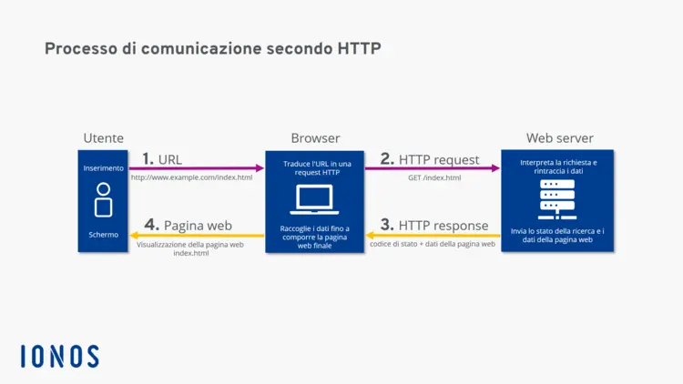
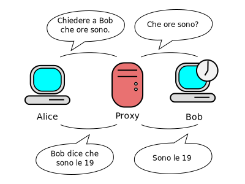
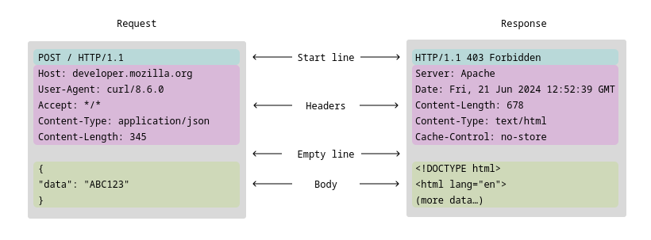
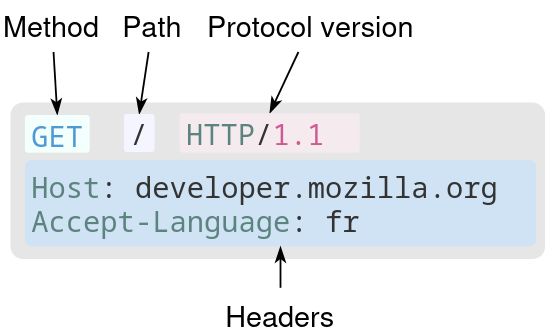
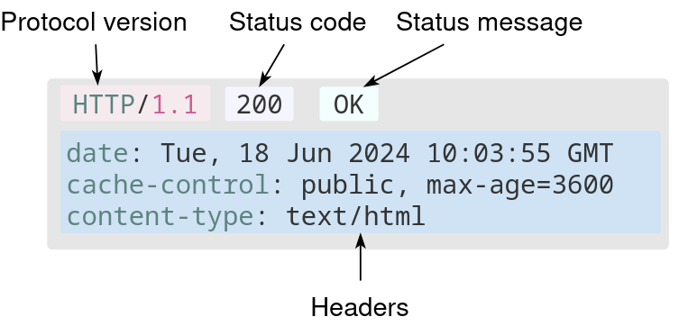
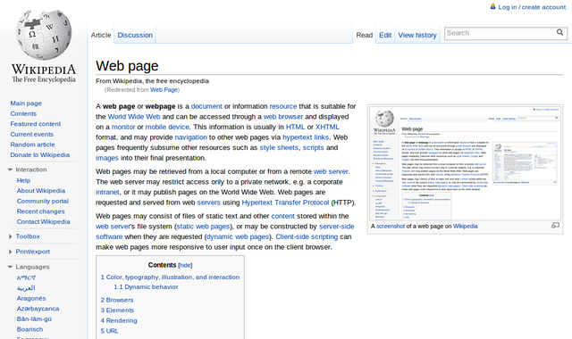

# Internet e World Wide Web

## Lezione 05 del corso di _Abilità Informatiche_ (2024/2025)

###### Sebastian Barzaghi | [sebastian.barzaghi2@unibo.it](mailto:sebastian.barzaghi2@unibo.it) | [https://orcid.org/0000-0002-0799-1527](https://orcid.org/0000-0002-0799-1527) | [https://www.unibo.it/sitoweb/sebastian.barzaghi2/](https://www.unibo.it/sitoweb/sebastian.barzaghi2/)

---



## HTTP

<!--

-->

---

### Cos'è un protocollo?

  

    <figure>
      
        <figcaption>
            Fonte: Di <a href="//commons.wikimedia.org/w/index.php?title=User:Lubaochuan&amp;action=edit&amp;redlink=1" class="new" title="User:Lubaochuan (page does not exist)">Lubaochuan</a> - Opera propria, <a href="https://creativecommons.org/licenses/by-sa/4.0" title="Creative Commons Attribution-Share Alike 4.0">CC BY-SA 4.0</a>, <a href="https://commons.wikimedia.org/w/index.php?curid=34946450">Collegamento</a>.
        </figcaption>
    </figure>
  

  

    

      Per comunicare, gli elementi all’interno di un sistema devono seguire regole comuni.
    

    

      Un protocollo è un insieme di regole e di messaggi che governano la comunicazione tra due entità.
    

    

      La definizione di ogni protocollo consiste nel fornire un insieme di regole non ambigue, definendo i messaggi che possono essere scambiati tra entità, il loro significato e le azioni da intraprendere in ogni situazione (es. semaforo).
    

  

An Overview of HTTP. In MDN Web Docs.   
 <a href="https://developer.mozilla.org/en-US/docs/Web/HTTP/Overview">https://developer.mozilla.org/en-US/docs/Web/HTTP/Overview</a>.

---

### Cos'è un protocollo?

Un protocollo deve essere espresso in un particolare linguaggio, un insieme di segnali e/o simboli comprensibili alle entità al fine di avviare e gestire la comunicazione.

Un linguaggio di questo tipo deve avere:

* Una **sintassi** da seguire per costruire i messaggi;
* Delle regole interpretative del messaggio, per definire la **semantica** dei messaggi;
* Dei **meccanismi per sincronizzare** la comunicazione;
* Dei **meccanismi per correggere e/o gestire** eventuali errori che possono intercorrere nello scambio dei messaggi.

An Overview of HTTP. In MDN Web Docs.   
 <a href="https://developer.mozilla.org/en-US/docs/Web/HTTP/Overview">https://developer.mozilla.org/en-US/docs/Web/HTTP/Overview</a>.

---

### Il protocollo HTTP

  

    <figure>
      
        <figcaption>
            Fonte: <a href="https://www.ionos.it/digitalguide/hosting/tecniche-hosting/protocollo-http/">https://www.ionos.it/digitalguide/hosting/tecniche-hosting/protocollo-http/</a>.
        </figcaption>
    </figure>
  

  

    

      Protocollo di comunicazione utilizzato per il trasferimento di dati tra un client e un server su una rete.
    

    

      HTTP standardizza come client e server comunicano tramite il metodo richiesta-risposta, in cui il client invia una richiesta al server e il server risponde con una risposta contenente i dati richiesti.
    

  

An Overview of HTTP. In MDN Web Docs.   
 <a href="https://developer.mozilla.org/en-US/docs/Web/HTTP/Overview">https://developer.mozilla.org/en-US/docs/Web/HTTP/Overview</a>.

---

### Le proxy

  

    <figure>
      
        <figcaption>
            Fonte: Di H2g2bob - Opera propria basata su: <a href="//commons.wikimedia.org/wiki/File:Proxy_concept_en.svg" title="File:Proxy concept en.svg">Proxy concept en.svg</a>, <a href="http://creativecommons.org/publicdomain/zero/1.0/deed.en" title="Creative Commons Zero, Public Domain Dedication">CC0</a>, <a href="https://commons.wikimedia.org/w/index.php?curid=124743074">Collegamento</a>.
        </figcaption>
    </figure>
  

  

    

      Tra il client e il server ci sono numerosi intermediari, collettivamente chiamati proxy, che eseguono diverse operazioni per migliorare le prestazioni e la sicurezza (gateway, cache, ecc.).
    

  

An Overview of HTTP. In MDN Web Docs.   
 <a href="https://developer.mozilla.org/en-US/docs/Web/HTTP/Overview">https://developer.mozilla.org/en-US/docs/Web/HTTP/Overview</a>.

---

### Ricordiamoci che esistono due tipi di messaggi

**Richiesta**: messaggio mandato dal client per richiedere una determinata azione da parte del server;

**Risposta**: messaggio mandato dal server come risposta alla richiesta del client.

HTTP Messages. In MDN Web Docs.   
 <a href="https://developer.mozilla.org/en-US/docs/Web/HTTP/Messages">https://developer.mozilla.org/en-US/docs/Web/HTTP/Messages</a>.

---

### La struttura di un messaggio secondo HTTP

- Una **testa** composta da:
  * Una **riga iniziale** (di richiesta o di risposta);
  * Un insieme di **intestazioni opzionali** (o header) che specificano la richiesta o descrivono il corpo del messaggio;
- Una **riga vuota** che separa la testa dal corpo del messaggio;
- Un **corpo opzionale** (o body o payload) con il contenuto del messaggio.

HTTP Messages. In MDN Web Docs.   
 <a href="https://developer.mozilla.org/en-US/docs/Web/HTTP/Messages">https://developer.mozilla.org/en-US/docs/Web/HTTP/Messages</a>.

---

### La struttura di un messaggio HTTP

<figure>
  
    <figcaption>
        Fonte: <a href="https://developer.mozilla.org/en-US/docs/Web/HTTP/Messages">https://developer.mozilla.org/en-US/docs/Web/HTTP/Messagesg</a>.
    </figcaption>
</figure>

HTTP Messages. In MDN Web Docs.   
 <a href="https://developer.mozilla.org/en-US/docs/Web/HTTP/Messages">https://developer.mozilla.org/en-US/docs/Web/HTTP/Messages</a>.

---

### La richiesta HTTP

  

    <figure>
      
        <figcaption>
            Fonte: <a href="https://developer.mozilla.org/en-US/docs/Web/HTTP/Overview">https://developer.mozilla.org/en-US/docs/Web/HTTP/Overview</a>.
        </figcaption>
    </figure>
  

  

    

      Testa: una riga di richiesta (contenente il metodo, il percorso e la versione di HTTP utilizzata) e le intestazioni (headers) contenenti varie informazioni (es. nome del dominio del server, lingua del messaggio, ecc.).
    

    

      Un'eventuale riga vuota.
    

    

      Un eventuale corpo.
    

  

HTTP Messages. In MDN Web Docs.   
 <a href="https://developer.mozilla.org/en-US/docs/Web/HTTP/Messages">https://developer.mozilla.org/en-US/docs/Web/HTTP/Messages</a>.

---

### Il metodo GET

  

    <code>
      GET /contact HTTP/1.1
      Host: example.com
      User-Agent: curl/8.6.0
      Accept: */*
    </code>
  

  

    

      Permette di richiedere informazioni sulla risorsa definita dall’URL specificato – per esempio come conseguenza di un click su un collegamento ipertestuale.
    

  

HTTP Messages. In MDN Web Docs.   
 <a href="https://developer.mozilla.org/en-US/docs/Web/HTTP/Messages">https://developer.mozilla.org/en-US/docs/Web/HTTP/Messages</a>.

---

### Il metodo POST

  

    <code>
      GET /contact HTTP/1.1
      Host: example.com
      User-Agent: curl/8.6.0
      Accept: */*
    </code>
  

  

    

      POST permette di creare sul server web contattato la risorsa specificata dall’URL utilizzato nella richiesta, e di associare informazioni incluse nella richiesta.
    

  

HTTP Messages. In MDN Web Docs.   
 <a href="https://developer.mozilla.org/en-US/docs/Web/HTTP/Messages">https://developer.mozilla.org/en-US/docs/Web/HTTP/Messages</a>.

---

### Il metodo DELETE

  

    <code>
      GET /contact HTTP/1.1
      Host: example.com
      User-Agent: curl/8.6.0
      Accept: */*
    </code>
  

  

    

      DELETE permette di rimuovere dal server web contattato tutte le informazioni relative alla risorsa specificata nella richiesta tramite l’URL.
    

  

HTTP Messages. In MDN Web Docs.   
 <a href="https://developer.mozilla.org/en-US/docs/Web/HTTP/Messages">https://developer.mozilla.org/en-US/docs/Web/HTTP/Messages</a>.

---

### Il metodo PUT

  

    <code>
      GET /contact HTTP/1.1
      Host: example.com
      User-Agent: curl/8.6.0
      Accept: */*
    </code>
  

  

    

      PUT permette di specificare informazioni aggiuntive, incluse nella richiesta, ad una risorsa esistente che già risiede sul server.
    

  

HTTP Messages. In MDN Web Docs.   
 <a href="https://developer.mozilla.org/en-US/docs/Web/HTTP/Messages">https://developer.mozilla.org/en-US/docs/Web/HTTP/Messages</a>.

---

### La risposta HTTP

  

    <figure>
      
        <figcaption>
            Fonte: <a href="https://developer.mozilla.org/en-US/docs/Web/HTTP/Overview">https://developer.mozilla.org/en-US/docs/Web/HTTP/Overview</a>.
        </figcaption>
    </figure>
  

  

    

      Tutte le risposte, oltre che a contenere metadati nell’header (e talvolta dati) nel corpo, specificano anche un codice di stato (un numero di tre cifre che specifica la classe di risposta.
    

  

HTTP Messages. In MDN Web Docs.   
 <a href="https://developer.mozilla.org/en-US/docs/Web/HTTP/Messages">https://developer.mozilla.org/en-US/docs/Web/HTTP/Messages</a>.

---

### I codici di stato: 1XX

  

    <code>
      GET /contact HTTP/1.1
      Host: example.com
      User-Agent: curl/8.6.0
      Accept: */*
    </code>
  

  

    

      Risposta informativa preliminare o di diagnostica (molto raro, di solito non usato).
    

  

HTTP Messages. In MDN Web Docs.   
 <a href="https://developer.mozilla.org/en-US/docs/Web/HTTP/Messages">https://developer.mozilla.org/en-US/docs/Web/HTTP/Messages</a>.

---

### I codici di stato: 2XX

  

    <code>
      GET /contact HTTP/1.1
      Host: example.com
      User-Agent: curl/8.6.0
      Accept: */*
    </code>
  

  

    

      La richiesta è stata ricevuta, compresa, accettata e elaborata con successo dal server.
    

  

HTTP Messages. In MDN Web Docs.   
 <a href="https://developer.mozilla.org/en-US/docs/Web/HTTP/Messages">https://developer.mozilla.org/en-US/docs/Web/HTTP/Messages</a>.

---

### I codici di stato: 3XX

  

    <code>
      GET /contact HTTP/1.1
      Host: example.com
      User-Agent: curl/8.6.0
      Accept: */*
    </code>
  

  

    

      Il client deve effettuare ulteriori azioni per completare la richiesta.
    

  

HTTP Messages. In MDN Web Docs.   
 <a href="https://developer.mozilla.org/en-US/docs/Web/HTTP/Messages">https://developer.mozilla.org/en-US/docs/Web/HTTP/Messages</a>.

 

---

### I codici di stato: 4XX

  

    <code>
      GET /contact HTTP/1.1
      Host: example.com
      User-Agent: curl/8.6.0
      Accept: */*
    </code>
  

  

    

      C'è stato un errore che dipende dalla richiesta del client (spesso derivante da errori nell'URL della richiesta).
    

  

HTTP Messages. In MDN Web Docs.   
 <a href="https://developer.mozilla.org/en-US/docs/Web/HTTP/Messages">https://developer.mozilla.org/en-US/docs/Web/HTTP/Messages</a>.

 

---

### I codici di stato: 5XX

  

    <code>
      GET /contact HTTP/1.1
      Host: example.com
      User-Agent: curl/8.6.0
      Accept: */*
    </code>
  

  

    

      C'è stato un errore che dipende dal server durante il tentativo di elaborazione della richiesta del client.
    

  

HTTP Messages. In MDN Web Docs.   
 <a href="https://developer.mozilla.org/en-US/docs/Web/HTTP/Messages">https://developer.mozilla.org/en-US/docs/Web/HTTP/Messages</a>.

---



## Le Tecnologie Web

<!--
Photo by <a href="https://unsplash.com/@afgprogrammer?utm_content=creditCopyText&utm_medium=referral&utm_source=unsplash">Mohammad Rahmani</a> on <a href="https://unsplash.com/photos/black-flat-screen-computer-monitor-8qEB0fTe9Vw?utm_content=creditCopyText&utm_medium=referral&utm_source=unsplash">Unsplash</a>
-->

---

### Pagine e siti Web

  

    <figure>
      
        <figcaption>
            Fonte: Di <a href="https://en.wikipedia.org/wiki/User:Lulzmango" class="extiw" title="en:User:Lulzmango">Lulzmango</a> - <a href="https://en.wikipedia.org/wiki/Web_page" class="extiw" title="en:Web page">en:Web_page</a>, <a href="https://creativecommons.org/licenses/by-sa/4.0" title="Creative Commons Attribution-Share Alike 4.0">CC BY-SA 4.0</a>, <a href="https://commons.wikimedia.org/w/index.php?curid=16944315">Link</a>.
        </figcaption>
    </figure>
  

  

    

      Una pagina Web è un documento ipertestuale pubblicato sul World Wide Web e visualizzato dall’utente tramite un client (browser, app, ecc.).
    

    

      Quindi, un sito Web consiste in un insieme di pagine Web (più altri file correlati) che il client richiede ad uno o più server per elaborarli e generarne la visualizzazione sullo schermo del dispositivo.
    

  

Introduction to HTML. In MDN Web Docs. <a href="https://developer.mozilla.org/en-US/docs/Learn/HTML/Introduction_to_HTML">https://developer.mozilla.org/en-US/docs/Learn/HTML/Introduction_to_HTML</a>.

---

### HyperText Markup Language

  

    <figure>
      
        <figcaption>
            Fonte: Di <a rel="nofollow" class="external text" href="https://www.w3.org/html/logo/index.html">W3C</a>, <a href="https://creativecommons.org/licenses/by/3.0" title="Creative Commons Attribution 3.0">CC BY 3.0</a>, <a href="https://commons.wikimedia.org/w/index.php?curid=12736763">Link</a>.
        </figcaption>
    </figure>
  

  

    

      Linguaggio di marcatura che definisce la struttura e la semantica del contenuto di una pagina Web.
    

    

      Consiste in una serie di elementi che vengono utilizzati per racchiudere parti del contenuto della pagina per farle apparire e/o comportare in una certa maniera.
    

  

Introduction to HTML. In MDN Web Docs. <a href="https://developer.mozilla.org/en-US/docs/Learn/HTML/Introduction_to_HTML">https://developer.mozilla.org/en-US/docs/Learn/HTML/Introduction_to_HTML</a>.

---

### Cascading Style Sheets

  

    <figure>
      
        <figcaption>
            Fonte: Di Rudloff - <a href="//commons.wikimedia.org/wiki/File:CSS3_and_HTML5_logos_and_wordmarks.svg" title="File:CSS3 and HTML5 logos and wordmarks.svg">CSS3 and HTML5 logos and wordmarks.svg</a>, <a href="https://creativecommons.org/licenses/by/3.0" title="Creative Commons Attribution 3.0">CC BY 3.0</a>, <a href="https://commons.wikimedia.org/w/index.php?curid=49121103">Link</a>.
        </figcaption>
    </figure>
  

  

    

      Linguaggio per definire lo stile delle pagine Web.
    

    

      Basato sul concetto di selettore per individuare specifici elementi HTML all’interno della pagina Web e applicargli un certo tipo di formattazione.
    

  

Introduction to HTML. In MDN Web Docs. <a href="https://developer.mozilla.org/en-US/docs/Learn/HTML/Introduction_to_HTML">https://developer.mozilla.org/en-US/docs/Learn/HTML/Introduction_to_HTML</a>.

---

### JavaScript

  

    <figure>
      
        <figcaption>
            Fonte: Di JavaScript Corp. - The JavaScript foundation, <a href="https://creativecommons.org/licenses/by-sa/4.0" title="Creative Commons Attribution-Share Alike 4.0">CC BY-SA 4.0</a>, <a href="https://commons.wikimedia.org/w/index.php?curid=103235118">Link</a>.
        </figcaption>
    </figure>
  

  

    

      Linguaggio di programmazione usato per aggiungere interattività alle pagine Web.
    

    

      Esecuzione di determinate azioni in seguito allo scatenarsi di specifici eventi.
    

  

Introduction to HTML. In MDN Web Docs. <a href="https://developer.mozilla.org/en-US/docs/Learn/HTML/Introduction_to_HTML">https://developer.mozilla.org/en-US/docs/Learn/HTML/Introduction_to_HTML</a>.

---

### La marcature del testo

  

    <figure>
      
        <figcaption>
            Fonte: Di <a href="//commons.wikimedia.org/w/index.php?title=User:RobertCailliau&amp;action=edit&amp;redlink=1" class="new" title="User:RobertCailliau (page does not exist)">Robert Cailliau</a> - <a rel="nofollow" class="external free" href="https://www.cailliau.org/IMG_20231124_230228.jpg">https://www.cailliau.org/IMG_20231124_230228.jpg</a>, <a href="https://creativecommons.org/licenses/by-sa/3.0" title="Creative Commons Attribution-Share Alike 3.0">CC BY-SA 3.0</a>, <a href="https://commons.wikimedia.org/w/index.php?curid=26140236">Link</a>.
        </figcaption>
    </figure>
  

  

    

      Annotazione del testo per definire esplicitamente i ruoli strutturali e semantici delle parti di cui è costituito.
    

  

Introduction to HTML. In MDN Web Docs. <a href="https://developer.mozilla.org/en-US/docs/Learn/HTML/Introduction_to_HTML">https://developer.mozilla.org/en-US/docs/Learn/HTML/Introduction_to_HTML</a>.

---

### La marcature del testo

  

    <figure>
      
        <figcaption>
            Fonte: Di <a href="//commons.wikimedia.org/w/index.php?title=User:RobertCailliau&amp;action=edit&amp;redlink=1" class="new" title="User:RobertCailliau (page does not exist)">Robert Cailliau</a> - <a rel="nofollow" class="external free" href="https://www.cailliau.org/IMG_20231124_230228.jpg">https://www.cailliau.org/IMG_20231124_230228.jpg</a>, <a href="https://creativecommons.org/licenses/by-sa/3.0" title="Creative Commons Attribution-Share Alike 3.0">CC BY-SA 3.0</a>, <a href="https://commons.wikimedia.org/w/index.php?curid=26140236">Link</a>.
        </figcaption>
    </figure>
  

  

    

      La marcatura trasforma il testo in una struttura ad albero.
    

  

Introduction to HTML. In MDN Web Docs. <a href="https://developer.mozilla.org/en-US/docs/Learn/HTML/Introduction_to_HTML">https://developer.mozilla.org/en-US/docs/Learn/HTML/Introduction_to_HTML</a>.

---

### La marcature del testo

  

    <figure>
      
        <figcaption>
            Fonte: Di <a href="//commons.wikimedia.org/w/index.php?title=User:RobertCailliau&amp;action=edit&amp;redlink=1" class="new" title="User:RobertCailliau (page does not exist)">Robert Cailliau</a> - <a rel="nofollow" class="external free" href="https://www.cailliau.org/IMG_20231124_230228.jpg">https://www.cailliau.org/IMG_20231124_230228.jpg</a>, <a href="https://creativecommons.org/licenses/by-sa/3.0" title="Creative Commons Attribution-Share Alike 3.0">CC BY-SA 3.0</a>, <a href="https://commons.wikimedia.org/w/index.php?curid=26140236">Link</a>.
        </figcaption>
    </figure>
  

  

    

      Diversi linguaggi di marcatura (es. SGML, XML).
    

    

      Metalinguaggi che definiscono regole sintattiche per specificare la marcatura, ma non impongono alcun vocabolario.
    

  

Introduction to HTML. In MDN Web Docs. <a href="https://developer.mozilla.org/en-US/docs/Learn/HTML/Introduction_to_HTML">https://developer.mozilla.org/en-US/docs/Learn/HTML/Introduction_to_HTML</a>.

---

### La marcatura: l'elemento

  

    <figure>
      
        <figcaption>
            Fonte: <a href="https://home.cern/science/computing/birth-web/short-history-web">https://home.cern/science/computing/birth-web/short-history-web</a>.
        </figcaption>
    </figure>
  

  

    

      Termine informativo che esprime la semantica della porzione di testo a cui si riferisce.
    

  

Introduction to HTML. In MDN Web Docs. <a href="https://developer.mozilla.org/en-US/docs/Learn/HTML/Introduction_to_HTML">https://developer.mozilla.org/en-US/docs/Learn/HTML/Introduction_to_HTML</a>.

---

### La marcatura: l'attributo

  

    <figure>
      
        <figcaption>
            Fonte: <a href="https://home.cern/science/computing/birth-web/short-history-web">https://home.cern/science/computing/birth-web/short-history-web</a>.
        </figcaption>
    </figure>
  

  

    

      Informazione aggiuntiva che si riferisce all’elemento a cui viene assegnata, sotto forma di coppia chiave-valore inserita nel marcatore di apertura.
    

  

Introduction to HTML. In MDN Web Docs. <a href="https://developer.mozilla.org/en-US/docs/Learn/HTML/Introduction_to_HTML">https://developer.mozilla.org/en-US/docs/Learn/HTML/Introduction_to_HTML</a>.

---

### Marcatura di un testo: esempio

<figure>
  
    <figcaption>
        Fonte: <a href="https://rubenverborgh.github.io/WebFundamentals/">https://rubenverborgh.github.io/WebFundamentals/</a>.
    </figcaption>
</figure>

How the web works. In MDN Web Docs.   
 <a href="https://developer.mozilla.org/en-US/docs/Learn/Getting_started_with_the_web/How_the_Web_works">https://developer.mozilla.org/en-US/docs/Learn/Getting_started_with_the_web/How_the_Web_works</a>.

---

### Marcatura di un testo: esempio

<figure>
  
    <figcaption>
        Fonte: <a href="https://rubenverborgh.github.io/WebFundamentals/">https://rubenverborgh.github.io/WebFundamentals/</a>.
    </figcaption>
</figure>

How the web works. In MDN Web Docs.   
 <a href="https://developer.mozilla.org/en-US/docs/Learn/Getting_started_with_the_web/How_the_Web_works">https://developer.mozilla.org/en-US/docs/Learn/Getting_started_with_the_web/How_the_Web_works</a>.

---

### Introduzione a HTML

  

    <figure>
      
        <figcaption>
            Fonte: <a href="https://home.cern/science/computing/birth-web/short-history-web">https://home.cern/science/computing/birth-web/short-history-web</a>.
        </figcaption>
    </figure>
  

  

    

      Linguaggio che segue una sintassi simile a XML e che inoltre utilizza uno specifico vocabolario costituito da elementi ed attributi per identificare i vari ruoli strutturali e semantici di una pagina Web.
    

    

      Il contenuto di un elemento può essere testo, altri elementi, o entrambi.
    

  

Introduction to HTML. In MDN Web Docs. <a href="https://developer.mozilla.org/en-US/docs/Learn/HTML/Introduction_to_HTML">https://developer.mozilla.org/en-US/docs/Learn/HTML/Introduction_to_HTML</a>.

---

### Struttura base di un documento HTML

  

    <figure>
      
        <figcaption>
            Fonte: <a href="https://home.cern/science/computing/birth-web/short-history-web">https://home.cern/science/computing/birth-web/short-history-web</a>.
        </figcaption>
    </figure>
  

  

    <ul>
      <li>
      Linguaggio che segue una sintassi simile a XML e che inoltre utilizza uno specifico vocabolario costituito da elementi ed attributi per identificare i vari ruoli strutturali e semantici di una pagina Web.
      </li>
      <li>
      Il contenuto di un elemento può essere testo, altri elementi, o entrambi.
      </li>
    </ul>
  

Introduction to HTML. In MDN Web Docs. <a href="https://developer.mozilla.org/en-US/docs/Learn/HTML/Introduction_to_HTML">https://developer.mozilla.org/en-US/docs/Learn/HTML/Introduction_to_HTML</a>.

...

---

## Le tecnologie di rete

---

### Come fa il client a trovare il server?

URL e HTTP forniscono le istruzioni necessarie ad ottenere una rappresentazione della risorsa cercata (ovvero, una copia della pagina HTML che visualizziamo).

Prendiamo un URL come questo: `http://<dominio>/<percorso>?<parametri>#<ancora>`:
* Il client richiede al server `/<percorso>?<parametri>#<ancora>`;
* Il server restituisce un messaggio con la copia della risorsa richiesta.

Ma manca il punto 1:
* Il client cerca uno degli indirizzi IP del dominio usando il DNS.

IP Address. In MDN Web Docs. <a href="https://developer.mozilla.org/en-US/docs/Glossary/IP_Address">https://developer.mozilla.org/en-US/docs/Glossary/IP_Address</a>.

---

### L'indirizzo IP

  

    <figure>
      
        <figcaption>
            Fonte: <a href="https://home.cern/science/computing/birth-web/short-history-web">https://home.cern/science/computing/birth-web/short-history-web</a>.
        </figcaption>
    </figure>
  

  

    

    Pur usando l’URL per accedere ad una risorsa, in realtà il server web che la ospita non è direttamente raggiungibile usando il suo nome ma attraverso un indirizzo specifico.
    

    

    Un indirizzo IP è un identificativo numerico assegnato a ogni dispositivo connesso a Internet.
    

  

IP Address. In MDN Web Docs. <a href="https://developer.mozilla.org/en-US/docs/Glossary/IP_Address">https://developer.mozilla.org/en-US/docs/Glossary/IP_Address</a>.

---

### L'indirizzo IP

  

    <figure>
      
        <figcaption>
            Fonte: <a href="https://home.cern/science/computing/birth-web/short-history-web">https://home.cern/science/computing/birth-web/short-history-web</a>.
        </figcaption>
    </figure>
  

  

    

      Una serie di numeri separati da punti, utilizzata per instradare il traffico di rete tra i dispositivi.
    

    

      Essenziali per la comunicazione su Internet, poiché consentono ai dispositivi di identificarsi e di scambiarsi informazioni tra di loro.
    

  

IP Address. In MDN Web Docs. <a href="https://developer.mozilla.org/en-US/docs/Glossary/IP_Address">https://developer.mozilla.org/en-US/docs/Glossary/IP_Address</a>.

---

### Il Domain Name System

  

    <figure>
      
        <figcaption>
            Fonte: <a href="https://home.cern/science/computing/birth-web/short-history-web">https://home.cern/science/computing/birth-web/short-history-web</a>.
        </figcaption>
    </figure>
  

  

    

      Quando un utente inserisce un URL o clicca su un link, il browser deve scoprire l'indirizzo IP associato a quel dominio per stabilire una connessione.
    

    

      Il DNS è un sistema di nomenclatura utilizzato per tradurre i nomi di dominio degli indirizzi Web in indirizzi IP numerici.
    

  

DNS. In MDN Web Docs. <a href="https://developer.mozilla.org/en-US/docs/Glossary/DNS">https://developer.mozilla.org/en-US/docs/Glossary/DNS</a>.

---

### Il Domain Name System

  

    <figure>
      
        <figcaption>
            Fonte: <a href="https://home.cern/science/computing/birth-web/short-history-web">https://home.cern/science/computing/birth-web/short-history-web</a>.
        </figcaption>
    </figure>
  

  

    

      In pratica, è come un elenco telefonico per Internet, dove i nomi di dominio come "google.com" vengono tradotti in indirizzi IP numerici come "172.217.168.78" che i computer possono usare per connettersi ai server Web corrispondenti.
    

      Permette agli utenti di trovare i siti web desiderati utilizzando nomi di dominio, invece di usare gli indirizzi IP numerici.
    

  

DNS. In MDN Web Docs. <a href="https://developer.mozilla.org/en-US/docs/Glossary/DNS">https://developer.mozilla.org/en-US/docs/Glossary/DNS</a>.

---

### Il Transmission Control Protocol

  

    <figure>
      
        <figcaption>
            Fonte: <a href="https://home.cern/science/computing/birth-web/short-history-web">https://home.cern/science/computing/birth-web/short-history-web</a>.
        </figcaption>
    </figure>
  

  

    

      Un protocollo che garantisce una trasmissione affidabile dei dati attraverso una rete.
    

      Basato sulla commutazione di pacchetto: suddivisione dei dati in pacchetti, aggiunta di un'intestazione che contiene informazioni sui dati, e garanzia che i pacchetti siano consegnati senza errori e nell'ordine corretto.
    

  

TCP. In MDN Web Docs. <a href="https://developer.mozilla.org/en-US/docs/Glossary/TCP">https://developer.mozilla.org/en-US/docs/Glossary/TCP</a>.

---

### Il Transmission Control Protocol

  

    <figure>
      
        <figcaption>
            Fonte: <a href="https://home.cern/science/computing/birth-web/short-history-web">https://home.cern/science/computing/birth-web/short-history-web</a>.
        </figcaption>
    </figure>
  

  

    

      Gli indirizzi IP vengono utilizzati per instradare i pacchetti di dati attraverso la rete da un dispositivo all’altro.
    

      Insieme, TCP e IP costituiscono il protocollo TCP/IP, che è diventato lo standard de facto per la comunicazione di rete su Internet.
    

  

TCP. In MDN Web Docs. <a href="https://developer.mozilla.org/en-US/docs/Glossary/TCP">https://developer.mozilla.org/en-US/docs/Glossary/TCP</a>.

---

## Ricapitolando

---

### Il Web è una strada, e noi dobbiamo andare ad un negozio

  

    <figure>
      
        <figcaption>
            Fonte: <a href="https://home.cern/science/computing/birth-web/short-history-web">https://home.cern/science/computing/birth-web/short-history-web</a>.
        </figcaption>
    </figure>
  

  

    

      Ad un’estremità c’è il client (casa), all’altra il server (un negozio).
    

      Durante la navigazione tramite browser, digitare un URL o cliccare su un link equivale a camminare dalla casa verso il negozio.
    

  

How the web works. In MDN Web Docs. <a href="https://developer.mozilla.org/en-US/docs/Learn/Getting_started_with_the_web/How_the_Web_works">https://developer.mozilla.org/en-US/docs/Learn/Getting_started_with_the_web/How_the_Web_works</a>.

---

### Chiediamo l'indirizzo

  

    <figure>
      
        <figcaption>
            Fonte: <a href="https://home.cern/science/computing/birth-web/short-history-web">https://home.cern/science/computing/birth-web/short-history-web</a>.
        </figcaption>
    </figure>
  

  

    

      Il browser si collega al server DNS e trova l'indirizzo reale del server su cui risiede il sito Web.
    

    

      In pratica, cerchiamo e troviamo l'indirizzo del negozio.
    

  

How the web works. In MDN Web Docs. <a href="https://developer.mozilla.org/en-US/docs/Learn/Getting_started_with_the_web/How_the_Web_works">https://developer.mozilla.org/en-US/docs/Learn/Getting_started_with_the_web/How_the_Web_works</a>.

---

### Troviamo l'indirizzo

  

    <figure>
      
        <figcaption>
            Fonte: <a href="https://home.cern/science/computing/birth-web/short-history-web">https://home.cern/science/computing/birth-web/short-history-web</a>.
        </figcaption>
    </figure>
  

  

    

      Il browser si collega al server DNS e trova l'indirizzo reale del server su cui risiede il sito Web.
    

    

      In pratica, cerchiamo e troviamo l'indirizzo del negozio.
    

  

How the web works. In MDN Web Docs. <a href="https://developer.mozilla.org/en-US/docs/Learn/Getting_started_with_the_web/How_the_Web_works">https://developer.mozilla.org/en-US/docs/Learn/Getting_started_with_the_web/How_the_Web_works</a>.

---

### Trovato il negozio, facciamo il nostro ordine

  

    <figure>
      
        <figcaption>
            Fonte: <a href="https://home.cern/science/computing/birth-web/short-history-web">https://home.cern/science/computing/birth-web/short-history-web</a>.
        </figcaption>
    </figure>
  

  

    

      l browser invia un messaggio di richiesta HTTP al server, chiedendogli di inviare una copia del sito Web al client.
    

    

      In pratica, una volta arrivati al negozio, ordiniamo quello che ci serve.
    

  

How the web works. In MDN Web Docs. <a href="https://developer.mozilla.org/en-US/docs/Learn/Getting_started_with_the_web/How_the_Web_works">https://developer.mozilla.org/en-US/docs/Learn/Getting_started_with_the_web/How_the_Web_works</a>.

---

### Il nostro ordine va a buon fine e ci vengono consegnati i prodotti

  

    <figure>
      
        <figcaption>
            Fonte: <a href="https://home.cern/science/computing/birth-web/short-history-web">https://home.cern/science/computing/birth-web/short-history-web</a>.
        </figcaption>
    </figure>
  

  

    

      Se il server approva la richiesta del client, invia al client un messaggio "200 OK", che significa "Certo, puoi guardare quel sito web! Eccolo qui", e inizia quindi a inviare i file del sito Web al browser sotto forma di pacchetti di dati.
    

    

      In pratica, il negozio ci consegna i prodotti che abbiamo ordinato, e noi li riportiamo a casa.
    

  

How the web works. In MDN Web Docs. <a href="https://developer.mozilla.org/en-US/docs/Learn/Getting_started_with_the_web/How_the_Web_works">https://developer.mozilla.org/en-US/docs/Learn/Getting_started_with_the_web/How_the_Web_works</a>.

---

### Durante tutto questo

  

    <figure>
      
        <figcaption>
            Fonte: <a href="https://home.cern/science/computing/birth-web/short-history-web">https://home.cern/science/computing/birth-web/short-history-web</a>.
        </figcaption>
    </figure>
  

  

    

      Il messaggio e tutti i dati in esso contenuti, inviati tra il client e il server, vengono trasmessi attraverso la connessione Internet utilizzando il protocollo TCP/IP.
    

  

How the web works. In MDN Web Docs. <a href="https://developer.mozilla.org/en-US/docs/Learn/Getting_started_with_the_web/How_the_Web_works">https://developer.mozilla.org/en-US/docs/Learn/Getting_started_with_the_web/How_the_Web_works</a>.

---

### Infine, ritorniamo a casa

  

    <figure>
      
        <figcaption>
            Fonte: <a href="https://home.cern/science/computing/birth-web/short-history-web">https://home.cern/science/computing/birth-web/short-history-web</a>.
        </figcaption>
    </figure>
  

  

    

      Il browser assembla i pacchetti in una pagina Web completa e la visualizza a schermo.
    

    

      In pratica, ritorni a casa con i prodotti in mano, pronti per essere usati.
    

  

How the web works. In MDN Web Docs. <a href="https://developer.mozilla.org/en-US/docs/Learn/Getting_started_with_the_web/How_the_Web_works">https://developer.mozilla.org/en-US/docs/Learn/Getting_started_with_the_web/How_the_Web_works</a>.

---

# Fine

## Lezione 05 del corso di _Abilità Informatiche_ (2024/2025)

###### Sebastian Barzaghi | [sebastian.barzaghi2@unibo.it](mailto:sebastian.barzaghi2@unibo.it) | [https://orcid.org/0000-0002-0799-1527](https://orcid.org/0000-0002-0799-1527) | [https://www.unibo.it/sitoweb/sebastian.barzaghi2/](https://www.unibo.it/sitoweb/sebastian.barzaghi2/)