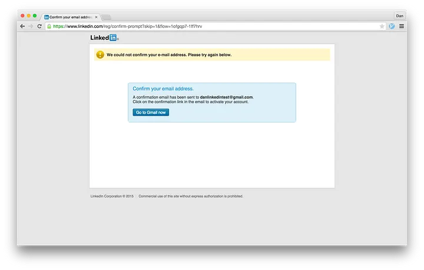

# Digital Literacy

## Lezione 06 del corso di _Abilità Informatiche_ (2024/2025)

###### Sebastian Barzaghi | [sebastian.barzaghi2@unibo.it](mailto:sebastian.barzaghi2@unibo.it) | [https://orcid.org/0000-0002-0799-1527](https://orcid.org/0000-0002-0799-1527) | [https://www.unibo.it/sitoweb/sebastian.barzaghi2/](https://www.unibo.it/sitoweb/sebastian.barzaghi2/)

---



## Disinformazione

<!--

-->

---

### PizzaGate

  

    <figure>
      
        <figcaption>
            Fonte: <a href="https://www.rollingstone.com/feature/anatomy-of-a-fake-news-scandal-125877/">https://www.rollingstone.com/feature/anatomy-of-a-fake-news-scandal-125877/</a>.
        </figcaption>
    </figure>
  

  

    

      Una teoria complottista che ha sostenuto che una pizzeria di Washington D.C., Comet Ping Pong, fosse il centro di una rete di pedofilia gestita da membri di alto livello del Partito Democratico degli Stati Uniti, tra cui Hillary Clinton.
    

    

      La teoria è nata da una serie di email trapelate da Wikileaks, che sono state interpretate (e distorte) in modo errato da alcuni utenti su Reddit e 4chan.
    

  

Robb, Amanda (2017). Anatomy of a Fake News Scandal. 
 <a href="https://www.rollingstone.com/feature/anatomy-of-a-fake-news-scandal-125877/">https://www.rollingstone.com/feature/anatomy-of-a-fake-news-scandal-125877/</a>.

---

### PizzaGate

  

    <figure>
      
        <figcaption>
            Fonte: <a href="https://www.rollingstone.com/feature/anatomy-of-a-fake-news-scandal-125877/">https://www.rollingstone.com/feature/anatomy-of-a-fake-news-scandal-125877/</a>.
        </figcaption>
    </figure>
  

  

    

      Un uomo armato si è recato nella pizzeria nel dicembre 2016 per "indagare" sulla presunta rete pedofila e ha sparato all'interno del locale.
    

    

      La teoria è nata da una serie di email trapelate da Wikileaks, che sono state interpretate, distorte e diffuse da alcuni utenti su Reddit, Twitter e 4chan.
    

  

Robb, Amanda (2017). Anatomy of a Fake News Scandal. 
 <a href="https://www.rollingstone.com/feature/anatomy-of-a-fake-news-scandal-125877/">https://www.rollingstone.com/feature/anatomy-of-a-fake-news-scandal-125877/</a>.

---

### Disinformazione

  

    <figure>
      
        <figcaption>
            Fonte: .
        </figcaption>
    </figure>
  

  

    

      Fenomeno di condivisione di contenuti informativi falsi, fuorvianti o decontestualizzati, effettuata da agenti consapevoli o inconsapevoli, con una serie di possibili intenti, e spesso caratterizzata da un aspetto memetico.
    

  

La Rassegna Stampa. In Rassegna Stampa per Bambini. 
 <a href="https://www.rassegnastampaperbambini.it/la-rassegna-stampa/">https://www.rassegnastampaperbambini.it/la-rassegna-stampa/</a>.

---

### Tipologie di disinformazione

<figure>
    
    <figcaption>
        Fonte: <a href="https://eavi.eu/beyond-fake-news-10-types-misleading-info/">https://eavi.eu/beyond-fake-news-10-types-misleading-info/</a>.
    </figcaption>
</figure>

---

### Vero o falso?

<figure>
    
    <figcaption>
        Fonte: <a href="https://libguides.lib.cwu.edu/c.php?g=625394&p=4391900">https://libguides.lib.cwu.edu/c.php?g=625394&p=4391900</a>.
    </figcaption>
</figure>

---

### Vero o falso?

  

    <figure>
      
        <figcaption>
            Fonte: <a href="https://libguides.lib.cwu.edu/c.php?g=625394&p=4391900">https://libguides.lib.cwu.edu/c.php?g=625394&p=4391900</a>.
        </figcaption>
    </figure>
  

  

    

      Falso. La fonte potrebbe essere legittima, ma la foto è falsa. Si tratta di una trovata dell'artista americano Zardulu, che ha messo in scena la foto con animali tassidermizzati.
    

  

---

### Vero o falso?

<figure>
    
    <figcaption>
        Fonte: <a href="https://libguides.lib.cwu.edu/c.php?g=625394&p=4391900">https://libguides.lib.cwu.edu/c.php?g=625394&p=4391900</a>.
    </figcaption>
</figure>

---

### Vero o falso?

  

    <figure>
      
        <figcaption>
            Fonte: <a href="https://libguides.lib.cwu.edu/c.php?g=625394&p=4391900">https://libguides.lib.cwu.edu/c.php?g=625394&p=4391900</a>.
        </figcaption>
    </figure>
  

  

    

      Falso. Il sito sta cercando di sembrare ABC News, ma l'URL è sbagliato. Il vero sito è abc.go.com, mentre questo è abc.com.co (il .co è un codice paese per la Colombia, i cui domini sono facili da registrare).
    

  

---

### Vero o falso?

<figure>
    
    <figcaption>
        Fonte: <a href="https://libguides.lib.cwu.edu/c.php?g=625394&p=4391900">https://libguides.lib.cwu.edu/c.php?g=625394&p=4391900</a>.
    </figcaption>
</figure>

---

### Vero o falso?

  

    <figure>
      
        <figcaption>
            Fonte: <a href="https://libguides.lib.cwu.edu/c.php?g=625394&p=4391900">https://libguides.lib.cwu.edu/c.php?g=625394&p=4391900</a>.
        </figcaption>
    </figure>
  

  

    

      Vero. Lo scoiattolo gigante indiano, o Ratufa indica, esiste!
    

  

---

### Vero o falso?

[https://www.youtube.com/watch?v=CE0Q904gtMI](https://www.youtube.com/watch?v=CE0Q904gtMI)

Fonte: <a href="https://libguides.lib.cwu.edu/c.php?g=625394&p=4391900">https://libguides.lib.cwu.edu/c.php?g=625394&p=4391900</a>.

---

### Vero o falso?

  

    

        <a href="https://www.youtube.com/watch?v=CE0Q904gtMI">https://www.youtube.com/watch?v=CE0Q904gtMI</a>
    

    

        Fonte: <a href="https://libguides.lib.cwu.edu/c.php?g=625394&p=4391900">https://libguides.lib.cwu.edu/c.php?g=625394&p=4391900</a>.
    

  

  

    

      Falso. Si tratta di un video creato da tre studenti di animazione di Montreal nel 2012 come progetto d’esame.
    

  

---

### Intento memetico e conseguenze

Sta diventando sempre più accessibile per singoli attori generare intere reti sociali per diffondere disinformazione.

Delle operazioni di rimozione di influenze su Facebook e X nel 2020, il 76% riguardava attori specifici che diffondevano disinformazione, rispetto al 62% nel 2019 e al 47% nel 2018.

Mishra, A. & Karumbaya, V. (2024). A Deadly Trifecta: Disinformation Networks, AI Memetic Warfare, and Deepfakes. On Global Network on Extremism & Technology. <a href="https://gnet-research.org/2024/02/15/a-deadly-trifecta-disinformation-networks-ai-memetic-warfare-and-deepfakes/">https://gnet-research.org/2024/02/15/a-deadly-trifecta-disinformation-networks-ai-memetic-warfare-and-deepfakes/</a>.

---

### Esempi

[Gli adolescenti di Veles (2016)](https://www.wired.com/2017/02/veles-macedonia-fake-news/)

[Il genocidio dei Rohingya (2017)](https://www.amnesty.org/en/latest/news/2022/09/myanmar-facebooks-systems-promoted-violence-against-rohingya-meta-owes-reparations-new-report/)

[Kullberg Network (2019)](https://www.snopes.com/news/2019/05/16/tldr-kullberg-network/)  

---

### Come fare?

* Controlla se ci sono lavori precedenti: dai un'occhiata per vedere se qualcun altro ha già verificato i fatti o ha fornito una sintesi della ricerca;
* Vai alla fonte: vai "a monte" alla fonte dell'affermazione per comprendere l'affidabilità delle informazioni;
* Leggi lateralmente: una volta che hai trovato la fonte di un'affermazione, leggi cosa dicono altri sulla fonte (pubblicazione, autore, ecc.);
* Ritorna indietro: se ti perdi, fai un passo indietro e ricomincia da capo, tenendo conto di ciò che sai ora.

Caulfield, M.A. (2017). Web Literacy for Student Fact-checkers. 
 <a href="https://webliteracy.pressbooks.com/">https://webliteracy.pressbooks.com/</a>.

---

### Risorse utili

* http://www.politifact.com/ 
* https://www.factcheck.org/ 
* http://snopes.com/ 
* https://www.open.online/c/fact-checking/ 
* https://pagellapolitica.it/ 
* https://facta.news/ 
* https://verificationhandbook.com/downloads/verification.handbook.pdf 
* https://digitalresource.center/content/introducing-imvain 
* https://www.tineye.com/ 

---



## Design Persuasivo

<!--

-->

---

### Il Web è uno spazio progettato

  

    <figure>
      
        <figcaption>
            Fonte: <a href="https://designshack.net/articles/typography/font-psychology/">https://designshack.net/articles/typography/font-psychology/</a>.
        </figcaption>
    </figure>
  

  

    

      Ogni cosa sul Web è frutto di decisioni prese da esseri umani, quindi di un’intenzione.
    

  

Fogg, B. J. (2009, April). A behavior model for persuasive design. In Proceedings of the 4th international Conference on Persuasive Technology (pp. 1-7). <a href="https://doi.org/10.1145/1541948.1541999">https://doi.org/10.1145/1541948.1541999</a>.

---



### Cosa vuol dire progettare qualcosa?

<!--
By Benjamin D. Esham / Wikimedia Commons, <a href="https://creativecommons.org/licenses/by-sa/4.0" title="Creative Commons Attribution-Share Alike 4.0">CC BY-SA 4.0</a>, <a href="https://commons.wikimedia.org/w/index.php?curid=3420850">Link</a>
-->

---



### Cosa vuol dire progettare qualcosa?

<!--
By Ángel Sanz de Andrés - Own work, <a href="https://creativecommons.org/licenses/by-sa/4.0" title="Creative Commons Attribution-Share Alike 4.0">CC BY-SA 4.0</a>, <a href="https://commons.wikimedia.org/w/index.php?curid=79061993">Link</a>
-->

---

### Cosa vuol dire progettare qualcosa?

* Diverse intenzioni;
* Diverse funzioni;
* Diverse emozioni;
* Diverse azioni.

Progettare vuol dire prendere determinate scelte nella realizzazione di qualcosa per ottenere un determinato risultato in termini di azioni o emozioni da parte di un utente.

In quanto utenti, reagite alla progettazione con emozioni e/o azioni.

Fogg, B. J. (2009, April). A behavior model for persuasive design. In Proceedings of the 4th international Conference on Persuasive Technology (pp. 1-7). <a href="https://doi.org/10.1145/1541948.1541999">https://doi.org/10.1145/1541948.1541999</a>.

---

### Quindi, nel Web è tutto intenzione

Le risorse Web sono progettate con un’intenzione.

Quali sono le intenzioni dei designer? Quali sono le vostre intenzioni?

Migliore è il design, più probabilmente verranno soddisfatte le intenzioni di entrambi (comunque, sicuramente del designer).

Fogg, B. J. (2009, April). A behavior model for persuasive design. In Proceedings of the 4th international Conference on Persuasive Technology (pp. 1-7). <a href="https://doi.org/10.1145/1541948.1541999">https://doi.org/10.1145/1541948.1541999</a>.

---

### Esempio: google.com

  

    <figure>
      
        <figcaption>
            Fonte: <a href="https://mozilla.github.io/web-lit-core/design-on-the-web/">https://mozilla.github.io/web-lit-core/design-on-the-web/</a>.
        </figcaption>
    </figure>
  

  

    <ul>
      <li>Focus su logo e barra di ricerca;</li>
      <li>Spazio vuoto;</li>
      <li>Contrasto.</li>
    </ul>
  

---

### Esempio: amazon.com

  

    <figure>
      
        <figcaption>
            Fonte: <a href="https://mozilla.github.io/web-lit-core/design-on-the-web/">https://mozilla.github.io/web-lit-core/design-on-the-web/</a>.
        </figcaption>
    </figure>
  

  

    <ul>
      <li>Numerosità degli elementi;</li>
      <li>Dimensioni variabili;</li>
      <li>Alcuni elementi più visibili di altri.</li>
    </ul>
  

---

### Esempio: youtube.com

  

    <figure>
      
        <figcaption>
            Fonte: <a href="https://mozilla.github.io/web-lit-core/design-on-the-web/">https://mozilla.github.io/web-lit-core/design-on-the-web/</a>.
        </figcaption>
    </figure>
  

  

    <ul>
      <li>Numerosi elementi interattivi;</li>
      <li>Progettazione che guida la vostra attenzione a seconda dell'intenzione del designer.</li>
    </ul>
  

---

### Le intenzioni possono coincidere...

-

---

### ... Ma possono anche contrastare

Per YouTube, l'utente deve vedere più video possibili, deve cliccare sulla pubblicità, e deve commentare.

L'utente ha invece bisogno di vedere video specifici, magari da parte dello stesso creator o sullo stesso soggetto, deve caricare il proprio contenuto, e commentare.

---

### Percorso dell'utente

  

    <figure>
      
        <figcaption>
            Fonte: <a href="https://www.rollingstone.com/feature/anatomy-of-a-fake-news-scandal-125877/">https://www.rollingstone.com/feature/anatomy-of-a-fake-news-scandal-125877/</a>.
        </figcaption>
    </figure>
  

  

    

        "Devo comprare un libro di fantascienza su Amazon".
    

    <ul>
      <li>"Cerco ‘libro fantascienza’ nella barra di ricerca";</li>
      <li>“Guardo i risultati”;</li>
      <li>“Clicco su un titolo che mi interessa”;</li>
      <li>...</li>
    </ul>
  

La Rassegna Stampa. In Rassegna Stampa per Bambini. 
 <a href="https://www.rassegnastampaperbambini.it/la-rassegna-stampa/">https://www.rassegnastampaperbambini.it/la-rassegna-stampa/</a>.

---

### Percorso dell'utente

  

    <figure>
      
        <figcaption>
            Fonte: <a href="https://www.rollingstone.com/feature/anatomy-of-a-fake-news-scandal-125877/">https://www.rollingstone.com/feature/anatomy-of-a-fake-news-scandal-125877/</a>.
        </figcaption>
    </figure>
  

  

    

        Uno degli strumenti utilizzati dai designer per la progettazione di un sito Web.
    

    

        Mappatura dettagliata e completa di intenzioni, azioni, ed emozioni dell’utente.
    

  

La Rassegna Stampa. In Rassegna Stampa per Bambini. 
 <a href="https://www.rassegnastampaperbambini.it/la-rassegna-stampa/">https://www.rassegnastampaperbambini.it/la-rassegna-stampa/</a>.

---

### Dark pattern

  

    <figure>
      
        <figcaption>
            Fonte: <a href="https://www.rollingstone.com/feature/anatomy-of-a-fake-news-scandal-125877/">https://www.rollingstone.com/feature/anatomy-of-a-fake-news-scandal-125877/</a>.
        </figcaption>
    </figure>
  

  

    

        Modelli di progettazione usati per manipolare le emozioni dell’utente ed indurlo a compiere azioni in contrasto con le sue intenzioni.
    

    

        Es. posizionamento tattico di bottoni, testi volutamente ambigui, ecc.
    

  

La Rassegna Stampa. In Rassegna Stampa per Bambini. 
 <a href="https://www.rassegnastampaperbambini.it/la-rassegna-stampa/">https://www.rassegnastampaperbambini.it/la-rassegna-stampa/</a>.

---

### Dark pattern

  

    <figure>
      
        <figcaption>
            Fonte: <a href="https://www.rollingstone.com/feature/anatomy-of-a-fake-news-scandal-125877/">https://www.rollingstone.com/feature/anatomy-of-a-fake-news-scandal-125877/</a>.
        </figcaption>
    </figure>
  

  

    

        Utilizzo crescente da parte delle aziende (nonostante le sanzioni).
    

    

        Funzionano: ci portano a fare esattamente quello che vogliono loro, facendoci credere che sia nei nostri migliori interessi.
    

  

La Rassegna Stampa. In Rassegna Stampa per Bambini. 
 <a href="https://www.rassegnastampaperbambini.it/la-rassegna-stampa/">https://www.rassegnastampaperbambini.it/la-rassegna-stampa/</a>.

---

### Esempio: LinkedIn

  

    <figure>
      
        <figcaption>
            Fonte: <a href="https://www.rollingstone.com/feature/anatomy-of-a-fake-news-scandal-125877/">https://www.rollingstone.com/feature/anatomy-of-a-fake-news-scandal-125877/</a>.
        </figcaption>
    </figure>
  

  

    

        Al momento della creazione dell’account, il sistema tenta più volte di farti importare la rubrica, usando una combinazione di testo ingannevoli, colori poco contrastanti e posizionamento strategico degli elementi.
    

  

Schlosser, D. (2015). LinkedIn Dark Patterns. Deceptive Patterns. <a href="https://medium.com/@danrschlosser/linkedin-dark-patterns-3ae726fe1462">https://medium.com/@danrschlosser/linkedin-dark-patterns-3ae726fe1462</a>.

---

### Esempio: LinkedIn

  

    <figure>
      
        <figcaption>
            Fonte: <a href="https://www.rollingstone.com/feature/anatomy-of-a-fake-news-scandal-125877/">https://www.rollingstone.com/feature/anatomy-of-a-fake-news-scandal-125877/</a>.
        </figcaption>
    </figure>
  

  

    

        Se l’utente tenta di saltare questo step (e solo in quel caso), una finestra aggiuntiva appare per chiedere all’utente di confermare la scelta, utilizzando un linguaggio totalmente fuorviante.
    

  

Schlosser, D. (2015). LinkedIn Dark Patterns. Deceptive Patterns. <a href="https://medium.com/@danrschlosser/linkedin-dark-patterns-3ae726fe1462">https://medium.com/@danrschlosser/linkedin-dark-patterns-3ae726fe1462</a>.

---

### Esempio: LinkedIn

  

    <figure>
      
        <figcaption>
            Fonte: <a href="https://www.rollingstone.com/feature/anatomy-of-a-fake-news-scandal-125877/">https://www.rollingstone.com/feature/anatomy-of-a-fake-news-scandal-125877/</a>.
        </figcaption>
    </figure>
  

  

    

        … e nonostante i ripetuti rifiuti da parte dell’utente, il sistema ci riprova, cambiando di nuovo la terminologia.
    

  

La Rassegna Stampa. In Rassegna Stampa per Bambini. 
 <a href="https://www.rassegnastampaperbambini.it/la-rassegna-stampa/">https://www.rassegnastampaperbambini.it/la-rassegna-stampa/</a>.

---

### Conferma imbarazzante

  

    <figure>
      
        <figcaption>
            Fonte: <a href="https://www.deceptive.design/types/confirmshaming">https://www.deceptive.design/types/confirmshaming</a>.
        </figcaption>
    </figure>
  

  

    

        L’utente viene manipolato emotivamente al fine di fargli compiere azioni che altrimenti non avrebbe fatto.
    

  

---

### Annunci mascherati

  

    <figure>
      
        <figcaption>
            Fonte: <a href="https://www.deceptive.design/types/disguised-ads">https://www.deceptive.design/types/disguised-ads</a>.
        </figcaption>
    </figure>
  

  

    

        L’utente viene indotto a interagire con annuncio pubblicitario spacciato come un elemento dell’interfaccia.
    

  

---

### Urgenza fasulla

  

    <figure>
      
        <figcaption>
            Fonte: <a href="https://www.deceptive.design/types/fake-scarcity">https://www.deceptive.design/types/fake-scarcity</a>.
        </figcaption>
    </figure>
  

  

    

        L’utente viene indotto a completare un’azione tramite un’indicazione fasulla di scarsità del prodotto o di tempo.
    

  

---

### Motel di scarafaggi

  

    <figure>
      
        <figcaption>
            Fonte: <a href="https://www.deceptive.design/types/hard-to-cancel">https://www.deceptive.design/types/hard-to-cancel</a>.
        </figcaption>
    </figure>
  

  

    

        L’utente viene intrappolato nella sottoscrizione ad un servizio, rendendo l’iscrizione molto semplice e la cancellazione molto difficile.
    

  

---

### Costi nascosti

  

    <figure>
      
        <figcaption>
            Fonte: <a href="https://www.deceptive.design/types/hidden-costs">https://www.deceptive.design/types/hidden-costs</a>.
        </figcaption>
    </figure>
  

  

    

        L’utente viene attratto da prezzi bassi, che si rivelano essere parziali e parti di un prezzo più alto al momento del checkout.
    

  

---

### Nagging

  

    <figure>
      
        <figcaption>
            Fonte: <a href="https://www.deceptive.design/types/nagging">https://www.deceptive.design/types/nagging</a>.
        </figcaption>
    </figure>
  

  

    

        L’utente prova a fare qualcosa, ma viene sistematicamente interrotto da richieste di fare qualcos’altro.
    

  

---

### Preselezione

  

    <figure>
      
        <figcaption>
            Fonte: <a href="https://www.deceptive.design/types/preselection">https://www.deceptive.design/types/preselection</a>.
        </figcaption>
    </figure>
  

  

    

        All’utente viene presentata un’opzione già selezionata.
    

  

---

### Formulazione a trabocchetto

  

    <figure>
      
        <figcaption>
            Fonte: <a href="https://blog.mobiversal.com/dark-patterns-or-how-ux-exploits-the-user-trick-questions-fake-new-notification.html">https://blog.mobiversal.com/dark-patterns-or-how-ux-exploits-the-user-trick-questions-fake-new-notification.html</a>.
        </figcaption>
    </figure>
  

  

    

        L’utente è spinto con l’inganno ad effettuare un’azione sulla base di un testo scritto in maniera volutamente ambigua.
    

  

---



## Privacy

<!--

-->

---

### La nostra ombra digitale

  

    <figure>
      
        <figcaption>
            Fonte: <a href="https://www.rollingstone.com/feature/anatomy-of-a-fake-news-scandal-125877/">https://www.rollingstone.com/feature/anatomy-of-a-fake-news-scandal-125877/</a>.
        </figcaption>
    </figure>
  

  

    

        Ogni giorno disseminiamo sul Web una serie di dati che riconducono irrimediabilmente alle nostre attività, ai nostri segreti, ai nostri pensieri, a noi.
    

    

        A chi appartengono questi dati? Per cosa vengono utilizzati?
    

  

La Rassegna Stampa. In Rassegna Stampa per Bambini. 
 <a href="https://www.rassegnastampaperbambini.it/la-rassegna-stampa/">https://www.rassegnastampaperbambini.it/la-rassegna-stampa/</a>.

---

### Ogni cosa viene tracciata

  

    <figure>
      
        <figcaption>
            Fonte: <a href="https://www.rollingstone.com/feature/anatomy-of-a-fake-news-scandal-125877/">https://www.rollingstone.com/feature/anatomy-of-a-fake-news-scandal-125877/</a>.
        </figcaption>
    </figure>
  

  

    

        La maggior parte dei siti deposita sui nostri sistemi dei cookie che tengono traccia di tutti i nostri movimenti (anche e soprattutto da sito a sito), con l’intenzione di migliorare l’efficacia di pubblicità mirate.
    

    

        Sui social, tutto viene registrato (anche i commenti privati).
    

    

        Le politiche di gestione dei dati della singola azienda possono cambiare improvvisamente.
    

  

La Rassegna Stampa. In Rassegna Stampa per Bambini. 
 <a href="https://www.rassegnastampaperbambini.it/la-rassegna-stampa/">https://www.rassegnastampaperbambini.it/la-rassegna-stampa/</a>.

---

### L'ombra digitale sono metadati

-

---

### GENERAL DATA PROTECTION REGULATION

l Regolamento si applicherà
a decorrere dal 25 maggio 2018
 Il nuovo Regolamento Generale Europeo sulla
Protezione dei Dati Personali n. 2016/679 (GDPR),
con i suoi 99 articoli ha riscritto la disciplina della
Privacy a livello europeo.

La necessità di emanare un Regolamento Europeo in
materia di privacy nasce dalla continua evoluzione
degli stessi concetti di privacy e protezione dei dati
personali e quindi della relativa tutela dovuta
principalmente alla diffusione del progresso
tecnologico.

Definire una BASELINE per la protezione dei dati
Proteggere e tutelare meglioo la protezione dei dati di
tutti I cittadini in Europa
Armonizzare la normativa in Europa in materia Privacy
eliminando le differenze di approccio tra Stati membri

l Regolamento si applica:
1. alla protezione delle persone fisiche con riguardo al trattamento dei loro dati
personali
2. al trattamento automatizzato di dati personali
3. al trattamento NON automatizzato di dati personali contenuti in un archivio

Ai fini del regolamento per "dato personale” si intende qualsiasi informazione
riguardante una persona fisica identificata o identificabile ("interessato");
si considera identificabile la persona fisica che può essere identificata, direttamente
o indirettamente, con particolare riferimento a un identificativo come il nome, un
numero di identificazione, dati relativi all’ubicazione, un identificativo
online o a uno o più elementi caratteristici della sua identità fisica, fisiologica,
genetica, psichica, economica, culturale o sociale.

Cos’è il trattamento di un dato?
Qualsiasi attività di gestione del dato
come:
trattamento
del dato
 la raccolta,
 la conservazione,
 la modifica,
 la consultazione,
 la comunicazione,
 la cancellazione
su qualsiasi supporto
 informatico,
 cartaceo o analogico,
sia attraverso operatori sia con processi automatizzati

Principi di:
* liceità e correttezza
* trasparenza
* limitazione delle finalità dei trattamenti
* minimizzazione
* esattezza
* limitazione della conservazione
* integrità e riservatezza

Requisiti:
* impianto sanzonatorio
* privacy by design
* privacy by default
* notifica della violazione
* nuovi diritti individuali
* consenso
* accountability
* data protection officer
* nuovo ambito di applicazione territoriale

---

### Cookie

  

    <figure>
      
        <figcaption>
            Fonte: <a href="https://www.rollingstone.com/feature/anatomy-of-a-fake-news-scandal-125877/">https://www.rollingstone.com/feature/anatomy-of-a-fake-news-scandal-125877/</a>.
        </figcaption>
    </figure>
  

  

    

        Piccoli file di testo mandati da un sito Web, trattenuti dal browser e memorizzati sul dispositivo, progettati per tenere traccia delle informazioni riguardanti l’utente.
    

    

        I siti ci “fiutano” seguendo la traccia lasciata dai cookie.
    

  

La Rassegna Stampa. In Rassegna Stampa per Bambini. 
 <a href="https://www.rassegnastampaperbambini.it/la-rassegna-stampa/">https://www.rassegnastampaperbambini.it/la-rassegna-stampa/</a>.

---

### Cookie

  

    <figure>
      
        <figcaption>
            Fonte: <a href="https://www.rollingstone.com/feature/anatomy-of-a-fake-news-scandal-125877/">https://www.rollingstone.com/feature/anatomy-of-a-fake-news-scandal-125877/</a>.
        </figcaption>
    </figure>
  

  

    

        Tecnici: essenziali per l’interazione con un sito Web (es. cookie di sessione che mantengono l’accesso dell’utente al sito).
    

    

        Analitici: raccolgono informazioni sull’utilizzo del sito Web da parte dell’utente (e.g. Google Analytics).
    

    

        Profilazione: raccolgono informazioni sull’utente per profilarlo ed inviargli pubblicità mirata (e.g. Google AdSense).
    

  

La Rassegna Stampa. In Rassegna Stampa per Bambini. 
 <a href="https://www.rassegnastampaperbambini.it/la-rassegna-stampa/">https://www.rassegnastampaperbambini.it/la-rassegna-stampa/</a>.

---

### Cookie

Let’s get one thing out of the way quickly: cookies are not a good name for these little snippets of text that get stored in your browser. In fact, they are a terrible name. Apparently, the name originates from the fable of Hansel and Gretel, although I have no idea if that is an urban legend or not.

Also, here is a quick example of cookies in action if you are looking for some context. Let’s say that you type amazon.com into your browser, and when the page loads, you are automatically logged in. Cookies allow that to happen.

Notice how you didn’t take any action on the site itself, but Amazon already knew something about you. This is because there is a small piece of text that gets stored in your browser when you create an account on Amazon.

---

similar to the experience of visiting a doctor, dentist or other health professional. 

In this example, you are actually going to be the parent that is taking your child to an appointment.

Imagine that you are in charge of taking your son or daughter to their annual doctor’s checkup. This is not your first one. In the past, you picked a doctor that you trusted and now you return to that doctor every year.

When you visit the office on that day, you check in with a secretary, who verifies your identity and send you and your child into a room. When the doctor shows up, he or she already has a copy of your medical history, and begins reviewing it with both of you.

In our example, the website is kind of like the doctor. He or she sees many patients, and must be able to react quickly to give each one a great experience.

The assistant is like the server. He or she prepares the doctor to give a great experience.

And your child is like the browser. He or she visits specific sites, or health practitioners. Your child also sees a dentist and an optometrist, which we will cover in a little bit. The doctor must see many children, or in technical terms, receives many visits from browsers around the world.

---

Let’s take a moment and imagine that initial communication between you and the assistant did not happen. Instead, you just strolled into the doctor’s office and were forced to recount your child’s health history. That would be a terrible experience for you, the visitor, for two reasons:

    You can’t perfectly recall your child’s health history in a way that is meaningful to a doctor. You might have some memory, but they need the actual specific conditions over time.
    This would take WAY too long for you.

Instead, there needs to be a system to rapidly deliver the right information to the doctor so you have a great experience when you visit. From a technical perspective, this is why we need cookies. Web developers want to give users a great experience as soon as they hit the page, and they just need a small hint to customize the experience for each returning visitor. That is the value of having a local cookie.

---

So, a cookie is a short piece of text that is stored in web visitor’s browser. If you are visiting a shopping site, it might contain a user ID that will allow the site to instantly log you in. You received that user ID when you created an account for the first time, and it was then stored in your browser by Amazon’s servers. Similarly, a doctor’s office will tie your child’s medical policy number to a specific account in their system.

---

Let’s align these two processes.

    You enter the doctor’s office and check in with the receptionist. The receptionist asks for your child’s medical ID.
    You enter an exam room with your child, and the doctor arrives with your child’s health history
    You are able to add on to your child’s health history since the doctor can quickly catch up with past notes. You resume as if the doctor just saw your child yesterday, when in reality, he/she has no memory of your last appointment from the previous year.

From a technical view:

    You type in Amazon.com. This means you are sending an HTTP request to the amazon.com servers.
    The servers read your cookie, and prepare a customized page that will allow you to be automatically logged in.
    The page is served to you, the visitor. You are already logged in and can resume shopping from where you left off.

---

First of all, there is no universal cookie protocol. Each site uses their own data categorization system, so cookies are not shared between sites, except in the case of retargeting. So, it is unlike a social security number, where one number unlocks multiple types of personal data. Similarly, your medical history is not automatically shared among practitioners unless you grant permission.

---

So far, the relationship between the web server and cookie is 1:1. But, sites can also share your information with third-party ad networks. For example, let’s say you are shopping for rollerblades. You leave coolrollerblades.com without buying anything. But, coolrollerblades.com uses the Facebook Ads tracking pixel. So, when you visit Facebook the next time, you see an ad for rollerblades. How can this happen?

Let’s imagine that your child visits the dentist’s office, and gets the news that many children get: she is going to need braces! Your doctor has taken an x-ray of your teeth, and is going to send them to the local orthodontist so you can speak to an expert. Here are the steps that would need to happen in this process:

    The doctor sends your x-rays to the assistant at the orthodontist’s office so he/she can create a file for you.
    You visit the orthodontist’s office and let the assistant know that your dentist referred you.
    The assistant gets your x-rays to the orthodontist so he/she can discuss with you as you meet.

---

Here’s one area where cookies and doctor’s visits are pretty different. Most people would say that an annual doctor’s visit for a child is an unquestionably good thing. Unless you do not trust modern medicine, it’s an easy way to get your child in front of an expert at least once a year.

On the other hand, there is a little more debate around the privacy issues that come along with cookies. Most people are comfortable with a site that simply uses your info to load your account in your browser of choice. But, especially after the Facebook Ads crisis stemming from the 2016 US Presidential Election, some people have become uncomfortable with retargeting. They don’t want ad networks to track them on many sites across the Internet. I am going to stay out of the privacy debate, but instead wanted to offer some background on the range of opinions on cookies.

---

...

---

### Cookie

  

    <figure>
      
        <figcaption>
            Fonte: <a href="https://blog.codeanalogies.com/2018/06/02/internet-cookies-explained-by-taking-your-kids-to-the-doctors-office ">https://blog.codeanalogies.com/2018/06/02/internet-cookies-explained-by-taking-your-kids-to-the-doctors-office </a>.
        </figcaption>
    </figure>
  

  

    

        Quando si visita un sito Web, i cookie vengono inviati dal server al client.
    

    

        Durante la navigazione successiva sul sito, il browser invia i cookie al server per consentire all’utente di accedere alle funzionalità del sito, ricevere ad personalizzati, ecc.
    

  

La Rassegna Stampa. In Rassegna Stampa per Bambini. 
 <a href="https://www.rassegnastampaperbambini.it/la-rassegna-stampa/">https://www.rassegnastampaperbambini.it/la-rassegna-stampa/</a>.

---

---

# Fine

## Lezione 06 del corso di _Abilità Informatiche_ (2024/2025)

###### Sebastian Barzaghi | [sebastian.barzaghi2@unibo.it](mailto:sebastian.barzaghi2@unibo.it) | [https://orcid.org/0000-0002-0799-1527](https://orcid.org/0000-0002-0799-1527) | [https://www.unibo.it/sitoweb/sebastian.barzaghi2/](https://www.unibo.it/sitoweb/sebastian.barzaghi2/)