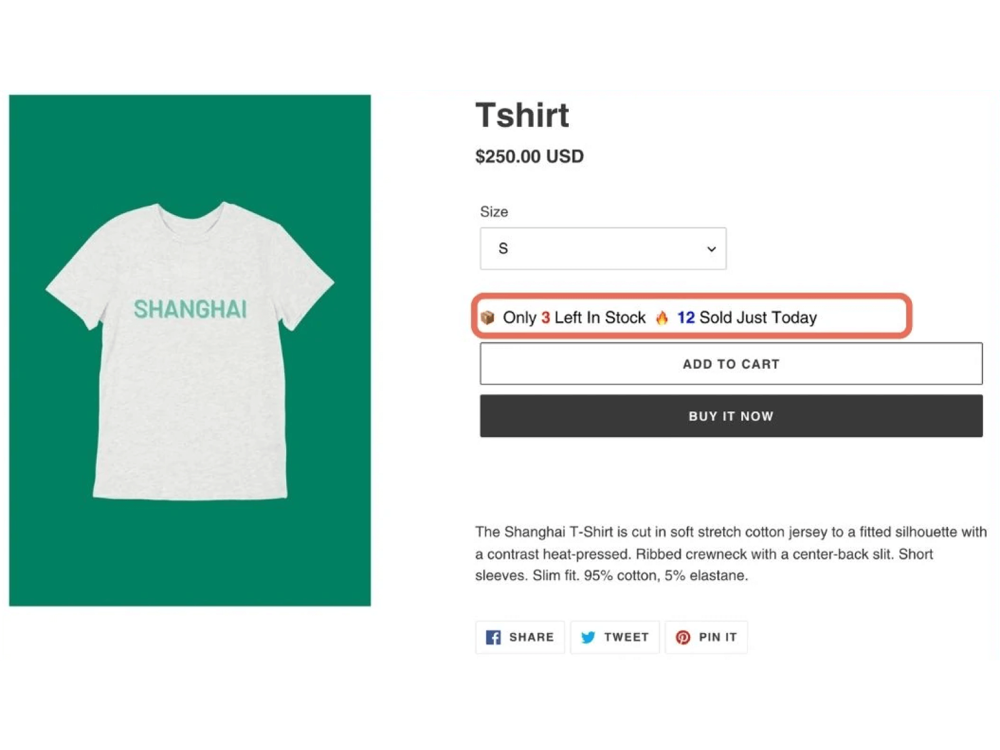
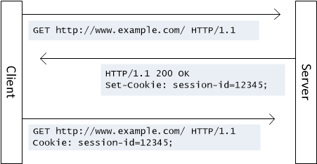

# Digital Literacy

## Lezione 06 del corso di _Abilità Informatiche_ (2024/2025)

###### Sebastian Barzaghi | [sebastian.barzaghi2@unibo.it](mailto:sebastian.barzaghi2@unibo.it) | [https://orcid.org/0000-0002-0799-1527](https://orcid.org/0000-0002-0799-1527) | [https://www.unibo.it/sitoweb/sebastian.barzaghi2/](https://www.unibo.it/sitoweb/sebastian.barzaghi2/)

---



## Disinformazione

<!--
Photo by <a href="https://unsplash.com/@visuals?utm_content=creditCopyText&utm_medium=referral&utm_source=unsplash">visuals</a> on <a href="https://unsplash.com/photos/gray-and-black-cat-sketch-2TS23o0-pUc?utm_content=creditCopyText&utm_medium=referral&utm_source=unsplash">Unsplash</a>
-->

---

### PizzaGate

  

    <figure>
      
        <figcaption>
            Fonte: <a href="https://www.rollingstone.com/feature/anatomy-of-a-fake-news-scandal-125877/">https://www.rollingstone.com/feature/anatomy-of-a-fake-news-scandal-125877/</a>.
        </figcaption>
    </figure>
  

  

    

      Una teoria complottista che ha sostenuto che una pizzeria di Washington D.C., Comet Ping Pong, fosse il centro di una rete di pedofilia gestita da membri di alto livello del Partito Democratico degli Stati Uniti, tra cui Hillary Clinton.
    

    

      La teoria è nata da una serie di email trapelate da Wikileaks, che sono state interpretate (e distorte) in modo errato da alcuni utenti su Reddit e 4chan.
    

  

Robb, Amanda (2017). Anatomy of a Fake News Scandal. 
 <a href="https://www.rollingstone.com/feature/anatomy-of-a-fake-news-scandal-125877/">https://www.rollingstone.com/feature/anatomy-of-a-fake-news-scandal-125877/</a>.

---

### PizzaGate

  

    <figure>
      
        <figcaption>
            Fonte: <a href="https://www.rollingstone.com/feature/anatomy-of-a-fake-news-scandal-125877/">https://www.rollingstone.com/feature/anatomy-of-a-fake-news-scandal-125877/</a>.
        </figcaption>
    </figure>
  

  

    

      Un uomo armato si è recato nella pizzeria nel dicembre 2016 per "indagare" sulla presunta rete pedofila e ha sparato all'interno del locale.
    

    

      La teoria è nata da una serie di email trapelate da Wikileaks, che sono state interpretate, distorte e diffuse da alcuni utenti su Reddit, Twitter e 4chan.
    

  

Robb, Amanda (2017). Anatomy of a Fake News Scandal. 
 <a href="https://www.rollingstone.com/feature/anatomy-of-a-fake-news-scandal-125877/">https://www.rollingstone.com/feature/anatomy-of-a-fake-news-scandal-125877/</a>.

---

### Disinformazione

Fenomeno di condivisione di contenuti informativi falsi, fuorvianti o decontestualizzati, effettuata da agenti consapevoli o inconsapevoli, con una serie di possibili intenti, e spesso caratterizzata da un aspetto memetico.

La Rassegna Stampa. In Rassegna Stampa per Bambini. 
 <a href="https://www.rassegnastampaperbambini.it/la-rassegna-stampa/">https://www.rassegnastampaperbambini.it/la-rassegna-stampa/</a>.

---

### Tipologie di disinformazione

<figure>
    
    <figcaption>
        Fonte: <a href="https://eavi.eu/beyond-fake-news-10-types-misleading-info/">https://eavi.eu/beyond-fake-news-10-types-misleading-info/</a>.
    </figcaption>
</figure>

---

### Vero o falso?

<figure>
    
    <figcaption>
        Fonte: <a href="https://libguides.lib.cwu.edu/c.php?g=625394&p=4391900">https://libguides.lib.cwu.edu/c.php?g=625394&p=4391900</a>.
    </figcaption>
</figure>

---

### Vero o falso?

  

    <figure>
      
        <figcaption>
            Fonte: <a href="https://libguides.lib.cwu.edu/c.php?g=625394&p=4391900">https://libguides.lib.cwu.edu/c.php?g=625394&p=4391900</a>.
        </figcaption>
    </figure>
  

  

    

      Falso. La fonte potrebbe essere legittima, ma la foto è falsa. Si tratta di una trovata dell'artista americano Zardulu, che ha messo in scena la foto con animali tassidermizzati.
    

  

---

### Vero o falso?

<figure>
    
    <figcaption>
        Fonte: <a href="https://libguides.lib.cwu.edu/c.php?g=625394&p=4391900">https://libguides.lib.cwu.edu/c.php?g=625394&p=4391900</a>.
    </figcaption>
</figure>

---

### Vero o falso?

  

    <figure>
      
        <figcaption>
            Fonte: <a href="https://libguides.lib.cwu.edu/c.php?g=625394&p=4391900">https://libguides.lib.cwu.edu/c.php?g=625394&p=4391900</a>.
        </figcaption>
    </figure>
  

  

    

      Falso. Il sito sta cercando di sembrare ABC News, ma l'URL è sbagliato. Il vero sito è abc.go.com, mentre questo è abc.com.co (il .co è un codice paese per la Colombia, i cui domini sono facili da registrare).
    

  

---

### Vero o falso?

<figure>
    
    <figcaption>
        Fonte: <a href="https://libguides.lib.cwu.edu/c.php?g=625394&p=4391900">https://libguides.lib.cwu.edu/c.php?g=625394&p=4391900</a>.
    </figcaption>
</figure>

---

### Vero o falso?

  

    <figure>
      
        <figcaption>
            Fonte: <a href="https://libguides.lib.cwu.edu/c.php?g=625394&p=4391900">https://libguides.lib.cwu.edu/c.php?g=625394&p=4391900</a>.
        </figcaption>
    </figure>
  

  

    

      Vero. Lo scoiattolo gigante indiano, o Ratufa indica, esiste!
    

  

---

### Vero o falso?

[https://www.youtube.com/watch?v=CE0Q904gtMI](https://www.youtube.com/watch?v=CE0Q904gtMI)

Fonte: <a href="https://libguides.lib.cwu.edu/c.php?g=625394&p=4391900">https://libguides.lib.cwu.edu/c.php?g=625394&p=4391900</a>.

---

### Vero o falso?

  

    

        <a href="https://www.youtube.com/watch?v=CE0Q904gtMI">https://www.youtube.com/watch?v=CE0Q904gtMI</a>
    

    

        Fonte: <a href="https://libguides.lib.cwu.edu/c.php?g=625394&p=4391900">https://libguides.lib.cwu.edu/c.php?g=625394&p=4391900</a>.
    

  

  

    

      Falso. Si tratta di un video creato da tre studenti di animazione di Montreal nel 2012 come progetto d’esame.
    

  

---

### Intento memetico e conseguenze

Sta diventando sempre più accessibile per singoli attori generare intere reti sociali per diffondere disinformazione.

Delle operazioni di rimozione di influenze su Facebook e X nel 2020, il 76% riguardava attori specifici che diffondevano disinformazione, rispetto al 62% nel 2019 e al 47% nel 2018.

Mishra, A. & Karumbaya, V. (2024). A Deadly Trifecta: Disinformation Networks, AI Memetic Warfare, and Deepfakes. On Global Network on Extremism & Technology. <a href="https://gnet-research.org/2024/02/15/a-deadly-trifecta-disinformation-networks-ai-memetic-warfare-and-deepfakes/">https://gnet-research.org/2024/02/15/a-deadly-trifecta-disinformation-networks-ai-memetic-warfare-and-deepfakes/</a>.

---

### Esempi

[Gli adolescenti di Veles (2016)](https://www.wired.com/2017/02/veles-macedonia-fake-news/)

[Il genocidio dei Rohingya (2017)](https://www.amnesty.org/en/latest/news/2022/09/myanmar-facebooks-systems-promoted-violence-against-rohingya-meta-owes-reparations-new-report/)

[Kullberg Network (2019)](https://www.snopes.com/news/2019/05/16/tldr-kullberg-network/)  

---

### Come fare?

* **Controlla se ci sono lavori precedenti**: dai un'occhiata per vedere se qualcun altro ha già verificato i fatti o ha fornito una sintesi della ricerca;
* **Vai alla fonte**: vai "a monte" alla fonte dell'affermazione per comprendere l'affidabilità delle informazioni;
* **Leggi lateralmente**: una volta che hai trovato la fonte di un'affermazione, leggi cosa dicono altri sulla fonte (pubblicazione, autore, ecc.);
* **Ritorna indietro**: se ti perdi, fai un passo indietro e ricomincia da capo, tenendo conto di ciò che sai ora.

Caulfield, M.A. (2017). Web Literacy for Student Fact-checkers. 
 <a href="https://webliteracy.pressbooks.com/">https://webliteracy.pressbooks.com/</a>.

---

### Risorse utili

* http://www.politifact.com/ 
* https://www.factcheck.org/ 
* http://snopes.com/ 
* https://www.open.online/c/fact-checking/ 
* https://pagellapolitica.it/ 
* https://facta.news/ 
* https://verificationhandbook.com/downloads/verification.handbook.pdf 
* https://digitalresource.center/content/introducing-imvain 
* https://www.tineye.com/ 

---



## Design Persuasivo

<!--
Photo by <a href="https://unsplash.com/@rishabhdharmani?utm_content=creditCopyText&utm_medium=referral&utm_source=unsplash">Rishabh Dharmani</a> on <a href="https://unsplash.com/photos/man-in-black-suit-jacket-raising-his-right-hand-IvfAs3Qk64M?utm_content=creditCopyText&utm_medium=referral&utm_source=unsplash">Unsplash</a>
-->

---

### Il Web è uno spazio progettato

  

    <figure>
      
        <figcaption>
            Fonte: <a href="https://designshack.net/articles/typography/font-psychology/">https://designshack.net/articles/typography/font-psychology/</a>.
        </figcaption>
    </figure>
  

  

    

      Ogni cosa sul Web è frutto di decisioni prese da esseri umani, quindi di un’intenzione.
    

  

Fogg, B. J. (2009, April). A behavior model for persuasive design. In Proceedings of the 4th international Conference on Persuasive Technology (pp. 1-7). <a href="https://doi.org/10.1145/1541948.1541999">https://doi.org/10.1145/1541948.1541999</a>.

---



### Cosa vuol dire progettare qualcosa?

<!--
By Benjamin D. Esham / Wikimedia Commons, <a href="https://creativecommons.org/licenses/by-sa/4.0" title="Creative Commons Attribution-Share Alike 4.0">CC BY-SA 4.0</a>, <a href="https://commons.wikimedia.org/w/index.php?curid=3420850">Link</a>
-->

---



### Cosa vuol dire progettare qualcosa?

<!--
By Ángel Sanz de Andrés - Own work, <a href="https://creativecommons.org/licenses/by-sa/4.0" title="Creative Commons Attribution-Share Alike 4.0">CC BY-SA 4.0</a>, <a href="https://commons.wikimedia.org/w/index.php?curid=79061993">Link</a>
-->

---

### Cosa vuol dire progettare qualcosa?

* Diverse intenzioni;
* Diverse funzioni;
* Diverse emozioni;
* Diverse azioni.

Progettare vuol dire prendere determinate scelte nella realizzazione di qualcosa per ottenere un determinato risultato in termini di azioni o emozioni da parte di un utente.

In quanto utenti, reagite alla progettazione con emozioni e/o azioni.

Fogg, B. J. (2009, April). A behavior model for persuasive design. In Proceedings of the 4th international Conference on Persuasive Technology (pp. 1-7). <a href="https://doi.org/10.1145/1541948.1541999">https://doi.org/10.1145/1541948.1541999</a>.

---

### Quindi, nel Web è tutto intenzione

Le risorse Web sono progettate con un’intenzione.

Quali sono le intenzioni dei designer? Quali sono le vostre intenzioni?

Migliore è il design, più probabilmente verranno soddisfatte le intenzioni di entrambi (comunque, sicuramente del designer).

Fogg, B. J. (2009, April). A behavior model for persuasive design. In Proceedings of the 4th international Conference on Persuasive Technology (pp. 1-7). <a href="https://doi.org/10.1145/1541948.1541999">https://doi.org/10.1145/1541948.1541999</a>.

---

### Esempio: google.com

  

    <figure>
      
        <figcaption>
            Fonte: <a href="https://mozilla.github.io/web-lit-core/design-on-the-web/">https://mozilla.github.io/web-lit-core/design-on-the-web/</a>.
        </figcaption>
    </figure>
  

  

    <ul>
      <li>Focus su logo e barra di ricerca;</li>
      <li>Spazio vuoto;</li>
      <li>Contrasto.</li>
    </ul>
  

---

### Esempio: amazon.com

  

    <figure>
      
        <figcaption>
            Fonte: <a href="https://mozilla.github.io/web-lit-core/design-on-the-web/">https://mozilla.github.io/web-lit-core/design-on-the-web/</a>.
        </figcaption>
    </figure>
  

  

    <ul>
      <li>Numerosità degli elementi;</li>
      <li>Dimensioni variabili;</li>
      <li>Alcuni elementi più visibili di altri.</li>
    </ul>
  

---

### Esempio: youtube.com

  

    <figure>
      
        <figcaption>
            Fonte: <a href="https://mozilla.github.io/web-lit-core/design-on-the-web/">https://mozilla.github.io/web-lit-core/design-on-the-web/</a>.
        </figcaption>
    </figure>
  

  

    <ul>
      <li>Numerosi elementi interattivi;</li>
      <li>Progettazione che guida la vostra attenzione a seconda dell'intenzione del designer.</li>
    </ul>
  

---

### Le intenzioni possono coincidere...

---

### L'esempio dell'accessibilità

La capacità dei sistemi informatici (come siti e applicazioni Web) di erogare servizi e fornire informazioni fruibili, senza discriminazioni.

Ne beneficiano:
* Anziani;
* Persone con difficoltà visive, uditive, intellettive, linguistiche, motorie.

Yesilada, Y., Brajnik, G., Vigo, M., & Harper, S. (2012). Understanding web accessibility and its drivers. In Proceedings of the international cross-disciplinary conference on web accessibility (pp. 1-9). <a href="https://doi.org/10.1145/2207016.22070">https://doi.org/10.1145/2207016.22070</a>.

---

### L'esempio dell'accessibilità

Ma anche:
* Persone con disabilità temporanee;
* Persone in mobilità;
* Persone con connessione lenta.

Parliamo di numeri ingenti:
* Circa 15% della popolazione mondiale;
* Circa 80 milioni in Europa;
* Circa 13% della popolazione in Italia.

Yesilada, Y., Brajnik, G., Vigo, M., & Harper, S. (2012). Understanding web accessibility and its drivers. In Proceedings of the international cross-disciplinary conference on web accessibility (pp. 1-9). <a href="https://doi.org/10.1145/2207016.22070">https://doi.org/10.1145/2207016.22070</a>.

---

### L'esempio dell'accessibilità

Un'opportunità per aziende e organizzazioni:
* Aumenta le visite (quindi, i guadagni);
* Migliora la Search Engine Optimization (SEO);
* Responsabilità sociale e fidelizzazione.

Yesilada, Y., Brajnik, G., Vigo, M., & Harper, S. (2012). Understanding web accessibility and its drivers. In Proceedings of the international cross-disciplinary conference on web accessibility (pp. 1-9). <a href="https://doi.org/10.1145/2207016.22070">https://doi.org/10.1145/2207016.22070</a>.

---

### Queste cose vengono definite secondo metodologie precise

<figure>
  
    <figcaption>
        Fonte: <a href="https://think360studio.com/process">https://think360studio.com/process</a>.
    </figcaption>
</figure>

Earnshaw, Y., Tawfik, A. A., & Schmidt, M. (2017). User experience design. Foundations of learning and instructional design technology. <a href="https://pressbooks.pub/lidtfoundations/chapter/user-experience-design/">https://pressbooks.pub/lidtfoundations/chapter/user-experience-design/</a>.

---

### ... Ma le intenzioni possono anche contrastare!

---

### Dark pattern

  

    <figure>
      
        <figcaption>
            Fonte: <a href="https://www.deceptive.design/types/confirmshaming">https://www.deceptive.design/types/confirmshaming</a>.
        </figcaption>
    </figure>
  

  

    

        Modelli di progettazione, usati per manipolare le emozioni dell’utente ed indurlo a compiere azioni in contrasto con le sue intenzioni.
    

    

        Es. posizionamento tattico di bottoni, testi volutamente ambigui, ecc.
    

  

Gray, C. M., Kou, Y., Battles, B., Hoggatt, J., & Toombs, A. L. (2018, April). The dark (patterns) side of UX design. In Proceedings of the 2018 CHI conference on human factors in computing systems (pp. 1-14). <a href="https://doi.org/10.1145/3173574.3174108">https://doi.org/10.1145/3173574.3174108</a>.

---

### Dark pattern

  

    <figure>
      
        <figcaption>
            Fonte: <a href="https://www.deceptive.design/types/confirmshaming">https://www.deceptive.design/types/confirmshaming</a>.
        </figcaption>
    </figure>
  

  

    

        Utilizzo crescente da parte delle aziende (nonostante le sanzioni).
    

    

        Funzionano. Ci portano a fare esattamente quello che vogliono loro, facendoci credere che sia nei nostri migliori interessi.
    

  

Gray, C. M., Kou, Y., Battles, B., Hoggatt, J., & Toombs, A. L. (2018, April). The dark (patterns) side of UX design. In Proceedings of the 2018 CHI conference on human factors in computing systems (pp. 1-14). <a href="https://doi.org/10.1145/3173574.3174108">https://doi.org/10.1145/3173574.3174108</a>.

---

### Esempio: LinkedIn

  

    <figure>
      
        <figcaption>
            Fonte: <a href="https://medium.com/@danrschlosser/linkedin-dark-patterns-3ae726fe1462">https://medium.com/@danrschlosser/linkedin-dark-patterns-3ae726fe1462</a>.
        </figcaption>
    </figure>
  

  

    

        Al momento della creazione dell’account, il sistema tenta più volte di farti importare la rubrica, usando una combinazione di testo ingannevoli, colori poco contrastanti e posizionamento strategico degli elementi.
    

  

Schlosser, D. (2015). LinkedIn Dark Patterns. Deceptive Patterns. <a href="https://medium.com/@danrschlosser/linkedin-dark-patterns-3ae726fe1462">https://medium.com/@danrschlosser/linkedin-dark-patterns-3ae726fe1462</a>.

---

### Esempio: LinkedIn

  

    <figure>
      
        <figcaption>
            Fonte: <a href="https://medium.com/@danrschlosser/linkedin-dark-patterns-3ae726fe1462">https://medium.com/@danrschlosser/linkedin-dark-patterns-3ae726fe1462</a>.
        </figcaption>
    </figure>
  

  

    

        Se l’utente tenta di saltare questo step (e solo in quel caso), una finestra aggiuntiva appare per chiedere all’utente di confermare la scelta, utilizzando un linguaggio totalmente fuorviante.
    

  

Schlosser, D. (2015). LinkedIn Dark Patterns. Deceptive Patterns. <a href="https://medium.com/@danrschlosser/linkedin-dark-patterns-3ae726fe1462">https://medium.com/@danrschlosser/linkedin-dark-patterns-3ae726fe1462</a>.

---

### Esempio: LinkedIn

  

    <figure>
      
        <figcaption>
            Fonte: <a href="https://medium.com/@danrschlosser/linkedin-dark-patterns-3ae726fe1462">https://medium.com/@danrschlosser/linkedin-dark-patterns-3ae726fe1462</a>.
        </figcaption>
    </figure>
  

  

    

        Se l’utente tenta di saltare questo step (e solo in quel caso), una finestra aggiuntiva appare per chiedere all’utente di confermare la scelta, utilizzando un linguaggio totalmente fuorviante.
    

  

Schlosser, D. (2015). LinkedIn Dark Patterns. Deceptive Patterns. <a href="https://medium.com/@danrschlosser/linkedin-dark-patterns-3ae726fe1462">https://medium.com/@danrschlosser/linkedin-dark-patterns-3ae726fe1462</a>.

---

### Esempio: LinkedIn

  

    <figure>
      
        <figcaption>
            Fonte: <a href="https://medium.com/@danrschlosser/linkedin-dark-patterns-3ae726fe1462">https://medium.com/@danrschlosser/linkedin-dark-patterns-3ae726fe1462</a>.
        </figcaption>
    </figure>
  

  

    

        … e nonostante i ripetuti rifiuti da parte dell’utente, il sistema ci riprova, cambiando di nuovo la terminologia.
    

  

Schlosser, D. (2015). LinkedIn Dark Patterns. Deceptive Patterns. <a href="https://medium.com/@danrschlosser/linkedin-dark-patterns-3ae726fe1462">https://medium.com/@danrschlosser/linkedin-dark-patterns-3ae726fe1462</a>.

---

### Conferma imbarazzante

  

    <figure>
      
        <figcaption>
            Fonte: <a href="https://www.deceptive.design/types/confirmshaming">https://www.deceptive.design/types/confirmshaming</a>.
        </figcaption>
    </figure>
  

  

    

        L’utente viene manipolato emotivamente al fine di fargli compiere azioni che altrimenti non avrebbe fatto.
    

  

---

### Annunci mascherati

  

    <figure>
      
        <figcaption>
            Fonte: <a href="https://www.deceptive.design/types/disguised-ads">https://www.deceptive.design/types/disguised-ads</a>.
        </figcaption>
    </figure>
  

  

    

        L’utente viene indotto a interagire con annuncio pubblicitario spacciato come un elemento dell’interfaccia.
    

  

---

### Urgenza fasulla

  

    <figure>
      
        <figcaption>
            Fonte: <a href="https://www.deceptive.design/types/fake-scarcity">https://www.deceptive.design/types/fake-scarcity</a>.
        </figcaption>
    </figure>
  

  

    

        L’utente viene indotto a completare un’azione tramite un’indicazione fasulla di scarsità del prodotto o di tempo.
    

  

---

### Motel di scarafaggi

  

    <figure>
      
        <figcaption>
            Fonte: <a href="https://www.deceptive.design/types/hard-to-cancel">https://www.deceptive.design/types/hard-to-cancel</a>.
        </figcaption>
    </figure>
  

  

    

        L’utente viene intrappolato nella sottoscrizione ad un servizio, rendendo l’iscrizione molto semplice e la cancellazione molto difficile.
    

  

---

### Costi nascosti

  

    <figure>
      
        <figcaption>
            Fonte: <a href="https://www.deceptive.design/types/hidden-costs">https://www.deceptive.design/types/hidden-costs</a>.
        </figcaption>
    </figure>
  

  

    

        L’utente viene attratto da prezzi bassi, che si rivelano essere parziali e parti di un prezzo più alto al momento del checkout.
    

  

---

### Nagging

  

    <figure>
      
        <figcaption>
            Fonte: <a href="https://www.deceptive.design/types/nagging">https://www.deceptive.design/types/nagging</a>.
        </figcaption>
    </figure>
  

  

    

        L’utente prova a fare qualcosa, ma viene sistematicamente interrotto da richieste di fare qualcos’altro.
    

  

---

### Preselezione

  

    <figure>
      
        <figcaption>
            Fonte: <a href="https://www.deceptive.design/types/preselection">https://www.deceptive.design/types/preselection</a>.
        </figcaption>
    </figure>
  

  

    

        All’utente viene presentata un’opzione già selezionata.
    

  

---

### Formulazione a trabocchetto

  

    <figure>
      
        <figcaption>
            Fonte: <a href="https://blog.mobiversal.com/dark-patterns-or-how-ux-exploits-the-user-trick-questions-fake-new-notification.html">https://blog.mobiversal.com/dark-patterns-or-how-ux-exploits-the-user-trick-questions-fake-new-notification.html</a>.
        </figcaption>
    </figure>
  

  

    

        L’utente è spinto con l’inganno ad effettuare un’azione sulla base di un testo scritto in maniera volutamente ambigua.
    

  

---



## Privacy

<!--
Photo by <a href="https://unsplash.com/@arthurbizkit?utm_content=creditCopyText&utm_medium=referral&utm_source=unsplash">Arthur Mazi</a> on <a href="https://unsplash.com/photos/blue-sky-over-white-clouds-a8CxRWIu8yw?utm_content=creditCopyText&utm_medium=referral&utm_source=unsplash">Unsplash</a>
-->

---

### La nostra ombra digitale

Ogni giorno disseminiamo sul Web una serie di dati che riconducono irrimediabilmente alle nostre attività, ai nostri segreti, ai nostri pensieri, a noi.

A chi appartengono questi dati? Per cosa vengono utilizzati?

Micheli, M., Lutz, C., & Büchi, M. (2018). Digital footprints: an emerging dimension of digital inequality. Journal of Information, Communication and Ethics in Society, 16(3), 242-251. <a href="https://doi.org/10.1108/JICES-02-2018-0014">https://doi.org/10.1108/JICES-02-2018-0014</a>.

---

### L'ombra digitale è composta dai nostri dati (e metadati) personali

<figure>
  
    <figcaption>
        Fonte: <a href="https://www.bitdefender.com/en-us/cyberpedia/what-is-digital-footprint">https://www.bitdefender.com/en-us/cyberpedia/what-is-digital-footprint</a>.
    </figcaption>
</figure>

---

### In Europa abbiamo il General Data Protection Regulation

Il nuovo Regolamento Generale Europeo sulla Protezione dei Dati Personali, applicato a decorrere dal 25 maggio 2018 a livello europeo.

La necessità nasce dalla continua evoluzione degli stessi concetti di privacy e protezione dei dati personali, dovuta principalmente alla diffusione del progresso tecnologico.

Obiettivo di definire una base per la protezione dei dati di persone fisiche nel contesto del loro trattamento (automatizzato e non).

Li, H., Yu, L., & He, W. (2019). The impact of GDPR on global technology development. Journal of Global Information Technology Management, 22(1), 1-6. <a href="https://doi.org/10.1080/1097198X.2019.1569186">https://doi.org/10.1080/1097198X.2019.1569186</a>.

---

### Cosa sono i dati personali?

Qualsiasi informazione riguardante una persona fisica identificata o identificabile, direttamente o indirettamente, con particolare riferimento a un identificativo come il nome, un numero di identificazione, dati relativi all’ubicazione, un identificativo online o a uno o più elementi caratteristici della sua identità fisica, fisiologica genetica, psichica, economica, culturale o sociale.

Li, H., Yu, L., & He, W. (2019). The impact of GDPR on global technology development. Journal of Global Information Technology Management, 22(1), 1-6. <a href="https://doi.org/10.1080/1097198X.2019.1569186">https://doi.org/10.1080/1097198X.2019.1569186</a>.

---

### Cos’è il trattamento di un dato? 

Qualsiasi attività di gestione del dato, incluse la raccolta, conservazione, modifica, consultazione, comunicazione, cancellazione su qualsiasi supporto informatico, cartaceo o analogico, sia attraverso operatori sia con processi automatizzati.

Li, H., Yu, L., & He, W. (2019). The impact of GDPR on global technology development. Journal of Global Information Technology Management, 22(1), 1-6. <a href="https://doi.org/10.1080/1097198X.2019.1569186">https://doi.org/10.1080/1097198X.2019.1569186</a>.

---

### Principi del GDPR

* **Liceità e correttezza**: necessità del consenso, protezione dell'interesse vitale, dell'interesse pubblico e dell'interesse legittimo;
* **Trasparenza**: fornire informazioni sul trattamento facilmente accessibili e comprensibili;
* **Limitazione delle finalità dei trattamenti**: identificazione necessaria delle finalità per le quali i dati saranno usati;
* **Minimizzazione**: limitazione della raccolta ai soli dati direttamente rilevanti e necessari per raggiungere uno scopo specifico;
* **Esattezza**: i dati devono essere corretti e aggiornati;
* **Limitazione della conservazione**: i dati devono essere  conservati solo per il tempo necessario;
* **Integrità e riservatezza**: i dati devono essere trattati con tecniche di sicurezza per proteggerli da attacchi o danni accidentali.

Li, H., Yu, L., & He, W. (2019). The impact of GDPR on global technology development. Journal of Global Information Technology Management, 22(1), 1-6. <a href="https://doi.org/10.1080/1097198X.2019.1569186">https://doi.org/10.1080/1097198X.2019.1569186</a>.

---

### Alcuni requisiti del GDPR

* **Privacy by design e by default**: implementazione dei principi di protezione dei dati fin dall'inizio;
* **Nuovi diritti individuali** (di essere informati, di accesso, di rettifica, alla cancellazione, alla portabilità, ecc.);
* **Consenso** (specifico, informato, dimostrabile, revocabile, esplicito);
* ...

---

### Cookie

Immaginate di tornare su [amazon.com](https://www.amazon.com) dopo esservi loggati settimane fa.

Una volta che la pagina si carica, siete già automaticamente loggati.

Non hai dovuto effettuare di nuovo il login, perché Amazon sapeva già qualcosa su di te.

---

### Cosa sono i cookie?

  

    <figure>
      
        <figcaption>
            Fonte: <a href="https://learn.microsoft.com/en-us/aspnet/web-api/overview/advanced/http-cookies">https://learn.microsoft.com/en-us/aspnet/web-api/overview/advanced/http-cookies</a>.
        </figcaption>
    </figure>
  

  

    

        Piccoli file di testo mandati da un sito Web, trattenuti dal browser e memorizzati sul dispositivo, progettati per tenere traccia delle informazioni riguardanti l’utente.
    

    

        I siti ci “fiutano” seguendo la traccia lasciata dai cookie.
    

  

Cahn, A., Alfeld, S., Barford, P., & Muthukrishnan, S. (2016, April). An empirical study of web cookies. In Proceedings of the 25th international conference on world wide web (pp. 891-901). <a href="https://doi.org/10.1145/2872427.2882991">https://doi.org/10.1145/2872427.2882991</a>.

---

### Alcune tipologie di cookie

**Tecnici**: essenziali per l’interazione con un sito Web (es. cookie di sessione che mantengono l’accesso dell’utente al sito).

**Analitici**: raccolgono informazioni sull’utilizzo del sito Web da parte dell’utente (e.g. Google Analytics).

**Profilazione**: raccolgono informazioni sull’utente per profilarlo ed inviargli pubblicità mirata (e.g. Google AdSense).

Cahn, A., Alfeld, S., Barford, P., & Muthukrishnan, S. (2016, April). An empirical study of web cookies. In Proceedings of the 25th international conference on world wide web (pp. 891-901). <a href="https://doi.org/10.1145/2872427.2882991">https://doi.org/10.1145/2872427.2882991</a>.

---

### Come funzionano i cookie?

  

    <figure>
      
        <figcaption>
            Fonte: <a href="https://blog.codeanalogies.com/2018/06/02/internet-cookies-explained-by-taking-your-kids-to-the-doctors-office ">https://blog.codeanalogies.com/2018/06/02/internet-cookies-explained-by-taking-your-kids-to-the-doctors-office </a>.
        </figcaption>
    </figure>
  

  

    

        Esempio: visita medica.
    

    

        Immaginate di portare un familiare alla visita annuale dal medico di fiducia.
    

    

        Quando visitate lo studio quel giorno, vi registrate con una segretaria, che verifica la vostra identità e vi manda, insieme al vostro familiare, in una stanza. Quando il medico arriva, ha già una copia della tua storia medica e inizia a esaminarla con entrambi.
    

  

Kononenko, K. (2018). Internet Cookies Explained by Taking Your Kids To The Doctor’s Office. On CodeAnalogies Blog. <a href="https://blog.codeanalogies.com/2018/06/02/internet-cookies-explained-by-taking-your-kids-to-the-doctors-office/">https://blog.codeanalogies.com/2018/06/02/internet-cookies-explained-by-taking-your-kids-to-the-doctors-office/</a>.

---

### Come funzionano i cookie?

  

    <figure>
      
        <figcaption>
            Fonte: <a href="https://blog.codeanalogies.com/2018/06/02/internet-cookies-explained-by-taking-your-kids-to-the-doctors-office ">https://blog.codeanalogies.com/2018/06/02/internet-cookies-explained-by-taking-your-kids-to-the-doctors-office </a>.
        </figcaption>
    </figure>
  

  

    

        Nel nostro esempio, il sito web è un po' come il medico, che vede molti pazienti e deve essere in grado di reagire rapidamente per rispondere ad ognuno di loro.
    

    

        L'assistente è come il server, in quanto prepara il medico dandogli informazioni sul prossimo paziente in anticipo.
    

    

        Il vostro familiare è come il browser, poiché visita e risponde a molteplici persone ogni giorno.
    

  

Kononenko, K. (2018). Internet Cookies Explained by Taking Your Kids To The Doctor’s Office. On CodeAnalogies Blog. <a href="https://blog.codeanalogies.com/2018/06/02/internet-cookies-explained-by-taking-your-kids-to-the-doctors-office/">https://blog.codeanalogies.com/2018/06/02/internet-cookies-explained-by-taking-your-kids-to-the-doctors-office/</a>.

---

### Come funzionano i cookie?

Ora immaginiamo che quella comunicazione iniziale tra noi e l'assistente non sia mai avvenuta.

Siamo semplicemente entrati nell'ambulatorio e siamo passati direttamente a raccontare la storia clinica del nostro parente.

Per noi sarebbe molto difficile, per almeno due motivi:
* Faremmo moltissima fatica a ricordare tutto, o comunque in una maniera che sia utile per il medico;
* Ci metteremmo troppo tempo.

Invece, è necessario un meccanismo che fornisca rapidamente le informazioni necessarie al medico.

Tecnicamente, è per questo che abbiamo bisogno dei cookie.

Kononenko, K. (2018). Internet Cookies Explained by Taking Your Kids To The Doctor’s Office. On CodeAnalogies Blog. <a href="https://blog.codeanalogies.com/2018/06/02/internet-cookies-explained-by-taking-your-kids-to-the-doctors-office/">https://blog.codeanalogies.com/2018/06/02/internet-cookies-explained-by-taking-your-kids-to-the-doctors-office/</a>.

---

### Come funzionano i cookie?

Quindi, un cookie è un breve pezzo di testo che viene memorizzato nel browser del visitatore del sito Web.

Se stiamo visitando un sito di e-commerce, potrebbe contenere un ID utente che permetterà al sito di farci accedere immediatamente.

Abbiamo ricevuto quell'ID quando abbiamo creato l'account per la prima volta.

Quell'ID viene poi inviato dal server al client (browser) al momento del login e da quest'ultimo memorizzato (fino a quando o a meno che non abbiamo intrapreso determinate azioni, come cancellare i dati di navigazione).

Kononenko, K. (2018). Internet Cookies Explained by Taking Your Kids To The Doctor’s Office. On CodeAnalogies Blog. <a href="https://blog.codeanalogies.com/2018/06/02/internet-cookies-explained-by-taking-your-kids-to-the-doctors-office/">https://blog.codeanalogies.com/2018/06/02/internet-cookies-explained-by-taking-your-kids-to-the-doctors-office/</a>.

---

### Come funzionano i cookie?

  

    <figure>
      
        <figcaption>
            Fonte: <a href="https://blog.codeanalogies.com/2018/06/02/internet-cookies-explained-by-taking-your-kids-to-the-doctors-office ">https://blog.codeanalogies.com/2018/06/02/internet-cookies-explained-by-taking-your-kids-to-the-doctors-office </a>.
        </figcaption>
    </figure>
  

  

    <ul>
    <li>
        Entriamo in ambulatorio e ci registriamo dall'assistente, che ci chiede l'ID del nostro parente;
    </li>
    <li>
        Passiamo alla stanza d'esame. Il medico arriva con la storia clinica del nostro parente;
    </li>
    <li>
        Possiamo specificare o aggiungere informazioni utili riguardanti la storia clinica del parente, poiché il medico può recuperare rapidamente le note precedenti.
    </li>
    </ul>
  

Kononenko, K. (2018). Internet Cookies Explained by Taking Your Kids To The Doctor’s Office. On CodeAnalogies Blog. <a href="https://blog.codeanalogies.com/2018/06/02/internet-cookies-explained-by-taking-your-kids-to-the-doctors-office/">https://blog.codeanalogies.com/2018/06/02/internet-cookies-explained-by-taking-your-kids-to-the-doctors-office/</a>.

---

### Come funzionano i cookie?

  

    <figure>
      
        <figcaption>
            Fonte: <a href="https://blog.codeanalogies.com/2018/06/02/internet-cookies-explained-by-taking-your-kids-to-the-doctors-office ">https://blog.codeanalogies.com/2018/06/02/internet-cookies-explained-by-taking-your-kids-to-the-doctors-office </a>.
        </figcaption>
    </figure>
  

  

    <ul>
    <li>
        Digitiamo nel nostro browser "amazon.com". Quindi, stiamo inviando una richiesta HTTP al server di Amazon, nella quale è presente un cookie che il server stesso ci ha mandato in precedenza;
    </li>
    <li>
        Il server legge il nostro cookie e risponde con un messaggio HTTP contenente una copia della pagina richiesta in cui noi siamo già autenticati;
    </li>
    <li>
        Possiamo riprendere da dove siamo rimasti.
    </li>
    </ul>
  

Kononenko, K. (2018). Internet Cookies Explained by Taking Your Kids To The Doctor’s Office. On CodeAnalogies Blog. <a href="https://blog.codeanalogies.com/2018/06/02/internet-cookies-explained-by-taking-your-kids-to-the-doctors-office/">https://blog.codeanalogies.com/2018/06/02/internet-cookies-explained-by-taking-your-kids-to-the-doctors-office/</a>.

---

### In teoria, i cookie non sono condivisi tra i siti che visitate

In teoria, non esiste un protocollo universale per i cookie.

I cookie sono solitamente associati ai rispettivi domini; possono quindi essere letti e manipolati solo dal server che li ha prodotti.

D'altro canto, i cookie prodotti da server che fanno parte dello stesso ecosistema o che appartengono a realtà che collaborano tra loro, possono comunicare tra loro (e lo fanno).

Kononenko, K. (2018). Internet Cookies Explained by Taking Your Kids To The Doctor’s Office. On CodeAnalogies Blog. <a href="https://blog.codeanalogies.com/2018/06/02/internet-cookies-explained-by-taking-your-kids-to-the-doctors-office/">https://blog.codeanalogies.com/2018/06/02/internet-cookies-explained-by-taking-your-kids-to-the-doctors-office/</a>.

---

### Cookie di terze parti

Ad esempio, supponiamo che vogliamo comprare dei pattini.

Andiamo su un sito chiamato "coolrollerblades.com", ma non acquistiamo nulla.

Poi saliamo su Instagram, e vediamo degli annunci riguardanti vari pattini molto simili a quelli che abbiamo visto sull'altro sito.

Kononenko, K. (2018). Internet Cookies Explained by Taking Your Kids To The Doctor’s Office. On CodeAnalogies Blog. <a href="https://blog.codeanalogies.com/2018/06/02/internet-cookies-explained-by-taking-your-kids-to-the-doctors-office/">https://blog.codeanalogies.com/2018/06/02/internet-cookies-explained-by-taking-your-kids-to-the-doctors-office/</a>.

---

### Cookie di terze parti

Immaginiamo di andare dal dentista.

Alla fine della visita, il dentista ci comunica che dobbiamo utilizzare l'apparecchio.

Il dentista inoltra la nostra cartella contenente le scannerizzazioni a raggi X ad un ortodentista che ci aiuterà con il nostro apparecchio.

Kononenko, K. (2018). Internet Cookies Explained by Taking Your Kids To The Doctor’s Office. On CodeAnalogies Blog. <a href="https://blog.codeanalogies.com/2018/06/02/internet-cookies-explained-by-taking-your-kids-to-the-doctors-office/">https://blog.codeanalogies.com/2018/06/02/internet-cookies-explained-by-taking-your-kids-to-the-doctors-office/</a>.

---

### Cookie di terze parti

<figure>
  
    <figcaption>
        Fonte: <a href="https://blog.codeanalogies.com/2018/06/02/internet-cookies-explained-by-taking-your-kids-to-the-doctors-office ">https://blog.codeanalogies.com/2018/06/02/internet-cookies-explained-by-taking-your-kids-to-the-doctors-office </a>.
    </figcaption>
</figure>

Kononenko, K. (2018). Internet Cookies Explained by Taking Your Kids To The Doctor’s Office. On CodeAnalogies Blog. <a href="https://blog.codeanalogies.com/2018/06/02/internet-cookies-explained-by-taking-your-kids-to-the-doctors-office/">https://blog.codeanalogies.com/2018/06/02/internet-cookies-explained-by-taking-your-kids-to-the-doctors-office/</a>.

---

### Cookie di terze parti

<figure>
  
    <figcaption>
        Fonte: <a href="https://blog.codeanalogies.com/2018/06/02/internet-cookies-explained-by-taking-your-kids-to-the-doctors-office ">https://blog.codeanalogies.com/2018/06/02/internet-cookies-explained-by-taking-your-kids-to-the-doctors-office </a>.
    </figcaption>
</figure>

---

### La questione della privacy

Il punto in cui la nostra metafora viene meno.

La maggior parte delle persone direbbe che una visita annuale dal medico è indiscutibilmente una cosa buona.

D'altra parte, c'è un po' più di dibattito sulle questioni relative alla privacy che accompagnano i cookie.

La maggior parte delle persone è a proprio agio con un sito che utilizza le loro informazioni per facilitare il processo di autenticazione ai propri siti.

Kononenko, K. (2018). Internet Cookies Explained by Taking Your Kids To The Doctor’s Office. On CodeAnalogies Blog. <a href="https://blog.codeanalogies.com/2018/06/02/internet-cookies-explained-by-taking-your-kids-to-the-doctors-office/">https://blog.codeanalogies.com/2018/06/02/internet-cookies-explained-by-taking-your-kids-to-the-doctors-office/</a>.

---

### La questione della privacy

Ma sempre più persone si stanno rendendo conto che questa condivisione sta prendendo pieghe inquietanti.

Inoltre, la condivisione dei dati personali tra domini diversi e con terze parti implica anche rischi per la sicurezza e una seria messa in discussione dei meccanismi di consenso e controllo da parte dell'utente sui propri dati.

Esempio: [il problema del legittimo interesse](https://shop.acconsento.click/cookie-legittimo-interesse-non-basta-serve-lesplicito-consenso-dellutente/).

Kyi, L., Ammanaghatta Shivakumar, S., Santos, C. T., Roesner, F., Zufall, F., & Biega, A. J. (2023, April). Investigating deceptive design in GDPR’s legitimate interest. In Proceedings of the 2023 CHI Conference on Human Factors in Computing Systems (pp. 1-16). <a href="https://doi.org/10.1145/3544548.3580637">https://doi.org/10.1145/3544548.3580637</a>

---

# Fine

## Lezione 06 del corso di _Abilità Informatiche_ (2024/2025)

###### Sebastian Barzaghi | [sebastian.barzaghi2@unibo.it](mailto:sebastian.barzaghi2@unibo.it) | [https://orcid.org/0000-0002-0799-1527](https://orcid.org/0000-0002-0799-1527) | [https://www.unibo.it/sitoweb/sebastian.barzaghi2/](https://www.unibo.it/sitoweb/sebastian.barzaghi2/)