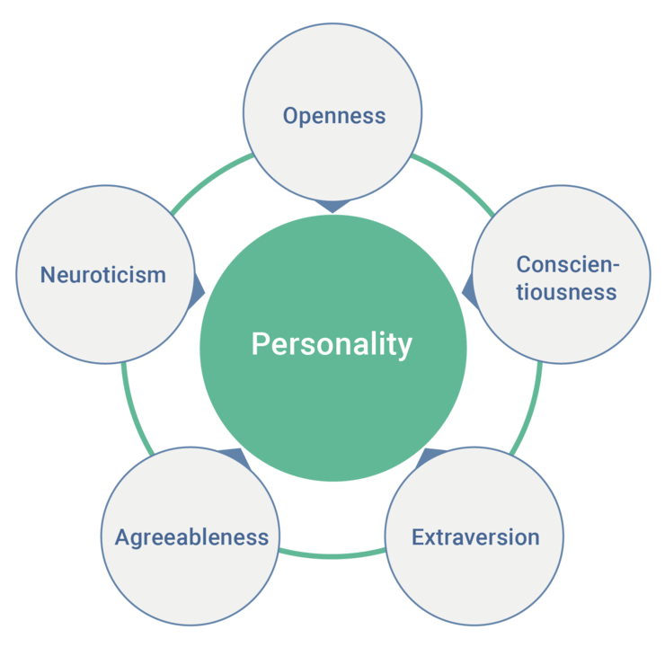
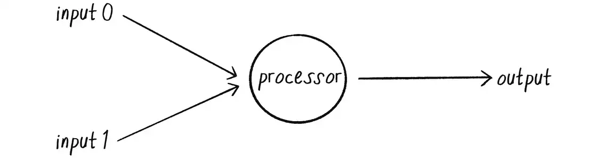
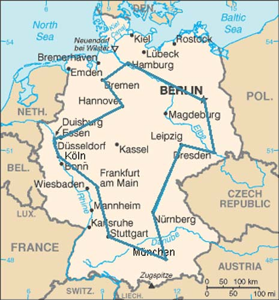
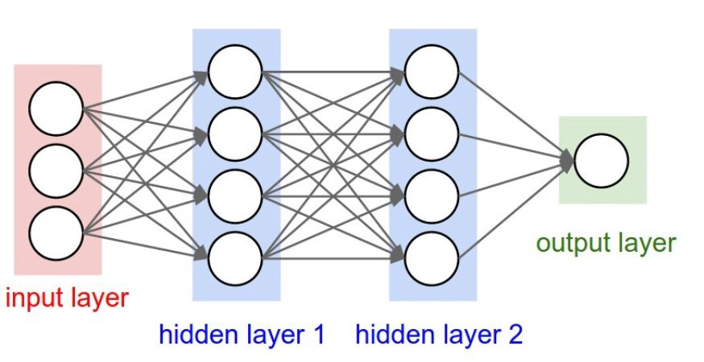

# Intelligenza Artificiale (1)

## Lezione 07 del corso di _Abilità Informatiche_ (2024/2025)

###### Sebastian Barzaghi | [sebastian.barzaghi2@unibo.it](mailto:sebastian.barzaghi2@unibo.it) | [https://orcid.org/0000-0002-0799-1527](https://orcid.org/0000-0002-0799-1527) | [https://www.unibo.it/sitoweb/sebastian.barzaghi2/](https://www.unibo.it/sitoweb/sebastian.barzaghi2/)

---

### Dal profilo psicologico a Cambridge Analytica (1)

  

    <figure>
      
        <figcaption>
            Fonte: Di Anna Tunikova for peats.de and wikipedia - <a rel="nofollow" class="external free" href="https://peats.de/article/big-five-die-personlichkeit-in-funf-dimensionen">https://peats.de/article/big-five-die-personlichkeit-in-funf-dimensionen</a>, <a href="https://creativecommons.org/licenses/by/4.0" title="Creative Commons Attribution 4.0">CC BY 4.0</a>, <a href="https://commons.wikimedia.org/w/index.php?curid=66464543">Collegamento</a>.
        </figcaption>
    </figure>
  

  

    

      Nel 2007 viene creata un'applicazione Facebook chiamata MyPersonality, che permette agli utenti di compilare dei brevi questionari psicometrici.
    

    

      Sulla base di questo, crea un piccolo profilo psicologico (basato sui Big Five).
    

  

NBC News (2015). 'Like' This: Can Facebook Assess Your Personality? <a href="https://www.nbcnews.com/health/health-news/can-facebook-assess-your-personality-n284736">https://www.nbcnews.com/health/health-news/can-facebook-assess-your-personality-n284736</a>.

---

### Dal profilo psicologico a Cambridge Analytica (2)

Nell'ecosistema di Facebook, diventa possibile confrontare i risultati di questi test con tutti i tipi di altri dati online dei soggetti (likes, pagine seguite, informazioni di profilo, ecc.).

Diventa molto semplice trovare delle correlazioni tra cose a cui hanno messo un "like", cose che hanno condiviso o pubblicato, sesso, età, luogo di residenza, ecc.

NBC News (2015). 'Like' This: Can Facebook Assess Your Personality? <a href="https://www.nbcnews.com/health/health-news/can-facebook-assess-your-personality-n284736">https://www.nbcnews.com/health/health-news/can-facebook-assess-your-personality-n284736</a>.

---

### Dal profilo psicologico a Cambridge Analytica (3)

Ciò ha permesso ai ricercatori di fare correlazioni e trarre deduzioni molto affidabili.

Esempi: gli uomini a cui piaceva il marchio di cosmetici MAC avevano leggermente più probabilità di essere gay; uno dei migliori indicatori per l'eterosessualità era "gradire" il Wu-Tang Clan; i seguaci di Lady Gaga erano tendenzialmente estroversi, mentre quelli che amavano la filosofia erano più introversi.

NBC News (2015). 'Like' This: Can Facebook Assess Your Personality? <a href="https://www.nbcnews.com/health/health-news/can-facebook-assess-your-personality-n284736">https://www.nbcnews.com/health/health-news/can-facebook-assess-your-personality-n284736</a>.

---

### Dal profilo psicologico a Cambridge Analytica (4)

Ogni informazione di questo tipo è troppo debole per produrre una previsione affidabile su una persona, dove prevale l’individualità del singolo.

Quando migliaia di singoli dati vengono combinati, le previsioni risultanti diventano molto più accurate.

Della Piazza, S. (2021). Lo scandalo di Cambridge Analytica, legato all’utilizzo dei dati personali ottenuti illecitamente da Facebook. <a href="https://www.dirittoconsenso.it/2021/12/21/il-caso-cambridge-analytica/">https://www.dirittoconsenso.it/2021/12/21/il-caso-cambridge-analytica/</a>.

---

### Dal profilo psicologico a Cambridge Analytica (5)

Questo ha permesso di comprendere un fenomeno (il comportamento social delle persone), ma ha anche aperto la strada ad altre applicazioni, che hanno creato un database di profili di utenti associati a differenze individuali (giovane conservatore; democratico divorziato; etc) che sono poi stati usati per indirizzare campagne elettorali.

Es. il microtargeting psicografico operato da [Cambridge Analytica](https://www.dirittoconsenso.it/2021/12/21/il-caso-cambridge-analytica/) durante le elezioni americane del 2016 e la Brexit, grazie a modelli di Machine Learning, una forma di Intelligenza Artificiale.

Della Piazza, S. (2021). Lo scandalo di Cambridge Analytica, legato all’utilizzo dei dati personali ottenuti illecitamente da Facebook. <a href="https://www.dirittoconsenso.it/2021/12/21/il-caso-cambridge-analytica/">https://www.dirittoconsenso.it/2021/12/21/il-caso-cambridge-analytica/</a>.

---



## Introduzione all'IA

<!--
Photo by <a href="https://unsplash.com/@cashmacanaya?utm_content=creditCopyText&utm_medium=referral&utm_source=unsplash">Cash Macanaya</a> on <a href="https://unsplash.com/photos/two-hands-reaching-for-a-flying-object-in-the-sky-X9Cemmq4YjM?utm_content=creditCopyText&utm_medium=referral&utm_source=unsplash">Unsplash</a>
-->

---

### Cos'è l'IA? (1)

La scienza che studia tecniche computazionali in grado di emulare l’intelligenza umana.

L’abilità di una macchina di mostrare capacità umane quali il ragionamento, l’apprendimento, la pianificazione e la creatività.

Ghosh, M., & Thirugnanam, A. (2021). Introduction to artificial intelligence. In Artificial Intelligence for Information Management: A Healthcare Perspective (pp. 23-44). Singapore: Springer Singapore. <a href="https://doi.org/10.1007/978-981-16-0415-7_2">https://doi.org/10.1007/978-981-16-0415-7_2</a>.

---

### Cos'è l'IA? (2)

L’Intelligenza Artificiale (IA) permette a sistemi informatici (software e/o hardware) di capire il proprio ambiente, mettersi in relazione con esso e risolvere problemi, agendo verso un obiettivo specifico. 

I sistemi di IA sono capaci di adattare il proprio comportamento analizzando gli effetti delle azioni precedenti e lavorando in autonomia.

Ghosh, M., & Thirugnanam, A. (2021). Introduction to artificial intelligence. In Artificial Intelligence for Information Management: A Healthcare Perspective (pp. 23-44). Singapore: Springer Singapore. <a href="https://doi.org/10.1007/978-981-16-0415-7_2">https://doi.org/10.1007/978-981-16-0415-7_2</a>.

---

### Cos'è l'IA? (3)

L'IA è già parte della trasformazione digitale del mondo contemporaneo.

Quali attività sarà possibile far svolgere alle IA, e con quali conseguenze nelle relazioni tra e con gli esseri umani?

* https://chatgpt.com/
* https://aidungeon.com/
* https://perchance.org/ai-text-to-image-generator
* https://suno.com/home
* https://text-to-cad.zoo.dev/
* https://invideo.io/make/ai-video-generator/

Ghosh, M., & Thirugnanam, A. (2021). Introduction to artificial intelligence. In Artificial Intelligence for Information Management: A Healthcare Perspective (pp. 23-44). Singapore: Springer Singapore. <a href="https://doi.org/10.1007/978-981-16-0415-7_2">https://doi.org/10.1007/978-981-16-0415-7_2</a>.

---

### Applicazioni dell'IA (1)

* **Informatica** (sistemi operativi, programmazione, reti, user interface, filtri anti-spam, sistemi di suggerimento, motori di ricerca, ecc.);
* **Medicina** (formulazione di farmaci, immagini radiologiche, trasporto, supporto alla diagnosi e terapia, ecc.);
* **Robotica** (guida autonoma, robot trasportatori, Kiva robot, ristorazione, Boston Dynamics, droni, ecc.);
* **Marketing** (pubblicità mirata):
* **Finanza** (algoritmi di trading);
* **Filosofia**;
* **Legge**;
* ...

Ghosh, M., & Thirugnanam, A. (2021). Introduction to artificial intelligence. In Artificial Intelligence for Information Management: A Healthcare Perspective (pp. 23-44). Singapore: Springer Singapore. <a href="https://doi.org/10.1007/978-981-16-0415-7_2">https://doi.org/10.1007/978-981-16-0415-7_2</a>.

---

### Applicazioni dell'IA (2)

Il campo d'applicazione della IA è diviso in un vastissimo insieme di aree specializzate, per ciascuna delle quali esistono sistemi molto efficienti nel compiere una azione, ma totalmente inadatti a compierne altre.

Si tratta di una delle principali differenze rispetto all'intelligenza umana, che per definizione è in grado di adattarsi a diversi tipi di problemi.

Ghosh, M., & Thirugnanam, A. (2021). Introduction to artificial intelligence. In Artificial Intelligence for Information Management: A Healthcare Perspective (pp. 23-44). Singapore: Springer Singapore. <a href="https://doi.org/10.1007/978-981-16-0415-7_2">https://doi.org/10.1007/978-981-16-0415-7_2</a>.

---

### Applicazioni dell'IA (3)

Ad esempio, i programmi di _machine translation_ (traduzione automatica di testi) spesso raggiungono risultati pari o migliori degli umani nella traduzione di un altissimo numero di lingue.

Tuttavia, non riescono a tradurre il senso di espressioni idiomatiche o astratte (umorismo, metafore), a meno che non siano espressamente pre-programmate per affrontare quel tipo di costrutti in quel determinato linguaggio.

Ghosh, M., & Thirugnanam, A. (2021). Introduction to artificial intelligence. In Artificial Intelligence for Information Management: A Healthcare Perspective (pp. 23-44). Singapore: Springer Singapore. <a href="https://doi.org/10.1007/978-981-16-0415-7_2">https://doi.org/10.1007/978-981-16-0415-7_2</a>.

---



## Origini dell'IA

<!--
Di Joseph Racknitz - <a rel="nofollow" class="external text" href="https://www.digi-hub.de/viewer/image/BV041097321/67/">Humboldt University Library</a>, Pubblico dominio, <a href="https://commons.wikimedia.org/w/index.php?curid=3266033">Collegamento</a>
-->

---

### Radici in discipline diverse

* **Filosofia** (intelligenza, conoscenza, ragionamento, apprendimento, linguaggio, ecc.);
* **Matematica** (logica, probabilità, statistica, teoria degli algoritmi, ecc.);
* **Psicologia** (modelli cognitivi, esperimenti psicologici);
* **Informatica** (software, hardware, algoritmi);
* **Linguistica** (sintassi, semantica e pragmatica del linguaggio naturale, rappresentazione della conoscenza);
* **Economia** (teoria delle decisioni, teoria dei giochi, ricerca operativa);
* **Neuroscienze** (neuroni, sinapsi, elaborazione delle informazioni nel cervello).

Haenlein, M., & Kaplan, A. (2019). A brief history of artificial intelligence: On the past, present, and future of artificial intelligence. California management review, 61(4), 5-14. <a href="https://doi.org/10.1177/0008125619864925">https://doi.org/10.1177/0008125619864925</a>.

---

### Filosofia

* **Aristotele** (384-322 a.C.) fu il primo a formulare un insieme preciso di leggi che governano la parte razionale della mente. Sviluppò un sistema informale di sillogismi per il ragionamento corretto, che in linea di principio permetteva di generare conclusioni meccanicamente, date delle premesse iniziali;
* **Llull** (1315) teorizzò che il ragionamento potesse essere eseguito tramite artefatti meccanici;
* **Hobbes** (1588-1679) teorizzò il ragionamento come calcolo numerico;
* **Leibniz** (1646-1717) costruì una macchina per eseguire operazioni su concetti piuttosto che su numeri.

Haenlein, M., & Kaplan, A. (2019). A brief history of artificial intelligence: On the past, present, and future of artificial intelligence. California management review, 61(4), 5-14. <a href="https://doi.org/10.1177/0008125619864925">https://doi.org/10.1177/0008125619864925</a>.

---

### Matematica

* **Boole** (1815-1864) elaborò i dettagli della logica proposizionale, o logica booleana;
* **Lovelace** (1840) previde l’avvento dell'AI simbolica (basata cioè su simboli/significati e le loro manipolazioni da parte di operazioni logiche);
* **Frege** (1848-1925) estese la logica di Boole per includere oggetti e relazioni (Logica del primo ordine);
* **Russel** (1919) dimostrò che proposizioni complesse e argomenti deduttivi possono essere rappresentati da valori vero/falso e operatori se/allora/non;
* **Turing** (1912-1954) dimostrò che qualsiasi operazione può essere eseguita da un calcolatore binario, che accetta cioè solo i simboli 0 e 1.

Haenlein, M., & Kaplan, A. (2019). A brief history of artificial intelligence: On the past, present, and future of artificial intelligence. California management review, 61(4), 5-14. <a href="https://doi.org/10.1177/0008125619864925">https://doi.org/10.1177/0008125619864925</a>.

---

### La nascita dell'IA (1943-1955) (1)

  

    <figure>
      
        <figcaption>
            Fonte: <a href="https://natureofcode.com/neural-networks/">https://natureofcode.com/neural-networks/</a>.
        </figcaption>
    </figure>
  

  

    

      Il primo lavoro che ora è generalmente riconosciuto come IA fu svolto da Warren McColluch e Walter Pitts (1943).
    

    

      Si basarono su tre fonti: la conoscenza sulla funzione dei neuroni nel cervello umano; l'analisi formale della logica proposizionale; e la teoria della computazione di Turing.
    

  

Haenlein, M., & Kaplan, A. (2019). A brief history of artificial intelligence: On the past, present, and future of artificial intelligence. California management review, 61(4), 5-14. <a href="https://doi.org/10.1177/0008125619864925">https://doi.org/10.1177/0008125619864925</a>.

---

### La nascita dell'IA (1943-1955) (2)

  

    <figure>
      
        <figcaption>
            Fonte: <a href="https://natureofcode.com/neural-networks/">https://natureofcode.com/neural-networks/</a>.
        </figcaption>
    </figure>
  

  

    

      Proposero un modello di neuroni artificiali in cui ogni neurone è caratterizzato come "acceso" o "spento", con un passaggio a "acceso" che avviene in risposta alla stimolazione di un numero sufficiente di neuroni adiacenti.
    

  

Haenlein, M., & Kaplan, A. (2019). A brief history of artificial intelligence: On the past, present, and future of artificial intelligence. California management review, 61(4), 5-14. <a href="https://doi.org/10.1177/0008125619864925">https://doi.org/10.1177/0008125619864925</a>.

---

### Entusiasmo iniziale, grandi aspettative (1952-1969)

L'IA fu definita da John McCarthy, per la prima volta, nel 1956 come "la scienza e l'ingegneria di costruire macchine intelligenti". 

Più o meno nello stesso periodo, Alan Turing, nel suo articolo "Computing Machinery and Intelligence" (1950), proponeva un test per capire se un computer fosse in grado di emulare così bene il comportamento umano da diventare indistinguibile da una persona vera.

Spiegazione del Test di Turing: https://www.how2shout.com/what-is/what-is-turing-test-and-it-used-for.html.

Un esempio di AI del periodo: [ELIZA](https://www.masswerk.at/elizabot/).

Haenlein, M., & Kaplan, A. (2019). A brief history of artificial intelligence: On the past, present, and future of artificial intelligence. California management review, 61(4), 5-14. <a href="https://doi.org/10.1177/0008125619864925">https://doi.org/10.1177/0008125619864925</a>.

---

### Una dose di realtà (1966-1973) (1)

I primi sistemi di AI si rivelarono un fallimento quando furono messi alla prova su una gamma più ampia di problemi più difficili.

Il primo tipo di difficoltà emerse perché la maggior parte dei primi programmi funzionava solo seguendo un insieme di istruzioni fisse per arrivare a una conclusione.

Un esempio astratto:
* "Quando piove, la strada si bagna";
* "Sta piovendo", quindi 
* "La strada è bagnata".
* In un sistema rigorosamente logico, quanto scritto sopra sarebbe corretto. Però, sappiamo anche che, nell'esperienza di tutti i giorni, la realtà è molto più complessa: se la strada è coperta, potrebbe non bagnarsi nemmeno se sta piovendo.

Haenlein, M., & Kaplan, A. (2019). A brief history of artificial intelligence: On the past, present, and future of artificial intelligence. California management review, 61(4), 5-14. <a href="https://doi.org/10.1177/0008125619864925">https://doi.org/10.1177/0008125619864925</a>.

---

### Una dose di realtà (1966-1973) (2)

  

    <figure>
      
        <figcaption>
            Fonte: <a href="https://www.astronomia.com/2010/12/03/il-problema-del-commesso-viaggiatore-risolto-dalle-api/">https://www.astronomia.com/2010/12/03/il-problema-del-commesso-viaggiatore-risolto-dalle-api/</a>.
        </figcaption>
    </figure>
  

  

    

      Il secondo tipo di difficoltà fu l'irrisolvibilità di molti dei problemi che l'IA stava cercando di risolvere (es. il Problema del Commesso Viaggiatore).
    

  

Haenlein, M., & Kaplan, A. (2019). A brief history of artificial intelligence: On the past, present, and future of artificial intelligence. California management review, 61(4), 5-14. <a href="https://doi.org/10.1177/0008125619864925">https://doi.org/10.1177/0008125619864925</a>.

---

### Sistemi basati sulla conoscenza (1969-1979) (1)

Quindi, questi primi metodi di risoluzione dei problemi erano meccanismi che cercavano di mettere insieme passaggi elementari di ragionamento per trovare soluzioni complete.

Tali approcci sono stati chiamati _deboli_ perché, sebbene generali, non erano in grado di scalare per affrontare istanze di problemi più grandi o difficili.

Haenlein, M., & Kaplan, A. (2019). A brief history of artificial intelligence: On the past, present, and future of artificial intelligence. California management review, 61(4), 5-14. <a href="https://doi.org/10.1177/0008125619864925">https://doi.org/10.1177/0008125619864925</a>.

---

### Sistemi basati sulla conoscenza (1969-1979) (2)

L'alternativa ai metodi deboli è stata quella di utilizzare conoscenze più potenti e specifiche per il dominio specifico relativo al problema da affrontare, che permettano passaggi di ragionamento più ampi e possano gestire più facilmente i casi tipicamente ricorrenti in aree di competenza ristrette. 

Questi tipi di sistemi sono anche chiamati _sistemi esperti_.

Questi sistemi funzionano in due parti principali:
* **Base di conoscenza**: una grande raccolta di informazioni su un certo argomento (ad esempio, malattie e trattamenti per un sistema medico);
* **Motore di inferenza**: il "cervello" del sistema, che usa la base di conoscenza per fare ragionamenti e trovare soluzioni.

Esempio: https://www.forbes.com/sites/gilpress/2020/04/27/12-ai-milestones-4-mycin-an-expert-system-for-infectious-disease-therapy/.

Haenlein, M., & Kaplan, A. (2019). A brief history of artificial intelligence: On the past, present, and future of artificial intelligence. California management review, 61(4), 5-14. <a href="https://doi.org/10.1177/0008125619864925">https://doi.org/10.1177/0008125619864925</a>.

---

### Inverno della IA (1980-1993)

L'industria dell'IA esplose da pochi milioni di dollari nel 1980 a miliardi di dollari nel 1988, includendo centinaia di aziende che costruivano sistemi esperti, sistemi di visione, robot e software e hardware specializzati per questi scopi.

Poco dopo arrivò un periodo chiamato “inverno dell'IA”, in cui molte aziende fallirono, poiché non riuscirono a mantenere le promesse fatte.

Motivi:
* Dipendenza da regole fisse: i metodi di ragionamento utilizzati dai sistemi basati sulla conoscenza **non funzionavano di fronte all'incertezza**;
* Impossibilità di aggiornare autonomamente le conoscenze: i sistemi di questo tipo **non potevano apprendere dall'esperienza**.

Haenlein, M., & Kaplan, A. (2019). A brief history of artificial intelligence: On the past, present, and future of artificial intelligence. California management review, 61(4), 5-14. <a href="https://doi.org/10.1177/0008125619864925">https://doi.org/10.1177/0008125619864925</a>.

---

### Reti neurali e apprendimento automatico (1986 - presente)

Questi metodi hanno la capacità di apprendere dall'esperienza.

Possono confrontare il valore di output previsto con il valore reale rispetto ad un problema e modificare i loro parametri per ridurre la differenza (e quindi l'errore), rendendoli più propensi a performare bene su esempi futuri.

La fragilità dei sistemi esperti portò a un nuovo approccio, più scientifico, che incorporava la **probabilità** anziché l'inferenza logica, e l'**apprendimento** automatico anziché la programmazione manuale di basi di conoscenza.

Haenlein, M., & Kaplan, A. (2019). A brief history of artificial intelligence: On the past, present, and future of artificial intelligence. California management review, 61(4), 5-14. <a href="https://doi.org/10.1177/0008125619864925">https://doi.org/10.1177/0008125619864925</a>.

---

### Big data (2001 - presente) (1)

Nel corso della storia di 60 anni dell'informatica, l'enfasi è sempre stata sull'algoritmo come principale oggetto di studio.

Alcuni lavori recenti nell'IA suggeriscono che, per molti problemi, ha più senso preoccuparsi dei dati e essere meno selettivi riguardo all'algoritmo da applicare.

Haenlein, M., & Kaplan, A. (2019). A brief history of artificial intelligence: On the past, present, and future of artificial intelligence. California management review, 61(4), 5-14. <a href="https://doi.org/10.1177/0008125619864925">https://doi.org/10.1177/0008125619864925</a>.

---

### Big data (2001 - presente) (2)

Uno studio influente in questa direzione è stato il lavoro di Yarowsky sulla disambiguazione del senso delle parole: dato l'uso della parola `"plant"` in una frase, ci si riferisce a una _pianta_ o a un _impianto industriale_?

* Gli approcci precedenti si basavano su esempi etichettati dall'uomo combinati con algoritmi di apprendimento automatico;
* Yarowsky mostrò che questa attività può essere svolta senza alcun esempio etichettato, con una precisione del 96%, analizzando un corpus di testi molto grande con le definizioni del dizionario dei due sensi (cioè `"plant: flora"` e `"plant: impianto industriale"`).

Haenlein, M., & Kaplan, A. (2019). A brief history of artificial intelligence: On the past, present, and future of artificial intelligence. California management review, 61(4), 5-14. <a href="https://doi.org/10.1177/0008125619864925">https://doi.org/10.1177/0008125619864925</a>.

---

### Deep learning (2011–presente) (1)

  

    <figure>
      
        <figcaption>
            Fonte: <a href="https://getthematic.com/insights/what-is-deep-learning/">https://getthematic.com/insights/what-is-deep-learning/</a>.
        </figcaption>
    </figure>
  

  

    

      Il deep learning si riferisce all'apprendimento automatico che utilizza più livelli di elementi computazionali semplici e regolabili.
    

    

      Esperimenti con tali reti furono condotti già negli anni '70 e '90. Tuttavia, fu solo nel 2011 che i metodi di deep learning decollarono veramente. Questo avvenne inizialmente nel riconoscimento vocale e poi nel riconoscimento visivo di oggetti.
    

  

Haenlein, M., & Kaplan, A. (2019). A brief history of artificial intelligence: On the past, present, and future of artificial intelligence. California management review, 61(4), 5-14. <a href="https://doi.org/10.1177/0008125619864925">https://doi.org/10.1177/0008125619864925</a>.

---

### Deep learning (2011–presente) (2)

Nel 2012, in una competizione per classificare le immagini in una delle mille categorie (armadillo, libreria, cavatappi, ecc.), un sistema di deep learning creato da Geoffrey Hinton dimostrò un miglioramento drammatico rispetto ai sistemi precedenti, che si basavano in gran parte su caratteristiche realizzate a mano.

Il deep learning dipende da **hardware molto potente** e dalla disponibilità di **grandi quantità di dati** di addestramento.

Haenlein, M., & Kaplan, A. (2019). A brief history of artificial intelligence: On the past, present, and future of artificial intelligence. California management review, 61(4), 5-14. <a href="https://doi.org/10.1177/0008125619864925">https://doi.org/10.1177/0008125619864925</a>.

---

### Lo stato dell'arte

La Stanford University riunisce panel di esperti per fornire report sullo stato dell'arte nell'IA, e produce anche un AI Index su [aiindex.org](https://aiindex.stanford.edu/) per monitorare i progressi.

Le ultime tendenze: https://aiindex.stanford.edu/report/#individual-chapters.

---

# Fine

## Lezione 07 del corso di _Abilità Informatiche_ (2024/2025)

###### Sebastian Barzaghi | [sebastian.barzaghi2@unibo.it](mailto:sebastian.barzaghi2@unibo.it) | [https://orcid.org/0000-0002-0799-1527](https://orcid.org/0000-0002-0799-1527) | [https://www.unibo.it/sitoweb/sebastian.barzaghi2/](https://www.unibo.it/sitoweb/sebastian.barzaghi2/)
