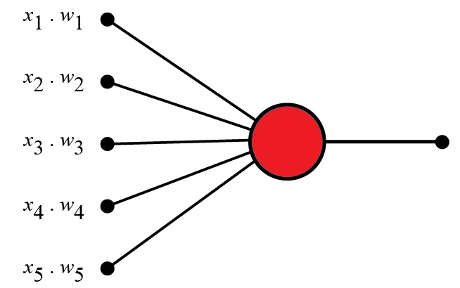

# Intelligenza Artificiale (2)

## Lezione 08 del corso di _Abilità Informatiche_ (2024/2025)

###### Sebastian Barzaghi | [sebastian.barzaghi2@unibo.it](mailto:sebastian.barzaghi2@unibo.it) | [https://orcid.org/0000-0002-0799-1527](https://orcid.org/0000-0002-0799-1527) | [https://www.unibo.it/sitoweb/sebastian.barzaghi2/](https://www.unibo.it/sitoweb/sebastian.barzaghi2/)

---



## Come funziona l'IA

<!--

-->

---

### IA debole (o ristretta)

  

    <figure>
      
        <figcaption>
            Fonte: <a href="https://www.miquido.com/blog/ai-based-personalisation/">https://www.miquido.com/blog/ai-based-personalisation/</a>.
        </figcaption>
    </figure>
  

  

    

      L'IA debole, anche chiamata IA ristretta, è focalizzata su un compito specifico (ad esempio, il riconoscimento di oggetti). 
    

    

      Risolve una classe di problemi specifici attraverso alcune capacità cognitive.
    

    

      Esempi: recommendation systems, assistenti virtuali, ecc.
    

  

Razavian, N., Knoll, F., & Geras, K. J. (2020, February). Artificial intelligence explained for nonexperts. In Seminars in musculoskeletal radiology (Vol. 24, No. 01, pp. 003-011). Thieme Medical Publishers. <a href="https://www.doi.org/10.1055/s-0039-3401041">https://www.doi.org/10.1055/s-0039-3401041</a>.

---

### Esempio: AlphaGo

Nel 2015-16 DeepMind sviluppa AlphaGo, un programma che batte il campione umano di Go, un famosissimo gioco da tavolo cinese. 

Documentario: <a href="https://www.youtube.com/watch?v=WXuK6gekU1Y">https://www.youtube.com/watch?v=WXuK6gekU1Y</a>.

---

### IA forte (o estesa)

L'IA forte è un tipo di intelligenza artificiale le cui capacità imitano le proprietà adattive e generalizzabili del cervello umano, comprese il ragionamento, la pianificazione e l'intuizione.

Conosciuta anche come IA Generale (AGI), _per ora_ è pura speculazione.

Articolo di Vox sui rapporti tra IA e religione: https://www.vox.com/the-highlight/23779413/silicon-valleys-ai-religion-transhumanism-longtermism-ea.

Razavian, N., Knoll, F., & Geras, K. J. (2020, February). Artificial intelligence explained for nonexperts. In Seminars in musculoskeletal radiology (Vol. 24, No. 01, pp. 003-011). Thieme Medical Publishers. <a href="https://www.doi.org/10.1055/s-0039-3401041">https://www.doi.org/10.1055/s-0039-3401041</a>.

---

### Pseudo-esempio: Watson

Nel 2011 Watson sconfigge campioni umani nel gioco televisivo statunitense Jeopardy.

Video: https://www.youtube.com/watch?v=P18EdAKuC1U.

“Customizzabile” per diverse applicazioni specifiche:
* Supporto alle decisioni in diagnosi e terapie;
* Servizi al cliente;
* Assistenza nei processi legali;
* ...

---

### Tipologie e approcci diversi

* IA **simbolica**: si basa sull'uso di simboli e regole esplicite per rappresentare e manipolare la conoscenza, tipicamente utilizzata in sistemi esperti;
* IA **sub-simbolica**: si basa sull'uso di modelli matematico-probabilistici per rappresentare i processi cognitivi;
  * **Reti neurali artificiali**: ispirate al funzionamento del cervello umano, utilizzate per riconoscere pattern e fare previsioni su grandi quantità di dati;
  * **Deep Learning**: sottocategoria delle reti neurali che utilizza strutture più complesse (come reti profonde) per affrontare compiti più complessi;
  * **Large Language Models**: addestrati su enormi quantità di testi per comprendere, generare e rispondere in linguaggio naturale.

Razavian, N., Knoll, F., & Geras, K. J. (2020, February). Artificial intelligence explained for nonexperts. In Seminars in musculoskeletal radiology (Vol. 24, No. 01, pp. 003-011). Thieme Medical Publishers. <a href="https://www.doi.org/10.1055/s-0039-3401041">https://www.doi.org/10.1055/s-0039-3401041</a>.

---

### Approccio simbolico (1)

  

    <figure>
      
        <figcaption>
            Fonte: <a href="https://medium.com/towards-data-science/symbolic-vs-subsymbolic-ai-paradigms-for-ai-explainability-6e3982c6948a">https://medium.com/towards-data-science/symbolic-vs-subsymbolic-ai-paradigms-for-ai-explainability-6e3982c6948a</a>.
        </figcaption>
    </figure>
  

  

    

      Le AI simboliche rappresentano la conoscenza tramite simboli ben distinti (parole, numeri, segni, etc.) che hanno un significato preciso, secondo regole definite.
    

  

Razavian, N., Knoll, F., & Geras, K. J. (2020, February). Artificial intelligence explained for nonexperts. In Seminars in musculoskeletal radiology (Vol. 24, No. 01, pp. 003-011). Thieme Medical Publishers. <a href="https://www.doi.org/10.1055/s-0039-3401041">https://www.doi.org/10.1055/s-0039-3401041</a>.

---

### Approccio simbolico (2)

  

    <figure>
      
        <figcaption>
            Fonte: <a href="https://medium.com/towards-data-science/symbolic-vs-subsymbolic-ai-paradigms-for-ai-explainability-6e3982c6948a">https://medium.com/towards-data-science/symbolic-vs-subsymbolic-ai-paradigms-for-ai-explainability-6e3982c6948a</a>.
        </figcaption>
    </figure>
  

  

    

      Es. un programma che "ragiona" su come risolvere un problema di logica (come "Se piove, allora prendo l'ombrello") lavora usando sequenze di simboli come "piovere", "prendere" e "ombrello" e segue regole di inferenza logica ("Se X, allora Y") per prendere una decisione.
    

  

Razavian, N., Knoll, F., & Geras, K. J. (2020, February). Artificial intelligence explained for nonexperts. In Seminars in musculoskeletal radiology (Vol. 24, No. 01, pp. 003-011). Thieme Medical Publishers. <a href="https://www.doi.org/10.1055/s-0039-3401041">https://www.doi.org/10.1055/s-0039-3401041</a>.

---

### Approccio simbolico (3)

  

    <figure>
      
        <figcaption>
            Fonte: <a href="https://medium.com/towards-data-science/symbolic-vs-subsymbolic-ai-paradigms-for-ai-explainability-6e3982c6948a">https://medium.com/towards-data-science/symbolic-vs-subsymbolic-ai-paradigms-for-ai-explainability-6e3982c6948a</a>.
        </figcaption>
    </figure>
  

  

    

      Un sistema esperto di medicina potrebbe usare simboli come "febbre", "tosse", "mal di testa" per fare diagnosi, applicando regole logiche per determinare quale malattia potrebbe corrispondere a questi sintomi.
    

  

Razavian, N., Knoll, F., & Geras, K. J. (2020, February). Artificial intelligence explained for nonexperts. In Seminars in musculoskeletal radiology (Vol. 24, No. 01, pp. 003-011). Thieme Medical Publishers. <a href="https://www.doi.org/10.1055/s-0039-3401041">https://www.doi.org/10.1055/s-0039-3401041</a>.

---

### Approccio simbolico (4)

**Vantaggi**: 
* Potente per risolvere problemi complessi in ambienti ben definiti, come la logica formale, la pianificazione e la manipolazione di concetti astratti;
* È facile da controllare, correggere e interpretare, e permette di costruire modelli molto trasparenti.

Razavian, N., Knoll, F., & Geras, K. J. (2020, February). Artificial intelligence explained for nonexperts. In Seminars in musculoskeletal radiology (Vol. 24, No. 01, pp. 003-011). Thieme Medical Publishers. <a href="https://www.doi.org/10.1055/s-0039-3401041">https://www.doi.org/10.1055/s-0039-3401041</a>.

---

### Approccio simbolico (5)

**Svantaggi**: 
* Dipende da una conoscenza predefinita;
* La rappresentazione simbolica è rigida, e richiede notevoli sforzi nella sua definizione (in termini di simboli da utilizzare e di regole da applicare per la loro manipolazione);* Non è particolarmente adattabile o capace di gestire l'incertezza o i contesti ambigui, come quelli che si trovano nel mondo reale.

Razavian, N., Knoll, F., & Geras, K. J. (2020, February). Artificial intelligence explained for nonexperts. In Seminars in musculoskeletal radiology (Vol. 24, No. 01, pp. 003-011). Thieme Medical Publishers. <a href="https://www.doi.org/10.1055/s-0039-3401041">https://www.doi.org/10.1055/s-0039-3401041</a>.

---

### Approccio sub-simbolico (1)

  

    <figure>
      
        <figcaption>
            Fonte: <a href="https://medium.com/towards-data-science/symbolic-vs-subsymbolic-ai-paradigms-for-ai-explainability-6e3982c6948a">https://medium.com/towards-data-science/symbolic-vs-subsymbolic-ai-paradigms-for-ai-explainability-6e3982c6948a</a>.
        </figcaption>
    </figure>
  

  

    

      Le IA sub-simboliche non rappresentano la conoscenza con simboli visibili o comprensibili dall'uomo (come "mela", "albero", "rosso"), ma la distribuiscono attraverso le connessioni tra elementi che processano le informazioni che la costituiscono (come i neuroni in un cervello umano).
    

  

Razavian, N., Knoll, F., & Geras, K. J. (2020, February). Artificial intelligence explained for nonexperts. In Seminars in musculoskeletal radiology (Vol. 24, No. 01, pp. 003-011). Thieme Medical Publishers. <a href="https://www.doi.org/10.1055/s-0039-3401041">https://www.doi.org/10.1055/s-0039-3401041</a>.

---

### Approccio sub-simbolico (2)

  

    <figure>
      
        <figcaption>
            Fonte: <a href="https://medium.com/towards-data-science/symbolic-vs-subsymbolic-ai-paradigms-for-ai-explainability-6e3982c6948a">https://medium.com/towards-data-science/symbolic-vs-subsymbolic-ai-paradigms-for-ai-explainability-6e3982c6948a</a>.
        </figcaption>
    </figure>
  

  

    

      In altre parole, la conoscenza è codificata in modo implicito attraverso pattern di attivazione.
    

    

      In un cervello, ogni neurone e la sua connessione ad altri neuroni rappresentano in modo molto più astratto la conoscenza.
    

  

Razavian, N., Knoll, F., & Geras, K. J. (2020, February). Artificial intelligence explained for nonexperts. In Seminars in musculoskeletal radiology (Vol. 24, No. 01, pp. 003-011). Thieme Medical Publishers. <a href="https://www.doi.org/10.1055/s-0039-3401041">https://www.doi.org/10.1055/s-0039-3401041</a>.

---

### Approccio sub-simbolico (3)

  

    <figure>
      
        <figcaption>
            Fonte: <a href="https://medium.com/towards-data-science/symbolic-vs-subsymbolic-ai-paradigms-for-ai-explainability-6e3982c6948a">https://medium.com/towards-data-science/symbolic-vs-subsymbolic-ai-paradigms-for-ai-explainability-6e3982c6948a</a>.
        </figcaption>
    </figure>
  

  

    

      Una rete neurale "impara" a riconoscere pattern, ma non lo fa in modo esplicito con simboli: non ha un concetto formale di "mela" in termini simbolici, ma riconosce pattern di dati che, per esempio, corrispondono ad una mela in una foto.
    

  

Razavian, N., Knoll, F., & Geras, K. J. (2020, February). Artificial intelligence explained for nonexperts. In Seminars in musculoskeletal radiology (Vol. 24, No. 01, pp. 003-011). Thieme Medical Publishers. <a href="https://www.doi.org/10.1055/s-0039-3401041">https://www.doi.org/10.1055/s-0039-3401041</a>.

---

### Approccio sub-simbolico (4)

**Vantaggi**: 
* Molto più performante, specialmente per compiti in cui bisogna gestire l'incertezza (es. riconoscimento, classificazione, ecc.);
* Molto flessibile e adattabile a nuovi dati senza essere riprogrammato esplicitamente.

Razavian, N., Knoll, F., & Geras, K. J. (2020, February). Artificial intelligence explained for nonexperts. In Seminars in musculoskeletal radiology (Vol. 24, No. 01, pp. 003-011). Thieme Medical Publishers. <a href="https://www.doi.org/10.1055/s-0039-3401041">https://www.doi.org/10.1055/s-0039-3401041</a>.

---

### Approccio sub-simbolico (5)

**Svantaggi**: 
* Non è facilmente interpretabile, perché non esiste una rappresentazione esplicita e comprensibile per l'uomo di cosa "sa";
* Richiede enormi quantità di dati e di potenza hardware per allenarsi.

Razavian, N., Knoll, F., & Geras, K. J. (2020, February). Artificial intelligence explained for nonexperts. In Seminars in musculoskeletal radiology (Vol. 24, No. 01, pp. 003-011). Thieme Medical Publishers. <a href="https://www.doi.org/10.1055/s-0039-3401041">https://www.doi.org/10.1055/s-0039-3401041</a>.

---

### Esempio di approccio sub-simbolico: Machine learning

  

    <figure>
      
        <figcaption>
            Fonte: <a href="https://medium.com/towards-data-science/symbolic-vs-subsymbolic-ai-paradigms-for-ai-explainability-6e3982c6948a">https://medium.com/towards-data-science/symbolic-vs-subsymbolic-ai-paradigms-for-ai-explainability-6e3982c6948a</a>.
        </figcaption>
    </figure>
  

  

    

      IA che impara dai dati e fa previsioni sulla base di quello che ha imparato, in assenza di istruzioni esplicite (cioé simboliche).
    

  

Razavian, N., Knoll, F., & Geras, K. J. (2020, February). Artificial intelligence explained for nonexperts. In Seminars in musculoskeletal radiology (Vol. 24, No. 01, pp. 003-011). Thieme Medical Publishers. <a href="https://www.doi.org/10.1055/s-0039-3401041">https://www.doi.org/10.1055/s-0039-3401041</a>.

---

### Unità della rete neurale: il Percettrone (1)

  

    <figure>
      
        <figcaption>
            Fonte: <a href="https://natureofcode.com/neural-networks/">https://natureofcode.com/neural-networks/</a>.
        </figcaption>
    </figure>
  

  

    

      Le cellule del cervello umano, i neuroni, formano una rete complessa e altamente interconnessa.
    

    

      Inviano segnali elettrici l'uno all'altro per elaborare informazioni provenienti dal mondo esterno.
    

  

Razavian, N., Knoll, F., & Geras, K. J. (2020, February). Artificial intelligence explained for nonexperts. In Seminars in musculoskeletal radiology (Vol. 24, No. 01, pp. 003-011). Thieme Medical Publishers. <a href="https://www.doi.org/10.1055/s-0039-3401041">https://www.doi.org/10.1055/s-0039-3401041</a>.

---

### Unità della rete neurale: il Percettrone (2)

  

    <figure>
      
        <figcaption>
            Fonte: <a href="https://natureofcode.com/neural-networks/">https://natureofcode.com/neural-networks/</a>.
        </figcaption>
    </figure>
  

  

    

      Analogamente, una rete neurale artificiale è fatta di neuroni artificiali che prendono dati esterni come input e producono un risultato.
    

    

      Il modello più semplice di neurone artificiale è il percettrone, proposto da Rosenblatt nel 1958.
    

  

Razavian, N., Knoll, F., & Geras, K. J. (2020, February). Artificial intelligence explained for nonexperts. In Seminars in musculoskeletal radiology (Vol. 24, No. 01, pp. 003-011). Thieme Medical Publishers. <a href="https://www.doi.org/10.1055/s-0039-3401041">https://www.doi.org/10.1055/s-0039-3401041</a>.

---

### Unità della rete neurale: il Percettrone (3)

  

    <figure>
      
        <figcaption>
            Fonte: <a href="https://natureofcode.com/neural-networks/">https://natureofcode.com/neural-networks/</a>.
        </figcaption>
    </figure>
  

  

    

      Consiste in: uno o più input (dati in entrata); un'unità di calcolo; e un output (dati in uscita).
    

    

      Il percettrone riceve degli input (numeri), li soppesa, somma i risultati e decide se dare come output un 1 o uno 0 in base ad una soglia predefinita.
    

  

Razavian, N., Knoll, F., & Geras, K. J. (2020, February). Artificial intelligence explained for nonexperts. In Seminars in musculoskeletal radiology (Vol. 24, No. 01, pp. 003-011). Thieme Medical Publishers. <a href="https://www.doi.org/10.1055/s-0039-3401041">https://www.doi.org/10.1055/s-0039-3401041</a>.

---

### Unità della rete neurale: il Percettrone (4)

  

    <figure>
      
        <figcaption>
            Fonte: <a href="https://www.w3schools.com/ai/ai_perceptrons.asp">https://www.w3schools.com/ai/ai_perceptrons.asp</a>.
        </figcaption>
    </figure>
  

  

    

      Ogni dato ha un certo valore numerico (x1, x2, x3, ecc.).
    

    

      Il valore di ogni dato di input viene moltiplicato con un <strong>peso</strong> (un altro valore numerico, generalmente tra 0 e 1, che ne rappresenta l'importanza rispetto al risultato finale).
    

    

      Tutti i valori pesati vengono <strong>sommati</strong> insieme, producendo un unico numero (una somma pesata).
    

  

Razavian, N., Knoll, F., & Geras, K. J. (2020, February). Artificial intelligence explained for nonexperts. In Seminars in musculoskeletal radiology (Vol. 24, No. 01, pp. 003-011). Thieme Medical Publishers. <a href="https://www.doi.org/10.1055/s-0039-3401041">https://www.doi.org/10.1055/s-0039-3401041</a>.

---

### Unità della rete neurale: il Percettrone (5)

  

    <figure>
      
        <figcaption>
            Fonte: <a href="https://www.w3schools.com/ai/ai_perceptrons.asp">https://www.w3schools.com/ai/ai_perceptrons.asp</a>.
        </figcaption>
    </figure>
  

  

    

      Questa somma pesata viene passata attraverso una <strong>funzione di attivazione</strong>, che decide se il percettrone si "attiva" (come un neurone che si accende).
    

    

      Un esempio è la <strong>funzione a gradino</strong>: se la somma è maggiore di una certa soglia, l'output sarà 1 (si, vero, positivo, ecc.); se è minore della soglia, l'output sarà 0 (no, falso, negativo, ecc.).
    

  

Razavian, N., Knoll, F., & Geras, K. J. (2020, February). Artificial intelligence explained for nonexperts. In Seminars in musculoskeletal radiology (Vol. 24, No. 01, pp. 003-011). Thieme Medical Publishers. <a href="https://www.doi.org/10.1055/s-0039-3401041">https://www.doi.org/10.1055/s-0039-3401041</a>.

---

### Unità della rete neurale: il Percettrone (6)

Il percettrone, in origine, era pensato per prendere input binari (0 e 1) e generare output binari (0 e 1).

Molto utile per decisioni semplici.

Razavian, N., Knoll, F., & Geras, K. J. (2020, February). Artificial intelligence explained for nonexperts. In Seminars in musculoskeletal radiology (Vol. 24, No. 01, pp. 003-011). Thieme Medical Publishers. <a href="https://www.doi.org/10.1055/s-0039-3401041">https://www.doi.org/10.1055/s-0039-3401041</a>.

---

### Esempio di Percettrone: il concerto (1)

Dobbiamo decisere se andare ad un concerto. 

Di solito, dobbiamo considerare una serie di fattori: l'artista è bravo? Il tempo è buono? 

Per prendere questa decisione, decidiamo di usare un percettrone.

---

### Esempio di Percettrone: il concerto (2)

I fattori da considerare sono i dati di input, ad ognuno dei quali possiamo assegnare un valore binario (0 equivale a "NO", 1 equivale a "SI").

* L'artista è bravo? = 0 o 1
* Il tempo è buono? = 0 o 1
* Siamo con amici? = 0 o 1
* Servono cibo? = 0 o 1
* Servono bevande? = 0 o 1

---

### Esempio di Percettrone: il concerto (3)

Ognuno di questi fattori, però, ha per noi un'importanza diversa. 

Quindi, ad ogni input assegnamo anche un peso numerico che rappresenti questa importanza (dove 0 è "importanza nulla" e 1 è "importanza essenziale").

* L'artista è bravo? = 0 o 1, con peso = 0.7
* Il tempo è buono? = 0 o 1, con peso = 0.6
* Siamo con amici? = 0 o 1, con peso = 0.5
* Servono cibo? = 0 o 1, con peso = 0.3
* Servono alcolici? = 0 o 1, con peso = 0.4

---

### Esempio di Percettrone: il concerto (4)

Ora, diciamo che:

* L'artista è bravo = 1
* Il tempo non è buono = 0
* Siamo con amici = 1
* Non servono cibo = 0
* Servono alcolici = 1

E diciamo che la nostra soglia da considerare per prendere la decisione sia 1.5: sotto la soglia, l'output è 0 ("non vado al concerto"); sopra la soglia, l'output è 1 ("vado al concerto").

---

### Esempio di Percettrone: il concerto (5)

Moltiplichiamo ogni input per il peso che gli abbiamo assegnato:

* L'artista è bravo = 1 * 0.7 = 0.7
* Il tempo non è buono = 0 * 0.6 = 0
* Siamo con amici = 1 * 0.5 = 0.5
* Non servono cibo = 0 * 0.3 = 0
* Servono alcolici = 1 * 0.4 = 0.4

Sommandoli, otteniamo: 0.7 + 0 + 0.5 + 0 + 0.4 = **1.6**

---

### Esempio di Percettrone: il concerto (6)

La somma dei valori pesati è 1.6, e la soglia che abbiamo stabilito è 1.5.

Dato che 1.6 > 1.5, l'output è 1, quindi andrò al concerto.

Nota: il criterio per stabilire la soglia dipende dal dominio del problema e dalle preferenze di chi sviluppa. Si tratta di una decisione arbitraria effettuata su basi empiriche (esperienza), su dati (in un processo di addestramento), ecc.

Nota ancora più importante: abbiamo completamente ignorato il concetto di **bias**, un aggiustamento che ci permette di spostare la soglia di decisione in maniera più flessibile ed adattabile a seconda della situazione.

---

### Reti neurali multistrato (1)

  

    <figure>
      
        <figcaption>
            Fonte: Di <a href="//commons.wikimedia.org/wiki/User_talk:Glosser.ca" class="mw-redirect" title="User talk:Glosser.ca">Glosser.ca</a> - Opera propria, deriva da <a href="//commons.wikimedia.org/wiki/File:Artificial_neural_network.svg" title="File:Artificial neural network.svg">File:Artificial neural network.svg</a>, <a href="https://creativecommons.org/licenses/by-sa/3.0" title="Creative Commons Attribution-Share Alike 3.0">CC BY-SA 3.0</a>, <a href="https://commons.wikimedia.org/w/index.php?curid=24913461">Link</a>.
        </figcaption>
    </figure>
  

  

    

      Sono composte da gruppi di neuroni artificiali organizzati in livelli.
    

    

      Ogni neurone in un livello fa un calcolo sui dati che riceve e poi decide se attivarsi o meno, sulla base degli elementi che abbiamo già visto.
    

  

Razavian, N., Knoll, F., & Geras, K. J. (2020, February). Artificial intelligence explained for nonexperts. In Seminars in musculoskeletal radiology (Vol. 24, No. 01, pp. 003-011). Thieme Medical Publishers. <a href="https://www.doi.org/10.1055/s-0039-3401041">https://www.doi.org/10.1055/s-0039-3401041</a>.

---

### Reti neurali multistrato (2)

  

    <figure>
      
        <figcaption>
            Fonte: Di <a href="//commons.wikimedia.org/wiki/User_talk:Glosser.ca" class="mw-redirect" title="User talk:Glosser.ca">Glosser.ca</a> - Opera propria, deriva da <a href="//commons.wikimedia.org/wiki/File:Artificial_neural_network.svg" title="File:Artificial neural network.svg">File:Artificial neural network.svg</a>, <a href="https://creativecommons.org/licenses/by-sa/3.0" title="Creative Commons Attribution-Share Alike 3.0">CC BY-SA 3.0</a>, <a href="https://commons.wikimedia.org/w/index.php?curid=24913461">Link</a>.
        </figcaption>
    </figure>
  

  

    <ul>
      <li><strong>livello di input</strong> (punto di entrata dei dati);</li> 
      <li>uno o più <strong>livelli intermedi o nascosti</strong> (strati di neuroni che elaborano i dati in modo complesso);</li>
      <li><strong>livello di output</strong> (punto di uscita del risultato finale).</li>
    </ul>
  

Razavian, N., Knoll, F., & Geras, K. J. (2020, February). Artificial intelligence explained for nonexperts. In Seminars in musculoskeletal radiology (Vol. 24, No. 01, pp. 003-011). Thieme Medical Publishers. <a href="https://www.doi.org/10.1055/s-0039-3401041">https://www.doi.org/10.1055/s-0039-3401041</a>.

---

### Reti neurali multistrato (3)

  

    <figure>
      
        <figcaption>
            Fonte: <a href="https://www.edureka.co/blog/what-is-a-neural-network/">https://www.edureka.co/blog/what-is-a-neural-network/</a>.
        </figcaption>
    </figure>
  

  

    

      Ogni neurone rappresenta una piccola parte di un concetto, un suo <strong>microtratto</strong>. 
    

    

      Non ha senso guardare un singolo neurone e pensare che rappresenti qualcosa di definito come "gatto", "cane", "mela", "rosso", "peso", "10cm".
    

  

Razavian, N., Knoll, F., & Geras, K. J. (2020, February). Artificial intelligence explained for nonexperts. In Seminars in musculoskeletal radiology (Vol. 24, No. 01, pp. 003-011). Thieme Medical Publishers. <a href="https://www.doi.org/10.1055/s-0039-3401041">https://www.doi.org/10.1055/s-0039-3401041</a>.

---

### Reti neurali multistrato (4)

  

    <figure>
      
        <figcaption>
            Fonte: <a href="https://www.edureka.co/blog/what-is-a-neural-network/">https://www.edureka.co/blog/what-is-a-neural-network/</a>.
        </figcaption>
    </figure>
  

  

    

      I neuroni nei primi strati potrebbero identificare caratteristiche di base come bordi, angoli e forme semplici. 
    

    

      I neuroni in strati più profondi potrebbero combinare queste informazioni per identificare forme più complesse, come occhi, orecchie o il corpo di un animale.
    

  

Razavian, N., Knoll, F., & Geras, K. J. (2020, February). Artificial intelligence explained for nonexperts. In Seminars in musculoskeletal radiology (Vol. 24, No. 01, pp. 003-011). Thieme Medical Publishers. <a href="https://www.doi.org/10.1055/s-0039-3401041">https://www.doi.org/10.1055/s-0039-3401041</a>.

---

### Reti neurali multistrato (5)

  

    <figure>
      
        <figcaption>
            Fonte: <a href="https://www.edureka.co/blog/what-is-a-neural-network/">https://www.edureka.co/blog/what-is-a-neural-network/</a>.
        </figcaption>
    </figure>
  

  

    

      Infine, gli strati finali della rete neurale potrebbero combinare tutte queste informazioni per decidere se l'immagine rappresenta un "gatto" o un "cane".
    

  

Razavian, N., Knoll, F., & Geras, K. J. (2020, February). Artificial intelligence explained for nonexperts. In Seminars in musculoskeletal radiology (Vol. 24, No. 01, pp. 003-011). Thieme Medical Publishers. <a href="https://www.doi.org/10.1055/s-0039-3401041">https://www.doi.org/10.1055/s-0039-3401041</a>.

---

### Reti neurali multistrato (6)

Anche se noi progettiamo la rete, i neuroni nei livelli nascosti non sono "programmati" per compiere operazioni specifiche come accade in un programma tradizionale. 

Invece, attraverso il processo di addestramento, i pesi dei neuroni vengono aggiustati in modo che la rete impari a riconoscere pattern nei dati. 

Razavian, N., Knoll, F., & Geras, K. J. (2020, February). Artificial intelligence explained for nonexperts. In Seminars in musculoskeletal radiology (Vol. 24, No. 01, pp. 003-011). Thieme Medical Publishers. <a href="https://www.doi.org/10.1055/s-0039-3401041">https://www.doi.org/10.1055/s-0039-3401041</a>.

---

### Reti neurali multistrato (7)

Ogni neurone nei layer nascosti impara a rappresentare una piccola parte di un concetto. Tuttavia, questi pattern non sono immediatamente interpretabili.

Non sappiamo esattamente cosa ogni neurone sta "vedendo", ma piuttosto possiamo osservare come il risultato finale si adatti correttamente al nostro obiettivo.

Razavian, N., Knoll, F., & Geras, K. J. (2020, February). Artificial intelligence explained for nonexperts. In Seminars in musculoskeletal radiology (Vol. 24, No. 01, pp. 003-011). Thieme Medical Publishers. <a href="https://www.doi.org/10.1055/s-0039-3401041">https://www.doi.org/10.1055/s-0039-3401041</a>.

---

### Esempio: capire se una foglia è malata (1)

  

    <figure>
      
        <figcaption>
            Fonte: <a href="https://www.edureka.co/blog/what-is-a-neural-network/">https://www.edureka.co/blog/what-is-a-neural-network/</a>.
        </figcaption>
    </figure>
  

  

    

      Prendiamo l'immagine di una foglia. Vogliamo capire se la foglia è sana o malata. Decidiamo di utilizzare una rete neurale. 
    

    

      L'immagine è fatta di pixel, e ogni pixel ha un valore numerico che rappresenta il colore del pixel stesso. Quindi, un'immagine può essere convertita in un insieme strutturato di valori numerici.
    

  

---

### Esempio: capire se una foglia è malata (2)

  

    <figure>
      
        <figcaption>
            Fonte: <a href="https://www.edureka.co/blog/what-is-a-neural-network/">https://www.edureka.co/blog/what-is-a-neural-network/</a>.
        </figcaption>
    </figure>
  

  

    

      Una volta che l'immagine è trasformata in numeri, questi numeri vengono passati come input alla rete neurale.
    

    

      La rete neurale ha livelli nascosti (strati intermedi) che si occupano di elaborare e trasformare questi numeri in informazioni più utili.
    

  

---

### Esempio: capire se una foglia è malata (3)

  

    <figure>
      
        <figcaption>
            Fonte: <a href="https://www.edureka.co/blog/what-is-a-neural-network/">https://www.edureka.co/blog/what-is-a-neural-network/</a>.
        </figcaption>
    </figure>
  

  

    

      Ogni neurone nei layer nascosti prende i numeri in ingresso (che sono i pixel dell'immagine), li combina con i pesi (numeri che determinano quanto ogni input è importante), e poi applica una funzione di attivazione per determinare se quel neurone deve attivarsi o meno.
    

  

---

### Esempio: capire se una foglia è malata (4)

  

    <figure>
      
        <figcaption>
            Fonte: <a href="https://www.edureka.co/blog/what-is-a-neural-network/">https://www.edureka.co/blog/what-is-a-neural-network/</a>.
        </figcaption>
    </figure>
  

  

    

      I layer nascosti quindi trasformano questi numeri di input in rappresentazioni più astratte.
    

  

---

### Esempio: capire se una foglia è malata (5)

  

    <figure>
      
        <figcaption>
            Fonte: <a href="https://www.edureka.co/blog/what-is-a-neural-network/">https://www.edureka.co/blog/what-is-a-neural-network/</a>.
        </figcaption>
    </figure>
  

  

    

      Ad esempio, mentre nel primo strato la rete potrebbe rilevare semplici caratteristiche come i bordi della foglia, nei layer successivi la rete potrebbe iniziare a riconoscere caratteristiche più complesse come la forma della foglia o eventuali macchie che indicano la presenza di malattie.
    

  

---

### Esempio: capire se una foglia è malata (6)

  

    <figure>
      
        <figcaption>
            Fonte: <a href="https://www.edureka.co/blog/what-is-a-neural-network/">https://www.edureka.co/blog/what-is-a-neural-network/</a>.
        </figcaption>
    </figure>
  

  

    

      L'output finale viene prodotto dal livello di output, che di solito è un singolo neurone (o più neuroni, a seconda del tipo di classificazione).
    

  

---

### Esempio: capire se una foglia è malata (7)

  

    <figure>
      
        <figcaption>
            Fonte: <a href="https://www.edureka.co/blog/what-is-a-neural-network/">https://www.edureka.co/blog/what-is-a-neural-network/</a>.
        </figcaption>
    </figure>
  

  

    

      Nel caso della classificazione della foglia come sana o malata, l'output sarà una probabilità tra 0 e 1, che indica quanto è probabile che l'immagine della foglia sia sana (ad esempio, 0.8 = 80% di probabilità che la foglia sia sana).
    

  

---

### Torniamo a parlare di apprendimento

---

### Tipi di ML (1)

L'apprendimento è un processo iterativo che consiste nell'ottimizzazione progressiva dei parametri che definiscono il modello di IA, attraverso la misurazione ciclica dell'errore tra il risultato prodotto e il risultato atteso.

* **Supervisionato**: l'IA viene addestrata su dati preventivamente etichettati da un essere umano;
* **Non supervisionato**: l'IA viene addestrata su dati non etichettati;
* **Per rinforzo**: l'IA apprende sulla base di penalità o ricompense ricevute dall'ambiente in cui si trova ad agire.

Razavian, N., Knoll, F., & Geras, K. J. (2020, February). Artificial intelligence explained for nonexperts. In Seminars in musculoskeletal radiology (Vol. 24, No. 01, pp. 003-011). Thieme Medical Publishers. <a href="https://www.doi.org/10.1055/s-0039-3401041">https://www.doi.org/10.1055/s-0039-3401041</a>.

---

### Tipi di ML (2)

<figure>
  
    <figcaption>
        Fonte: Peng, J., Jury, E. C., Dönnes, P., & Ciurtin, C. (2021). Machine learning techniques for personalised medicine approaches in immune-mediated chronic inflammatory diseases: applications and challenges. Frontiers in pharmacology, 12, 720694. <a href="http://dx.doi.org/10.3389/fphar.2021.720694">http://dx.doi.org/10.3389/fphar.2021.720694</a>.
    </figcaption>
</figure>

---

### Tipi di ML (3)

L'addestramento consiste nel provare, fare errori, e correggerli tramite la **retropropagazione**, un meccanismo per cui la rete regola i vari pesi tra neuroni per migliorare il proprio risultato.

L'addestramento è poi seguito da una fase successiva di **testing**, in cui la rete svolge l’attività per cui è stata addestrata su nuovi dati che non aveva mai visto prima.

Razavian, N., Knoll, F., & Geras, K. J. (2020, February). Artificial intelligence explained for nonexperts. In Seminars in musculoskeletal radiology (Vol. 24, No. 01, pp. 003-011). Thieme Medical Publishers. <a href="https://www.doi.org/10.1055/s-0039-3401041">https://www.doi.org/10.1055/s-0039-3401041</a>.

---

### Apprendimento supervisionato

  

    <figure>
      
        <figcaption>
            Fonte: <a href="https://www.edureka.co/blog/what-is-a-neural-network/">https://www.edureka.co/blog/what-is-a-neural-network/</a>.
        </figcaption>
    </figure>
  

  

    

      In fase di addestramento, vengono forniti i dati su cui allenarsi (es. immagini da classificare a seconda che contengano gatti oppre cani) e anche la risposta corretta (es. a tutte le immagini di cani, viene associata l’etichetta "cane"; a tutte le immagini di gatti, viene associata l’etichetta "gatto").
    

  

Razavian, N., Knoll, F., & Geras, K. J. (2020, February). Artificial intelligence explained for nonexperts. In Seminars in musculoskeletal radiology (Vol. 24, No. 01, pp. 003-011). Thieme Medical Publishers. <a href="https://www.doi.org/10.1055/s-0039-3401041">https://www.doi.org/10.1055/s-0039-3401041</a>.

---

### Apprendimento non-supervisionato

  

    <figure>
      
        <figcaption>
            Fonte: <a href="https://www.edureka.co/blog/what-is-a-neural-network/">https://www.edureka.co/blog/what-is-a-neural-network/</a>.
        </figcaption>
    </figure>
  

  

    

      In fase di apprendimento della rete, vengono forniti solo dati senza la risposta corretta.
    

    

      L'IA individua da sola regolarità statistiche presenti nei dati (es. la conformazione del muso, la dimensione, i colori, ecc.) e li raggruppa in <strong>cluster</strong> omogenei sulla base di queste regolarità.
    

  

Razavian, N., Knoll, F., & Geras, K. J. (2020, February). Artificial intelligence explained for nonexperts. In Seminars in musculoskeletal radiology (Vol. 24, No. 01, pp. 003-011). Thieme Medical Publishers. <a href="https://www.doi.org/10.1055/s-0039-3401041">https://www.doi.org/10.1055/s-0039-3401041</a>.

---

### Apprendimento per rinforzo

In fase di apprendimento, l'IA apprende a compiere delle azioni in un ambiente al fine di massimizzare una ricompensa cumulativa nel tempo.

L'IA esegue azioni e riceve feedback sotto forma di ricompense o penalizzazioni. L'obiettivo dell'agente è imparare a scegliere le azioni che massimizzano la ricompensa complessiva nel lungo periodo.

Una IA impara a giocare a Pokémon: https://www.youtube.com/watch?v=DcYLT37ImBY.

Una IA impara a camminare: https://www.youtube.com/watch?v=L_4BPjLBF4E.

Razavian, N., Knoll, F., & Geras, K. J. (2020, February). Artificial intelligence explained for nonexperts. In Seminars in musculoskeletal radiology (Vol. 24, No. 01, pp. 003-011). Thieme Medical Publishers. <a href="https://www.doi.org/10.1055/s-0039-3401041">https://www.doi.org/10.1055/s-0039-3401041</a>.

---

# Fine

## Lezione 08 del corso di _Abilità Informatiche_ (2024/2025)

###### Sebastian Barzaghi | [sebastian.barzaghi2@unibo.it](mailto:sebastian.barzaghi2@unibo.it) | [https://orcid.org/0000-0002-0799-1527](https://orcid.org/0000-0002-0799-1527) | [https://www.unibo.it/sitoweb/sebastian.barzaghi2/](https://www.unibo.it/sitoweb/sebastian.barzaghi2/)