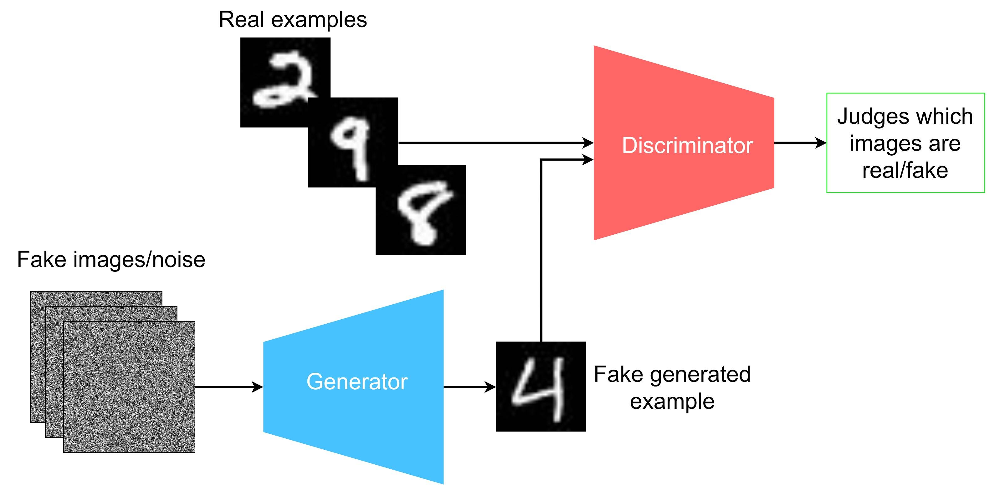
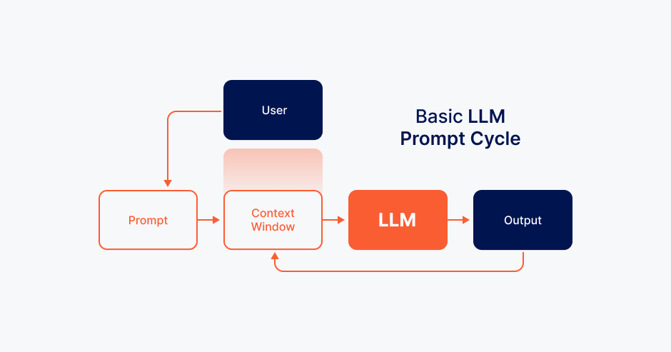

# Intelligenza Artificiale (3)

## Lezione 09 del corso di _Abilità Informatiche_ (2024/2025)

###### Sebastian Barzaghi | [sebastian.barzaghi2@unibo.it](mailto:sebastian.barzaghi2@unibo.it) | [https://orcid.org/0000-0002-0799-1527](https://orcid.org/0000-0002-0799-1527) | [https://www.unibo.it/sitoweb/sebastian.barzaghi2/](https://www.unibo.it/sitoweb/sebastian.barzaghi2/)

---



## IA discriminativa e IA generativa

<!--
Photo by <a href="https://unsplash.com/@googledeepmind?utm_content=creditCopyText&utm_medium=referral&utm_source=unsplash">Google DeepMind</a> on <a href="https://unsplash.com/photos/a-close-up-of-a-pink-wall-with-glitter-sprinkles-mEawZ3YloK4?utm_content=creditCopyText&utm_medium=referral&utm_source=unsplash">Unsplash</a>
-->

---

### IA discriminativa

Quella che abbiamo visto fino ad ora, in pratica.

Effettua diverse operazioni computazionali su dati esistenti (es. classificare un'immagine sulla base di ciò che contiene; riconoscimento vocale; ecc.), "discriminandoli" (cioé analizzandoli, classificandoli e distinguendoli) secondo la loro distribuzione probabilistica. 

Razavian, N., Knoll, F., & Geras, K. J. (2020, February). Artificial intelligence explained for nonexperts. In Seminars in musculoskeletal radiology (Vol. 24, No. 01, pp. 003-011). Thieme Medical Publishers. <a href="https://www.doi.org/10.1055/s-0039-3401041">https://www.doi.org/10.1055/s-0039-3401041</a>.

---

### IA generativa

Finalizzata alla generazione di nuovo contenuto (testi, immagini, musica, video, ecc.) sulla base di determinate informazioni di partenza (_prompt_). 

I modelli di tipo generativo imparano a produrre nuovi dati con caratteristiche simili ai dati originali, utilizzando modelli di apprendimento automatico per identificare i pattern e le relazioni nei dati esistenti.

Razavian, N., Knoll, F., & Geras, K. J. (2020, February). Artificial intelligence explained for nonexperts. In Seminars in musculoskeletal radiology (Vol. 24, No. 01, pp. 003-011). Thieme Medical Publishers. <a href="https://www.doi.org/10.1055/s-0039-3401041">https://www.doi.org/10.1055/s-0039-3401041</a>.

---

### Un esempio ibrido: Generative Adversarial Networks (1)

Immaginiamoci la Gioconda.

Ora, immaginiamoci un falsario che decide di creare un duplicato del dipinto.

Per farlo, il falsario deve capire e imparare come l'autore originario ha creato l'opera.

Immaginiamoci anche un investigatore, il cui obiettivo è quello di scovare il falsario e intuire le regole che questo sta imparando per riprodurre lo stile dell'autore originale.

Hong, Y., Hwang, U., Yoo, J., & Yoon, S. (2019). How generative adversarial networks and their variants work: An overview. ACM Computing Surveys (CSUR), 52(1), 1-43. <a href="https://doi.org/10.1145/3301282">https://doi.org/10.1145/3301282</a>.

---

### Un esempio ibrido: Generative Adversarial Networks (2)

  

    <figure>
      
        <figcaption>
            Fonte: <a href="https://developer.ibm.com/articles/generative-adversarial-networks-explained/">https://developer.ibm.com/articles/generative-adversarial-networks-explained/</a>.
        </figcaption>
    </figure>
  

  

    

      Un modello di IA che usa contemporaneamente due reti neurali diverse: un <strong>discriminatore</strong> (l'investigatore) e un <strong>generatore</strong> (il falsario).
    

    

      Durante l'addestramento, il discriminatore impara a discriminare i dati di input (es. riconoscere cifre numeriche nelle immagini).
    

  

Hong, Y., Hwang, U., Yoo, J., & Yoon, S. (2019). How generative adversarial networks and their variants work: An overview. ACM Computing Surveys (CSUR), 52(1), 1-43. <a href="https://doi.org/10.1145/3301282">https://doi.org/10.1145/3301282</a>.

---

### Un esempio ibrido: Generative Adversarial Networks (3)

  

    <figure>
      
        <figcaption>
            Fonte: <a href="https://developer.ibm.com/articles/generative-adversarial-networks-explained/">https://developer.ibm.com/articles/generative-adversarial-networks-explained/</a>.
        </figcaption>
    </figure>
  

  

    

      Alla fine dell'apprendimento, è in grado di classificare nuovi dati di input sulla base del proprio apprendimento (es. determina se l'immagine contiene una cifra sulla base dei pattern appresi in fase di allenamento dalle altre immagini usate).
    

  

Hong, Y., Hwang, U., Yoo, J., & Yoon, S. (2019). How generative adversarial networks and their variants work: An overview. ACM Computing Surveys (CSUR), 52(1), 1-43. <a href="https://doi.org/10.1145/3301282">https://doi.org/10.1145/3301282</a>.

---

### Un esempio ibrido: Generative Adversarial Networks (4)

  

    <figure>
      
        <figcaption>
            Fonte: <a href="https://developer.ibm.com/articles/generative-adversarial-networks-explained/">https://developer.ibm.com/articles/generative-adversarial-networks-explained/</a>.
        </figcaption>
    </figure>
  

  

    

      Il generatore, invece, crea immagini sulla base di dati casuali (noise): inizialmente, le immagini create saranno senza senso.
    

  

Hong, Y., Hwang, U., Yoo, J., & Yoon, S. (2019). How generative adversarial networks and their variants work: An overview. ACM Computing Surveys (CSUR), 52(1), 1-43. <a href="https://doi.org/10.1145/3301282">https://doi.org/10.1145/3301282</a>.

---

### Un esempio ibrido: Generative Adversarial Networks (5)

  

    <figure>
      
        <figcaption>
            Fonte: <a href="https://developer.ibm.com/articles/generative-adversarial-networks-explained/">https://developer.ibm.com/articles/generative-adversarial-networks-explained/</a>.
        </figcaption>
    </figure>
  

  

    

      L'output del generatore viene dato in pasto al discriminatore, che verifica che i dati prodotti dal generatore siano passabili rispetto ai dati di addestramento su cui il discriminatore si è allenato.
    

  

Hong, Y., Hwang, U., Yoo, J., & Yoon, S. (2019). How generative adversarial networks and their variants work: An overview. ACM Computing Surveys (CSUR), 52(1), 1-43. <a href="https://doi.org/10.1145/3301282">https://doi.org/10.1145/3301282</a>.

---

### Un esempio ibrido: Generative Adversarial Networks (6)

  

    <figure>
      
        <figcaption>
            Fonte: <a href="https://developer.ibm.com/articles/generative-adversarial-networks-explained/">https://developer.ibm.com/articles/generative-adversarial-networks-explained/</a>.
        </figcaption>
    </figure>
  

  

    

      Se i dati non sono accettabili, il generatore deve correggere i pesi; se invece i dati sono accettabili, il discriminatore è stato "ingannato", e l’immagine è presa come risultato valido.
    

  

Hong, Y., Hwang, U., Yoo, J., & Yoon, S. (2019). How generative adversarial networks and their variants work: An overview. ACM Computing Surveys (CSUR), 52(1), 1-43. <a href="https://doi.org/10.1145/3301282">https://doi.org/10.1145/3301282</a>.

---

### Un esempio ibrido: Generative Adversarial Networks (7)

"Questa persona non esiste": https://thispersondoesnotexist.com/

---



## L'IA di adesso

<!--
Photo by <a href="https://unsplash.com/@robpotter?utm_content=creditCopyText&utm_medium=referral&utm_source=unsplash">Rob Potter</a> on <a href="https://unsplash.com/photos/a-close-up-of-a-parrot-with-a-black-background-V44l9FBHe_8?utm_content=creditCopyText&utm_medium=referral&utm_source=unsplash">Unsplash</a>
-->

---

### Pappagalli stocastici (1)

Immaginiamoci di avere un pappagallo, Lauro.

Lauro è molto bravo ad imitare il linguaggio umano e ha una memoria estremamente sviluppata.

Lauro ascolta tutte le conversazioni che avvengono in casa e le può imitare in maniera accurata.

Bender, E. M., Gebru, T., McMillan-Major, A., & Shmitchell, S. (2021, March). On the dangers of stochastic parrots: Can language models be too big?🦜. In Proceedings of the 2021 ACM conference on fairness, accountability, and transparency (pp. 610-623). <a href="https://doi.org/10.1145/3442188.3445922">https://doi.org/10.1145/3442188.3445922</a>.

---

### Pappagalli stocastici (2)

Se Lauro ci sente dire "Ho fame, vorrei proprio un po' di...", probabilmente completerà la nostra frase con "... pasta", o "riso", o "pizza".

La probabilità che generi un output di questo tipo, sulla base del nostro input, è molto più alta rispetto a "bicicletta", "astuccio" o "filosofia postmoderna".

Bender, E. M., Gebru, T., McMillan-Major, A., & Shmitchell, S. (2021, March). On the dangers of stochastic parrots: Can language models be too big?🦜. In Proceedings of the 2021 ACM conference on fairness, accountability, and transparency (pp. 610-623). <a href="https://doi.org/10.1145/3442188.3445922">https://doi.org/10.1145/3442188.3445922</a>.

---

### Pappagalli stocastici (3)

Ma Lauro è pur sempre un pappagallo, e quindi non ha coscienza di cosa siano "pasta", "riso", "pizza", "astuccio". 

Quello che fa è basarsi sulla distribuzione statistica del linguaggio e la probabilità che una certa parola o espressione sia seguita da un'altra.

Bender, E. M., Gebru, T., McMillan-Major, A., & Shmitchell, S. (2021, March). On the dangers of stochastic parrots: Can language models be too big?🦜. In Proceedings of the 2021 ACM conference on fairness, accountability, and transparency (pp. 610-623). <a href="https://doi.org/10.1145/3442188.3445922">https://doi.org/10.1145/3442188.3445922</a>.

---

### Pappagalli stocastici (4)

Lauro è un **pappagallo stocastico**, ovvero un sistema determinato in maniera casuale o probabilistica.

Un Large Language Model è molto simile ad un pappagallo stocastico "on steroids", capace di ascoltare non solo le conversazioni in casa nostra, ma a tutte le conversazioni che avvengono in tutto il mondo.

Bender, E. M., Gebru, T., McMillan-Major, A., & Shmitchell, S. (2021, March). On the dangers of stochastic parrots: Can language models be too big?🦜. In Proceedings of the 2021 ACM conference on fairness, accountability, and transparency (pp. 610-623). <a href="https://doi.org/10.1145/3442188.3445922">https://doi.org/10.1145/3442188.3445922</a>.

---

### Large Language Model (1)

  

    <figure>
      
        <figcaption>
            Fonte: <a href="https://developer.ibm.com/articles/generative-adversarial-networks-explained/">https://developer.ibm.com/articles/generative-adversarial-networks-explained/</a>.
        </figcaption>
    </figure>
  

  

    

      Un modello di IA generativa basato su reti neurali multistrato e addestrato su enormi quantità di testo per imparare a riconoscere schemi e associazioni propri del linguaggio naturale.
    

  

Lee, T. B., & Trott, S. (2023). Large language models, explained with a minimum of math and jargon. Understanding AI, 27, 2023. <a href="https://www.understandingai.org/p/large-language-models-explained-with">https://www.understandingai.org/p/large-language-models-explained-with</a>.

---

### Large Language Model (2)

  

    <figure>
      
        <figcaption>
            Fonte: <a href="https://developer.ibm.com/articles/generative-adversarial-networks-explained/">https://developer.ibm.com/articles/generative-adversarial-networks-explained/</a>.
        </figcaption>
    </figure>
  

  

    

      Un utente interroga il modello con un <strong>prompt</strong> e riceve dal modello una risposta. 
    

    

      Sia il prompt che la risposta vengono aggiunti iterativamente ad una <strong>finestra contestuale</strong> che riproduce una forma di "memoria" tenuta dall'IA.
    

  

Lee, T. B., & Trott, S. (2023). Large language models, explained with a minimum of math and jargon. Understanding AI, 27, 2023. <a href="https://www.understandingai.org/p/large-language-models-explained-with">https://www.understandingai.org/p/large-language-models-explained-with</a>.

---

### Large Language Model (3)

Il processo di addestramento di un LLM si divide in due fasi principali:
* **Pre-training**: in questa fase, il modello viene addestrato su un grande corpus di testo per imparare a riconoscere le relazioni tra le parole e tra le frasi;
* **Fine-tuning**: in questa fase, il modello viene addestrato su un nuovo corpus di testo specifico per migliorare la sua capacità di generare testo in un contesto specifico.

Lee, T. B., & Trott, S. (2023). Large language models, explained with a minimum of math and jargon. Understanding AI, 27, 2023. <a href="https://www.understandingai.org/p/large-language-models-explained-with">https://www.understandingai.org/p/large-language-models-explained-with</a>.

---

### Large Language Model (4)

I pesi delle connessioni tra neuroni che il modello impara durante il processo di addestramento vengono chiamati **parametri**. 

Conme già visto, si tratta di valori numerici che definiscono il comportamento del modello e che il modello stesso ottimizza per affinare la sua capacità di predire o generare output in modo coerente.

Lee, T. B., & Trott, S. (2023). Large language models, explained with a minimum of math and jargon. Understanding AI, 27, 2023. <a href="https://www.understandingai.org/p/large-language-models-explained-with">https://www.understandingai.org/p/large-language-models-explained-with</a>.

---

### Large Language Model (5)

I parametri vengono inizializzati (spesso in modo casuale) e successivamente ottimizzati per riconoscere le relazioni linguistiche generali presenti nei dati (es. prevedere la parola successiva in una frase o per completare una sequenza di testo).

Nel fine-tuning, i parametri già ottimizzati durante il pre-training vengono adattati ulteriormente su un corpus di testo specifico e più mirato.

Lee, T. B., & Trott, S. (2023). Large language models, explained with a minimum of math and jargon. Understanding AI, 27, 2023. <a href="https://www.understandingai.org/p/large-language-models-explained-with">https://www.understandingai.org/p/large-language-models-explained-with</a>.

---

### Large Language Model (6)

Man mano che i parametri aumentano, aumentano le capacità del modello, ma anche le risorse di calcolo richieste. 

Es. l'evoluzione dei modelli GPT per la creazione di testo: 
* GPT-1 ha 117 milioni di parametri;
* GPT2 ne ha 1.5 miliardi;
* GPT3 ne ha 175 miliardi.

Lee, T. B., & Trott, S. (2023). Large language models, explained with a minimum of math and jargon. Understanding AI, 27, 2023. <a href="https://www.understandingai.org/p/large-language-models-explained-with">https://www.understandingai.org/p/large-language-models-explained-with</a>.

---

### Large Language Model (7)

**Vantaggi**: elevatissima scalabilità e flessibilità; resistenza a informazioni incerte, danneggiate o lacunose.

**Svantaggi**: performance fortemente influenzata dai dati di addestramento, potenziale presenza di allucinazioni (palesi errori nell'output generato), costi di sviluppo e addestramento elevati (legati alle risorse hardware e alla quantità di dati richieste), mancanza di trasparenza, incertezze legate all'AI Act. 

Lee, T. B., & Trott, S. (2023). Large language models, explained with a minimum of math and jargon. Understanding AI, 27, 2023. <a href="https://www.understandingai.org/p/large-language-models-explained-with">https://www.understandingai.org/p/large-language-models-explained-with</a>.

---



## I problemi

<!--
Photo by <a href="https://unsplash.com/@rosellastudio?utm_content=creditCopyText&utm_medium=referral&utm_source=unsplash">Madison Bracaglia</a> on <a href="https://unsplash.com/photos/white-concrete-surface-close-up-photography--kxED2shuUg?utm_content=creditCopyText&utm_medium=referral&utm_source=unsplash">Unsplash</a>
-->

---

### Uso di dati nella IA

L’IA si basa su **dati storici** e, ora, anche su **dati sintetici**.

* I dati storici sono raccolti in dataset "reali": le canzoni che ho ascoltato, le temperature raccolte negli ultimi 200 anni, i post su Twitter su un determinato argomento, i testi estratti da articoli di giornale digitalizzati dalla Library of Congress, ecc.
* I dati sintetici sono generati da un'altra IA e possono aiutare a rappresentare un problema, se ne danno una rappresentazione affidabile.

Razavian, N., Knoll, F., & Geras, K. J. (2020, February). Artificial intelligence explained for nonexperts. In Seminars in musculoskeletal radiology (Vol. 24, No. 01, pp. 003-011). Thieme Medical Publishers. <a href="https://www.doi.org/10.1055/s-0039-3401041">https://www.doi.org/10.1055/s-0039-3401041</a>.

---

### IA e overfitting

L'**overfitting** è un fenomeno che si verifica quando un'IA impara troppo bene i dettagli dei dati di addestramento, al punto da diventare troppo specifico per quel dataset.

Questo significa che, invece di generalizzare e fare previsioni accurate su nuovi dati, il modello diventa "troppo adattato" a quelle specifiche informazioni e quindi perde la capacità di adattamento.

Razavian, N., Knoll, F., & Geras, K. J. (2020, February). Artificial intelligence explained for nonexperts. In Seminars in musculoskeletal radiology (Vol. 24, No. 01, pp. 003-011). Thieme Medical Publishers. <a href="https://www.doi.org/10.1055/s-0039-3401041">https://www.doi.org/10.1055/s-0039-3401041</a>.

---

### IA e discriminazione

Bias presenti nei dati possono produrre distorsioni nel funzionamento delle IA allenate su questi

Es. alcuni sistemi di riconoscimento facciale trattano alcune persone in modo più impreciso rispetto alle altre, sulla base della pigmentazione della pelle o della loro struttura facciale.

Esempio: https://www.bbc.com/news/technology-68655429.

Ferrer, X., Van Nuenen, T., Such, J. M., Coté, M., & Criado, N. (2021). Bias and discrimination in AI: a cross-disciplinary perspective. IEEE Technology and Society Magazine, 40(2), 72-80. <a href="https://doi.org/10.1109/MTS.2021.3056293">https://doi.org/10.1109/MTS.2021.3056293</a>.

---

### Una minaccia?

* Protezione dei dati?
* Copyright?
* Creazione di monopoli?
* Impatto sul mercato del lavoro?
* Disinformazione?
* Ambiente?

---

### Una minaccia per la privacy?

L'intelligence sudcoreana ha accusato DeepSeek di raccolta eccessiva dei dati personali della propria utenza, compresi i pattern di input dalla tastiera (che permettono il riconoscimento dell'individuo), e di invio di questi ad altre aziende cinesi.

Link all'articolo: https://www.reuters.com/technology/artificial-intelligence/south-korea-spy-agency-says-deepseek-excessively-collects-personal-data-2025-02-10/

---

### Una minaccia per il copyright?

Anthropic viene denunciata da un gruppo di autori per aver allenato i propri LLM su dati testuali, tra cui centinaia di migliaia di libri protetti da copyright. 

Link all'articolo: https://www.corrierecomunicazioni.it/digital-economy/intelligenza-artificiale-anthropic-denunciata-per-violazione-di-copyright/

---

### Una minaccia per il mercato?

La stragrande maggioranza di startup di IA è vincolata in esclusiva alle big tech come Amazon, Google e Microsoft, in cambio di finanziamenti ingenti e accesso a enormi risorse di calcolo e dati. 

Link all'articolo: https://www.tomshw.it/hardware/ia-a-rischio-monopolizzazione-lantitrust-comincia-le-indagini-2025-01-18

---

### Una minaccia per il lavoro?

Bp pianifica di licenziare il 5% della propria forza lavoro (circa 7700 persone) sulla base di valutazioni di ridimensionamento effettuate da una IA.

Link all'articolo: https://www.wired.it/article/intelligenza-artificiale-licenziamenti-bp-tagli-rinnovabili-investimenti-lavoro/

---

### Una minaccia per l'informazione?

Grok, il chatbot della piattaforma X, permette di generare direttamente in loco testi, immagini e video non sottoposti ad alcun tipo di controllo (eccetto quelli previsti dalla piattaforma stessa).

Link all'articolo: https://www.franzrusso.it/condividere-comunicare/ia-possibili-rischi-disinformazione-il-caso-grok/

---

### Una minaccia per l'ambiente?

In media, ChatGPT consuma 519 millilitri d'acqua (circa una bottiglietta d'acqua) per generare 100 parole.

Link all'articolo: https://fortune.com/article/how-much-water-does-ai-use/

---

### Questioni etiche

Le IA rischiano di essere:
* **Imperscrutabili**: non è dato sapere in base a cosa abbiano favorito una decisione;
* **Fuorvianti**: hanno preso una decisione in base a dati distorti da bias;
* **Ingiuste**: generano effetti iniqui sulle persone;
* **Trasformative**: portano a trasformazioni dell'output che minacciano l'autonomia, la privacy o altri diritti individuali;
* **Non-tracciabili**: difficoltà nel rintracciare la persona o organizzazione responsabile dell'output.

Ferrer, X., Van Nuenen, T., Such, J. M., Coté, M., & Criado, N. (2021). Bias and discrimination in AI: a cross-disciplinary perspective. IEEE Technology and Society Magazine, 40(2), 72-80. <a href="https://doi.org/10.1109/MTS.2021.3056293">https://doi.org/10.1109/MTS.2021.3056293</a>.

---

### AI Act (1)

Nel 2024, il Parlamento Europeo ha approvato l'AI Act, il primo Regolamento al mondo esplicitamente e totalmente dedicato all'IA.

Il testo contiene norme che disciplinano l'attività delle IA, obbligando le aziende che le sviluppano e distribuiscono al rispetto dei diritti e dei valori fondamentali dell'Unione Europea.

Testo integrale: https://eur-lex.europa.eu/legal-content/EN/TXT/?uri=CELEX%3A32024R1689.

Sito per non esperti: https://artificialintelligenceact.eu/

---

### AI Act (2)

Saranno **vietati** i sistemi di IA che determinano un rischio inaccettabile per la sicurezza, la sussistenza e i diritti delle persone. 

In questa categoria rientrano i sistemi che possono manipolare il comportamento umano (es. _social scoring_ e polizia predittiva).

Esempio di _social scoring_: https://scenarieconomici.it/wp-content/uploads/2021/08/scs5.png

---

### AI Act (3)

Il regolamento considera **ad alto rischio** un numero limitato di sistemi di IA che possono avere ripercussioni negative sulla sicurezza delle persone o sui loro diritti fondamentali.

Es. identificazione biometrica; riconoscimento delle emozioni; valutazione dell'occupazione; determinare l'accesso a servizi e a prestazioni pubblici e privati essenziali.

Prima di immettere un sistema di IA ad alto rischio sul mercato dell'UE, o di farlo entrare in servizio, i fornitori dovranno sottoporlo, in particolare, a una valutazione.

---

### AI Act (4)

I sistemi di IA **a basso rischio** (come videogiochi o filtri spam) saranno esenti da obblighi. 

A prescindere dal livell odi pericolosità, gli utenti dovranno essere consapevoli del fatto che stanno interagendo con una macchina.

---

### IA e cultura (1)

Nell'AI Act europeo, la cultura è espressamente menzionata fra gli ambiti al cui sviluppo l'IA è chiamata a concorrere. 

A livello nazionale si richiamano le potenzialità dell'IA, ma si evidenzia anche come "digitalizzare beni non metadatati e/o descritti sia fortemente sconsigliato".

Vengono ripresi e rivisti concetti fondamentali come l'**originalità** (con ripercussioni anche sul concetto di _bene digitale come replica o copia dell'originale fisico_) e il **copyright**.

---

### IA e cultura (2)

I fornitori dovranno assicurarsi che gli output siano esplicitamente etichettati come prodotti di IA.

I fornitori dovranno pubblicare una descrizione sufficientemente dettagliata dei dati utilizzati per l'addestramento dei propri modelli.

I detentori dei diritti potranno espressamente riservarsi il diritto di utilizzo delle proprie opere (in teoria)... ma come si fa con i modelli già addestrati?

---

### IA generativa e professioni culturali

Risultati del questionario di Dicolab: https://storymaps.arcgis.com/stories/102108ca51eb4f559c6331573ae53388.

---

# Fine

## Lezione 09 del corso di _Abilità Informatiche_ (2024/2025)

###### Sebastian Barzaghi | [sebastian.barzaghi2@unibo.it](mailto:sebastian.barzaghi2@unibo.it) | [https://orcid.org/0000-0002-0799-1527](https://orcid.org/0000-0002-0799-1527) | [https://www.unibo.it/sitoweb/sebastian.barzaghi2/](https://www.unibo.it/sitoweb/sebastian.barzaghi2/)