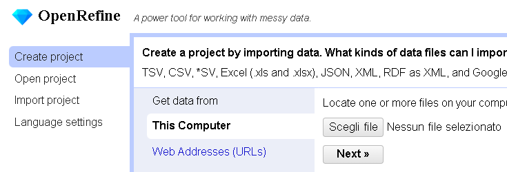
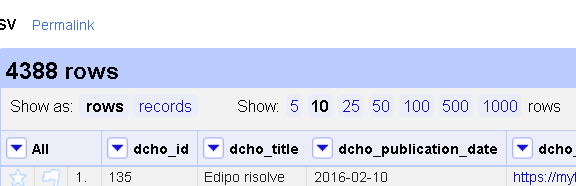
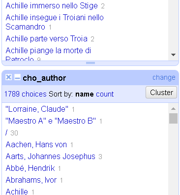
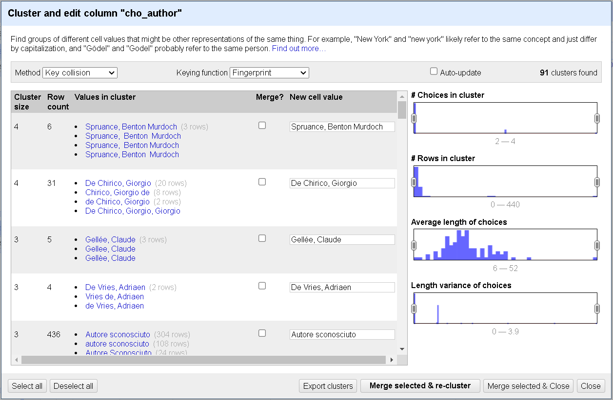

# Data Cleaning nelle Scienze Umane

#### Un'introduzione leggera alla pulizia dei dati con OpenRefine

Sebastian Barzaghi | 
[sebastian.barzaghi2@unibo.it](mailto:sebastian.barzaghi2@unibo.it) | 
[https://orcid.org/0000-0002-0799-1527](https://orcid.org/0000-0002-0799-1527)

---

## Cosa sono i dati nelle scienze umane?

Qualsiasi valore assegnato a qualcosa che può essere quantificato, qualificato o interpretato in qualche modo per essere utilizzato come prova informativa

Numeri, parole, immagini, video, foto, registrazioni audio, interviste, manoscritti, appunti, collezioni...

  Gualandi, B., Pareschi, L., & Peroni, S. (2023). What do we mean by “data”? A proposed classification of data types in the arts and humanities. Journal of Documentation, 79(7), 51-71. <a href="https://doi.org/10.1108/JD-07-2022-0146">https://doi.org/10.1108/JD-07-2022-0146</a>.

---

## Per essere utili, i dati devono essere organizzati

Per essere compresi da te stesso in futuro

Per essere leggibili dalle macchine (Interoperable secondo FAIR)

Per essere compresi dagli altri (Reusable secondo FAIR)

  UiT The Arctic University of Norway. (2023). Data Cleaning. Zenodo. <a href="https://doi.org/10.5281/zenodo.8375643">https://doi.org/10.5281/zenodo.8375643</a>

---

## Tutti i dati sono disordinati

Non dare mai la qualità dei tuoi dati per scontato

L'80% dell'analisi dei dati è dedicato al processo di pulizia dei dati e alla loro preparazione per ulteriori manipolazioni e analisi

La pulizia e la preparazione devono essere iterative

Necessarie per lavorare con i dataset

  UiT The Arctic University of Norway. (2023). Data Cleaning. Zenodo. <a href="https://doi.org/10.5281/zenodo.8375643">https://doi.org/10.5281/zenodo.8375643</a>

---

## Un dataset è una raccolta di dati

Ogni valore appartiene a una variabile e a un'osservazione

Ogni variabile forma una colonna

Ogni osservazione forma una riga

  S. Ciston, “A CRITICAL FIELD GUIDE FOR WORKING WITH MACHINE LEARNING DATASETS”, K. Crawford and M. Ananny, Eds., Knowing Machines project, Feb. 2023. <a href="https://knowingmachines.org/critical-field-guide">https://knowingmachines.org/critical-field-guide</a>.

---

## La pulizia dei dati è difficile (ma ne vale la pena)!

* Preparare i dati
* Eliminare la ridondanza
* Separare o combinare i valori
* Correggere errori e incoerenze (es. duplicati, valori vuoti, errori di ortografia o formattazione incoerenti, ecc.)
* Standardizzare quando possibile
* Gestire i valori NULL

  UiT The Arctic University of Norway. (2023). Data Cleaning. Zenodo. <a href="https://doi.org/10.5281/zenodo.8375643">https://doi.org/10.5281/zenodo.8375643</a>

---

## Errori comuni

---

## Non modificare mai i dati originali

Fai sempre una copia prima di apportare modifiche

Esegui il backup dei file

Tieni traccia di tutti i passaggi

Salva i tuoi file nella codifica `UTF-8`

  Seth van Hooland, Ruben Verborgh, and Max De Wilde, "Cleaning Data with OpenRefine," Programming Historian 2 (2013), <a href="https://doi.org/10.46430/phen0023">https://doi.org/10.46430/phen0023</a>.

---

## Descrivi sempre i dati

Documenta tutto il necessario per capire cosa c'è nel dataset e come utilizzarlo

Considera:

* Il "chi", "cosa", "quando", "dove" e "come" dei dati
* Come trovare e accedere ai dati
* Suggerimenti sull'idoneità dei dati per rispondere a domande specifiche
* Avvertenze sui problemi o le incoerenze note nei dati
* Informazioni per verificare che i dati siano importati correttamente

  White, E. P., Baldridge, E., Brym, Z. T., Locey, K. J., McGlinn, D. J., & Supp, S. R. (2013). Nine simple ways to make it easier to (re)use your data (e7v2). PeerJ Inc. <a href="https://doi.org/10.7287/peerj.preprints.7v2">https://doi.org/10.7287/peerj.preprints.7v2</a>.

---

## Usa formati standard per le tabelle

    

        
    

    

        
Ogni variabile deve avere una colonna separata

    

  UiT The Arctic University of Norway. (2023). Data Cleaning. Zenodo. <a href="https://doi.org/10.5281/zenodo.8375643">https://doi.org/10.5281/zenodo.8375643</a>

---

## Usa formati standard per le tabelle

    

        
    

    

        
Ogni osservazione deve avere una riga separata

    

  UiT The Arctic University of Norway. (2023). Data Cleaning. Zenodo. <a href="https://doi.org/10.5281/zenodo.8375643">https://doi.org/10.5281/zenodo.8375643</a>

---

## Usa formati standard per le tabelle

    

        
    

    

        
Ogni cella dovrebbe contenere un singolo valore

    

  UiT The Arctic University of Norway. (2023). Data Cleaning. Zenodo. <a href="https://doi.org/10.5281/zenodo.8375643">https://doi.org/10.5281/zenodo.8375643</a>

---

## Evita di aggregare commenti e altre informazioni con i dati

    

        
    

    

        
Inserimento di più di un tipo di informazione in una cella, es. commenti, unità di misura, metadati, ecc.

    

  UiT The Arctic University of Norway. (2023). Data Cleaning. Zenodo. <a href="https://doi.org/10.5281/zenodo.8375643">https://doi.org/10.5281/zenodo.8375643</a>

---

## Evita di aggregare commenti e altre informazioni con i dati

    

        
    

    

        
Aggiungi le informazioni aggiuntive al titolo della colonna o in una colonna separata

        
Aggiungi i metadati in un documento separato

    

  UiT The Arctic University of Norway. (2023). Data Cleaning. Zenodo. <a href="https://doi.org/10.5281/zenodo.8375643">https://doi.org/10.5281/zenodo.8375643</a>

---

## Non utilizzare la formattazione per trasmettere informazioni

    

        
    

    

        
Es. evidenziare celle, righe o colonne che dovrebbero essere escluse da un'analisi; lasciare righe vuote per indicare separazioni nei dati, ecc.

    

  UiT The Arctic University of Norway. (2023). Data Cleaning. Zenodo. <a href="https://doi.org/10.5281/zenodo.8375643">https://doi.org/10.5281/zenodo.8375643</a>

---

## Non utilizzare la formattazione per trasmettere informazioni

    

        
    

    

        
Aggiungi le unità al titolo della colonna o in una colonna separata

        
Aggiungi le informazioni in una colonna separata

        
Aggiungi i metadati in un documento separato

    

  UiT The Arctic University of Norway. (2023). Data Cleaning. Zenodo. <a href="https://doi.org/10.5281/zenodo.8375643">https://doi.org/10.5281/zenodo.8375643</a>

---

## Non utilizzare più tabelle o più schede

    

        
    

    

        
Es. più di una tabella o scheda all'interno di un singolo foglio di calcolo

        
Se possibile, combina tutto in una tabella unica o mantieni ogni tabella in un file separato

    

  UiT The Arctic University of Norway. (2023). Data Cleaning. Zenodo. <a href="https://doi.org/10.5281/zenodo.8375643">https://doi.org/10.5281/zenodo.8375643</a>

---

## Non utilizzare caratteri speciali

    

        
    

    

        
Se possibile, evita <a href="https://www.edatlas.it/scarica/1836/Capitolo5/ContenutiDigitali/2EntitaCarattere.pdf">caratteri speciali</a> nei titoli delle colonne e nel testo: <code>/</code> <code>\</code> <code>:</code> <code>*</code> <code>.</code> <code>?</code> <code>‘</code> <code><</code> <code>></code> <code>[</code> <code>]</code> <code>(</code> <code>)</code> <code>&</code> <code>$</code> <code>æ</code> <code>Æ</code> ...

        
Evita sempre di utilizzare spazi nei titoli delle colonne: invece, utilizza underscore (<code>_</code>) o CamelCase (es. <code>TitoloPrincipale</code>)

    

  UiT The Arctic University of Norway. (2023). Data Cleaning. Zenodo. <a href="https://doi.org/10.5281/zenodo.8375643">https://doi.org/10.5281/zenodo.8375643</a>

---

## Sii coerente

* Es. date visualizzate in molti formati diversi (es. "12 luglio 2024", "12/07/2024", "12-07-2024", ecc.)
* Es. nomi visualizzati in molte varianti diverse (es. "Alessandro Manzoni", "A. Manzoni", "Manzoni", "Manzoni, Alessandro", ecc.)
* Utilizza **standard internazionali** (es. [EDTF](https://www.loc.gov/standards/datetime/))
* Utilizza **record di autorità** (es. [VIAF](https://viaf.org/))
* Sii coerente nella **capitalizzazione** delle parole, nella scelta dei **delimitatori** e nelle convenzioni di **denominazione** per le variabili
* Evita di utilizzare il delimitatore del dataset (es. `,`, `;`, `/`, ecc.) nei dati stessi
* Fai attenzione agli **spazi**!

  UiT The Arctic University of Norway. (2023). Data Cleaning. Zenodo. <a href="https://doi.org/10.5281/zenodo.8375643">https://doi.org/10.5281/zenodo.8375643</a>

---

## Elimina la ridondanza (con cautela!)

Includi:

* Duplicati
* Osservazioni irrilevanti
* Dati incompleti
* Dati non validi
* Dati in conflitto

Sono tutte **interpretazioni**: considera sempre se un'osservazione o una colonna debbano essere eliminate o meno!

  White, E. P., Baldridge, E., Brym, Z. T., Locey, K. J., McGlinn, D. J., & Supp, S. R. (2013). Nine simple ways to make it easier to (re)use your data (e7v2). PeerJ Inc. <a href="https://doi.org/10.7287/peerj.preprints.7v2">https://doi.org/10.7287/peerj.preprints.7v2</a>.

---

## Tratta sempre i valori NULL

Usa un metodo coerente che sia compatibile e che non causi errori (es. lasciare la cella vuota)

Considera che:
* Può essere difficile sapere se un valore è mancante o è stato trascurato durante l'inserimento dei dati
* Gli spazi vuoti possono essere confusi quando spazi (`  `) o tabs (`/`) sono usati come delimitatori nei file di testo
* `NA` e `NULL` sono valori nulli ragionevoli

  White, E. P., Baldridge, E., Brym, Z. T., Locey, K. J., McGlinn, D. J., & Supp, S. R. (2013). Nine simple ways to make it easier to (re)use your data (e7v2). PeerJ Inc. <a href="https://doi.org/10.7287/peerj.preprints.7v2">https://doi.org/10.7287/peerj.preprints.7v2</a>.

---

## Esegui sempre un controllo di qualità

Verifica:
* Errori grammaticali
* Uso incoerente di maiuscole e minuscole
* Titoli incoerenti per le colonne
* Unità di misura incoerenti, tipi di dati incoerenti (es. numerico, carattere), schemi di denominazione, ecc.
* Valori fuori intervallo

  White, E. P., Baldridge, E., Brym, Z. T., Locey, K. J., McGlinn, D. J., & Supp, S. R. (2013). Nine simple ways to make it easier to (re)use your data (e7v2). PeerJ Inc. <a href="https://doi.org/10.7287/peerj.preprints.7v2">https://doi.org/10.7287/peerj.preprints.7v2</a>.

---

## Quando hai finito, esporta e condividi

Utilizza una licenza aperta per far sapere agli altri esattamente cosa possono e non possono fare con i dati (es. [Creative Commons Zero (CC0)](https://creativecommons.org/publicdomain/zero/1.0/))

Utilizza formati aperti per rendere i dati interoperabili (es. [CSV](https://en.wikipedia.org/wiki/Comma-separated_values)), quando possibile

Considera di condividere i tuoi dati su [GitHub](https://github.com/) e/o di pubblicarli su un repository (es. [Zenodo](https://zenodo.org/), [Figshare](https://figshare.com/), ecc.) per renderli visibili, accessibili e stabili

  White, E. P., Baldridge, E., Brym, Z. T., Locey, K. J., McGlinn, D. J., & Supp, S. R. (2013). Nine simple ways to make it easier to (re)use your data (e7v2). PeerJ Inc. <a href="https://doi.org/10.7287/peerj.preprints.7v2">https://doi.org/10.7287/peerj.preprints.7v2</a>.

---

## OpenRefine

---

## Uno strumento per la pulizia dei dati

* Identificare e correggere errori
* Combinare dati da diverse fonti
* Non modifica il file originale
* Tutte le azioni sono reversibili e tracciate
* La documentazione può essere pubblicata insieme ai dati
* Il flusso di lavoro può essere salvato e applicato a nuovi dataset

  Baker, J., Moore, C., Priego, E., Alegre, R., Cope, J., Price, L., ... & Wilson, G. (2016). Library Carpentry: software skills training for library professionals. Liber Quarterly: The Journal of European Research Libraries, 26(3), 141-162. <a href="http://dx.doi.org/10.18352/lq.10176">http://dx.doi.org/10.18352/lq.10176</a>

---

## Alcuni scenari di utilizzo

* Sapere quante volte un particolare valore appare in una colonna nei tuoi dati
* Sapere come i valori sono distribuiti in tutto il dataset
* Normalizzare date formattate in modi diversi e allinearle ad un unico formato comune
* Normalizzare nomi o termini che, pur riferendosi alle stesse entità, differiscono tra loro
* Separare frammenti di dati combinati insieme in dati individuali
* Allineare i dati a una fonte esterna

  Baker, J., Moore, C., Priego, E., Alegre, R., Cope, J., Price, L., ... & Wilson, G. (2016). Library Carpentry: software skills training for library professionals. Liber Quarterly: The Journal of European Research Libraries, 26(3), 141-162. <a href="http://dx.doi.org/10.18352/lq.10176">http://dx.doi.org/10.18352/lq.10176</a>

---

## Installazione di OpenRefine

* Scarica OpenRefine: [https://openrefine.org/download.html](https://openrefine.org/download.html)
  * Dovrebbe già includere Java Runtime Environment
  * Se non funziona, scarica e installa anche Java Runtime Environment: [https://www.java.com/it/](https://www.java.com/it/)
* Decomprimi il file scaricato
* Fai doppio clic su `openrefine.exe` (su Windows), `openrefine.dmg` (su OS) o `refine.bat`
* Accedi all'interfaccia su un browser web all'indirizzo [http://127.0.0.1:3333](http://127.0.0.1:3333)

---

## Creazione di un progetto

    

        
    

    

      <ul>
        <li>Scarica il dataset Mythologiae (link in chat)</li>
        <li>In <em>Create Project</em> > <em>This computer</em>, clicca su <em>Choose files</em> e carica <code>mythologiae-dataset.csv</code></li>
        <li>Clicca su <em>Next</em></li>
      </ul>
    

---

## Creazione di un progetto

    

        
    

    

      <ul>
        <li>In <em>Parse data as</em> > <em>CSV / TSV / separator-based files</em></li>
        <li><em>Character encoding</em> deve avere <code>UTF-8</code> come valore</li>
        <li>Seleziona <em>Columns are separated by</em> > <em>commas (CSV)</em></li>
        <li>Spunta <em>Use character <code>"</code> to enclose cells containing column separators</em></li>
        <li>Spunta <em>Trim leading & trailing whitespace from strings</em></li>
      </ul>
    

---

## Creazione di un progetto

    

        
    

    

      <ul>
        <li>Seleziona <em>Parse next <code>1</code> line(s) as column headers</em></li>
        <li>Spunta <em>Store blank rows</em></li>
        <li>Spunta <em>Store blank cells as nulls</em></li>
        <li>Clicca su <em>Create project</em></li>
      </ul>
    

---

## Schermata del progetto

    

        
    

    

      <ul>
        <li><code>Permalink</code> ti consente di tornare ad uno stato di visualizzazione specifico del progetto, con filtri e faccette applicati, inserendo informazioni specifiche della visualizzazione direttamente nell'URL</li>
      </ul>
    

---

## Schermata del progetto

    

        
    

    

      <ul>
        <li><code>Open</code> apre una nuova scheda del browser mostrando la schermata di creazione del progetto per modificare le impostazioni, avviare un nuovo progetto o aprire un progetto esistente</li>
        <li><code>Export</code> ti consente di selezionare un formato per esportare il dataset</li>
        <li><code>Help</code> apre una nuova scheda del browser contenente un manuale utente</li>
      </ul>
    

---

## Schermata della griglia

    

        
    

    

      <ul>
        <li>Visualizzazione dei dati in formato tabellare</li>
        <li>Numero totale di righe</li>
        <li>Modalità rows vs modalità records</li>
        <li>Numero di righe/record visibili su schermo contemporaneamente</li>
      </ul>
    

---

## Facet/Filter

    

        
    

    

      
Modi principali per esplorare i dati, mostrando pattern, tendenze e sottogruppi

      <ul>
        <li><code>Refresh</code> aggiorna ciascuna facet con le informazioni più recenti</li>
        <li><code>Reset all</code> resetta tutte le faccette senza rimuoverle</li>
        <li><code>Remove all</code> rimuove tutte le faccette</li>
      </ul>
    

---

## Undo/Redo

    

        
    

    

      <ul>
        <li>Storico del progetto come elenco di modifiche in ordine cronologico</li>
        <li>Salvataggio automatico ogni 5 minuti e alla chiusura con <code>CTRL + C</code></li>
        <li>Ogni attività che modifica i dati può essere annullata</li>
        <li>La cronologia delle modifiche di ciascun progetto è salvata insieme al progetto stesso</li>
      </ul>
    

---

## Modalità rows

    

        
    

    

      <ul>
        <li><strong>Row</strong>: una serie di celle, una cella per colonna</li>
        <li>A volte, ci sono più informazioni in una singola cella (es. <code>dcho_keyword</code>)</li>
        <li>In questi casi, se riesci a dividere correttamente questi valori, puoi utilizzare la modalità <strong>records</strong> di OpenRefine per visualizzarli correttamente</li>
      </ul>
    

---

## Modalità records

    

        
    

    

      <ul>
        <li><strong>Record</strong>: una collezione di una o più righe</li>
        <li>Le molteplici informazioni in una singola cella (es. <code>dcho_keyword</code>), una volta divise, vengono visualizzate ognuna in una riga diversa, ma appartengono allo stesso record</li>
      </ul>
    

---

## Esplora i dati con le Facet

**Facet**: un aspetto della varianza dei dati in una colonna

Fornisce una visione d'insieme dei dati

Consente ulteriori operazioni, come il filtraggio e il clustering

---

## Esplora i fati con le Facet

    

        
    

    

      <ul>
        <li>Tipicamente, crei una facet su una particolare colonna</li>
        <li>Fai clic sul <em>triangolo</em> davanti al nome della colonna (es. <code>dcho_theme</code>)</li>
        <li>Seleziona <em>Facet</em></li>
        <li>Seleziona una facet a tua scelta (es. <em>Text facet</em>)</li>
      </ul>
    

---

## Text facet

    

        
    

    

      <ul>
        <li>Prende il contenuto totale delle celle della colonna in questione e le abbina</li>
        <li>Ordina per nome o conteggio</li>
        <li>Modifica in massa ogni cella identica nella colonna</li>
        <li>Ottimo per esaminare i dati e correggere errori di battitura, spazi in eccesso, ecc.</li>
      </ul>
    

---

## Text facet

    

        
    

    

      <ul>
        <li>Molteplici facet sono impilate una sopra l'altra (es. nell'immagine viene aggiunta <code>cho_author</code>)</li>
      </ul>
    

---

## Filter

    

        
    

    

      <ul>
        <li>I filtri possono essere aggiunti su una colonna</li>
        <li>Utili per identificare più precisamente dei dati</li>
        <li>Clicca sulla freccia e seleziona <em>Text filter</em></li>
      </ul>
    

---

## Filter

    

        
    

    

      <ul>
        <li>I filtri condividono lo stesso spazio con le facet</li>
        <li>Digita il testo da cercare (es. "edipo") per restituire le righe con quel testo contenuto in quella colonna</li>
        <li>Sensibilità alle maiuscole e minuscole disattivata di default</li>
      </ul>
    

---

## Filtrare con i Facet

    

        
    

    

      <ul>
        <li>È possibile filtrare anche tramite facet</li>
        <li>Clicca su qualsiasi voce in un filtro (es. "Allston, Washington" nella facet <code>cho_author</code>)</li>
        <li>Vengono visualizzate solo le righe con quel valore in quella colonna</li>
      </ul>
    

---

## Filtrare con i Facet

    

        
    

    

      <ul>
        <li>Puoi usare più facet per migliorare il filtraggio</li>
      </ul>
    

---

## Filtrare con i Facet

    

        
    

    

      <ul>
        <li>Puoi usare facet personalizzati per ottenere determinati effetti (es. filtrare le righe con celle vuote)</li>
      </ul>
    

---

## Sort

    

        
    

    

      <ul>
        <li>Puoi determinare l'ordine in cui vengono mostrate le righe in base ad alcune condizioni</li>
        <li>Clicca sulla freccia e seleziona <em>Sort</em></li>
      </ul>
    

---

## Sort

    

        
    

    

      <ul>
        <li>Seleziona come trattare i valori delle celle durante l'ordinamento (es. se sono date, molto probabilmente vorrai selezionare <em>date</em>)</li>
        <li>Puoi anche selezionare l'ordine effettivo (es. prima tutti i valori validi, poi quelli errati, poi quelli mancanti)</li>
        <li>Clicca su <em>OK</em></li>
      </ul>
    

---

## Cluster

    

        
    

    

      <ul>
        <li>Un ottimo modo per correggere le incongruenze trovate con le facet</li>
        <li>Utilizza una varietà di metodi di confronto per trovare diciture simili ma non identiche, e mostrarle in modo da rendere possibile l'allineamento dei valori che dovrebbero essere uguali</li>
        <li>Crea una facet</li>
        <li>Clicca su <em>Cluster</em></li>
      </ul>
    

---

## Cluster

    

        
    

    

      <ul>
        <li>Clicca su <em>Cluster</em></li>
        <li>Prova diversi algoritmi per rilevare vari cluster</li>
        <li>Per ogni cluster, puoi unire i valori sostituendoli con un valore unico e coerente</li>
        <li>Per impostazione predefinita, il valore più comune nel cluster viene utilizzato come nuovo valore, ma puoi cambiarlo</li>
      </ul>
    

 

---

## Cluster

    

        
    

    

      <ul>
        <li>Prova diversi algoritmi per rilevare vari cluster</li>
        <li>Per ogni cluster, puoi unire i valori spuntando <em>Merge?</em></li>
        <li>Clicca su <em>Merge selected & re-cluster</em> per verificare e su <em>Merge selected & Close</em> per terminare</li>
      </ul>
    

---

## Modifica delle celle

OpenRefine offre numerose funzionalità per modificare e migliorare il contenuto delle celle in modo automatico ed efficiente

* Modifica tramite una facet di testo: clicca su _Edit_ a destra della facet e inserisci un nuovo valore
* Utilizzo della funzione trova/sostituisci: seleziona _Edit cells_ > _Replace_ per inserire una stringa da cercare e una stringa da sostituire
* Modifica delle singole celle: passa il mouse su una cella e clicca su _Edit_

---

## Split

    

        
    

    

      <ul>
        <li>A volte una cella può contenere più valori (ad esempio, colonna <code>dcho_keyword</code>: più valori separati da virgole <code>,</code>)</li>
        <li>Fai clic sulla freccia e seleziona <em>Edit cells</em></li>
        <li>Seleziona <em>Split multi-valued cells</em></li>
      </ul>
    

---

## Split

    

        
    

    

      <ul>
        <li>Puoi decidere come dividere le celle</li>
        <li>Idealmente, dovresti sempre usare nel testo un separatore (ad esempio <code>,</code>, <code>|</code>, <code>;</code>, ecc.), e indicarlo qui</li>
        <li>Clicca su <em>OK</em></li>
      </ul>
    

---

## Transform

Un modo potente per applicare modifiche che non possono essere ottenute tramite semplici facet, filtri o cluster

* eliminare spazi bianchi iniziali e finali
* dividere i dati in più colonne
* rimuovere la punteggiatura
* standardizzare un formato di dati
* estrarre un particolare tipo di dati da una stringa di testo

Possono essere preimpostate o scritte ad hoc in un linguaggio chiamato GREL

---

## Reconcile

Processo semi-automatico di abbinamento dei dati con fonti esterne

Utile per:
* Correggere errori di ortografia o variazioni nei nomi propri
* Pulire i valori inseriti manualmente confrontandoli con file di autorità
* Collegare i tuoi dati a un dataset esistente

È necessario il giudizio umano per rivedere e approvare i risultati

Avviene di default tramite ricerca di stringhe, quindi pulisci e raggruppa i dati prima di riconciliarli!

---

## Reconcile

    

        
    

    

      <ul>
        <li>Clicca sulla freccia e seleziona <em>Reconcile</em></li>
        <li>Seleziona <em>Start reconciling</em></li>
      </ul>
    

---

## Reconcile

    

        
    

    

      <ul>
        <li>Seleziona il servizio di riconciliazione (ad esempio <code>VIAF</code>)</li>
        <li>Clicca su <em>Next</em></li>
      </ul>
    

---

## Reconcile

    

        
    

    

      <ul>
        <li>A seconda della colonna e del servizio di riconciliazione selezionato, scegli il tipo di entità che desideri riconciliare (es. <code>Person</code>)</li>
        <li>Clicca su <em>Start reconciling</em></li>
      </ul>
    

---

## Reconcile

    

        
    

    

      <ul>
        <li>Alcuni valori delle celle vengono riconciliati direttamente (ad esempio <em>Houdon, Jean Antoine</em>)</li>
        <li>Altri richiedono una validazione manuale (ad esempio <em>Gérard, Francois Baron</em>)</li>
        <li>Cliccare sul <em>segno di spunta singolo</em> per riconciliare solo quella cella, o sul <em>segno di spunta doppio</em> per estenderlo a tutte le celle identiche</li>
      </ul>
    

---

## Cosa fare

---

## dcho_theme

* Impostare un separatore comune (`|`)
* Dividere i valori (_split_)
* Raggruppare i valori (_cluster_)
* Modificare (es. mantenere solo l'ultimo valore se c'è una gerarchia, eliminare "Non categoria", ecc.)
* Standardizzare quando possibile (vedi [Iconclass](https://iconclass.org/))
  * iscriviti e accedi a Iconclass
  * cerca il tema
  * scegli l'opzione più appropriata
  * sostituisci il tema esistente nel dataset con l'ID dell'opzione trovata
    * es. "L'Enigma della Sfinge" &rarr; `94T33`
    * es. "Eracle cattura il cinghiale di Erimanto" &rarr; `94L324`

---

## cho_century

* Impostare un separatore comune (`|`)
* Modificare
* Standardizzare (vedi [EDTF](https://www.loc.gov/standards/datetime/))
  * es. "II secolo" &rarr; `0100-01-01/0199-12-31`
  * es. "II secolo a.C." &rarr; `-0199-01-01/-0100-12-31`

---

## cho_date

* Impostare un separatore comune (`|`)
* Modificare (es. rimuovi "ca.", "circa", ecc.)
  * L'incertezza ("ca.", "circa", ecc.) deve essere espressa in una colonna separata `cho_date_uncertainty` che accetta solo `True` (sì) o `False` (no)
* Standardizzare (vedi [EDTF](https://www.loc.gov/standards/datetime/))
  * es. "460 a.C." &rarr; `-0460`
  * es. "550-530 a.C." &rarr; `-0550/-0530`
  * es. "1705-1706" &rarr; `1705/1706`

---

## cho_sources_classic

* Impostare un separatore comune (`|`)
* Modificare (es. rimuovere le citazioni che non sono in forma canonica)
  * Le citazioni non canoniche devono essere salvate in una colonna separata `cho_sources_other`
* Standardizzare
  * Cerca la citazione su [Perseus](https://www.perseus.tufts.edu/hopper/)
  * es. "Apollodoro, Biblioteca, II 5" &rarr; `Apollod. 2.5`
  * es. "Omero, Odissea, XI vv.601-604" &rarr; `Hom. Od. 11.601`

---

## Altri dati

* Tutti: controllare i valori NULL, correggere i refusi, sostituire i separatori con `|`
* `dcho_keyword`: dividere, raggruppare, modificare (mantenere solo italiano), ???riconciliare???
~~* `cho_title`: modificare~~
* `cho_author`: raggruppare, modificare, riconciliare con VIAF ("Person")
* `cho_period`: raggruppare, modificare
* `cho_type`: raggruppare, modificare
* `cho_location`: raggruppare, modificare, riconciliare con VIAF ("Organization")

---

## Conclusioni

Puoi già fare molto per aumentare la qualità dei dati

* Esplora i dati utilizzando _facet_, filtri e _sorting_
* Trasforma i dati tramite modifiche singole e di massa, raggruppamenti (_cluster_), divisioni (_split_) e sostituzioni
* Riconcilia i dati con fonti esterne

Prova! Stai lavorando su una copia e puoi sempre tornare indietro