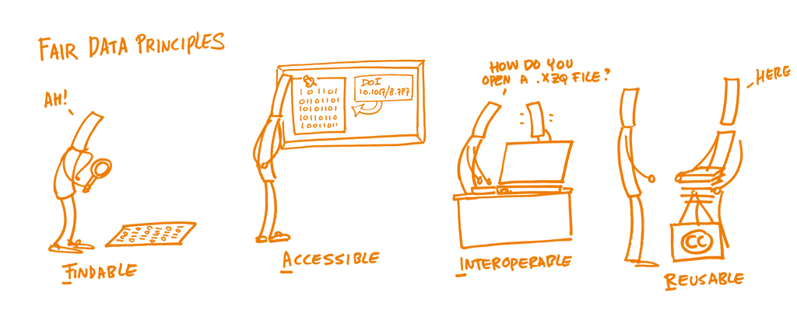

### Dati e modelli per il patrimonio culturale e la loro rappresentazione

##### I casi del _Rinascimento digitale di Ulisse Aldrovandi_ e del _Progetto SIRIUS_

Sebastian Barzaghi | 
[https://www.unibo.it/sitoweb/sebastian.barzaghi2/](https://www.unibo.it/sitoweb/sebastian.barzaghi2/) |
[sebastian.barzaghi2@unibo.it](mailto:sebastian.barzaghi2@unibo.it) | 
[https://orcid.org/0000-0002-0799-1527](https://orcid.org/0000-0002-0799-1527)

---

## Outline

1. Concetti chiave
    * Dato
    * Modello (di dati)
    * FAIRness
2. Casi di studio
    * Aldrovandi (Spoke 4)
    * SIRIUS (Spoke 6)

---



## Partiamo dai dati

---

## Cosa sono i dati?

Fare ricerca implica lavorare con i dati, tanto come oggetti di studio ed analisi, quanto come prodotti del processo stesso di ricerca.

> I dati sono record fattuali raccolti, generati o riutilizzati nella pratica di ricerca, come base di analisi, ragionamenti, discussioni o calcoli.

  OECD (2007), OECD Principles and Guidelines for Access to Research Data from Public Funding, OECD Publishing, Paris. <a href="https://doi.org/10.1787/9789264034020-en-fr">https://doi.org/10.1787/9789264034020-en-fr</a>.

---

## Le sfide dei dati culturali

. The hands-on guide to research data management for KU Leuven researchers, students, and research support staff in the humanities and social sciences. Zenodo. https://doi.org/10.5281/zenodo.8010618.")

---

## Le sfide dei dati culturali

Processi di ricerca umanistica ancora dominati da paradigmi tradizionali, mancanza di finanziamenti, problemi di copyright, ecc.

&rarr; La ricerca umanistica è raramente documentata, standardizzata e strutturata per facilitarne la comprensione e il riuso da parte di _altri_ (umani o macchine).

  Erzsébet Tóth-Czifra (2019). DARIAH Pathfinder to Data Management Best Practices in the Humanities. Version 1.0.0. DARIAH-Campus. [Pathfinder]. <a href="https://campus.dariah.eu/id/yR8mHfs3eW-ibu58LerCt">https://campus.dariah.eu/id/yR8mHfs3eW-ibu58LerCt</a>.

---

## I dati sono rappresentati secondo _modelli_

    

      <figure>
      
        <figcaption>
            Fonte: Kučerová, H. (2018). The concept of model and conceptual model in information science. <a href="https://knihovnarevue-en.nkp.cz/archives/2018-2/reviewed-articles/the-concept-of-model-and-conceptual-model-in-information-science ">https://knihovnarevue-en.nkp.cz/archives/2018-2/reviewed-articles/the-concept-of-model-and-conceptual-model-in-information-science </a>.
        </figcaption>
      </figure>
    

    

        

          Rappresentazioni formali di segmenti di realtà che li rendono computabili.
        

        

          Fondamentali per descrivere, organizzare e gestire i dati.
        

    

  Flanders, J., & Jannidis, F. (2015). Data modeling. A new companion to digital humanities, 229-237. <a href="https://doi.org/10.1002/9781118680605.ch16">https://doi.org/10.1002/9781118680605.ch16</a>.

---



## Dati e modelli ai tempi dell'Open Science

---

## Cos'è la Scienza Aperta?

    

      <figure>
      
        <figcaption>
            Melanie Imming, Jon Tennant, & Ivo Grigorov. (2018). Stickers Open Science just science done right (IT). Zenodo. <a href="https://doi.org/10.5281/zenodo.2613332">https://doi.org/10.5281/zenodo.2613332</a>.
        </figcaption>
      </figure>
    

    

        

          Un costrutto che combina movimenti e pratiche con l'obiettivo di rendere la conoscenza scientifica più trasparente, accessibile e riutilizzabile per tutti.
        

    

  UNESCO (2021). UNESCO Recommendation on Open Science. <a href="https://doi.org/10.54677/MNMH8546">https://doi.org/10.54677/MNMH8546</a>.

---

## Open Science per il patrimonio culturale: perché?

Rendere i dati disponibili a ricercatori, organizzazioni e cittadini.

Costruire collaborativamente strumenti e servizi di gestione, manipolazione e visualizzazione dei dati.

Aumentare la replicabilità e l'interdisciplinarietà della ricerca umanistica.

  Edmond, J., & Tóth-Czifra, E. (2018). Open data for humanists, a pragmatic guide. <a href="https://shs.hal.science/halshs-02115443">https://shs.hal.science/halshs-02115443</a>.

---

## "My FAIR Data"

    

      <figure>
      
        <figcaption>
            MBezjak, S., Clyburne-Sherin, A., Conzett, P., Fernandes, P. L., Görögh, E., Helbig, K., ... & Tennant, J. (2018). The Open Science Training Handbook. <a href="https://open-science-training-handbook.gitbook.io/book">https://open-science-training-handbook.gitbook.io/book</a>.
        </figcaption>
      </figure>
    

    

        

          Rintracciabilità, tramite identificatori persistenti e metadati descrittivi.
        

    

  Wilkinson, M. D., Dumontier, M., Aalbersberg, I. J., Appleton, G., Axton, M., Baak, A., ... & Mons, B. (2016). The FAIR Guiding Principles for scientific data management and stewardship. Scientific data, 3(1), 1-9. <a href="https://doi.org/10.1038/sdata.2016.18">https://doi.org/10.1038/sdata.2016.18</a>.

---

## "My FAIR Data"

    

      <figure>
      
        <figcaption>
            MBezjak, S., Clyburne-Sherin, A., Conzett, P., Fernandes, P. L., Görögh, E., Helbig, K., ... & Tennant, J. (2018). The Open Science Training Handbook. <a href="https://open-science-training-handbook.gitbook.io/book">https://open-science-training-handbook.gitbook.io/book</a>.
        </figcaption>
      </figure>
    

    

        

          Accessibilità, tramite protocolli standard ed eventualmente anche sistemi di autenticazione.
        

    

  Wilkinson, M. D., Dumontier, M., Aalbersberg, I. J., Appleton, G., Axton, M., Baak, A., ... & Mons, B. (2016). The FAIR Guiding Principles for scientific data management and stewardship. Scientific data, 3(1), 1-9. <a href="https://doi.org/10.1038/sdata.2016.18">https://doi.org/10.1038/sdata.2016.18</a>.

---

## "My FAIR Data"

    

      <figure>
      
        <figcaption>
            MBezjak, S., Clyburne-Sherin, A., Conzett, P., Fernandes, P. L., Görögh, E., Helbig, K., ... & Tennant, J. (2018). The Open Science Training Handbook. <a href="https://open-science-training-handbook.gitbook.io/book">https://open-science-training-handbook.gitbook.io/book</a>.
        </figcaption>
      </figure>
    

    

        

          Interoperabilità, tramite formati e modelli standardizzati.
        

    

  Wilkinson, M. D., Dumontier, M., Aalbersberg, I. J., Appleton, G., Axton, M., Baak, A., ... & Mons, B. (2016). The FAIR Guiding Principles for scientific data management and stewardship. Scientific data, 3(1), 1-9. <a href="https://doi.org/10.1038/sdata.2016.18">https://doi.org/10.1038/sdata.2016.18</a>.

---

## "My FAIR Data"

    

      <figure>
      
        <figcaption>
            MBezjak, S., Clyburne-Sherin, A., Conzett, P., Fernandes, P. L., Görögh, E., Helbig, K., ... & Tennant, J. (2018). The Open Science Training Handbook. <a href="https://open-science-training-handbook.gitbook.io/book">https://open-science-training-handbook.gitbook.io/book</a>.
        </figcaption>
      </figure>
    

    

        

          Riusabilità, tramite documentazione e licenze quanto più aperte possibile.
        

    

  Wilkinson, M. D., Dumontier, M., Aalbersberg, I. J., Appleton, G., Axton, M., Baak, A., ... & Mons, B. (2016). The FAIR Guiding Principles for scientific data management and stewardship. Scientific data, 3(1), 1-9. <a href="https://doi.org/10.1038/sdata.2016.18">https://doi.org/10.1038/sdata.2016.18</a>.

---

## Linked Open Data

    

      <figure>
      
        <figcaption>
            Fonte: <a href="https://5stardata.info/en/">https://5stardata.info/en/</a>.
        </figcaption>
      </figure>
    

    

        

          Dati semi-strutturati, azionabili dalle macchine e pubblicati in formato aperto.
        

        

          Fondamentali per Interoperabilità e Riusabilità.
        

    

  Blaney, J. (2017). Introduction to the principles of linked open data. The Programming Historian. <a href="https://doi.org/10.46430/phen0068">https://doi.org/10.46430/phen0068</a>.

---

## Linked Open Data

    

      <figure>
      
        <figcaption>
            Fonte: Blaney, J. (2017). Introduction to the principles of linked open data. The Programming Historian. <a href="https://doi.org/10.46430/phen0068">https://doi.org/10.46430/phen0068</a>.
        </figcaption>
      </figure>
    

    

        

          Basati sul concetto di tripla RDF.
        

    

  Blaney, J. (2017). Introduction to the principles of linked open data. The Programming Historian. <a href="https://doi.org/10.46430/phen0068">https://doi.org/10.46430/phen0068</a>.

---



## Caso 1: Aldrovandi

---

## Digitalizzare una mostra temporanea

Creare una versione digitale della mostra "L'Altro Rinascimento: Ulisse Aldrovandi e le meraviglie del mondo" e renderla accessibile online.

Progetto pilota per raccogliere linee guida di acquisizione e digitalizzazione del patrimonio culturale da applicare ai casi core dello Spoke.

---

## I dati: catalogo degli oggetti

    

      <figure>
        
        <figcaption>
            Fonte: Barzaghi, S., Bordignon, A., Gualandi, B., & Peroni, S. (2024, June 5). Thinking Outside the Black Box: Insights from a Digital Exhibition in the Humanities. MeTe digitali. Mediterraneo in rete tra testi e contesti (AIUCD 2024), Catania, Italy. Zenodo. <a href="https://doi.org/10.5281/zenodo.11487997">https://doi.org/10.5281/zenodo.11487997</a>.
        </figcaption>
      </figure>
    

    

        

          Descrizione strutturata per ogni oggetto, definita da una serie di metadati bibliografici estratti da cataloghi museali e note dei curatori (es. titolo, identificativo, tipo, tecnica, soggetti, ruoli, ecc.).
        

    

---

## I dati: tabella dei processi

    

      <figure>
        
        <figcaption>
            Fonte: Barzaghi, S., Bordignon, A., Gualandi, B., & Peroni, S. (2024, June 5). Thinking Outside the Black Box: Insights from a Digital Exhibition in the Humanities. MeTe digitali. Mediterraneo in rete tra testi e contesti (AIUCD 2024), Catania, Italy. Zenodo. <a href="https://doi.org/10.5281/zenodo.11487997">https://doi.org/10.5281/zenodo.11487997</a>.
        </figcaption>
      </figure>
    

    

        

          Descrizione strutturata per il processo di digitalizzazione di ogni oggetto, definita da una serie di metadati assegnati ad ogni fase prevista dal flusso di lavoro (es. acquisizione, elaborazione, modellazione, ecc.).
        

    

---

## Il modello: CHAD-AP

    

      <figure>
        
        <figcaption>
            Fonte: Barzaghi, S. and Peroni, S. (2024). Cultural Heritage Acquisition and Digitisation Application Profile. <a href="https://w3id.org/dharc/ontology/chad-ap">https://w3id.org/dharc/ontology/chad-ap</a>.
        </figcaption>
      </figure>
    

---

## Il modello: CHAD-AP

    

      <figure>
        
        <figcaption>
            Fonte: Barzaghi, S. and Peroni, S. (2024). Cultural Heritage Acquisition and Digitisation Application Profile. <a href="https://w3id.org/dharc/ontology/chad-ap">https://w3id.org/dharc/ontology/chad-ap</a>.
        </figcaption>
      </figure>
    

---

## Esempio

XXX

---

## Sviluppi futuri

XXX

---



## Caso 2: SIRIUS

---

## Promuovere una cultura del rischio

Progetto per lo sviluppo di strategie condivise per la gestione dei rischi che impattano la salvaguardia del patrimonio culturale.

Obiettivi di stimolare collaborazione e coordinamento tra i diversi agenti coinvolti, fornire strumenti utili alle autorità locali per la gestione di situazioni di rischio potenziale, aumentare consapevolezza e responsabilizzazione presso i cittadini.

---

## I dati: assessment del rischio

Dati sparsi, raramente accessibili, non strutturati, non interoperabili.

Numerose metodologie riconosciute, ma non formalizzate da protocolli FAIR.

---

## Il modello: HeRO

. Heritage Risk Assessment Ontology. https://w3id.org/sirius/ontology/hero.")

---

## Esempio

XXX

---

## Sviluppi futuri

Sviluppo di uno o più vocabolari controllati per definire formalmente (quindi in LOD) una terminologia multilingua comune riguardante il rischio nell'ambito del patrimonio culturale.

Sviluppo di una web app per la visualizzazione interattiva dei dati raccolti tramite richieste API da un'istanza di Omeka S (per dati sul rischio) e Wikidata (per dati sugli oggetti).

---



## Conclusioni

---

## Rendiamo i nostri dati più aperti e FAIR...

... tramite modelli semantici (ontologie, application profile e vocabolari controllati) esistenti o creati sulla base di requisiti concreti.

... tramite la loro pubblicazione in formati standard che ne valorizzano la ricchezza semantica, su piattaforme accessibili, con licenze aperte.

---

## Tra i dati, diamo spazio anche alle metodologie...

... modellandole come i dati stessi.

... documentandole abbondantemente con esempi.

... pubblicandole sotto forma di protocolli riutilizzabili.

---

## Facciamo comunicare dati e modelli di progetti diversi...

... tramite modelli semantici (ontologie, application profile e vocabolari controllati) esistenti o creati sulla base di requisiti concreti.

... 

---

# Grazie!

## Domande?

Sebastian Barzaghi | 
[https://www.unibo.it/sitoweb/sebastian.barzaghi2/](https://www.unibo.it/sitoweb/sebastian.barzaghi2/) |
[sebastian.barzaghi2@unibo.it](mailto:sebastian.barzaghi2@unibo.it) | 
[https://orcid.org/0000-0002-0799-1527](https://orcid.org/0000-0002-0799-1527)