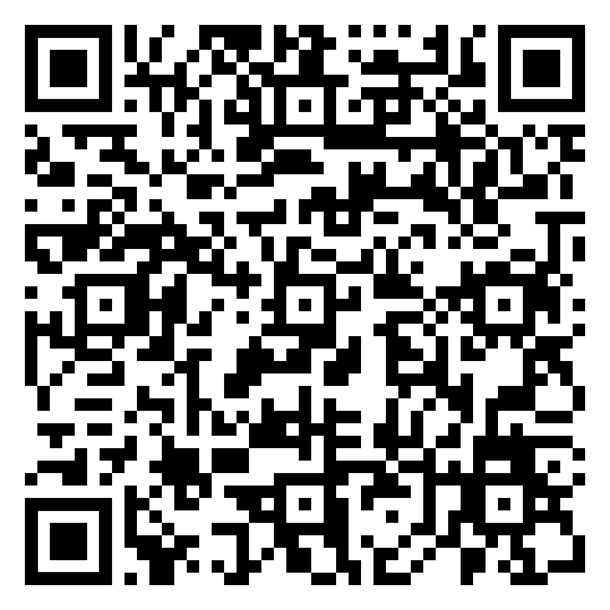

# Introduzione

## Lezione 00 del corso di _Digital Humanities e Data Management per i Beni Culturali_ (2024/2025)

###### Sebastian Barzaghi | [sebastian.barzaghi2@unibo.it](mailto:sebastian.barzaghi2@unibo.it) | [https://orcid.org/0000-0002-0799-1527](https://orcid.org/0000-0002-0799-1527)

---

### Piacere!

Ricercatore presso il Dipartimento di Beni Culturali dell'Università di Bologna.

Laureato nel 2020 nel corso di laurea magistrale in Digital Humanities and Digital Knowledge ([DHDK](https://corsi.unibo.it/2cycle/DigitalHumanitiesKnowledge)) presso l'Università di Bologna.

Attualmente lavoro presso il laboratorio di ricerca [FrameLAB](https://framelab.unibo.it/) e collaboro con altre realtà (es. [DHARC](https://centri.unibo.it/dharc/en)).

I miei interessi si concentrano sullo studio e l'implementazione di strumenti e metodologie basate sui **Linked Open Data** e l'**Open Science** per migliorare le attività accademiche (ricerca, didattica e terza missione) nei settori delle discipline umanistiche e del patrimonio culturale

---

### Cosa vi aspettate?

    

        
    

    

        
<a href="https://forms.gle/RdBDcRJds7oeA6SU7">https://forms.gle/RdBDcRJds7oeA6SU7</a>

    

---

### Qual è il tuo livello di familiarità con il concetto di "Digital Humanities"?

    

      <iframe width="600" height="300" seamless frameborder="0" scrolling="no" src="https://docs.google.com/spreadsheets/d/e/2PACX-1vRxCM0HrFDBHrDocKRWTw5GMbrfzbcPVeYSMMlELexuLDS6_ewb9Iy5jog5D4mNC5pmIBxm3HF2SJZy/pubchart?oid=272791889&amp;format=interactive"></iframe>
    

    

      
Avendo a che fare con dati digitali e fonti umanistiche, le "Digital Humanities" sono il dominio entro il quale necessariamente ci muoviamo.

      
Definiamole il punto di incontro tra scienze informatiche e discipline umanistiche.

    

---

### Qual è il tuo livello di familiarità con il concetto di "Data Management"?

    

      <iframe width="600" height="300" seamless frameborder="0" scrolling="no" src="https://docs.google.com/spreadsheets/d/e/2PACX-1vRxCM0HrFDBHrDocKRWTw5GMbrfzbcPVeYSMMlELexuLDS6_ewb9Iy5jog5D4mNC5pmIBxm3HF2SJZy/pubchart?oid=2092092195&amp;format=interactive"></iframe>
    

    

      
La gestione dei dati è il tema fondamentale che affronteremo e attorno al quale l'intero corso è organizzato.

      
Si tratta di un processo complesso che ci permette di rendere utili e utilizzabili ciò che chiamiamo "dati".

    

---

### Qual è il tuo livello di familiarità con il concetto di "Open Science"?

    

      <iframe width="600" height="300" seamless frameborder="0" scrolling="no" src="https://docs.google.com/spreadsheets/d/e/2PACX-1vRxCM0HrFDBHrDocKRWTw5GMbrfzbcPVeYSMMlELexuLDS6_ewb9Iy5jog5D4mNC5pmIBxm3HF2SJZy/pubchart?oid=46492131&amp;format=interactive"></iframe>
    

    

      
La "Scienza Aperta" è uno dei paradigmi che guideranno le attività che faremo per tutto il resto del corso.

      
Per ora, limitiamoci a dire che si tratta di <a href="https://doi.org/10.5281/zenodo.2613332">"scienza fatta bene"</a>.

    

---

### Qual è il tuo livello di familiarità con il concetto di "Linked Open Data"?

    

      <iframe width="600" height="300" seamless frameborder="0" scrolling="no" src="https://docs.google.com/spreadsheets/d/e/2PACX-1vRxCM0HrFDBHrDocKRWTw5GMbrfzbcPVeYSMMlELexuLDS6_ewb9Iy5jog5D4mNC5pmIBxm3HF2SJZy/pubchart?oid=51082031&amp;format=interactive"></iframe>
    

    

      

        In stretta connessione con l'Open Science, i Linked Open Data rappresentano un altro paradigma che vede il dato come qualcosa di aperto e contestualizzato.
      

    

---

### Informazioni preliminari

**Obiettivi**: fornire competenze e strumenti pratici per l'ideazione, gestione e pubblicazione di risorse digitali riguardanti i beni culturali e basate su dati di ambito umanistico.

**Temi**: Digital Humanities, Data management, Linked Open Data, Open Science.

**Risultati**: progetti _vostri_ che testimoniano le competenze acquisite.

---

### Regole

**Materiale integrativo, gratuito e accessibile**: i libri e gli articoli sono pensati per essere un accompagnamento alle lezioni e saranno resi disponibili sulla piattaforma istituzionale [Virtuale](https://virtuale.unibo.it/course/view.php?id=66104) e nella repository [GitHub](https://github.com/dhdmch/2024-2025).

  Spesso in una slide troverete un riquadro di questo tipo, contenente la fonte bibliografica (liberamente accessibile) da cui ho tratto il contenuto della slide. Consideratela parte facoltativa del materiale integrativo, da leggere secondo il vostro interesse.

---

### Regole

**Presenza non obbligatoria ma consigliata**: per i non frequentanti ci sarà solo più materiale obbligatorio da studiare. Frequentanti, non abbiate paura ad interagire e a fare domande.

**Progetto finale**: vi verranno forniti dettagli più avanti, ma per il momento sappiate che la natura dell'esame _non_ sarà negoziabile.

---

### Organizzazione del corso

* **Quando**
  * [15 lezioni](https://www.unibo.it/it/studiare/dottorati-master-specializzazioni-e-altra-formazione/insegnamenti/insegnamento/2024/502386/orariolezioni) (lunedì, mercoledì, giovedì)
  * 2 ore per lezione
  * Circa 7 moduli
  * Sessione teorica e pratica per ogni modulo
  * 1 pausa di 10 minuti (concordiamo su quando)
* **Dove**
  * Lunedì: Aula 2
  * Mercoledì e giovedì: Laboratorio informatico
* **Come**
  * [GitHub](https://github.com/dhdmch/2024-2025)
  * [Virtuale](https://virtuale.unibo.it/course/view.php?id=66104)
  * [Registrazioni](https://liveunibo-my.sharepoint.com/:f:/g/personal/sebastian_barzaghi2_unibo_it/EhNZP7JyGstEvrgE_PGMgJ0BqGsfnUiMG7otV3TfPaIzkQ?e=Icg7zc)

---

### Organizzazione del corso

| ID | Titolo | Tipo | Tematica | Data |
|----|--------|------|----------|------|
| 00 | _Introduzione_ | Teorica | `Corso`, `Esame` | 07-11-2024 |
| 01 | _La grande sfida_ | Teorica | `Open Science`, `Dati`, `Digital Humanities`, `Data Management` | 07-11-2024 |
| 02 | _Primi passi_ | Pratica | [GitHub](https://github.com/) | 18-11-2024 |
| 03 | _PLAN: pianificare_ | Teorica | `Metadati`, `FAIR`, `Case study`, `Progetto d'esame` | 20-11-2024 |
| 04 | _Diario di bordo_ | Pratica | [Markdown](https://www.markdownguide.org/) | 21-11-2024 |
| 05 | _COLLECT: creare e raccogliere_ | Teorica | `Raccolta e creazione dati`, `Documentazione`, `File system` | 25-11-2024 |
| 06 | _Il biblioggetto_ | Pratica | [Zotero](https://www.zotero.org/) | 27-11-2024 |

---

| ID | Titolo | Tipo | Tematica | Data |
|----|--------|------|----------|------|
| 07 | _COLLECT: descrivere_ | Teorica | `Modellazione dei dati`, `Linked Open Data` | 28-11-2024 |
| 08 | _Strutture nascoste_ | Pratica | [TEI](https://tei-c.org/) | 02-12-2024 |
| 09 | _L'oltretesto_ | Pratica | [RDF](https://it.wikipedia.org/wiki/Resource_Description_Framework) | 04-12-2024 |
| 10 | _PROCESS: preparare ed elaborare_ | Teorica | `Pulizia dei dati`, `Qualità dei dati` | 05-12-2024 |
| 11 | _Metti la cera, togli la cera_ | Pratica | [OpenRefine](https://openrefine.org/) | 09-12-2024 |
| 12 | _ANALYZE: analizzare_ | Teorica | `Analisi dei dati`, `Visualizzazione dei dati` | 11-12-2024 |
| 13 | _Tutto è rivelato_ | Pratica | [Voyant Tools](https://voyant-tools.org/) | 12-12-2024 |
| 14 | _SHARE: condividere e riutilizzare_ | Teorica | `Preservazione dei dati`, `Citazione dei dati`, `Pubblicazione dei dati` | 16-12-2024 |
| 15 | _L'eredità di Alessandria_ | Pratica | [Zenodo](https://zenodo.org/) | 18-12-2024 |

---

### Esame

Un progetto di _gestione dei dati_ correlato a tematiche di interesse documentario e/o storico-artistico, che verrà presentato durante un colloquio orale (e pubblicato su GitHub).

Basato su linee guida specifiche che saranno presentate e discusse durante il corso e che saranno disponibili su Virtuale e nella repository GitHub.

Gli studenti potranno lavorare al progetto individualmente o in gruppo (da definire).

---

### Preparazione all'esame

Non spaventatevi: avremo modo di esercitarci e capire assieme i vari passaggi da seguire per realizzare un buon progetto (e portare a casa un 30 e lode).

Nelle sessioni pratiche, lavoreremo assieme su un _caso di studio_ di gestione dei dati in cui vi aiuterò attivamente, per farvi sperimentare con gli strumenti e i metodi presentati a lezione.

---

### Valutazione

Il contributo personale di ciascuna persona e la conoscenza degli argomenti del corso saranno valutati durante il colloquio orale:

* <50% (valutazione insufficiente): preparazione non adeguata in nessun aspetto del progetto;
* 51-70% (valutazione sufficiente): tra 18/30 e 23/30;
* 71-90% (valutazione positiva): tra 24/30 e 27/30;
* 91-100% (valutazione eccellente): tra 28/30 e 30/30.

---

### Valutazione

Ad un certo punto, anche voi dovrete valutare me!

Il questionario di valutaizone è **davvero molto importante**, quindi - a tempo debito - insisterò molto sulla sua compilazione da parte vostra.

Vi prego di essere quanto più corretti ed oggettivi possibile nella valutazione del corso, in modo da farmi capire cosa va bene e cosa no.

---

### Raccomandazioni finali

Affrontare cose nuove è sempre difficile, quindi non preoccupatevi se il corso può sembrare complicato: lo è!

Però, è pensato per essere accessibile a studenti non abituati a questo tipo di tematiche (per questo motivo, una vostra valutazione onesta è assolutamente fondamentale).

Se fatte in buona fede, non esistono domande stupide.

Nel dubbio, chiedete sempre (dal vivo o per mail). A seconda della domanda, potrei aver bisogno di tempo per darvi una risposta sensata, quindi - nel caso - abbiate un po' di pazienza!

---

# Fine

## Lezione 00 del corso di _Digital Humanities e Data Management per i Beni Culturali_ (2024/2025)

###### Sebastian Barzaghi | [sebastian.barzaghi2@unibo.it](mailto:sebastian.barzaghi2@unibo.it) | [https://orcid.org/0000-0002-0799-1527](https://orcid.org/0000-0002-0799-1527)