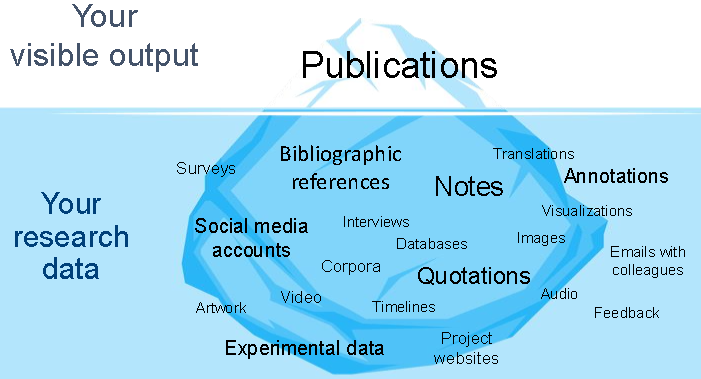
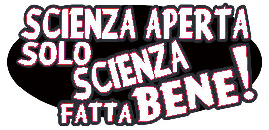
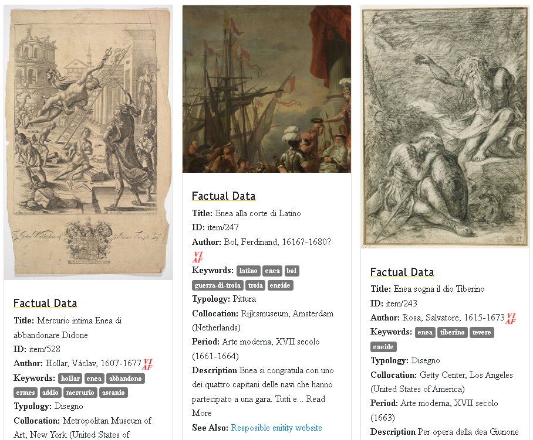
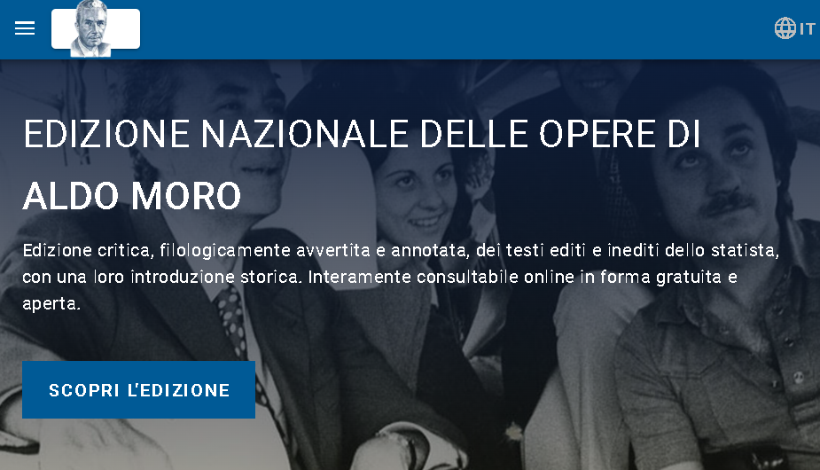
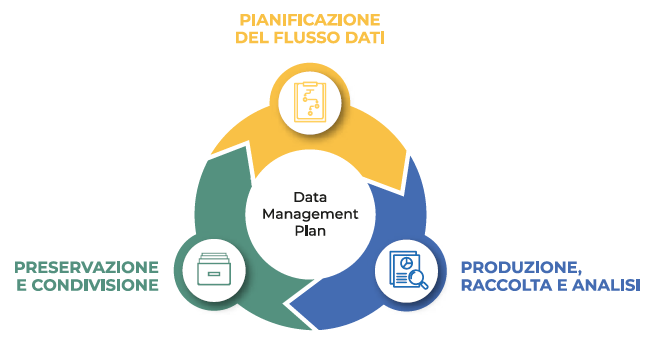
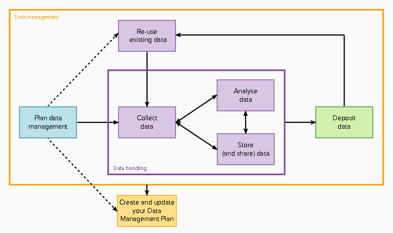

# La grande sfida

## Lezione 01 del corso di _Digital Humanities e Data Management per i Beni Culturali_ (2024/2025)

###### Sebastian Barzaghi | [sebastian.barzaghi2@unibo.it](mailto:sebastian.barzaghi2@unibo.it) | [https://orcid.org/0000-0002-0799-1527](https://orcid.org/0000-0002-0799-1527)

---



## Partiamo dai dati

<!--
Photo by <a href="https://unsplash.com/@gregbecker?utm_content=creditCopyText&utm_medium=referral&utm_source=unsplash">Greg Becker</a> on <a href="https://unsplash.com/photos/body-of-water-under-clear-blue-sky-sYzFIusQp3Q?utm_content=creditCopyText&utm_medium=referral&utm_source=unsplash">Unsplash</a>
-->

---

### Un dato è una fonte di conoscenza

  

    <figure>
      
        <figcaption>
            Fonte: Noppe, N., Vanvelk, J., & Callens, N. (2023). The hands-on guide to research data management for KU Leuven researchers, students, and research support staff in the humanities and social sciences. Zenodo. <a href="https://doi.org/10.5281/zenodo.8010618">https://doi.org/10.5281/zenodo.8010618</a>.
        </figcaption>
    </figure>
  

  

    

      I dati sono record fattuali raccolti, generati o riutilizzati come base di analisi, ragionamenti, discussioni o calcoli.
    

    

      Vengono usati da studiosi e scienziati come sturmenti per comprendere il mondo e comunicare tra di loro.
    

  

  OECD (2007). OECD Principles and Guidelines for Access to Research Data from Public Funding, OECD Publishing, Paris. <a href="https://doi.org/10.1787/9789264034020-en-fr">https://doi.org/10.1787/9789264034020-en-fr</a>.

---

### Un dato è una categoria relazionale

I dati non hanno valore di verità di per sé, né possono essere visti come rappresentazioni dirette dei fenomeni studiati. 

Ciò che è considerabile "dato" dipende da chi lo usa, come, e per quale scopo.

Un oggetto diventa un dato quando è visto come prova reale o potenziale per una o più asserzioni riguardanti un certo fenomeno.

  Leonelli, S. (2016). Data-Centric Biology: A Philosophical Study. University of Chicago Press. <a href="https://doi.org/10.7208/chicago/9780226416502.001.0001">https://doi.org/10.7208/chicago/9780226416502.001.0001</a>.

---

### Più dati sono raccolti in dataset

Un dataset è una raccolta di dati organizzati secondo criteri precisi.

La sua corretta gestione garantisce l'efficienza, l'affidabilità e l'utilità dei dati.

  Ciston, S., & Mike Ananny, K. C. (2023). A critical field guide for working with machine learning datasets. Knowing Machines project. <a href="https://knowingmachines.org/critical-field-guide">https://knowingmachines.org/critical-field-guide</a>.

---

### Non è facile parlare di dati nelle discipline umanistiche

Non c'è consenso su che cosa siano i _dati_ nelle discipline umanistiche.

Il termine stesso _discipline umanistiche_ è ampio e racchiude in sé domini di conoscenza estremamente diversi.

  Tóth-Czifra, E. (2019). DARIAH Pathfinder to Data Management Best Practices in the Humanities. Version 1.0.0. DARIAH-Campus. [Pathfinder]. <a href="https://campus.dariah.eu/id/yR8mHfs3eW-ibu58LerCt">https://campus.dariah.eu/id/yR8mHfs3eW-ibu58LerCt</a>.

---

### Anche gli umanisti usano e producono dati

Ogni tipo di ricerca produce o riusa dei dati, anche se il termine _dato_ non viene utilizzato in certi contesti.

Esempio: un ricercatore utilizza delle fonti (primarie o secondarie) per rispondere alle proprie domande di ricerca, producendo _almeno_ una bibliografia.

  Gualandi, B., Pareschi, L., & Peroni, S. (2023). What do we mean by “data”? A proposed classification of data types in the arts and humanities. Journal of Documentation, 79(7), 51-71. <a href="https://doi.org/10.1108/JD-07-2022-0146">https://doi.org/10.1108/JD-07-2022-0146</a>.

---

### Se tutti producono e usano dati, dobbiamo discutere come i dati possano essere condivisi e riutilizzati.

---



## Apriti, Scienza

<!--
Photo by <a href="https://unsplash.com/@ilmissile?utm_content=creditCopyText&utm_medium=referral&utm_source=unsplash">Jacopo Tarantini</a> on <a href="https://unsplash.com/photos/bottom-view-of-rocks-GUwwV5l2QNk?utm_content=creditCopyText&utm_medium=referral&utm_source=unsplash">Unsplash</a>
-->

---

### La scienza fatta bene

    

      <figure>
      
        <figcaption>
            Melanie Imming, Jon Tennant, & Ivo Grigorov. (2018). Stickers Open Science just science done right (IT). Zenodo. <a href="https://doi.org/10.5281/zenodo.2613332">https://doi.org/10.5281/zenodo.2613332</a>.
        </figcaption>
      </figure>
    

    

        

          La Scienza Aperta è un insieme di movimenti e pratiche che mirano a rendere la conoscenza scientifica più trasparente, accessibile e riutilizzabile per tutti.
        

    

  UNESCO (2021). UNESCO Recommendation on Open Science. <a href="https://doi.org/10.54677/MNMH8546">https://doi.org/10.54677/MNMH8546</a>.

---

### Argomento Scientifico

La maggiore riproducibilità e trasparenza dei metodi e dei risultati della ricerca garantiscono maggiore scientificità.

  Wuttke, U. (2018, novembre 19). Introduction to Humanities Research Data Management. Zenodo. <a href="https://doi.org/10.5281/zenodo.1491250">https://doi.org/10.5281/zenodo.1491250</a>.

---

### Argomento Sociologico

La conoscenza scientifica è un prodotto di collaborazione sociale, e quindi appartiene alla comunità.

  Wuttke, U. (2018, novembre 19). Introduction to Humanities Research Data Management. Zenodo. <a href="https://doi.org/10.5281/zenodo.1491250">https://doi.org/10.5281/zenodo.1491250</a>.

---

### Argomento Utilitaristico

Una scienza più aperta massimizza la possibilità per il singolo ricercatore di ricevere un maggior numero di citazioni, una maggiore copertura mediatica, un numero più ampio di collaborazioni e opportunità di lavoro e finanziamento.

Inoltre, rientra sempre più spesso tra i requisiti dei finanziatori a livello nazionale e internazionale.

  Wuttke, U. (2018, novembre 19). Introduction to Humanities Research Data Management. Zenodo. <a href="https://doi.org/10.5281/zenodo.1491250">https://doi.org/10.5281/zenodo.1491250</a>.

---

### La Scienza Aperta viene costruita sui dati aperti

In breve, si tratta di creare, usare e condividere **dati aperti**, cioé dati liberamente disponibili per l'accesso e il (ri)utilizzo.

Idealmente, i dati non dovrebbero avere restrizioni da copyright, brevetti o altri meccanismi di controllo.

Nella realtà, bisogna puntare ad avere dati [_aperti quanto più possibile, chiusi secondo necessità_](https://rea.ec.europa.eu/open-science_en).

  Wuttke, U. (2018, novembre 19). Introduction to Humanities Research Data Management. Zenodo. <a href="https://doi.org/10.5281/zenodo.1491250">https://doi.org/10.5281/zenodo.1491250</a>.

---

### E per quanto riguarda le discipline umanistiche?

---

### La ricerca umanistica è dominata da paradigmi tradizionali (1/2)

Molti ricercatori usano come dati di ricerca fonti primarie, che spesso sono fisiche e raramente digitalizzate.

Le metodologie di ricerca tendono ad essere implicite, date per scontate.

La ricerca umanistica dipende generalmente da una _stratificazione densa_ di interpretazioni e commenti.

  Tóth-Czifra, E. (2019). DARIAH Pathfinder to Data Management Best Practices in the Humanities. Version 1.0.0. DARIAH-Campus. [Pathfinder]. <a href="https://campus.dariah.eu/id/yR8mHfs3eW-ibu58LerCt">https://campus.dariah.eu/id/yR8mHfs3eW-ibu58LerCt</a>.

---

### La ricerca umanistica è dominata da paradigmi tradizionali (2/2)

I sistemi semiotici delle discipline umanistiche tendono ad essere specifici e individualistici.

I dati sono difficilmente accessibili a causa di copyright stringenti e licenze inadatte al cambio di paradigma.

I dati culturali sono complessi e raramente documentati in modo da facilitarne l'integrazione, la comprensione e il riutilizzo da parte di altri.

  Tóth-Czifra, E. (2019). DARIAH Pathfinder to Data Management Best Practices in the Humanities. Version 1.0.0. DARIAH-Campus. [Pathfinder]. <a href="https://campus.dariah.eu/id/yR8mHfs3eW-ibu58LerCt">https://campus.dariah.eu/id/yR8mHfs3eW-ibu58LerCt</a>.

---

### Esistono forti incentivi per la Scienza Aperta

- Nuove prospettive di ricerca;
- Pubblicazione e diffusione della ricerca;
- Aumento dell'impatto e della visibilità (e quindi delle citazioni);
- Allineamento alle richieste dell'UE (e quindi maggiore disponibilità di finanziamenti).

  Wuttke, U. (2018, novembre 19). Introduction to Humanities Research Data Management. Zenodo. <a href="https://doi.org/10.5281/zenodo.1491250">https://doi.org/10.5281/zenodo.1491250</a>.

---

### Scienza Aperta per umanisti: perché?

Anche solo piccoli cambiamenti nel flusso di lavoro, come l'adozione di [ORCID](https://orcid.org/) e l'uso di strumenti come [Zenodo](https://zenodo.org/), possono fare una grande differenza.

Tra i vari vantaggi troviamo:
- Un migliore accesso ai dati e ai materiali;
- Una maggiore rappresentazione di posizioni marginali;
- Una maggiore credibilità della ricerca umanistica.

  Edmond, J., & Tóth-Czifra, E. (2018). Open data for humanists, a pragmatic guide. <a href="https://shs.hal.science/halshs-02115443">https://shs.hal.science/halshs-02115443</a>.

---

### Il ruolo fondamentale del digitale

Le tecnologie digitali forniscono l'importante opportunità alle discipline umanistiche di mettere in discussione paradigmi esistenti e sviluppare nuovi metodi di indagine e disseminazione scientifica accessibili e trasparenti.

Il campo in rapida espansione che esplora, sviluppa e applica metodi e tecnologie digitali nelle discipline umanistiche è spesso chiamato **Digital Humanities**.

  Wuttke, U. (2018). Introduction to Humanities Research Data Management. Zenodo. <a href="https://doi.org/10.5281/zenodo.1491250">https://doi.org/10.5281/zenodo.1491250</a>.

---



## Cambio di paradigma

<!--
Photo by <a href="https://unsplash.com/@geordannatheartist?utm_content=creditCopyText&utm_medium=referral&utm_source=unsplash">Geordanna Cordero</a> on <a href="https://unsplash.com/photos/multicolored-abstract-painting-5NE6mX0WVfQ?utm_content=creditCopyText&utm_medium=referral&utm_source=unsplash">Unsplash</a>
-->

---

### Cosa facciamo nelle DH?

Il termine **Digital Humanities** (DH) descrive contemporaneamente una comunità, un insieme di metodi e di strumenti, un cambio di paradigma, un campo di ricerca.

Comprende una <a href="https://vocabs.dariah.eu/tadirah/en/">vasta gamma di attività</a>, come la creazione di dataset e lo sviluppo di strumenti informatici necessari per la ricerca, la didattica e la disseminazione scientifica nelle scienze umanistiche.

  Weingart, Scott B., Susan Grunewald, Matthew Lincoln et al. (eds.). The Digital Humanities Literacy Guidebook. Carnegie Mellon University, Updated November 11, 2022. <a href="https://cmu-lib.github.io/dhlg/">https://cmu-lib.github.io/dhlg/</a>.

---

### Creiamo dataset

    

      <figure>
      
        <figcaption>
            Fonte: Valentina Pasqual, & Francesca Tomasi. (2021). mythlod/1.0 (1.0) [Data set]. Zenodo. <a href="https://doi.org/10.5281/zenodo.4639821">https://doi.org/10.5281/zenodo.4639821</a>.
        </figcaption>
      </figure>
    

    

        
Collezioni di dati strutturati, rese disponibili ad un pubblico più ampio per ulteriori studi e analisi.

    

---

### Creiamo modelli

    

      
      <figcaption>
          Fonte: Barzaghi, S., & Peroni, S. (2024). Cultural Heritage Acquisition and Digitisation Application Profile. <a href="https://w3id.org/dharc/ontology/chad-ap">https://w3id.org/dharc/ontology/chad-ap</a>.
      </figcaption>
    

    

        
Astrazioni per organizzare e descrivere dati in formati strutturati e azionabili dalle macchine.

    

---

### Creiamo strumenti

    

      
      <figcaption>
          Fonte: Moro, A. (2021). Edizione Nazionale delle Opere di Aldo Moro, voll., Bologna, Università di Bologna. ISBN: 9788854970496; DOI: <a href="https://doi.org/10.6092/unibo/aldomoro">https://doi.org/10.6092/unibo/aldomoro</a>.
      </figcaption>
    

    

        
Software e applicazioni che permettono di eseguire determinate operazioni sui dati (es. ricerca, caricamento, manipolazione, pubblicazione, ecc.) tramite interfacce visive e/o di programmazione.

    

---

### Queste attività prendono forma nei progetti

La struttura di base di qualsiasi progetto di DH è una combinazione di 
* **risorse digitali**, memorizzate in una 
* **struttura** (es. un database, un file system) e accessibili tramite un insieme di 
* **servizi** (es. interrogazione, ricerca, elaborazione, analisi) resi disponibili attraverso un'
* **interfaccia** che supporta l'esperienza dell'utente.

---

### Il risultato non è mai uno

I risultati di un progetto di Digital Humanities consistono spesso in **dati**, **siti Web**, **applicazioni**, **modelli**, **metodologie**, **documentazione** e altre risorse che dovrebbero essere rese accessibili ad altri agenti (umani e software), per facilitare la loro condivisione e riuso, la riproducibilità del processo di ricerca, e così via.

---

### Dipende tutto dalla gestione dei dati

Per sviluppare in maniera corretta un progetto e produrre un impatto concreto, le DH richiedono risultati ben strutturati, documentati, accessibili, sostenibili, utilizzabili.

Per farlo, è necessario seguire una serie di attività rigorose, orientate ad una consapevole **gestione dei dati**.

  Strasser, C., Cook, R., Michener, W., & Budden, A. (2012). Primer on Data Management: What you always wanted to know.
 <a href="https://doi.org/10.5281/zenodo.1491250">https://doi.org/10.5281/zenodo.1491250</a>.

---



## Un'impresa necessaria

<!--
Photo by <a href="https://unsplash.com/@billy_huy?utm_content=creditCopyText&utm_medium=referral&utm_source=unsplash">Billy Huynh</a> on <a href="https://unsplash.com/photos/blue-skies-filled-of-stars-W8KTS-mhFUE?utm_content=creditCopyText&utm_medium=referral&utm_source=unsplash">Unsplash</a>
-->

---

### Una lettera d'amore ai propri dati

La gestione dei dati (o Data Management, DM) è l'organizzazione critica dei dati durante l'intero ciclo di ricerca.

Tra gli obiettivi del DM, troviamo:
- rendere il processo di ricerca efficiente;
- rendere i dati interpretabili, comprensibili e rintracciabili nel tempo;
- favorire l'integrità scientifica della ricerca;
- stimolare la collaborazione tra ricercatori.

  Smits, D.A.B., Teperek, M. (2020). Research Data Management for Master’s Students: From Awareness to Action. Data Science Journal, 19(1), p. 30. 
 <a href="http://doi.org/10.5334/dsj-2020-030">http://doi.org/10.5334/dsj-2020-030</a>.

---

### Il DM consiste in una serie di attività complesse

    

      <figure>
        
        <figcaption>
          Fonte: Gualandi, B. (2024). Data stewardship e open science nelle discipline umanistiche. Zenodo. <a href="https://doi.org/10.5281/zenodo.12937887">https://doi.org/10.5281/zenodo.12937887</a>.
        </figcaption>
      </figure>
    

    

        

          La gestione dei dati consiste nella produzione, raccolta, analisi,  preservazione e condivisione dei dati.
        

    

---

### Vediamolo più da vicino

<figure>
  
  <figcaption>
    Gualandi, B., Caldoni, G., & Marino, M. (2022). Research Data Management: Data Lifecycle. Zenodo. <a href="https://doi.org/10.5281/zenodo.7249051">https://doi.org/10.5281/zenodo.7249051</a>.
  </figcaption>
</figure>

---

### Pianificazione

  

    <figure>
      
      <figcaption>
        Fonte: Gualandi, B., Caldoni, G., & Marino, M. (2022). Research Data Management: Data Lifecycle. Zenodo. <a href="https://doi.org/10.5281/zenodo.7249051">https://doi.org/10.5281/zenodo.7249051</a>.
      </figcaption>
    </figure>
  

  

      

        Azioni principali: identificare i tipi di dati, identificare i metadati, pianificare la loro organizzazione in dataset, e redigere un Data Management Plan (DMP).
      

  

---

### Produzione, raccolta e analisi

  

    <figure>
      
      <figcaption>
        Fonte: Gualandi, B., Caldoni, G., & Marino, M. (2022). Research Data Management: Data Lifecycle. Zenodo. <a href="https://doi.org/10.5281/zenodo.7249051">https://doi.org/10.5281/zenodo.7249051</a>.
      </figcaption>
    </figure>
  

  

      

        Azioni principali: raccogliere o creare i dati, elaborare i dati per renderli utilizzabili (pulizia, combinazione, trasformazione, controllo qualità), analizzare i dati per generare risultati utili, produrre la documentazione dei dati e delle metodologie utilizzate.
      

  

---

### Preservazione e condivisione

  

    <figure>
      
      <figcaption>
        Fonte: Gualandi, B., Caldoni, G., & Marino, M. (2022). Research Data Management: Data Lifecycle. Zenodo. <a href="https://doi.org/10.5281/zenodo.7249051">https://doi.org/10.5281/zenodo.7249051</a>.
      </figcaption>
    </figure>
  

  

    

      Azioni principali: valutare quali dati depositare, scegliere la repository, depositare i dati, applicare una licenza ai dati.
    

  

---

### Caso di studio: Mythologiae

https://mythologiae.unibo.it/

Collezione digitale di 4000+ opere d'arte raffiguranti scene della mitologia classica.

Ogni oggetto della collezione è descritto da una serie di metadati.

Lavoreremo su alcune sezioni di questo dataset, sperimentando con strumenti e metodi in maniera pratica e _simulando ciò che poi dovrete portare all'esame_.

---

# Fine

## Lezione 01 del corso di _Digital Humanities e Data Management per i Beni Culturali_ (2024/2025)

###### Sebastian Barzaghi | [sebastian.barzaghi2@unibo.it](mailto:sebastian.barzaghi2@unibo.it) | [https://orcid.org/0000-0002-0799-1527](https://orcid.org/0000-0002-0799-1527)