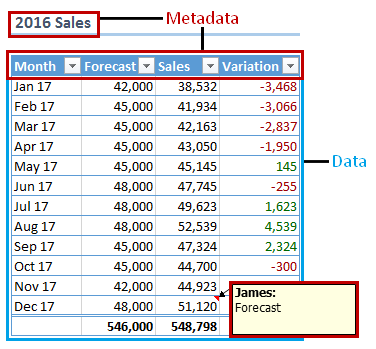

<!--
### DATA DOCUMENTATION???

https://ubc-library-rc.github.io/rdm/ 05
https://rdmkit.elixir-europe.org/index 05
https://osf.io/wbr7t 05

-->

# PLAN: Pianificare

## Lezione 03 del corso di _Digital Humanities e Data Management per i Beni Culturali_ (2024/2025)

###### Sebastian Barzaghi | [sebastian.barzaghi2@unibo.it](mailto:sebastian.barzaghi2@unibo.it) | [https://orcid.org/0000-0002-0799-1527](https://orcid.org/0000-0002-0799-1527) | [https://www.unibo.it/sitoweb/sebastian.barzaghi2/](https://www.unibo.it/sitoweb/sebastian.barzaghi2/)

---

### Pianificazione

  

    <figure>
      
      <figcaption>
        Fonte: Gualandi, B., Caldoni, G., & Marino, M. (2022). Research Data Management: Data Lifecycle. Zenodo. <a href="https://doi.org/10.5281/zenodo.7249051">https://doi.org/10.5281/zenodo.7249051</a>.
      </figcaption>
    </figure>
  

  

      

        Azioni principali: identificare i tipi di dati, identificare i metadati, pianificare la loro organizzazione in dataset, e redigere un Data Management Plan (DMP).
      

  

---

**

### Di nuovo, partiamo dai dati

---

### Rinfreschiamoci la memoria

  

    <figure>
      
        <figcaption>
            Fonte: Noppe, N., Vanvelk, J., & Callens, N. (2023). The hands-on guide to research data management for KU Leuven researchers, students, and research support staff in the humanities and social sciences. Zenodo. <a href="https://doi.org/10.5281/zenodo.8010618">https://doi.org/10.5281/zenodo.8010618</a>.
        </figcaption>
    </figure>
  

  

    

      I dati sono record fattuali raccolti, generati o riutilizzati come base di analisi, ragionamenti, discussioni o calcoli.
    

    

      Vengono usati da studiosi e scienziati come strumenti per comprendere il mondo e generare conoscenza.
    

  

  OECD (2007). OECD Principles and Guidelines for Access to Research Data from Public Funding, OECD Publishing, Paris. <a href="https://doi.org/10.1787/9789264034020-en-fr">https://doi.org/10.1787/9789264034020-en-fr</a>.

---

### Dati strutturati

**

Dati organizzati in uno schema predefinito (es. tabella).

Solitamente, sono facili da gestire e analizzare con l'uso di database relazionali e linguaggi di interrogazione specifici (es. SQL).

Esempi: tabelle di database, fogli di calcolo, ecc.

Rusu, O., Halcu, I., Grigoriu, O., Neculoiu, G., Sandulescu, V., Marinescu, M., & Marinescu, V. (2013, January). Converting unstructured and semi-structured data into knowledge. In 2013 11th roedunet international conference (pp. 1-4). IEEE. doi: <a href="https://doi.org/10.1109/RoEduNet.2013.6511736">https://doi.org/10.1109/RoEduNet.2013.6511736</a>. 

---

### Dati semi-strutturati

**

Dati con una struttura parziale e flessibile.

Sono più flessibili dei dati strutturati ma richiedono spesso una strutturazione minima che segua determinati schemi di codifica e vocabolari controllati.

Esempi: documenti XML, documenti JSON, documenti HTML, dataset RDF, ecc.

Rusu, O., Halcu, I., Grigoriu, O., Neculoiu, G., Sandulescu, V., Marinescu, M., & Marinescu, V. (2013, January). Converting unstructured and semi-structured data into knowledge. In 2013 11th roedunet international conference (pp. 1-4). IEEE. doi: <a href="https://doi.org/10.1109/RoEduNet.2013.6511736">https://doi.org/10.1109/RoEduNet.2013.6511736</a>. 

---

### Dati non-strutturati

**

Dati che mancano formalmente di una struttura organizzata.

Sono spesso in forma libera, come testo naturale, audio o video.

Una loro analisi richiede tecniche avanzate di processamento dei dati, come l’elaborazione del linguaggio naturale (NLP).

Esempi: documenti di testo, registrazioni, immagini, ecc.

Rusu, O., Halcu, I., Grigoriu, O., Neculoiu, G., Sandulescu, V., Marinescu, M., & Marinescu, V. (2013, January). Converting unstructured and semi-structured data into knowledge. In 2013 11th roedunet international conference (pp. 1-4). IEEE. doi: <a href="https://doi.org/10.1109/RoEduNet.2013.6511736">https://doi.org/10.1109/RoEduNet.2013.6511736</a>. 

---

### Come identificare i dati

- Di quali informazioni ho bisogno per realizzare il mio progetto?
- Di quali informazioni ho bisogno per rispondere alle mie domande di ricerca?
- Di quali informazioni hanno bisogno gli altri per comprendere e replicare quanto fatto da me?

Arnold, B., Bowler, L., Gibson, S., Herterich, P., Higman, R., Krystalli, A., ... & Whitaker, K. (2019). The Turing Way: A Handbook for Reproducible Data Science. Zenodo. <a href="https://the-turing-way.netlify.app/">https://the-turing-way.netlify.app/</a>.

---

### Come trovare i dati (esistenti)

Sul Web esistono tantissimi dataset disponibili in formato aperto, pubblicati e conservati all'interno di _repository_ dedicate.

Alcuni esempi di risorse per trovare dati:
- https://www.re3data.org/
- https://fairsharing.org/
- https://oad.simmons.edu/oadwiki/Data_repositories

Arnold, B., Bowler, L., Gibson, S., Herterich, P., Higman, R., Krystalli, A., ... & Whitaker, K. (2019). The Turing Way: A Handbook for Reproducible Data Science. Zenodo. <a href="https://the-turing-way.netlify.app/">https://the-turing-way.netlify.app/</a>.

---

### Controllate sempre la documentazione dei dati

Per trovare, contestualizzare e utilizzare i dataset, è fondamentale controllare i **metadati** che li descrivono.

Per esempio, una delle prime attività da fare quando si lavora con i dati è controllare la **licenza** assegnata ad essi, per capire se e come possono essere utilizzati.

Più in generale, è fondamentale controllare la documentazione che accompagna i dati, in modo da poterli capire - e, di conseguenza, utilizzare con criterio e responsabilità.

---

### Se invece state creando i dati...

... Il discorso resta lo stesso! 

Li identificate, a seconda delle vostre necessità, e li documentate fin dall'inizio, in maniera graduale e continua.

---

**

## A te, tra 2000 anni

---

### Un dato è anche una categoria relazionale

Ciò che è considerabile _dato_ dipende da chi lo usa, come, e per quale scopo.

Un oggetto diventa un dato quando è visto come prova reale o potenziale per una o più asserzioni riguardanti un certo fenomeno.

  Leonelli, S. (2016). Data-Centric Biology: A Philosophical Study. University of Chicago Press. <a href="https://doi.org/10.7208/chicago/9780226416502.001.0001">https://doi.org/10.7208/chicago/9780226416502.001.0001</a>.

---

### Le implicazioni sono di vitale importanza, oggi più che mai

Esempi:

- https://doi.org/10.5172/jfs.327.14.2-3.271
- https://news.ucsc.edu/2023/08/t2iat.html
- https://www.abc.net.au/news/2023-04-26/hidden-dangers-of-artificial-intelligence/102264038
- https://www.esquire.com/news-politics/politics/a33994802/pasco-county-sheriff-pre-crime-harassment/

---

### La _data documentation_ è una panoramica chiara sui dati

**

Una descrizione critica di tutto quello che serve ad un'altra persona o ai voi stessi del futuro per trovare, comprendere, e contestualizzare i vostri dati in maniera indipendente.

I dati senza documentazione sono uno spreco di soldi, tempo, risorse, inutili (o addirittura dannosi).

---

### Un esempio: il README

**

Una forma di documentazione, non strutturata e leggibile dagli esseri umani, che descrive caratteristiche di alto livello del progetto o ricerca per i quali stiamo utilizzando e/o creando i dati.

---

### Un altro esempio: i metadati

---

### Cosa sono i metadati?

---

### Cosa sono i metadati?

---

### Cosa sono i metadati?

---

### Dati per descrivere o rappresentare caratteristiche di altri dati

Una forma di documentazione strutturata che descrive le caratteristiche di un oggetto, come autore, contenuto, qualità, formato, posizione, diritti di accesso, ecc.

Possono essere utilizzati per descrivere tanto gli oggetti fisici (es. frammenti di vaso, libri, campioni), quanto gli oggetti digitali (es. documenti, immagini, dataset, software).

Australian Research Data Commons (ARDC). (2020). ARDC Metadata Guide. Zenodo. <a href="https://doi.org/10.5281/zenodo.6459832">https://doi.org/10.5281/zenodo.6459832</a>. 

---

### Esistono diverse tipologie di metadati

- **Descrittivi**: permettono la scoperta, identificazione e selezione dei dati. Includono elementi come "titolo", "autore", ecc.;
- **Strutturali**: forniscono informazioni sull'organizzazione dei dati e su come questi siano in relazione l'uno con l'altro. Ad esempio, descrivono il layout di una
tabella o le relazioni tra gli elementi che la compongono;
- **Amministrativi**: facilitano la gestione dei dati. Includono elementi come "identificativo", "licenza", _provenance_, ecc.

Australian Research Data Commons (ARDC). (2020). ARDC Metadata Guide. Zenodo. <a href="https://doi.org/10.5281/zenodo.6459832">https://doi.org/10.5281/zenodo.6459832</a>. 

---

### I metadati seguono degli schemi standardizzati

Strutture concettuali che specificano quali metadati utilizzare e secondo quali regole.

Stabiliscono un significato unico e non ambiguo per i metadati, costituendo una vera e propria lingua comune che favorisce l'ineroperabilità dei dati descritti.

Spesso specifici per ambito disciplinare, consolidati a livello delle comunità di ricerca, e implementati da piattaforme online (es. cataloghi, registri, basi di dati, portali, ecc.) e da infrastrutture di archiviazione e accesso a lungo termine.

Elenchi:
- https://fairsharing.org/
- https://rd-alliance.github.io/metadata-directory/standards/
- https://www.dcc.ac.uk/guidance/standards/metadata/list

Australian Research Data Commons (ARDC). (2020). ARDC Metadata Guide. Zenodo. <a href="https://doi.org/10.5281/zenodo.6459832">https://doi.org/10.5281/zenodo.6459832</a>. 

---

### Come identificare i metadati

- Usa le risorse esistenti per individuare lo/gli schema/i di metadati più adatto a descrivere i tuoi dati, tenendo conto anche di altri fattori (es. archiviazione a lungo termine);
- Identifica le informazioni richieste dallo/i schema/i e raccoglile durante il processo di gestione dei dati;
- Usa - ovunque sia possibile - vocabolari controllati, schemi di codifica, e _authority file_;
- Quando depositi i dati, includi nei metadati informazioni fondamentali (es. persone coinvolte, identificativi, licenza);
- Se alcune informazioni non possono essere strutturate nei metadati, devono essere fornite come documentazione aggiuntiva per facilitare la comprensione dei dati.

Alma Mater Studiorum – Università di Bologna & ARIC – Area Ricerca, Settore Coordinamento Servizi Ricerca e Progetti di Area, Data Steward (2024). Linee guida di Ateneo per la gestione dei dati della ricerca. <a href="https://www.unibo.it/it/allegati/Lineeguidaricerca_v4_HR.pdf/@@download/file/Lineeguidaricerca_v4_HR.pdf">https://www.unibo.it/it/allegati/Lineeguidaricerca_v4_HR.pdf/@@download/file/Lineeguidaricerca_v4_HR.pdf</a>.

---

### I metadati sono fondamentali per la FAIRness

I metadati fatti bene hanno un impatto molto profondo su 

- Reperibilità (Findability): i metadati rendono una risorsa più facilmente trovabile;
- Accessibilità (Accessibility): i metadati forniscono indicazioni su come avere accesso alla risorsa descritta;
- Interoperabilità (Interoperability): i metadati rendono una risorsa integrabile con altri dati, risorse, sistemi, applicazioni e flussi di lavoro;
- Riusabilità (Reusability): i metadati forniscono indicazioni su aspetti fondamentali come la struttura e la semantica dei dati di una risorsa, la sua storia, e istruzioni su come utilizzarla.

Ma lo vedremo meglio durante la prossima lezione teorica...

Wilkinson, M., Dumontier, M., Aalbersberg, I. et al. The FAIR Guiding Principles for scientific data management and stewardship. Sci Data 3, 160018 (2016). <a href="https://doi.org/10.1038/sdata.2016.18">https://doi.org/10.1038/sdata.2016.18</a>.

---

### In previsione del viaggio: il DMP

---

### Un Data Management Plan è lo strumento principale di documentazione dei dati

Documento vivente che contiene informazioni su come gestire, organizzare, documentare tutti i dati che in qualche maniera fanno parte del progetto durante il suo ciclo di vita.

Può intimidire e sembrare eccessivo, ma serve a pensare sistematicamente attraverso il processo di ricerca da una "prospettiva dei dati".

Esempio: Gualandi, B., & Peroni, S. (2024). Data Management Plan: second version (1.0). Zenodo. https://doi.org/10.5281/zenodo.10727879 

Alma Mater Studiorum – Università di Bologna & ARIC – Area Ricerca, Settore Coordinamento Servizi Ricerca e Progetti di Area, Data Steward (2024). Linee guida di Ateneo per la gestione dei dati della ricerca. <a href="https://www.unibo.it/it/allegati/Lineeguidaricerca_v4_HR.pdf/@@download/file/Lineeguidaricerca_v4_HR.pdf">https://www.unibo.it/it/allegati/Lineeguidaricerca_v4_HR.pdf/@@download/file/Lineeguidaricerca_v4_HR.pdf</a>.

---

### Un DMP è solitamente composto da _molti_ elementi

- Fornisce una panoramica dettagliata dei dati di ricerca, sia nuovi che riutilizzati;
- Specifica metodologie, strumenti e software utilizzati per raccogliere, creare o analizzare i dati;
- Indica le strategie che utilizzerai per assicurare la qualità dei dati ed evitare possibili imprecisioni o incoerenze;
- Riporta le strategie di conservazione dei dati, ad esempio in termini di condivisione con i collaboratori o di creazione di copie di backup;
- Descrive le strategie di archiviazione a lungo termine e di applicazione dei principi FAIR ai dati;
- Descrivi i ruoli e le responsabilità all’interno del team di ricerca;
- Documenta i costi, anche in termini di tempo, associati alla gestione dei dati;
- Tratta gli aspetti di gestione dei dati legati alla privacy, ai diritti di proprietà intellettuale e all’etica.

---

### Come stilare un DMP

Trattandosi di un documento di testo, è possibile scriverlo a mano, utilizzare template esistenti da riempire, oppure utilizzare strumenti per una sua generazione semi-automatica.

Esempi:
- https://argos.openaire.eu/home 
- https://ds-wizard.org/
- https://dmptool.org/ 
- https://dmponline.dcc.ac.uk/ 

Noi lo faremo alla vecchia maniera, durante la prossima lezione, scrivendolo in Markdown.

---

### Progetto d'esame

---

### Le guide turistiche di Roma, dal Medioevo al XIX secolo

**

Nel corso dei secoli, le guide turistiche di Roma evolvono da strumenti medievali pieni di leggende a opere scientifiche e artistiche del Rinascimento, per poi trasformarsi in guide moderne, pratiche e orientate al turismo di massa nel XVIII e XIX secolo.

---

### Le guide turistiche di Roma, dal Medioevo al XIX secolo

Sin dall'antichità, Roma è stata una meta di viaggi, inizialmente per motivi politici e culturali, e poi come importante centro di pellegrinaggio cristiano a partire dal IV secolo, grazie alla presenza dei sepolcri dei martiri. Le prime guide turistiche erano influenzate da leggende e etimologie medievali.

Nel Rinascimento, si sviluppa un approccio più erudito e scientifico, con un maggiore studio delle rovine romane e la ricostruzione della città antica basata su fonti classiche e iscrizioni.

---

### Le guide turistiche di Roma, dal Medioevo al XIX secolo

Più avanti, le guide si dividono in due tipologie: quelle per viaggiatori eruditi, ricche di dettagli storici e artistici, e quelle per il pubblico più ampio, con informazioni più pratiche.

Le guide diventano poi strumenti pratici per i turisti, con itinerari dettagliati e descrizioni più maneggevoli e illustrate.

Infine, verso il XIX secolo, le guide diventano caratterizzate da itinerari precisi, informazioni pratiche e dettagli su tariffe, alloggi ed eventi locali.

---

### Esempi di elementi di interesse per un esperto di dominio

- Luoghi di interesse citati;
- Opere d'arte citate;
- Autori delle opere citate;
- Biblioteche e manoscritti/opere a stampa citate;
- Persone correlate a vario titolo ai luoghi (mecenati, bibliotecari, conservatori, ecc.).

Un'analisi di questi elementi può aiutare a capire come si evolve la citazione nel corso del tempo, quali elementi tendono ad essere associati agli altri, quali tendono ad emergere più spesso dal discorso degli autori, ecc.

---

### Progetto d'esame

Ognuno di voi dovrà portare un progetto di gestione dei dati riguardante questo dominio di conoscenza, sulla base dei documenti disponibili (che vi fornirò a tempo debito).

Il progetto avrà la forma di una repository Git, pubblicata su GitHub, con documentazione scritta in Markdown (inclusi i vari README, un DMP, e una piccola pagina Web che servirà da principale vetrina di comunicazione), e contenente anche i dati che utilizzerete e che produrrete. I dati, inoltre, dovranno essere pubblicati anche su Zenodo.

All'esame mi dovrete presentare il progetto tramite la pagina Web, che dovrà contenere in sostanza una descrizione succinta di cosa avete fatto e come.

---

### Mi raccomando...

Non dovete fare un lavoro perfetto. Un progetto digitale è sempre migliorabile, anche dopo un esame.

La cosa che più mi interessa è che abbiate consapevolezza delle tematiche trattate, della metodologia, e degli strumenti utilizzati, e che sappiate trasmettermi questa consapevolezza durante l'esposizione.

---

# Fine

## Lezione 03 del corso di _Digital Humanities e Data Management per i Beni Culturali_ (2024/2025)

###### Sebastian Barzaghi | [sebastian.barzaghi2@unibo.it](mailto:sebastian.barzaghi2@unibo.it) | [https://orcid.org/0000-0002-0799-1527](https://orcid.org/0000-0002-0799-1527) | [https://www.unibo.it/sitoweb/sebastian.barzaghi2/](https://www.unibo.it/sitoweb/sebastian.barzaghi2/)

---