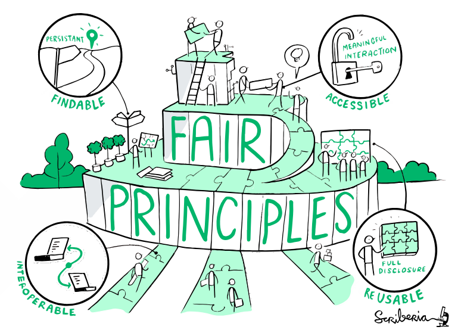
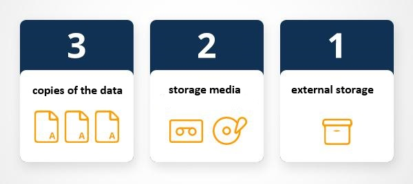
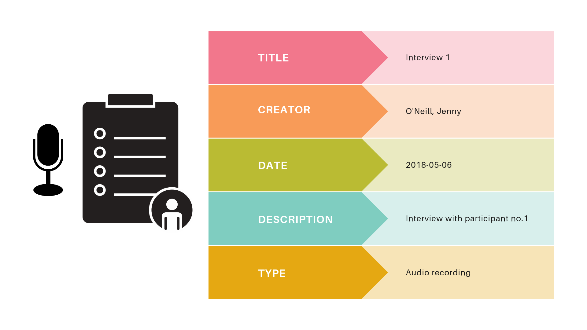

# COLLECT: Creare e Raccogliere

## Lezione 05 del corso di _Digital Humanities e Data Management per i Beni Culturali_ (2024/2025)

###### Sebastian Barzaghi | [sebastian.barzaghi2@unibo.it](mailto:sebastian.barzaghi2@unibo.it) | [https://orcid.org/0000-0002-0799-1527](https://orcid.org/0000-0002-0799-1527) | [https://www.unibo.it/sitoweb/sebastian.barzaghi2/](https://www.unibo.it/sitoweb/sebastian.barzaghi2/)

---

### Produzione, raccolta e analisi

  

    <figure>
      
      <figcaption>
        Fonte: Gualandi, B., Caldoni, G., & Marino, M. (2022). Research Data Management: Data Lifecycle. Zenodo. <a href="https://doi.org/10.5281/zenodo.7249051">https://doi.org/10.5281/zenodo.7249051</a>.
      </figcaption>
    </figure>
  

  

      

        Azioni principali: <strong>raccogliere o creare i dati</strong>, elaborare i dati per renderli utilizzabili (pulizia, combinazione, trasformazione, controllo qualità), analizzare i dati per generare risultati utili, produrre la documentazione dei dati e delle metodologie utilizzate.
      

  

---



## All is FAIR in Love and War

<!--
Photo by <a href="https://unsplash.com/@regele?utm_content=creditCopyText&utm_medium=referral&utm_source=unsplash">HUDSON | @regele</a> on <a href="https://unsplash.com/photos/a-bird-flying-in-the-sky-TtSr9mdoBxQ?utm_content=creditCopyText&utm_medium=referral&utm_source=unsplash">Unsplash</a>
-->

---

### Principi a supporto della riproducibilità

    

      
      <figcaption>
          Fonti: The Turing Way Community, & Scriberia. (2024). Illustrations from The Turing Way: Shared under CC-BY 4.0 for reuse. Zenodo. <a href="https://doi.org/10.5281/zenodo.13882307">https://doi.org/10.5281/zenodo.13882307</a>.
      </figcaption>
    

    

        
Nel 2016 sono stati pubblicati i Principi FAIR per la gestione e la stewardship dei dati scientifici, volti a migliorare una serie di caratteristiche fondamentali per la gestione scientifica delle risorse digitali.

    

Wilkinson, M., Dumontier, M., Aalbersberg, I. et al. The FAIR Guiding Principles for scientific data management and stewardship. Sci Data 3, 160018 (2016). <a href="https://doi.org/10.1038/sdata.2016.18">https://doi.org/10.1038/sdata.2016.18</a>.

 

---

### I principi enfatizzano l'importanza della _machine-actionability_

La capacità dei sistemi computazionali di trovare, accedere, interagire e riutilizzare i dati con un intervento umano minimo o nullo.

È importante perché gli esseri umani si affidano sempre più a strumenti computazionali per gestire i dati a causa dell'aumento del loro volume, complessità e velocità di creazione.

Wilkinson, M., Dumontier, M., Aalbersberg, I. et al. The FAIR Guiding Principles for scientific data management and stewardship. Sci Data 3, 160018 (2016). <a href="https://doi.org/10.1038/sdata.2016.18">https://doi.org/10.1038/sdata.2016.18</a>.

 

---

### Findability

Il primo passo per (ri)utilizzare i dati è trovarli!

Per essere reperibile, i dati dovrebbero essere identificati in maniera univoca e persistente.

I dati sono reperibili tramite i metadati e identificabili e localizzabili tramite un meccanismo di identificazione standard.

Rocca-Serra, P., Sansone, S.-A., Gu, W., Welter, D., Abbassi Daloii, T., & Portell-Silva, L. (2022). D2.1 FAIR Cookbook. Zenodo. <a href="https://doi.org/10.5281/zenodo.6783564">https://doi.org/10.5281/zenodo.6783564</a>.

---

### Altre note sulla Findability

Gli identificatori persistenti (PID) sono importanti perché identificano in modo univoco e persistente i dati e ne facilitano la citazione. 

Un esempio di PID è un Digital Object Identifier (DOI). Quando depositi i dati in un archivio, assicurati di selezionare un archivio che assegni un identificatore persistente (ad esempio Zenodo).

I metadati che descrivono i dati ne supportano la reperibilità, la citazione e il riutilizzo, poiché forniscono un contesto importante per la loro interpretazione e rendono più facile per le macchine eseguire analisi automatizzate. 

Segui schemi di metadati standard, generali come Dublin Core, o specifici per disciplina.

Rocca-Serra, P., Sansone, S.-A., Gu, W., Welter, D., Abbassi Daloii, T., & Portell-Silva, L. (2022). D2.1 FAIR Cookbook. Zenodo. <a href="https://doi.org/10.5281/zenodo.6783564">https://doi.org/10.5281/zenodo.6783564</a>.

---

### Accessibility

Se il primo passo per (ri)utilizzare i dati è trovarli, il secondo è sapere come e a quali condizioni possono essere accessibili.

I dati sono accessibili quando possono essere sempre recuperati online sia dalle macchine che dagli esseri umani:
- Dietro appropriata autorizzazione (se necessaria);
- Tramite un protocollo (un insieme di procedure e convenzioni che regolano la trasmissione dei dati, stabilendo il formato, il processo di comunicazione e le regole di accesso) ben definito (es. HTTPS, RESTful API, ecc.).

Se i dati non sono aperti, lo devono essere almeno i metadati che li descrivono.

Rocca-Serra, P., Sansone, S.-A., Gu, W., Welter, D., Abbassi Daloii, T., & Portell-Silva, L. (2022). D2.1 FAIR Cookbook. Zenodo. <a href="https://doi.org/10.5281/zenodo.6783564">https://doi.org/10.5281/zenodo.6783564</a>.

---

### Altre note sull'Accessibility

Non tutti i dati devono essere resi aperti per essere FAIR! Se l'accesso è consentito, i dati devono essere recuperabili senza la necessità di protocolli specializzati.

Inoltre, anche se il contenuto completo non è reso completamente disponibile, i dati devono essere il più possibile reperibili, in un luogo sicuro a lungo termine. 

Dovresti cercare un archivio (generico o specializzato) che faccia quanto segue:
- Conserva i dati in modo sicuro;
- Assicura che i dati siano reperibili;
- Descrive i dati in modo appropriato (metadati);
- Aggiunge informazioni sulla licenza.

Rocca-Serra, P., Sansone, S.-A., Gu, W., Welter, D., Abbassi Daloii, T., & Portell-Silva, L. (2022). D2.1 FAIR Cookbook. Zenodo. <a href="https://doi.org/10.5281/zenodo.6783564">https://doi.org/10.5281/zenodo.6783564</a>.

---

### Interoperability

I dati di solito devono essere integrati con altri dati e devono essere interoperabili con applicazioni o flussi di lavoro per favorirne l'analisi, l'archiviazione e l'elaborazione.

I dati possono essere interoperabili solo se:
- I (meta)dati sono azionabili dalle macchine;
- I formati dei (meta)dati utilizzano vocabolari condivisi e/o ontologie;

I (meta)dati devono quindi essere sintatticamente analizzabili e semanticamente comprensibili dalle macchine.

Rocca-Serra, P., Sansone, S.-A., Gu, W., Welter, D., Abbassi Daloii, T., & Portell-Silva, L. (2022). D2.1 FAIR Cookbook. Zenodo. <a href="https://doi.org/10.5281/zenodo.6783564">https://doi.org/10.5281/zenodo.6783564</a>.

---

### Reusability

Ottimizzare il riutilizzo dei dati è l'obiettivo finale, e - per raggiungerlo - i metadati e i dati dovrebbero essere ben descritti in modo che possano essere utilizzati, replicati e combinati in contesti differenti.

Affinché i dati siano riutilizzabili, devono:
- Essere conformi ai principi di trovabilità, accessibilità e interoperabilità;
- Essere sufficientemente descritti da poter essere (semi-)automaticamente collegati o integrati con fonti di dati rilevanti;
- Essere sufficientemente documentati da poter essere compresi;
- Avere licenze il meno restrittive possibile;
- Fare riferimento alle loro fonti con metadati di provenienza abbastanza ricchi da permetterne una corretta citazione.

Rocca-Serra, P., Sansone, S.-A., Gu, W., Welter, D., Abbassi Daloii, T., & Portell-Silva, L. (2022). D2.1 FAIR Cookbook. Zenodo. <a href="https://doi.org/10.5281/zenodo.6783564">https://doi.org/10.5281/zenodo.6783564</a>.

---

### La documentazione dei dati è essenziale per rendere i tuoi dati FAIR

La documentazione dei dati dovrebbe fornire informazioni chiare su:
- Dove e come trovare i dati (directory, cartella, archiviazione, ecc.) (`metadati`, `identificatori`);
- Come accedere ai dati (registrazione, autenticazione, ecc.) (`repository`, `condizioni d'accesso`);
- Modelli e software per gestire i dati (`formati`, `ontologie`);
- Chi può riutilizzare i dati e come (`licenze`, `documentazione`).

Wilkinson, M., Dumontier, M., Aalbersberg, I. et al. The FAIR Guiding Principles for scientific data management and stewardship. Sci Data 3, 160018 (2016). <a href="https://doi.org/10.1038/sdata.2016.18">https://doi.org/10.1038/sdata.2016.18</a>.

 

---



## A caccia di dati

<!--
Photo by <a href="https://unsplash.com/@adamnir?utm_content=creditCopyText&utm_medium=referral&utm_source=unsplash">Adam Nir</a> on <a href="https://unsplash.com/photos/a-bird-is-perched-on-a-tree-branch-QQka89whA-M?utm_content=creditCopyText&utm_medium=referral&utm_source=unsplash">Unsplash</a>
-->

---

### La fase di raccolta

Il processo in cui vengono raccolti o creati i dati. 

Pone anche le basi per la qualità sia dei dati che della loro documentazione. 

È importante registrare le decisioni prese riguardo:
- Quali dati raccoglierai o creerai?
- Che tipo, formato e volume di dati?
- Ci sono dati esistenti?
- Come saranno raccolti o creati i dati?
- Quali standard e metodologie utilizzerai?
- Come strutturerai e nominerai le tue cartelle e file?

Australian Research Data Commons (ARDC). (2020). ARDC Metadata Guide. Zenodo. <a href="https://doi.org/10.5281/zenodo.6459832">https://doi.org/10.5281/zenodo.6459832</a>.

---

### Creare documentazione di progetto: README e DMP

- Non strutturati, leggibili dagli esseri umani;
- Salvati in formato aperto: testo semplice (`.txt`) o Markdown (`.md`);
- Software: editor di testo, Microsoft Word;
- **README**: uno per cartella;  
    **DMP**: uno per progetto;
- **README**: il suo contenuto dipende dalla cartella in cui si trova;  
    **DMP**: struttura abbastanza standard; i contenuti dipendono dal progetto.

Rocca-Serra, P., Sansone, S.-A., Gu, W., Welter, D., Abbassi Daloii, T., & Portell-Silva, L. (2022). D2.1 FAIR Cookbook. Zenodo. <a href="https://doi.org/10.5281/zenodo.6783564">https://doi.org/10.5281/zenodo.6783564</a>.

---

### Organizzare le risorse di progetto

Stabilisci la struttura delle cartelle:
- Raggruppa i file con proprietà comuni in cartelle;
- Usa nomi di cartelle significativi e chiari;
- Mantieni un numero gestibile di sottocartelle;
- Struttura le cartelle in modo gerarchico;
- Separa il lavoro corrente da quello completato;
- Conserva i dati grezzi separatamente da quelli elaborati.

Documenta i dettagli nei vari README e/o nel DMP. 

Esempi: <https://dmeg.cessda.eu/Data-Management-Expert-Guide/2.-Organise-Document/File-naming-and-folder-structure>, <https://libguides.graduateinstitute.ch/rdm/folders>, <https://datamanagement.hms.harvard.edu/plan-design/directory-structure>.

Schweinberger, Martin. 2022. Data Management, Version Control, and Reproducibility. Brisbane: The University of Queensland. url: <a href="https://slcladal.github.io/repro.html">https://slcladal.github.io/repro.html</a> (Version 2022.10.10).

---

### Organizzare le risorse di progetto

Stabilisci il sistema di nomenclatura dei file:
- Mantieni nomi brevi ma significativi (se usi abbreviazioni, tienine traccia);
- Includi date in un formato standard (es. `YYYY-MM-DD`);
- Evita spazi, punti e caratteri speciali (es. `/`, `\`, `:`, `*`, `?`, `"`, `<`, `>`, `|`);
- Includi informazioni rilevanti nei nomi dei file, come l’identificativo e il numero di versione.

Documenta i dettagli nei vari README e/o nel DMP.

> [ProjectName]\_[DocumentType]\_[Date]\_[Version].[Extension]
>
> ClimateStudy_Report_20240522_v1.0.docx

Schweinberger, Martin. 2022. Data Management, Version Control, and Reproducibility. Brisbane: The University of Queensland. url: <a href="https://slcladal.github.io/repro.html">https://slcladal.github.io/repro.html</a> (Version 2022.10.10).

---

### Segui la regola del 3-2-1

    

      
      <figcaption>
        Fonte: Schweinberger, Martin. 2022. Data Management, Version Control, and Reproducibility. Brisbane: The University of Queensland. url: <a href="https://slcladal.github.io/repro.html">https://slcladal.github.io/repro.html</a> (Version 2022.10.10).
      </figcaption>
    

    

        
Conserva almeno tre (3) copie dei tuoi dati, archiviando le copie di backup su due (2) supporti di archiviazione differenti (es. computer, chiavetta, ecc.), con una (1) di esse situata su un servizio esterno (es. OneDrive, GitHub, ecc.).

    

Schweinberger, Martin. 2022. Data Management, Version Control, and Reproducibility. Brisbane: The University of Queensland. url: <a href="https://slcladal.github.io/repro.html">https://slcladal.github.io/repro.html</a> (Version 2022.10.10).

---

### Altre informazioni da registrare durante la raccolta dei dati

- Metodi utilizzati per la raccolta;
- Data di raccolta;
- Posizione geografica (se appropriato);
- Condizioni sperimentali e ambientali (se appropriate);
- Standard e calibrazione (se applicabile);
- Incertezze, precisione e accuratezza delle misurazioni (se appropriate);
- Problemi noti (campionamento, valori nulli, ecc.);
- Dati di _provenance_ (es. fonti);
- Questioni di protezione e sicurezza dei dati (se applicabile);
- Schemi di metadati e vocabolari controllati appropriati;
- Strategie di archiviazione a lungo termine.

Rocca-Serra, P., Sansone, S.-A., Gu, W., Welter, D., Abbassi Daloii, T., & Portell-Silva, L. (2022). D2.1 FAIR Cookbook. Zenodo. <a href="https://doi.org/10.5281/zenodo.6783564">https://doi.org/10.5281/zenodo.6783564</a>.

---

### Documentazione dei dati: Codebook

- Solitamente una tabella;
- Leggibile dagli esseri umani e/o dalle macchine;
- Salvato in formato aperto: valori separati da virgola (`.csv`);
- Software: editor di testo, programmi di fogli di calcolo, OpenRefine, Excel;
- Uno per dataset.

Contiene definizioni dei simboli, abbreviazioni, variabili, intestazioni delle colonne, unità di misura, e formati dei dati, e documenta altri aspetti metodologici, come il trattamento dei dati mancanti.

Esempio: <https://www.nycja.org/assets/Example-Court-Notification-Codebook.pdf>

Rocca-Serra, P., Sansone, S.-A., Gu, W., Welter, D., Abbassi Daloii, T., & Portell-Silva, L. (2022). D2.1 FAIR Cookbook. Zenodo. <a href="https://doi.org/10.5281/zenodo.6783564">https://doi.org/10.5281/zenodo.6783564</a>.

---

### Documentazione dei dati: Metadati

Leggendo i principi FAIR, si capisce quanto sia fondamentale la disponibilità di metadati leggibili dalle macchine.

Sono le informazioni contestuali che descrivono i dati, di solito più strutturate del resto della documentazione, in quanto conformi a standard stabiliti e strutturati.

Rocca-Serra, P., Sansone, S.-A., Gu, W., Welter, D., Abbassi Daloii, T., & Portell-Silva, L. (2022). D2.1 FAIR Cookbook. Zenodo. <a href="https://doi.org/10.5281/zenodo.6783564">https://doi.org/10.5281/zenodo.6783564</a>.

---

### Gli schemi di metadati forniscono specifiche

Strutture concettuali che specificano quali metadati (chiamati _elementi_) utilizzare e secondo quali regole. 

In particolare, specificano:
- L'insieme di elementi;
- La definizione di elementi;
- Le relazioni tra elementi;
- Le regole di utilizzo degli elementi.

Australian Research Data Commons (ARDC). (2020). ARDC Metadata Guide. Zenodo. <a href="https://doi.org/10.5281/zenodo.6459832">https://doi.org/10.5281/zenodo.6459832</a>.

---

### Bisogna usare gli schemi giusti

È buona pratica utilizzare schemi di metadati standard internazionali per organizzare e descrivere i dati in modo strutturato.

Liste utili:
- [FAIRsharing](https://fairsharing.org/);
- [Directory su DCC](https://www.dcc.ac.uk/guidance/standards/metadata);
- [Directory su RDA](https://rd-alliance.github.io/metadata-directory/standards/).

Rocca-Serra, P., Sansone, S.-A., Gu, W., Welter, D., Abbassi Daloii, T., & Portell-Silva, L. (2022). D2.1 FAIR Cookbook. Zenodo. <a href="https://doi.org/10.5281/zenodo.6783564">https://doi.org/10.5281/zenodo.6783564</a>.

---

### Esempio: Dublin Core

Dublin Core è composto da 15 elementi “core”. È uno degli schemi di metadati più semplici e più utilizzati, pensato per descrivere risorse Web ma applicabile anche a risorse fisiche.

Nel standard sono incluse definizioni di ciascun elemento, che stabiliscono quali tipi di informazioni devono essere registrati, dove e come. 

Documentazione ufficiale: <https://www.dublincore.org/specifications/dublin-core/dcmi-terms/>

Rocca-Serra, P., Sansone, S.-A., Gu, W., Welter, D., Abbassi Daloii, T., & Portell-Silva, L. (2022). D2.1 FAIR Cookbook. Zenodo. <a href="https://doi.org/10.5281/zenodo.6783564">https://doi.org/10.5281/zenodo.6783564</a>.

---

### Esempio: Dublin Core

---

### I metadati si appoggiano anche sugli _schemi di codifica_

Gli schemi di codifica sono insiemi di regole che specificano la sintassi e il lessico utilizzati nei metadati, garantendo coerenza e interoperabilità nell'inserimento e nell'interpretazione dei dati.

- **Schema di codifica sintattica**: definisce come rappresentare uno specifico tipo di dati a partire dal formato (es. [ISO 8601](https://www.iso.org/iso-8601-date-and-time-format.html) per le date, come `2024-11-24`);
- **Authority file**: definisce come rappresentare le varianti di un valore stabilito come autoritativo (es. [VIAF](https://viaf.org/) per i nomi di persona e delle organizzazioni);
- **Vocabolario controllato**: definisce come rappresentare uno specifico tipo di dati a partire da un insieme finito e controllato di opzioni (es. [Art & Architecture Thesaurus](https://www.getty.edu/research/tools/vocabularies/aat/) per termini appartenenti ai domini dell'arte e dell'architettura).

Rocca-Serra, P., Sansone, S.-A., Gu, W., Welter, D., Abbassi Daloii, T., & Portell-Silva, L. (2022). D2.1 FAIR Cookbook. Zenodo. <a href="https://doi.org/10.5281/zenodo.6783564">https://doi.org/10.5281/zenodo.6783564</a>.

---

### Schemi di codifica sintattica

Stabiliscono come formattare i dati in un modo standardizzato e coerente, in modo da favorire la ocerenza dei dati, garantire la loro interoperabilità, e facilitarne il trattamento automatico.

Esempio: [ISO 8601](https://www.iso.org/iso-8601-date-and-time-format.html) per una rappresentazione standardizzata di date, orari e combinazioni di data e ora.
* `2024-11-24`;
* `14:30:00`;
* `2024-11-24T14:30:00`.

---

### Authority file

Elenchi strutturati di termini o entità che vengono utilizzati come riferimenti autoritativi per garantire l'accuratezza e la coerenza nelle informazioni.

Vengono utilizzati per evitare ambiguità e variazioni nei dati, specialmente quando ci sono diverse rappresentazioni per lo stesso concetto.

Esempio: [VIAF](https://viaf.org/) per controllare la rappresentazione dei nomi di persona, organizzazione, luogo, o opera.
* `Leopardi, Giacomo, 1798-1837` (http://viaf.org/viaf/12311353);
* `Buonarroti, Michelangelo, 1475-1564` (http://viaf.org/viaf/24585191).

---

### Vocabolari controllati

Lista strutturata e normativa di termini, organizzati in un esplicito sistema di relazioni.

Metodo per la descrizione coerente dei dati e per controllare i possibili valori applicabili ad un elemento.

Lista esemplare di vocabolari controllati: <https://bartoc.org/>

Rocca-Serra, P., Sansone, S.-A., Gu, W., Welter, D., Abbassi Daloii, T., & Portell-Silva, L. (2022). D2.1 FAIR Cookbook. Zenodo. <a href="https://doi.org/10.5281/zenodo.6783564">https://doi.org/10.5281/zenodo.6783564</a>.

---

### Metadati e schemi si basano sempre di più su ontologie

Affinché i metodi e gli strumenti computazionali funzionino e i dati possano avere un utilizzo più generalizzato, è necessario che ci siano accordi, contratti sociali e protocolli condivisi che ne consentano l'interoperabilità (e quindi il riuso).

Poiché trattiamo di principi FAIR, inevitabilmente dobbiamo affrontare le nozioni di Linked (Open) Data e Resource Description Framework (RDF). 

Questo significa essenzialmente che non possiamo parlare di metadati azionabili dalle macchine senza parlare di modelli semantici e ontologie (ma sarà per la prossima volta).

Rocca-Serra, P., Sansone, S.-A., Gu, W., Welter, D., Abbassi Daloii, T., & Portell-Silva, L. (2022). D2.1 FAIR Cookbook. Zenodo. <a href="https://doi.org/10.5281/zenodo.6783564">https://doi.org/10.5281/zenodo.6783564</a>.

---

# Fine

## Lezione 05 del corso di _Digital Humanities e Data Management per i Beni Culturali_ (2024/2025)

###### Sebastian Barzaghi | [sebastian.barzaghi2@unibo.it](mailto:sebastian.barzaghi2@unibo.it) | [https://orcid.org/0000-0002-0799-1527](https://orcid.org/0000-0002-0799-1527) | [https://www.unibo.it/sitoweb/sebastian.barzaghi2/](https://www.unibo.it/sitoweb/sebastian.barzaghi2/)