# L'oggetto bibliografia

## Lezione 06 del corso di _Digital Humanities e Data Management per i Beni Culturali_ (2024/2025)

###### Sebastian Barzaghi | [sebastian.barzaghi2@unibo.it](mailto:sebastian.barzaghi2@unibo.it) | [https://orcid.org/0000-0002-0799-1527](https://orcid.org/0000-0002-0799-1527) | [https://www.unibo.it/sitoweb/sebastian.barzaghi2/](https://www.unibo.it/sitoweb/sebastian.barzaghi2/)

---

## Zotero

---

### Alcune attività fondamentali di ricerca

- Raccogliere letteratura scientifica;
- Costruire bibliografie;
- Citare risorse bibliografiche.

---

### Un flusso di lavoro classico...

---

### Un flusso di lavoro classico...

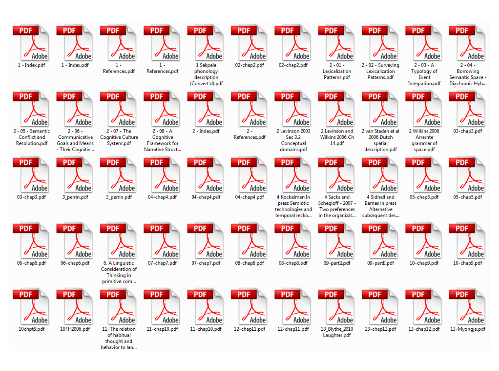

---

### Un flusso di lavoro classico...

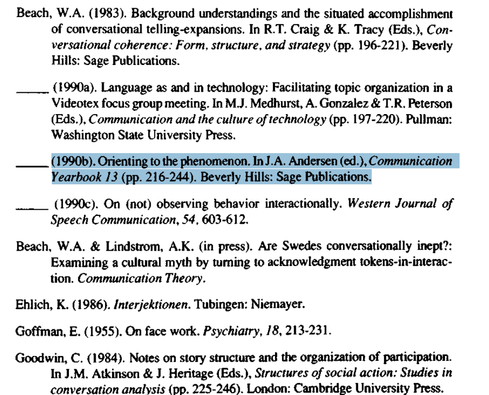

---

### ... Con i soliti problemi

- Un sacco di PDF con nomi di file incomprensibili;
- Nessun collegamento tra metadati, file, note;
- Quando si cita, la migliore opzione è copiare e incollare;
- Difficile condividere articoli con metadati;
- Riformattazione a mano delle citazioni;
- Collaborazione difficile.

---

### Usiamo Zotero

Link: <https://www.zotero.org/>

Zotero è un servizio e un software gratuito e open-source per la gestione dei riferimenti bibliografici e dei metadati. 

Consente di raccogliere, organizzare, citare e condividere fonti bibliografiche in modo semplice e veloce.

In particolare, serve per:
- **Raccolta dei dati**: consente di raccogliere automaticamente metadati da articoli, libri, siti web e altre risorse online;
- **Organizzazione**: permette di organizzare i riferimenti in collezioni, aggiungere tag, note e allegare file PDF;
- **Citazioni e riferimenti**: genera citazioni in vari stili (APA, MLA, Chicago, ecc.) e crea bibliografie in modo automatico;
- **Condivisione**: facilita la collaborazione, permettendo di condividere raccolte di riferimenti con altri ricercatori.

---

### 1. Home page di Zotero.org

---

### 2. Login 

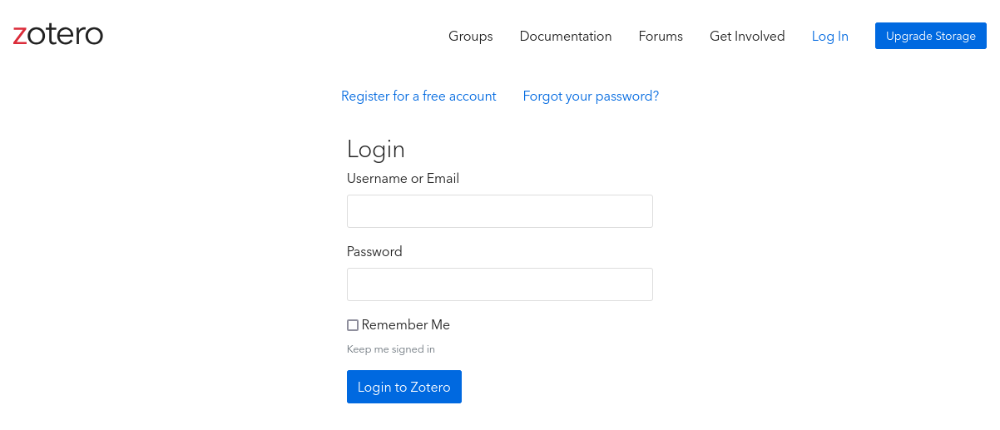

---

### 3. Registrazione

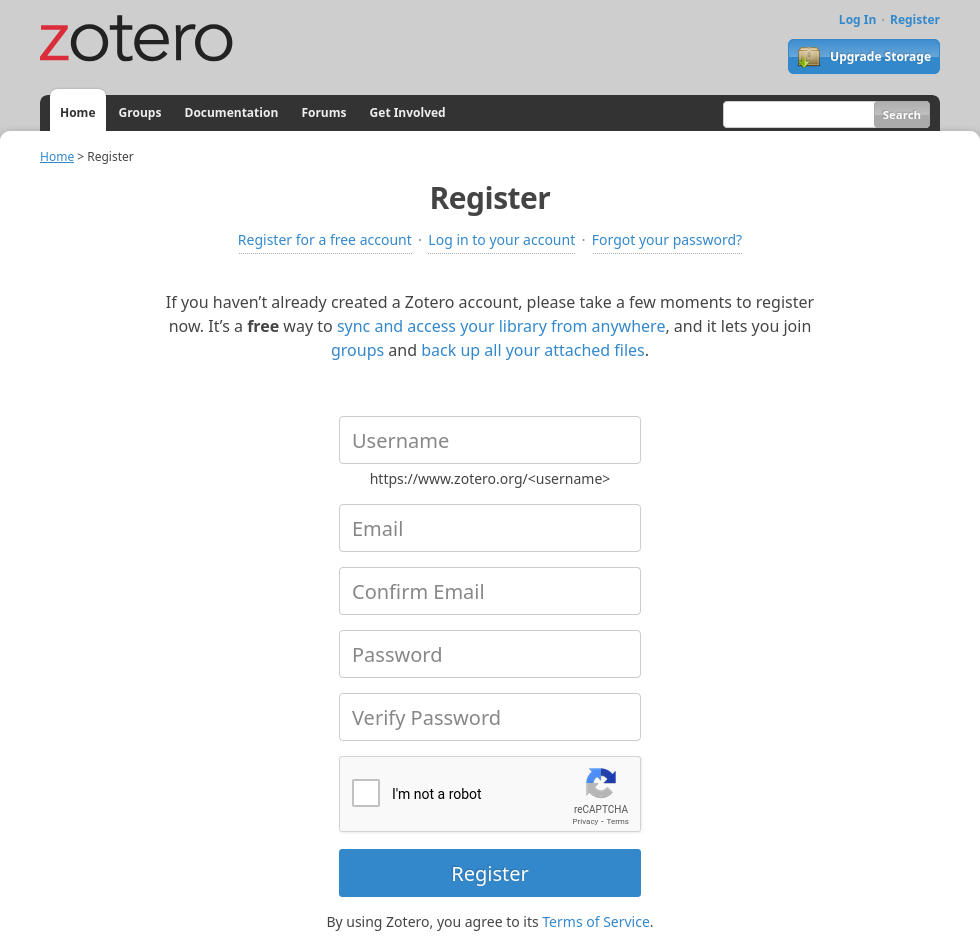

---

### 4. Interfaccia principale

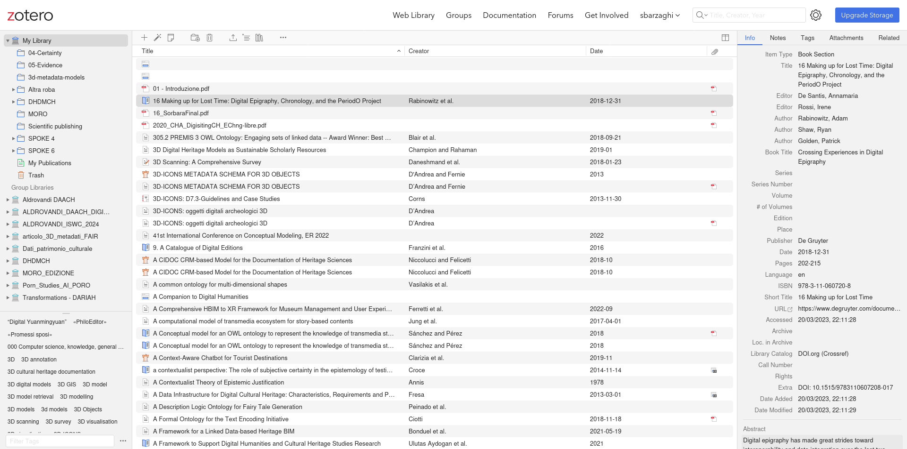

---

### 5. Aggiunta di un nuovo item alla collezione

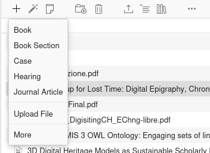

---

### 6. Colonna dei metadati bibliografici

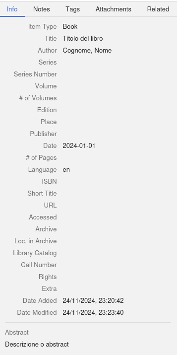

---

### 7. Selezione di item e export

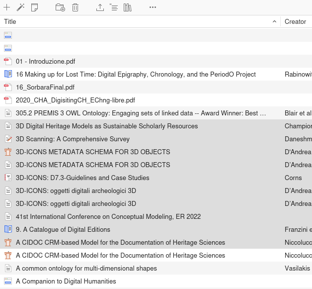

---

### 8. Produzione di citazioni inline

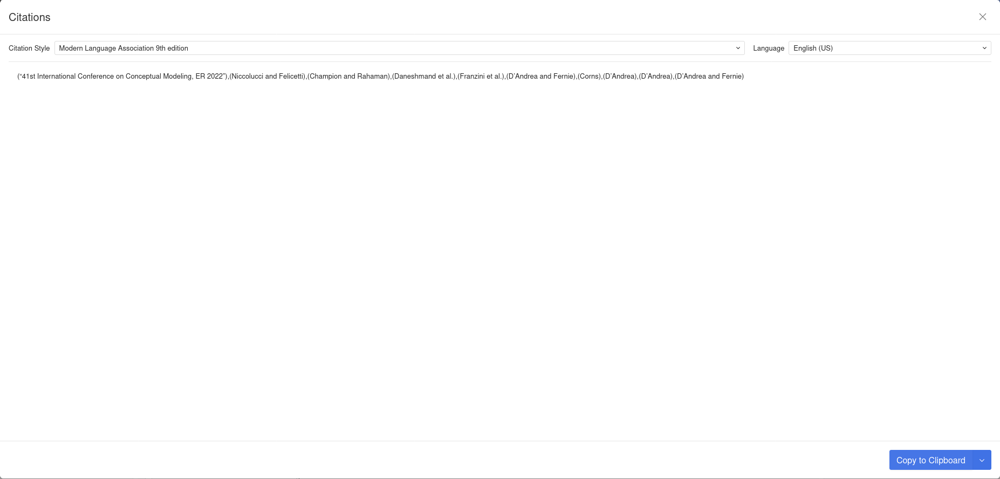

---

### 9. Produzionme di riferimenti bibliografici

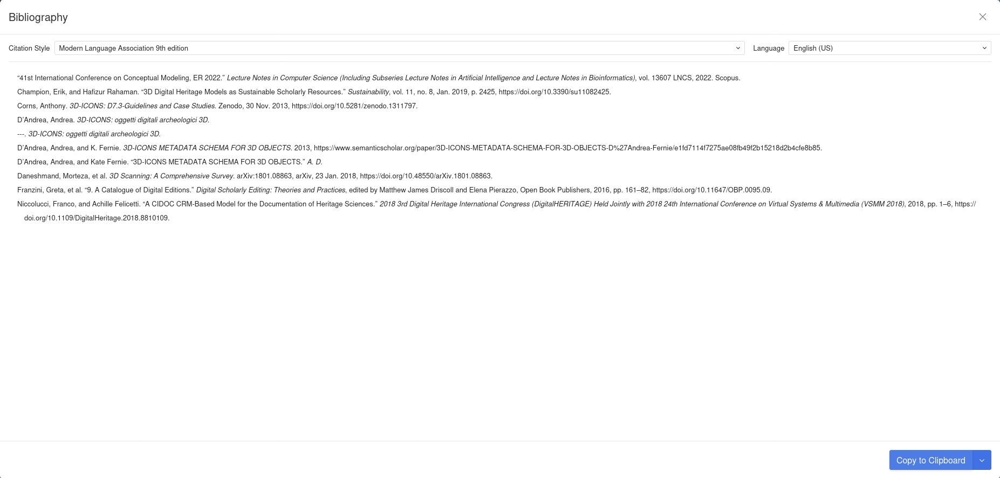

---

## Attività pratica

---

### Scopriamo qualche dato di Mythologiae

Il dataset di Mythologiae è costituito da ~4389 righe e 31 colonne: 
* Ogni riga corrisponde ad un'opera d'arte;
* Ogni colonna orrisponde ad un metadato riferito all'opera d'arte (es. autore, tema mitologico, data di creazione, ecc.);

Tra le colonne, c'è anche `cho_sources_classic`, che indica le fonti classiche associate al tema mitologico individuato nell'opera.

---

### Oggi lavoriamo solo su un piccolo sottoinsieme di dati: le citazioni canoniche

Le citazioni canoniche sono un sistema di riferimento utilizzato principalmente nella letteratura classica, per citare testi antichi in modo breve e standardizzato. Esse indicano il titolo dell’opera, seguita dal libro e dalla sezione specifica.

- Opera: nome del testo (ad esempio, Apollodoro, Odissea, Erodoto);
- Libro: il numero del libro o della parte dell'opera;
- Sezione: il numero della sezione, capitolo o verso specifico.

Esempi:
- `Apollod. 3.5.8`, che equivale a "Apollodoro, _Biblioteca_, libro 3, capitolo 5, sezione 8";
- `Hom. Od. 11.273`, che equivale a "Omero, _Odissea_, libro 11, verso 273";
- `Hdt. 2.175`, che equivale a "Erodoto, _Storie_, libro 2, paragrafo 175".

---

### Cosa farete

- Esaminerete il dataset disponibile qui: <https://docs.google.com/spreadsheets/d/1GBWW2AMO8HjXhyNB59CuC_aAx3X2aFl1uES5eHGLqos/edit?usp=sharing>
    - Una sola colonna, contenente una serie di citazioni canoniche;
- Cercherete su Perseus i dati contestuali della citazione (ove possibile), come l'editore, il luogo di pubblicazione, ecc.;
- Vi consiglio di fare ricerche su Google usando _anche_ la stringa di testo che trovate su Perseus;
- Nella collezione `DHDMCH_2024-2025` condivisa su Zenodo, inserirete i dati bibliografici estratti dalla citazione e da Perseus.

---

- La tipologia dell'opera sarà `Book section`;
- Per ora limitiamoci a inserire informazioni legate a tipo, titolo, autore, traduttore, titolo dell'opera, luogo di pubblicazione, publisher, data di pubblicazione, e info extra (che conterrà la citazione canonica originale).
- Le informazioni le scoprite curiosando sul Web; cercatele bene, ma se non le trovate, non inserite nulla!
- Nel frattempo, ragionate su quello che state facendo: quali operazioni state effettuando? quali fonti state usando? quale software? in quale modalità? quali informazioni state raccogliendo?

---

Esempio:
- es. `Hom. Od. 1` è un `Book section` con
  - `Title`: Book 1
  - `Author` (> Switch to Single Field): Homer
  - `Translator`: Murray, Augustus Taber
  - `Book Title`: The Odyssey
  - `Place`: London
  - `Publisher`: William Heinemann, Ltd.
  - `Date`: 1919
  - `Extra`: Hom. Od. 1

---

Esempio:
- `Hom. Od. 22.75-199` è un `Book section` con
  - `Title`: Book 22, lines 75-199
  - `Author` (> Switch to Single Field): Homer
  - `Translator`: Murray, Augustus Taber
  - `Book Title`: The Odyssey
  - `Place`: London
  - `Publisher`: William Heinemann, Ltd.
  - `Date`: 1919
  - `Extra`: Hom. Od. 22.75-199

---

Altro esempio:
- `Apollod. 3.5.8` è un `Book section` con
  - `Title`: Book 3, chapter 5, section 8
  - `Author`: Apollodorus
  - `Translator`: Frazer, James George
  - `Book Title`: The Library
  - `Place`: London
  - `Publisher`: William Heinemann, Ltd.
  - `Date`: 1921
  - `Extra`: Apollod. 3.5.8

---

## Altri lati di Zotero (che vi consiglio di esplorare)

---

### Zoterobib

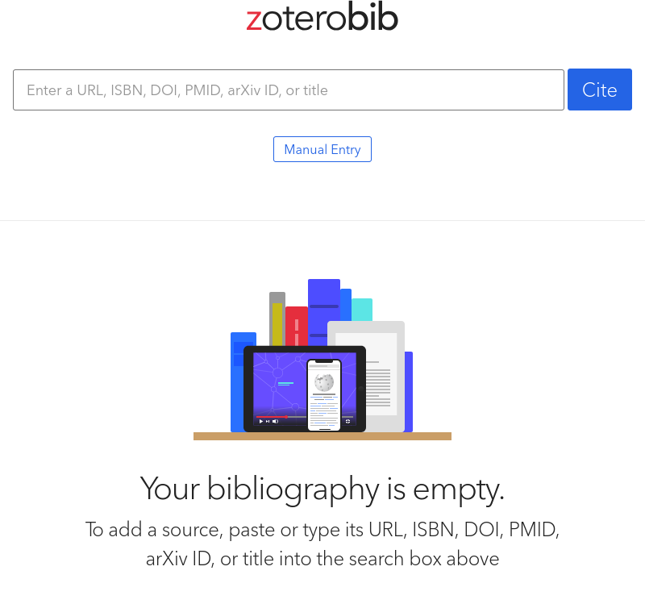

---

### Zoterobib

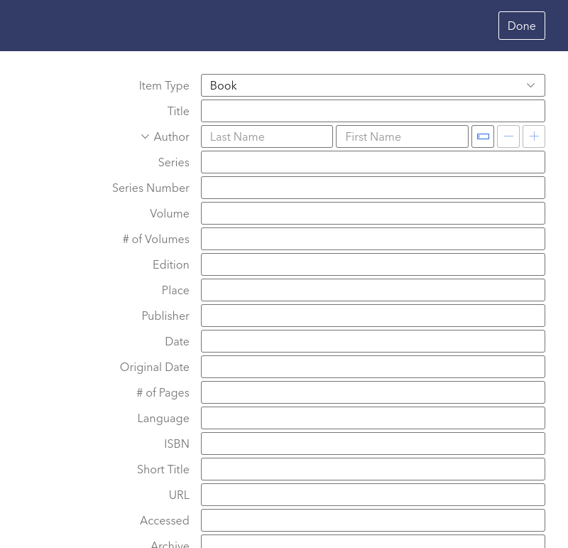

---

### Zotero (software) e Zotero Connector (plugin per browser)

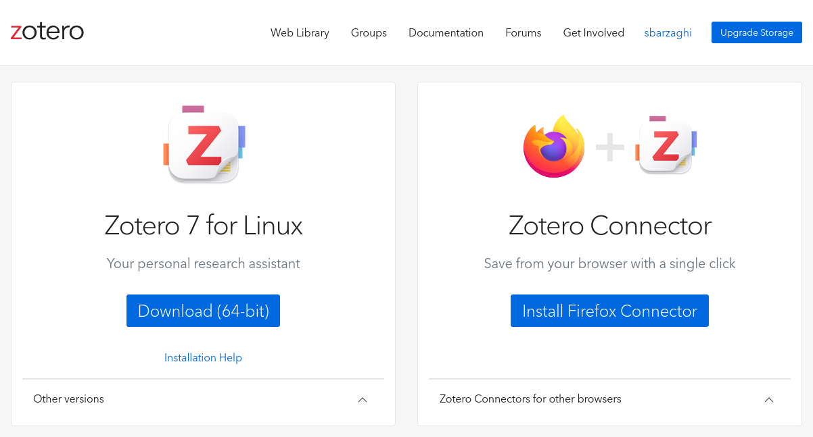

---

# Fine

## Lezione 06 del corso di _Digital Humanities e Data Management per i Beni Culturali_ (2024/2025)

###### Sebastian Barzaghi | [sebastian.barzaghi2@unibo.it](mailto:sebastian.barzaghi2@unibo.it) | [https://orcid.org/0000-0002-0799-1527](https://orcid.org/0000-0002-0799-1527) | [https://www.unibo.it/sitoweb/sebastian.barzaghi2/](https://www.unibo.it/sitoweb/sebastian.barzaghi2/)
