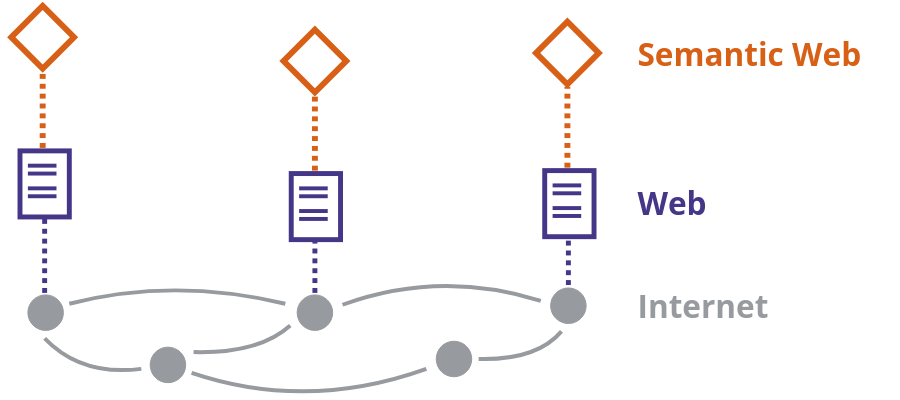

# COLLECT: Descrivere

## Lezione 07 del corso di _Digital Humanities e Data Management per i Beni Culturali_ (2024/2025)

###### Sebastian Barzaghi | [sebastian.barzaghi2@unibo.it](mailto:sebastian.barzaghi2@unibo.it) | [https://orcid.org/0000-0002-0799-1527](https://orcid.org/0000-0002-0799-1527) | [https://www.unibo.it/sitoweb/sebastian.barzaghi2/](https://www.unibo.it/sitoweb/sebastian.barzaghi2/)

---

### Produzione, raccolta e analisi

<div style="display: flex; align-items: center;">
  <div style="flex: 1;">
    <figure>
      
      <figcaption>
        Fonte: Gualandi, B., Caldoni, G., & Marino, M. (2022). Research Data Management: Data Lifecycle. Zenodo. <a href="https://doi.org/10.5281/zenodo.7249051">https://doi.org/10.5281/zenodo.7249051</a>.
      </figcaption>
    </figure>
  </div>
  <div style="flex: 1;">
      <p>
        Azioni principali: raccogliere o creare i dati, elaborare i dati per renderli utilizzabili (pulizia, combinazione, trasformazione, controllo qualità), analizzare i dati per generare risultati utili, produrre la documentazione dei dati e delle metodologie utilizzate.
      </p>
  </div>
</div>

---



## Non possediamo nient'altro che metafore

<!--
Photo by <a href="https://unsplash.com/@spaceboy?utm_content=creditCopyText&utm_medium=referral&utm_source=unsplash">Henrik Dønnestad</a> on <a href="https://unsplash.com/photos/abstract-painting-t2Sai-AqIpI?utm_content=creditCopyText&utm_medium=referral&utm_source=unsplash">Unsplash</a>
-->

---

### Un modello è un'astrazione

<div style="display: flex; align-items: center;">
  <div style="flex: 2;">
    <figure>
    
      <figcaption>
          Fonte: Kučerová, H. (2018). The concept of model and conceptual model in information science. <a href="https://knihovnarevue-en.nkp.cz/archives/2018-2/reviewed-articles/the-concept-of-model-and-conceptual-model-in-information-science ">https://knihovnarevue-en.nkp.cz/archives/2018-2/reviewed-articles/the-concept-of-model-and-conceptual-model-in-information-science</a>.
      </figcaption>
    </figure>
  </div>
  <div style="flex: 1;">
      <p>
        Una rappresentazione semplificata di qualcosa (un sistema, oggetto, fenomeno, ecc.).
      </p>
      <p>
        Ne cattura le caratteristiche fondamentali, permettendo di descrivere, comprendere, analizzare, predire o interagire con quella cosa.
      </p>
      <p>
        Es. una mappa, un'equazione, uno schema di metadati...
      </p>
  </div>
</div>

<div class="footer">
Kučerová, H. (2018). The concept of model and conceptual model in information science. <a href="https://knihovnarevue-en.nkp.cz/archives/2018-2/reviewed-articles/the-concept-of-model-and-conceptual-model-in-information-science">https://knihovnarevue-en.nkp.cz/archives/2018-2/reviewed-articles/the-concept-of-model-and-conceptual-model-in-information-science</a>.
</div>

---

### Cos'è la modellazione dei dati?

<div style="display: flex; align-items: center;">
  <div style="flex: 2;">
    <figure>
    
      <figcaption>
          Fonte: Barzaghi, S., Heibi, I., Moretti, A., & Peroni, S. (2024). Developing Application Profiles for Enhancing Data and Workflows in Cultural Heritage Digitisation Processes. arXiv preprint arXiv:2404.12069. <a href="https://doi.org/10.48550/arXiv.2404.12069">https://doi.org/10.48550/arXiv.2404.12069</a>.
      </figcaption>
    </figure>
  </div>
  <div style="flex: 1;">
      <p>
        L’insieme di attività di rappresentazione formale di un segmento di realtà in modo tale da renderlo computabile.
      </p>
      <p>
        Es. creazione di database, definizione di schemi XML, sviluppo di ontologie, ecc. 
      </p>
  </div>
</div>

<div class="footer">
Tomasi, F. (2018). Modelling in the digital humanities: conceptual data models and knowledge organization in the cultural heritage domain. Historical Social Research/Historische Sozialforschung. Supplement, (31), 170-179. <a href="https://www.jstor.org/stable/26533637">https://www.jstor.org/stable/26533637</a>.
</div>

---

### Estrarre elementi dai dati osservati a partire da un'interpretazione

Scelta di:
- **Classi**: categorie di oggetti con proprietà e comportamenti simili
- **Entità**: individui appartenenti alle classi
- **Attributi**: proprietà delle classi (e quindi anche delle entità)
- **Relazioni**: rapporti logici tra classi (e quindi anche tra entità)

<div class="footer">
Tomasi, F. (2018). Modelling in the digital humanities: conceptual data models and knowledge organization in the cultural heritage domain. Historical Social Research/Historische Sozialforschung. Supplement, (31), 170-179. <a href="https://www.jstor.org/stable/26533637">https://www.jstor.org/stable/26533637</a>.
</div>

---

### Esempio

> Neuromante, scritto da William Gibson e pubblicato nel 1984, è un libro di 271 pagine e di genere cyberpunk

Individuiamo <span class="class">classi</span>, <span class="entity">entità</span>, <span class="attribute">attributi</span> e <span class="relation">relazioni</span>.

---

### Esempio

> <span class="entity">Neuromante</span>, <span class="relation">scritto da</span> <span class="entity">William Gibson</span> (una <span class="class">persona</span>) e <span class="attribute">pubblicato nel 1984</span>, è un <span class="class">libro</span> <span class="attribute">di 271 pagine</span> e <span class="relation">di genere</span> <span class="entity">cyberpunk</span> (un <span class="class">genere</span>).

Individuiamo <span class="class">classi</span>, <span class="entity">entità</span>, <span class="attribute">attributi</span> e <span class="relation">relazioni</span>.

---

## Strutture nel testo

---

### Quanto abbiamo appena fatto è una sorta di marcatura...

<div style="display: flex; align-items: center;">
  <div style="flex: 2;">
    <figure>
    
      <figcaption>
          Fonte: <a href="https://basic-inf.github.io/2022-2023/chapters/08.pdf ">https://basic-inf.github.io/2022-2023/chapters/08.pdf</a>.
      </figcaption>
    </figure>
  </div>
  <div style="flex: 1;">
      <p>
        Annotazione del testo per definire esplicitamente i ruoli strutturali e semantici degli elementi di cui è costituito.
      </p>
      <p>
        Esempio: eXtensible Markup Language (XML), HyperText Markup Language (HTML), ecc.
      </p>
  </div>
</div>

---

### Nella marcatura, un _elemento_ (~classe) è un termine che esprime la semantica del testo a cui si riferisce


---

### Nella marcatura, un _attributo_ è un'informazione aggiuntiva assegnata ad un elemento


---

### Esempio di modello di dati: Text Encoding Initiative

Per agevolare la portabilità dei prodotti digitali e per
consentire dunque la condivisione dei formati di
scambio è stato realizzato un progetto denominato
TEI (Text Encoding Initiative).

TEI è un modello di dati per la codifica testuale per descrivere oggetti e fenomeni testuali.

che vuole contemplare tutta la serie dei
fenomeni di interesse ‘umanistico’ e trovare, per
ciascuno di essi, un vocabolario unico al fine di
arrivare ad una formalizzazione utile a normalizzare i
criteri, le modalità e il lessico del markup, di fronte
alla polisemia del linguaggio naturale

Documentazione ufficiale: <http://www.tei-c.org/Guidelines>

---

### Struttura di un documento TEI

Un testo codificato in TEI è costituito da tre parti minime:
- un elemento `TEI` che contiene tutti gli altri;
- un elemento `teiHeader`, contenente i metadati;
- un elemento `text`, contenente il corpo (`body`) del testo.

```
<TEI xmlns="http://www.tei-c.org/ns/1.0">
  <teiHeader>
    <fileDesc>
      <titleStmt>
        <title>Neuromancer: A machine-readable transcription</title>
      </titleStmt>
      <publicationStmt>
        <p>Not for distribution.</p>
      </publicationStmt>
      <sourceDesc>
        <p>Transcribed from the novel *Neuromancer* by William Gibson, published in 1984.</p>
      </sourceDesc>
    </fileDesc>
  </teiHeader>
  <text>
    <body>
      <p>
        The sky above the port was the color of television, tuned to a dead channel.
      </p>
    </body>
  </text>
</TEI>

```

---

## Spazi semantici

---

### I contenuti sul Web sono (solo) per noi

In generale, il Web ospita contenuti leggibili e comprensibili dagli esseri umani.

Lo stesso discorso vale per le macchine?

HTML impone _come_ rappresentare (non _cosa_).

Alcuni tag sono semantici (es. `<title>`) ma il loro contenuto non è strutturato né standardizzato.

<div class="footer">
Verborgh, Ruben. The Semantic Web & Linked Open Data. In Web Fundamentals. <a href="https://rubenverborgh.github.io/WebFundamentals/semantic-web/">https://rubenverborgh.github.io/WebFundamentals/semantic-web/</a>.
</div>

---

###  Il Web è universale ma incompleto

Sul Web, una qualsiasi pagina A può essere collegata ad una qualsiasi pagina B. 

Ma non viene espressa nessuna informazione sul tipo di collegamento esistente tra la pagina A e la pagina B.

Sul Web, chiunque può pubblicare qualsiasi cosa su qualsiasi argomento.

Conseguenze:
- Decentralizzazione;
- Inconsistenza dei dati;
- Incompletezza dei dati.

<div class="footer">
Verborgh, Ruben. The Semantic Web & Linked Open Data. In Web Fundamentals. <a href="https://rubenverborgh.github.io/WebFundamentals/semantic-web/">https://rubenverborgh.github.io/WebFundamentals/semantic-web/</a>.
</div>

---

###  Il Semantic Web è un livello aggiuntivo del Web

<div style="display: flex; align-items: center;">
  <div style="flex: 2;">
    <figure>
    
      <figcaption>
          Fonte: Verborgh, Ruben. The Semantic Web & Linked Open Data. In Web Fundamentals. <a href="https://rubenverborgh.github.io/WebFundamentals/semantic-web/">https://rubenverborgh.github.io/WebFundamentals/semantic-web/</a>.
      </figcaption>
    </figure>
  </div>
  <div style="flex: 1;">
      <p>
        Il Semantic Web è un'estensione del Web tradizionale, che propone di aggiungere informazioni semantiche per rendere i dati sul Web descritti, strutturati, interconnessi e automatizzabili.
      </p>
  </div>
</div>

---

###  Alla base ci sono i Linked (Open) Data

Dati (semi-)strutturati in grafi, interpretabili dalle macchine (e pubblicati in formato aperto).

Se abbiamo più dataset con licenza aperta, e descritti dagli stessi standard di metadati, possiamo effettuare più facilmente interrogazioni e analisi incrociate, integrazioni, ecc. 

In altre parole: interoperabilità!

<div class="footer">
Jonathan Blaney, "Introduction to the Principles of Linked Open Data," Programming Historian 6 (2017), <a href="https://doi.org/10.46430/phen0068">https://doi.org/10.46430/phen0068</a>. 
</div>

---

### Esempio

La persona William Gibson è identificata da un URI come http://viaf.org/viaf/109517110.
Questo permette di disambiguare le risorse in modo che tutti possano fare riferimento alla stessa entità in modo uniforme.

Riferimento agli authority files come VIAF (per gli autori) o Wikidata (per le opere).

---

### 5 ★ Open Data

Link: https://5stardata.info/en/

Schema di pubblicazione dei dati in formato LOD:
1. I dati sono disponibili sul Web con una licenza aperta (es. Creative Commons);
2. 1 + i dati sono in un formato strutturato e leggibile dalle macchine (es. Excel);
3. 2 + i dati sono in un formato non proprietario (es. CSV, XML, ecc.);
4. 3 + i dati sono identificati in maniera persistente ed univoca sul Web tramite URI;
5. 4 + i dati sono collegati ad altri dati e risorse esterni per fornire ulteriore contesto.

---

###  Quattro principi di pubblicazione LOD

* **Usare URI come nomi per le cose**;
* Usare HTTP per permettere alle macchine di cercare questi nomi;
* Fornire informazioni utili al momento della ricerca;
* **Includere link ad altre cose**.

---

### Usare URI per dare nomi alle cose

Un URI è un identificatore unico per una risorsa. 

Non è necessario che un URI punti fisicamente a una risorsa, ma deve essere unico.

Esempi di URI che disambiguano entità:
  - http://viaf.org/viaf/109517110 (William Gibson);
  - https://www.wikidata.org/entity/Q662029 (Neuromante).

---

### Includere link ad altre risorse 

Tra le informazioni utili associate ai dati, ci dovrebbero essere link ad altri dati o risorse.

I link danno significato ai dati: permettono l’esplorazione del contesto e l'integrazione con altre fonti di conoscenza.

---

###  L’unità minima nei LOD: la tripla RDF

<div style="display: flex; align-items: center;">
  <div style="flex: 2;">
    <figure>
    
      <figcaption>
          Fonte: Verborgh, Ruben. The Semantic Web & Linked Open Data. In Web Fundamentals. <a href="https://rubenverborgh.github.io/WebFundamentals/semantic-web/">https://rubenverborgh.github.io/WebFundamentals/semantic-web/</a>.
      </figcaption>
    </figure>
  </div>
  <div style="flex: 1;">
      <p>
        Costrutto astratto minimo di modellazione dei LOD.
      </p>
      <p>
        <ul>
          <li>Soggetto: un'entità;</li>
          <li>Predicato: una caratteristica del soggetto;</li>
          <li>Oggetto: un'entità o un valore.</li>
        </ul>
      </p>
  </div>
</div>

<div class="footer">
Jonathan Blaney, "Introduction to the Principles of Linked Open Data," Programming Historian 6 (2017), <a href="https://doi.org/10.46430/phen0068">https://doi.org/10.46430/phen0068</a>. 
</div>

---

### Resource Description Framework

Modello di dati standard che descrive i dati tramite triple SPO.

Dice cosa fare, ma non:
- Come scrivere triple!
  - Per questo ci sono le serializzazioni (sintassi concrete di RDF);
- Come esprimere entità e proprietà!
  - Per questo esistono gli artefatti semantici (come vocabolari controllati, ontologie, ecc.).

---

### Tesauro

Vocabolario controllato nel quale sono presenti anche relazioni di varia natura, es. gerarchiche, associative (sinonimia, iperonimia, iponimia, olonimia, meronimia), ecc.

---

### Ontologia

Modello di dati che descrive una particolare area di conoscenza definendo una terminologia comune per:
entità 
proprietà (relazioni e attributi)
vincoli logici e regole di inferenza

---

### l'importanza dei lod e dei modelli semantici

...

---

# Fine

## Lezione 07 del corso di _Digital Humanities e Data Management per i Beni Culturali_ (2024/2025)

###### Sebastian Barzaghi | [sebastian.barzaghi2@unibo.it](mailto:sebastian.barzaghi2@unibo.it) | [https://orcid.org/0000-0002-0799-1527](https://orcid.org/0000-0002-0799-1527) | [https://www.unibo.it/sitoweb/sebastian.barzaghi2/](https://www.unibo.it/sitoweb/sebastian.barzaghi2/)
