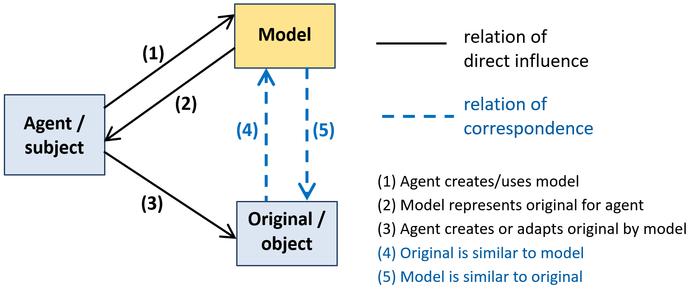
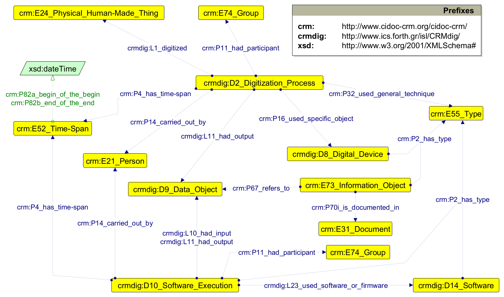
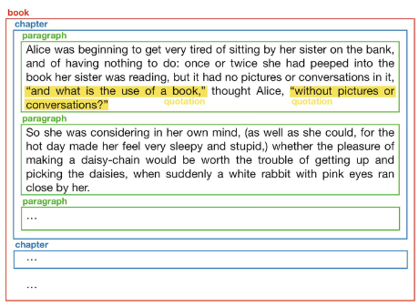
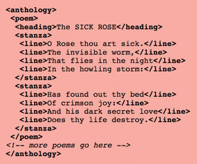
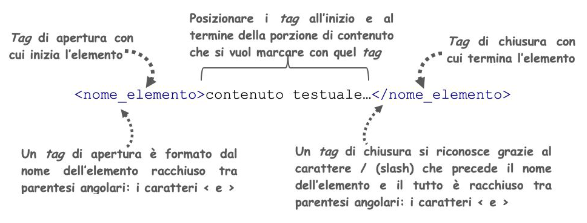
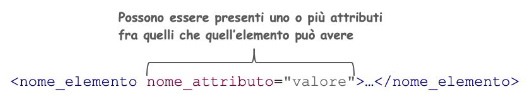
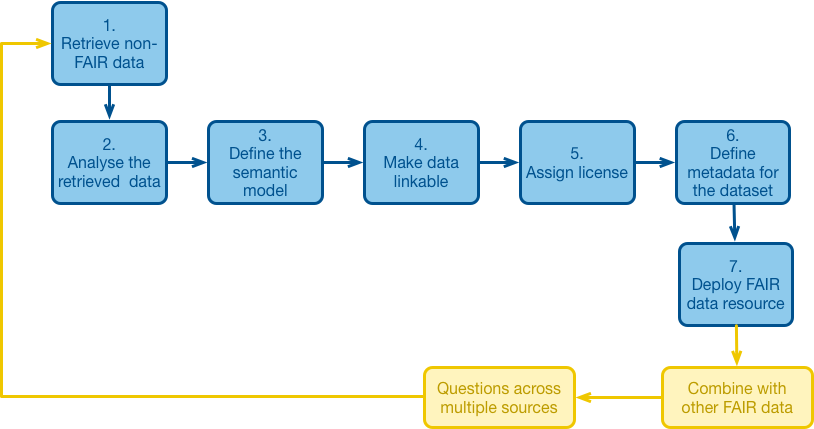
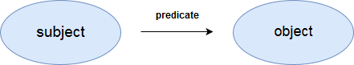

# COLLECT: Descrivere

## Lezione 07 del corso di _Digital Humanities e Data Management per i Beni Culturali_ (2024/2025)

###### Sebastian Barzaghi | [sebastian.barzaghi2@unibo.it](mailto:sebastian.barzaghi2@unibo.it) | [https://orcid.org/0000-0002-0799-1527](https://orcid.org/0000-0002-0799-1527) | [https://www.unibo.it/sitoweb/sebastian.barzaghi2/](https://www.unibo.it/sitoweb/sebastian.barzaghi2/)

---

### Produzione, raccolta e analisi

<div style="display: flex; align-items: center;">
  <div style="flex: 1;">
    <figure>
      
      <figcaption>
        Fonte: Gualandi, B., Caldoni, G., & Marino, M. (2022). Research Data Management: Data Lifecycle. Zenodo. <a href="https://doi.org/10.5281/zenodo.7249051">https://doi.org/10.5281/zenodo.7249051</a>.
      </figcaption>
    </figure>
  </div>
  <div style="flex: 1;">
      <p>
        Azioni principali: raccogliere o creare i dati, elaborare i dati per renderli utilizzabili (pulizia, combinazione, trasformazione, controllo qualità), analizzare i dati per generare risultati utili, produrre la documentazione dei dati e delle metodologie utilizzate.
      </p>
  </div>
</div>

---

### Un dato è una fonte di conoscenza

<div style="display: flex; align-items: center;">
  <div style="flex: 2;">
    <figure>
      
        <figcaption>
            Fonte: Noppe, N., Vanvelk, J., & Callens, N. (2023). The hands-on guide to research data management for KU Leuven researchers, students, and research support staff in the humanities and social sciences. Zenodo. <a href="https://doi.org/10.5281/zenodo.8010618">https://doi.org/10.5281/zenodo.8010618</a>.
        </figcaption>
    </figure>
  </div>
  <div style="flex: 1;">
    <p>
      I dati sono record fattuali raccolti, generati o riutilizzati come base di analisi, ragionamenti, discussioni o calcoli.
    </p>
    <p>
      Vengono usati da studiosi e scienziati come strumenti per comprendere il mondo e generare conoscenza.
    </p>
  </div>
</div>

<div class="footer">
  OECD (2007). OECD Principles and Guidelines for Access to Research Data from Public Funding, OECD Publishing, Paris. <a href="https://doi.org/10.1787/9789264034020-en-fr">https://doi.org/10.1787/9789264034020-en-fr</a>.
</div>

---

### La ricerca umanistica è dominata da paradigmi tradizionali

Molti ricercatori usano come dati di ricerca fonti primarie, che spesso sono fisiche e raramente digitalizzate.

I sistemi semiotici delle discipline umanistiche tendono ad essere specifici, impliciti, individualistici, dati per scontato.

I dati sono difficilmente accessibili a causa di copyright stringenti e licenze inadatte alle dinamiche della ricerca contemporanea.

**I dati culturali sono complessi e raramente documentati in modo da facilitarne l'integrazione, la comprensione e il riutilizzo da parte di altri**.

<div class="footer">
  Tóth-Czifra, E. (2019). DARIAH Pathfinder to Data Management Best Practices in the Humanities. Version 1.0.0. DARIAH-Campus. [Pathfinder]. <a href="https://campus.dariah.eu/id/yR8mHfs3eW-ibu58LerCt">https://campus.dariah.eu/id/yR8mHfs3eW-ibu58LerCt</a>.
</div>

---



## Semplifichiamo

<!--
Photo by <a href="https://unsplash.com/@spaceboy?utm_content=creditCopyText&utm_medium=referral&utm_source=unsplash">Henrik Dønnestad</a> on <a href="https://unsplash.com/photos/abstract-painting-t2Sai-AqIpI?utm_content=creditCopyText&utm_medium=referral&utm_source=unsplash">Unsplash</a>
-->

---

### Un modello è un'astrazione

<div style="display: flex; align-items: center;">
  <div style="flex: 2;">
    <figure>
    
      <figcaption>
          Fonte: Kučerová, H. (2018). The concept of model and conceptual model in information science. <a href="https://knihovnarevue-en.nkp.cz/archives/2018-2/reviewed-articles/the-concept-of-model-and-conceptual-model-in-information-science ">https://knihovnarevue-en.nkp.cz/archives/2018-2/reviewed-articles/the-concept-of-model-and-conceptual-model-in-information-science</a>.
      </figcaption>
    </figure>
  </div>
  <div style="flex: 1;">
      <p>
        Una rappresentazione semplificata di qualcosa (un sistema, oggetto, fenomeno, ecc.).
      </p>
      <p>
        Ne cattura le caratteristiche fondamentali, permettendo di descrivere, comprendere, analizzare, predire o interagire con quella cosa.
      </p>
      <p>
        Es. una mappa, un'equazione, <strong>uno schema di metadati</strong>...
      </p>
  </div>
</div>

<div class="footer">
Kučerová, H. (2018). The concept of model and conceptual model in information science. <a href="https://knihovnarevue-en.nkp.cz/archives/2018-2/reviewed-articles/the-concept-of-model-and-conceptual-model-in-information-science">https://knihovnarevue-en.nkp.cz/archives/2018-2/reviewed-articles/the-concept-of-model-and-conceptual-model-in-information-science</a>.
</div>

---

### Cos'è la modellazione dei dati?

<div style="display: flex; align-items: center;">
  <div style="flex: 2;">
    <figure>
    
      <figcaption>
          Fonte: Barzaghi, S., Heibi, I., Moretti, A., & Peroni, S. (2024). Developing Application Profiles for Enhancing Data and Workflows in Cultural Heritage Digitisation Processes. arXiv preprint arXiv:2404.12069. <a href="https://doi.org/10.48550/arXiv.2404.12069">https://doi.org/10.48550/arXiv.2404.12069</a>.
      </figcaption>
    </figure>
  </div>
  <div style="flex: 1;">
      <p>
        L’insieme di attività di rappresentazione formale di un segmento di realtà in modo tale da renderlo computabile.
      </p>
      <p>
        I modelli di dati forniscono una struttura precisa che permette ai dati di essere trattati, compresi, e gestiti.
      </p>
      <p>
        Es. creazione di database, definizione di schemi XML, sviluppo di ontologie, ecc. 
      </p>
  </div>
</div>

<div class="footer">
Tomasi, F. (2018). Modelling in the digital humanities: conceptual data models and knowledge organization in the cultural heritage domain. Historical Social Research/Historische Sozialforschung. Supplement, (31), 170-179. <a href="https://www.jstor.org/stable/26533637">https://www.jstor.org/stable/26533637</a>.
</div>

---

### Estrarre elementi dai dati osservati a partire da un'interpretazione

Tra i vari fattori che determinano lo sviluppo di un modello di dati, c'è anche il _linguaggio_.

In breve, un modello di dati traspone _pattern_ presenti nel linguaggio naturale in una forma che possa essere processata e compresa dalle macchine.

Questo comporta l'individuazione di:
- **Classi**: categorie di oggetti con proprietà e comportamenti simili (es. "Persona");
- **Entità**: individui appartenenti alle classi (es. "Tizio");
- **Attributi**: proprietà delle classi (e quindi anche delle entità) (es. età, altezza, ecc.);
- **Relazioni**: rapporti logici e semantici tra classi (e quindi anche tra entità) (es. "conosce").

<div class="footer">
Tomasi, F. (2018). Modelling in the digital humanities: conceptual data models and knowledge organization in the cultural heritage domain. Historical Social Research/Historische Sozialforschung. Supplement, (31), 170-179. <a href="https://www.jstor.org/stable/26533637">https://www.jstor.org/stable/26533637</a>.
</div>

---

### Un esempio grossolano, giusto per capire

> Neuromante, scritto da William Gibson e pubblicato nel 1984, è un libro di 271 pagine e di genere cyberpunk.

Individuiamo <span class="class">classi</span>, <span class="entity">entità</span>, <span class="attribute">attributi</span> e <span class="relation">relazioni</span>.

---

### Un esempio grossolano, giusto per capire

> <span class="entity">Neuromante</span>, <span class="relation">scritto da</span> <span class="entity">William Gibson</span> (una <span class="class">persona</span>) e <span class="attribute">pubblicato nel 1984</span>, è un <span class="class">libro</span> <span class="attribute">di 271 pagine</span> e <span class="relation">di genere</span> <span class="entity">cyberpunk</span> (un <span class="class">genere</span>).

Individuiamo <span class="class">classi</span>, <span class="entity">entità</span>, <span class="attribute">attributi</span> e <span class="relation">relazioni</span>.

---

### Un esempio grossolano, giusto per capire

* <span class="entity">Neuromante</span> è un <span class="class">libro</span>;
* <span class="entity">William Gibson</span> è una <span class="class">persona</span>;
* <span class="entity">cyberpunk</span> è un <span class="class">genere</span>;
* <span class="entity">Neuromante</span> <span class="relation">ha creatore</span> <span class="entity">William Gibson</span>;
* <span class="entity">Neuromante</span> <span class="attribute">ha data di pubblicazione</span> "1984";
* <span class="entity">Neuromante</span> <span class="attribute">ha numero di pagine</span> "271";
* <span class="entity">Neuromante</span> <span class="relation">ha genere</span> <span class="entity">cyberpunk</span>.

---



## Strutture nascoste

<!--
Photo by <a href="https://unsplash.com/@leiadakrozjhen?utm_content=creditCopyText&utm_medium=referral&utm_source=unsplash">Leiada Krozjhen</a> on <a href="https://unsplash.com/photos/a-book-open-with-text-7UxQUl3mdnw?utm_content=creditCopyText&utm_medium=referral&utm_source=unsplash">Unsplash</a>
-->

---

### Quanto abbiamo appena fatto lo possiamo vedere anche come una sorta di marcatura...

<div style="display: flex; align-items: center;">
  <div style="flex: 2;">
    <figure>
    
      <figcaption>
          Fonte: <a href="https://basic-inf.github.io/2022-2023/chapters/08.pdf ">https://basic-inf.github.io/2022-2023/chapters/08.pdf</a>.
      </figcaption>
    </figure>
  </div>
  <div style="flex: 1;">
      <p>
        Annotazione (o codifica) del testo per definire esplicitamente i ruoli strutturali e semantici degli elementi di cui è costituito.
      </p>
      <p>
        Un modo per rendere esplicito ciò che nel testo è implicito o congetturale.
      </p>
      <p>
        Reso tramite un linguaggio di marcatura, un insieme di convenzioni usate per annotare un testo.
      </p>
  </div>
</div>

---

### I linguaggi di marcatura sono definiti tramite XML

<div style="display: flex; align-items: center;">
  <div style="flex: 2;">
    <figure>
    
      <figcaption>
          Fonte: Buzzoni, M. (2020). Towards the Construction of a Stemma. Handbook of Stemmatology: History, Methodology, Digital Approaches, 139-207. <a href="https://doi.org/10.1515/9783110684384-004">https://doi.org/10.1515/9783110684384-004</a>.
      </figcaption>
    </figure>
  </div>
  <div style="flex: 1;">
      <p>
        L'eXtensive Markup Language (XML) è un metalinguaggio: un linguaggio usato per descrivere altri linguaggi (di marcatura).
      </p>
      <p>
        Permette di specificare come la marcatura viene distinta dal testo, quale marcatura è permessa e quale è obbligatoria.
      </p>
      <p>
        Basato su elementi e attributi (e altre cose, che però non vedremo).
      </p>
  </div>
</div>

---

### Nella marcatura, un _elemento_ è un termine che esprime la semantica del testo a cui si riferisce



---

### Nella marcatura, un _attributo_ è un'informazione aggiuntiva assegnata ad un elemento



---

### Perché marcare un testo?

Quando interagiamo con un testo, percepiamo sia le informazioni linguistiche (contenuto) sia le meta-informazioni che otteniamo tramite la contestualizzazione e l'interpretazione (es. il _corsivo_ può essere utilizzato per dare enfasi, cambiando completamente il significato della frase).

I computer però non colgono queste strutture nascoste: hanno bisogno di un meccanismo (il markup, appunto) che faccia emergere questo tipo di informazioni, così da poterle processare.

Il markup è adatto a fare questo perché separa in maniera esplicita il contenuto dal significato.

<div class="footer">
Dee, S. (2014). Learning the TEI in a Digital Environment. Journal of the Text Encoding Initiative, (7). <a href="https://doi.org/10.4000/jtei.968">https://doi.org/10.4000/jtei.968</a>.
</div>

---

### Esempio di modello di dati: Text Encoding Initiative

TEI è uno schema di codifica e un modello di dati standard, formulato come un'applicazione di XML, per descrivere oggetti e fenomeni testuali in ambito umanistico.

Obiettivo: contemplare tutta la serie dei fenomeni di interesse umanistico e trovare, per ciascuno di essi, un vocabolario unico al fine di arrivare ad una formalizzazione utile a normalizzare i criteri, le modalità e il lessico del markup, di fronte alla polisemia del linguaggio naturale.

Documentazione ufficiale: <http://www.tei-c.org/guidelines>.

<div class="footer">
Tomasi, F. La codifica XML/TEI. <a href="http://web.dfc.unibo.it/buzzetti/corsoSFI/25febbraio/tomasi.pdf">http://web.dfc.unibo.it/buzzetti/corsoSFI/25febbraio/tomasi.pdf</a>.
</div>

---

### Struttura di un documento TEI

Un testo codificato in TEI è costituito da _almeno_ tre elementi:
- un elemento `TEI`, contenente tutti gli altri;
- un elemento `teiHeader`, contenente i metadati del documento;
- un elemento `text`, contenente il corpo (`body`) del testo.

```
<TEI xmlns="http://www.tei-c.org/ns/1.0">
  <teiHeader>
    <fileDesc>
      <titleStmt>
        <title>
          TITOLO
        </title>
      </titleStmt>
      <publicationStmt>
        <p>
          INFORMAZIONI SULLA PUBBLICAZIONE
        </p>
      </publicationStmt>
      <sourceDesc>
        <p>
          INFORMAZIONI SULLA FONTE ORIGINALE
        </p>
      </sourceDesc>
    </fileDesc>
  </teiHeader>
  <text>
    <body>
      <p n="1">
        PARAGRAFO 1...
      </p>
      <p n="2">
        PARAGRAFO 2...
      </p>
    </body>
  </text>
</TEI>
```

---



## Spazi semantici

<!--
Photo by <a href="https://unsplash.com/@birminghammuseumstrust?utm_content=creditCopyText&utm_medium=referral&utm_source=unsplash">Birmingham Museums Trust</a> on <a href="https://unsplash.com/photos/blue-and-white-floral-textile-G0PuUqpMfaY?utm_content=creditCopyText&utm_medium=referral&utm_source=unsplash">Unsplash</a>
-->

---

### La scienza fatta bene

<div style="display: flex; align-items: center;">
    <div style="flex: 2;">
      <figure>
      
        <figcaption>
            Melanie Imming, Jon Tennant, & Ivo Grigorov. (2018). Stickers Open Science just science done right (IT). Zenodo. <a href="https://doi.org/10.5281/zenodo.2613332">https://doi.org/10.5281/zenodo.2613332</a>.
        </figcaption>
      </figure>
    </div>
    <div style="flex: 1;">
        <p>
          La Scienza Aperta è un insieme di movimenti e pratiche che mirano a rendere la conoscenza scientifica più trasparente, accessibile e riutilizzabile per tutti.
        </p>
    </div>
</div>

<div class="footer">
  UNESCO (2021). UNESCO Recommendation on Open Science. <a href="https://doi.org/10.54677/MNMH8546">https://doi.org/10.54677/MNMH8546</a>.
</div>

---

### La FAIRificazione

<div style="display: flex; align-items: center;">
  <div style="flex: 2;">
    <figure>
      
      <figcaption>
          Fonte: <a href="https://www.go-fair.org/fair-principles/fairification-process/">https://www.go-fair.org/fair-principles/fairification-process/</a>.
      </figcaption>
    </figure>
  </div>
  <div style="flex: 1;">
    <p>
      Processo di trasformazione di dati non-FAIR in una loro versione FAIR.
    </p>
    <p>
      Include la definizione di un modello semantico e la sua applicazione per collegare i dati tra loro.
    </p>
    <p>
      Per fare questo, si utilizzano tecnologie legate al paradigma dei Linked Open Data (LOD).
    </p>
  </div>
</div>

<div class="footer">
  Jacobsen, A., Kaliyaperumal, R., da Silva Santos, L. O. B., Mons, B., Schultes, E., Roos, M., & Thompson, M. (2020). A generic workflow for the data FAIRification process. Data Intelligence, 2(1-2), 56-65. <a href="https://doi.org/10.1162/dint_a_00028">https://doi.org/10.1162/dint_a_00028</a>.
</div>

---

### Dati aperti e contestualizzati

<div style="display: flex; align-items: center;">
  <div style="flex: 2;">
    <figure>
      
      <figcaption>
          Fonte: Bernard, C. (2019). Immersing evolving geographic divisions in the semantic Web (Doctoral dissertation, Université Grenoble Alpes). <a href="https://theses.hal.science/tel-02524361v1">https://theses.hal.science/tel-02524361v1</a>. 
      </figcaption>
    </figure>
  </div>
  <div style="flex: 1;">
    <p>
      Dati semi-strutturati, pubblicati in formato aperto e descritti tramite modelli semantici.
    </p>
    <p>
      Sono rappresentati tramite triple soggetto-predicato-oggetto su cui si basa il Resource Description Framework (RDF). 
    </p>
  </div>
</div>

<div class="footer">
Blaney, J. (2017). Introduction to the Principles of Linked Open Data. The Programming Historian. <a href="https://doi.org/10.46430/phen0068">https://doi.org/10.46430/phen0068</a>. 
</div>

---

### Esempio di modello di dati: RDF

<div style="display: flex; align-items: center;">
  <div style="flex: 2;">
    <figure>
      
      <figcaption>
          Fonte: Bernard, C. (2019). Immersing evolving geographic divisions in the semantic Web (Doctoral dissertation, Université Grenoble Alpes). <a href="https://theses.hal.science/tel-02524361v1">https://theses.hal.science/tel-02524361v1</a>. 
      </figcaption>
    </figure>
  </div>
  <div style="flex: 1;">
    <p>
      Resource Description framework: modello di dati standard che permette di rappresentare, descrivere, e pubblicare i dati sul Web in un formato accessibile e interpretabile dalle macchine tramite l'utilizzo di triple soggetto-predicato-oggetto.
    </p>
  </div>
</div>

<div class="footer">
Jonathan Blaney, "Introduction to the Principles of Linked Open Data," Programming Historian 6 (2017), <a href="https://doi.org/10.46430/phen0068">https://doi.org/10.46430/phen0068</a>. 
</div>

---

###  L’unità minima nei LOD: la tripla RDF

<div style="display: flex; align-items: center;">
  <div style="flex: 1;">
    <figure>
    
      <figcaption>
          Fonte: Jonathan Blaney, "Introduction to the Principles of Linked Open Data," Programming Historian 6 (2017), <a href="https://doi.org/10.46430/phen0068">https://doi.org/10.46430/phen0068</a>.
      </figcaption>
    </figure>
  </div>
  <div style="flex: 1;">
      <p>
        Costrutto astratto minimo di modellazione dei LOD.
      </p>
      <p>
        <ul>
          <li>Soggetto: un'entità (sempre identificata da un URI);</li>
          <li>Predicato: una caratteristica del soggetto (sempre identificata da un URI);</li>
          <li>Oggetto: un'entità (identificata da un URI) o un valore (letterale, numerico, temporale, ecc.).</li>
        </ul>
      </p>
      <p>
        Le triple si collegano tra loro, formando un grafo di dati.
      </p>
  </div>
</div>

<div class="footer">
Jonathan Blaney, "Introduction to the Principles of Linked Open Data," Programming Historian 6 (2017), <a href="https://doi.org/10.46430/phen0068">https://doi.org/10.46430/phen0068</a>. 
</div>

---

### Esempio di triple RDF

<figure>
  
  <figcaption>
      Fonte: Bernard, C. (2019). Immersing evolving geographic divisions in the semantic Web (Doctoral dissertation, Université Grenoble Alpes). <a href="https://theses.hal.science/tel-02524361v1">https://theses.hal.science/tel-02524361v1</a>.
  </figcaption>
</figure>

---

### Gli obiettivi: interoperabilità e riusabilità dei dati

Se abbiamo più dataset con licenza aperta, e descritti dagli stessi standard di metadati (cioé modellati nella stessa maniera), possiamo collegarli, effettuare più facilmente interrogazioni e analisi incrociate, integrazioni su larga scala, ecc. 

In altre parole: **interoperabilità** e **riusabilità**!

---

###  Un paio di principi fondamentali

**Utilizzare formati standard riconosciuti**: i dati devono essere strutturati con standard riconosciuti per permettere l'elaborazione coerente da parte delle macchine (RDF, appunto, e modelli semantici, come ontologie e vocabolari controllati).

**Riferimento univoco alle entità**: i dati devono essere identificati univocamente e in maniera persistente, in modo da poterli disambiguare tra tutti i dataset (tramite URI).

**Pubblicare i dati apertamente**: i dati devono essere accessibili con licenze aperte, e in formati che non richiedano software proprietario.

<div class="footer">
Blaney, J. (2017). Introduction to the Principles of Linked Open Data. The Programming Historian. <a href="https://doi.org/10.46430/phen0068">https://doi.org/10.46430/phen0068</a>. 
</div>

---

### Usare URI per dare nomi alle cose

Un URI è un identificatore unico per una risorsa.

Diversamente da un URL, non è necessario che un URI punti _fisicamente_ a una risorsa, ma deve essere comunque unico.

Esempi di URI che disambiguano entità:
- <https://www.wikidata.org/wiki/Q188987> (William Gibson);
- <https://www.wikidata.org/entity/Q662029> (Neuromante).

<div class="footer">
Jonathan Blaney, "Introduction to the Principles of Linked Open Data," Programming Historian 6 (2017), <a href="https://doi.org/10.46430/phen0068">https://doi.org/10.46430/phen0068</a>. 
</div>

---

### 5 ★ Open Data

Link: <https://5stardata.info/en/>.

Schema di pubblicazione dei dati in formato LOD:
- 1) I dati sono disponibili sul Web con una licenza aperta (es. Creative Commons);
- 2) I dati sono in un formato strutturato e leggibile dalle macchine (es. Excel);
- 3) I dati sono in un formato non proprietario (es. CSV, XML, RDF, ecc.);
- 4) I dati sono identificati in maniera persistente ed univoca sul Web tramite URI;
- 5) I dati sono collegati ad altri dati e risorse esterne per fornire ulteriore contesto.

<div class="footer">
Jonathan Blaney, "Introduction to the Principles of Linked Open Data," Programming Historian 6 (2017), <a href="https://doi.org/10.46430/phen0068">https://doi.org/10.46430/phen0068</a>. 
</div>

---

### Esempio: Wikidata

Link: <https://www.wikidata.org>.

I dati sono resi disponibili sotto la licenza Creative Commons CC0.

I dati sono modellati secondo un modello proprio di Wikidata, ma sono serviti anche in RDF.

I dati sono identificati da URI.

I dati sono collegati tra di loro e con altri dati, dataset, database, pagine Web.

---

### Un piccolo limite di RDF in quanto modello di dati

Dice _cosa_ fare, ma non dice:
- _Come scrivere triple_: per questo ci sono le **serializzazioni** (es. RDF/XML, Turtle, ecc.) che specificano la **sintassi** da usare;
- _Come esprimere entità e proprietà_: per questo esistono i **modelli semantici** (es. vocabolari controllati, ontologie, ecc.) che specificano il **lessico** da usare.

---

### Esempio di modello semantico: Tassonomia, tesauro, ecc.

Vocabolari controllati nei quali sono presenti anche relazioni di varia natura, es. gerarchiche, associative (sinonimia, iperonimia, iponimia, olonimia, meronimia), ecc.

Esempio di tassonomia: <https://vocabs.dariah.eu/tadirah/en/>.

Esempio di tesauro: <https://www.getty.edu/research/tools/vocabularies/aat/>.

Catalogo di vocabolari controllati: <https://bartoc.org/>.

<div class="footer">
Hjørland, Birger. 2017. “Classification”. Knowledge Organization 44, no. 2: 97-128. Also available in ISKO Encyclopedia of Knowledge Organization, eds. Birger Hjørland and Claudio Gnoli, <a href="https://www.isko.org/cyclo/classification">https://www.isko.org/cyclo/classification</a>.
</div>

---

### Esempio di modello semantico: Ontologia

Modello di dati che descrive un particolare dominio di conoscenza, definendo una terminologia comune per entità, proprietà (relazioni e attributi), e vincoli logici e regole di inferenza.

Esempi: <https://w3id.org/dharc/ontology/chad-ap>, <https://w3id.org/spar/cito>, <http://www.cidoc-crm.org/cidoc-crm>...

Catalogo di ontologie: <https://lov.linkeddata.es/dataset/lov/>.

<div class="footer">
Hjørland, Birger. 2017. “Classification”. Knowledge Organization 44, no. 2: 97-128. Also available in ISKO Encyclopedia of Knowledge Organization, eds. Birger Hjørland and Claudio Gnoli, <a href="https://www.isko.org/cyclo/classification">https://www.isko.org/cyclo/classification</a>.
</div>

---

# Fine

## Lezione 07 del corso di _Digital Humanities e Data Management per i Beni Culturali_ (2024/2025)

###### Sebastian Barzaghi | [sebastian.barzaghi2@unibo.it](mailto:sebastian.barzaghi2@unibo.it) | [https://orcid.org/0000-0002-0799-1527](https://orcid.org/0000-0002-0799-1527) | [https://www.unibo.it/sitoweb/sebastian.barzaghi2/](https://www.unibo.it/sitoweb/sebastian.barzaghi2/)
