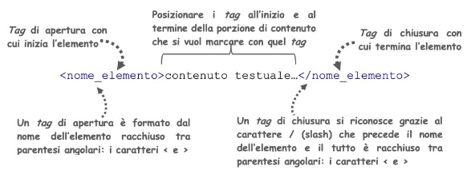
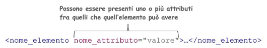

# Strutture nascoste

## Lezione 08 del corso di _Digital Humanities e Data Management per i Beni Culturali_ (2024/2025)

###### Sebastian Barzaghi | [sebastian.barzaghi2@unibo.it](mailto:sebastian.barzaghi2@unibo.it) | [https://orcid.org/0000-0002-0799-1527](https://orcid.org/0000-0002-0799-1527) | [https://www.unibo.it/sitoweb/sebastian.barzaghi2/](https://www.unibo.it/sitoweb/sebastian.barzaghi2/)

---

## XML

---

### I linguaggi di marcatura sono definiti tramite XML

<div style="display: flex; align-items: center;">
  <div style="flex: 1;">
    <figure>
    
      <figcaption>
          Fonte: Buzzoni, M. (2020). Towards the Construction of a Stemma. Handbook of Stemmatology: History, Methodology, Digital Approaches, 139-207. <a href="https://doi.org/10.1515/9783110684384-004">https://doi.org/10.1515/9783110684384-004</a>.
      </figcaption>
    </figure>
  </div>
  <div style="flex: 1;">
      <p>
        L'eXtensive Markup Language (XML) è un metalinguaggio: un linguaggio usato per descrivere altri linguaggi (di marcatura).
      </p>
      <p>
        Permette di specificare come la marcatura viene distinta dal testo, quale marcatura è permessa e quale è obbligatoria.
      </p>
      <p>
        Basato su elementi e attributi.
      </p>
  </div>
</div>

---

### Nella marcatura, un _elemento_ è un termine che esprime la semantica del testo a cui si riferisce

<figure>
    
    <figcaption>
        Fonte: <a href="https://basic-inf.github.io/2022-2023/chapters/08.pdf">https://basic-inf.github.io/2022-2023/chapters/08.pdf</a>.
    </figcaption>
</figure>

---

### Nella marcatura, un _attributo_ è un'informazione aggiuntiva assegnata ad un elemento

<figure>
    
    <figcaption>
        Fonte: <a href="https://basic-inf.github.io/2022-2023/chapters/08.pdf">https://basic-inf.github.io/2022-2023/chapters/08.pdf</a>.
    </figcaption>
</figure>

---

### I tag si devono annidare correttamente

Devi _sempre_ chiudere l'utlimo tag che hai aperto prima di chiuderne un altro precedente.

Per esempio, questo è un errore: 

`<sentence>Questo è <emphasis>un errore!</sentence></emphasis>`

Questo, invece, è corretto:

`<sentence>Questo non è <emphasis>un errore!</emphasis></sentence>`

---

### Alcuni elementi sono vuoti, cioé non hanno contenuto testuale

Possono essere scritti normalmente:

`<milestone type="pagebreak"></milestone>`

Oppure con solo il tag di apertura e il secondo caporale `>` preceduto da `/`:

`<milestone type="pagebreak"/>`

---

### La prima linea di un file XML è la dichiarazione

Esempio:  
`<?xml version="1.0" encoding="UTF-8"?>`

Dichiara i dettagli del file (in questo caso, è un documento XML, versione 1.0, e codificato secondo UTF-8). 

Ci possono essere altre informazioni, come la lingua, lo stile, ecc.

---

### Esempi di scenari di utilizzo di XML

- Stai studiando l'uso delle parole di un autore e vuoi escludere qualsiasi testo in cui l'autore citi una fonte esterna; 
- Hai una raccolta di documenti e vuoi creare un elenco di tutti i nomi di persone o di luoghi menzionati;
- Stai trascrivendo un manoscritto che coinvolge diverse mani e vuoi identificare quali tratti di testo sono stati scritti da ciascuna persona;
- Stai trascrivendo un documento e hai identificato un errore di battitura che potrebbe confondere un non esperto o ostacolare la ricerca del testo, quindi vuoi fornire una correzione senza sostituire l'errore originale.

---

## TEI

---

### TEI Lite

Un modello basato su XML per marcare testi umanistici.

Standard internazionale che dà ampie libertà di codificare le caratteristiche del testo secondo diverse soluzioni. Definisce circa 580 elementi e 265 attributi per rappresentare un insieme molto ampio di fenomeni testuali e meta-informazioni ad essi associate.

Pochissimi progetti richiedono una conoscenza completa di TEI. Per questo, è stato publbicato anche un sottoinsieme gestibile con gli elementi fondamentali, chiamato [TEI Lite](https://tei-c.org/Vault/P5/1.0.1/doc/tei-p4-lite/teiu5_it.html).

---

### Elementi e attributi sono organizzati in 21 moduli

Tra i moduli più utilizzati, troviamo:
- `tei`: definisce le basi infrastrutturali su cui si appoggiano elementi ed attributi degli altri moduli;
- `header`: definisce gli elementi che compongono la sezione dell'intestazione (es. metadati bibliografici, relazioni con i materiali di orgine, revisioni, ecc.);
- `core`: definisce elementi ed attributi che possono far parte di qualsiasi documento (es. paragrafi, citazioni, liste, entità, note, elementi grafici, ecc.);
- `textstructure`: definisce elementi ed attributi che descrivono la struttura dei testi (es. pagine, corpo del testo, intestazioni, postfazioni, ecc.).

---

### Aderire allo standard

Per usare efficacemente TEI, dovete assicurarvi che:
- nella dichiarazione venga esplicitato questo link: <http://www.tei-c.org/ns/1.0>;
- vengano rispettati i requisiti del modello di dati TEI, sulla base dei modelli (e quindi degli elementi e attributi) selezionati per il progetto in questione.

Servizio per la creazione di schemi TEI documentati: <https://roma.tei-c.org/>.

---

### Un documento TEI di base

- Un elemento `TEI`, in cui viene sempre dichiarato un attributo `@xmlns` con il valore `http://www.tei-c.org/ns/1.0`;

```
<TEI xmlns="http://www.tei-c.org/ns/1.0">
 ...
</TEI>
```

---

### Un documento TEI di base

- Un elemento `TEI`, contenente:
    - un elemento `teiHeader`, per i metadati

```
<TEI xmlns="http://www.tei-c.org/ns/1.0">
    <teiHeader>
        ...
    </teiHeader>
 ...
</TEI>
```

---

### Un documento TEI di base

- Un elemento `TEI`, contenente:
    - un elemento `teiHeader`, per i metadati
    - un elemento `text`, per il contenuto effettivo del documento

```
<TEI xmlns="http://www.tei-c.org/ns/1.0">
    <teiHeader>
        ...
    </teiHeader>
    <text>
        ...
    </text>
 ...
</TEI>
```

---

### Il TEI Header

Contiene _almeno_ una descrizione del documento digitale, dentro l'elemento `fileDesc`.

```
<TEI xmlns="http://www.tei-c.org/ns/1.0">
    <teiHeader>
        <fileDesc>
            ...
        </fileDesc>
    </teiHeader>
    <text>
        ...
    </text>
 ...
</TEI>
```

---

### Il TEI Header

`fileDesc` deve contenere _almeno_ questi elementi:
- `titleStmt`, contenente informazioni su titolo (`title`) e responsabilità;

```
<TEI xmlns="http://www.tei-c.org/ns/1.0">
    <teiHeader>
        <fileDesc>
            <titleStmt>
                <title>
                    ...
                </title>
            </titleStmt>
        </fileDesc>
    </teiHeader>
    <text>
        ...
    </text>
 ...
</TEI>
```

---

### Il TEI Header

`fileDesc` deve contenere _almeno_ questi elementi:
- `titleStmt`, contenente informazioni su titolo (`title`) e responsabilità;
- `publicationStmt`, contenente informazioni sulla pubblicazione;

```
<TEI xmlns="http://www.tei-c.org/ns/1.0">
    <teiHeader>
        <fileDesc>
            <titleStmt>
                <title>
                    ...
                </title>
            </titleStmt>
            <publicationStmt>
                ...
            </publicationStmt>
        </fileDesc>
    </teiHeader>
    <text>
        ...
    </text>
 ...
</TEI>
```

---

### Il TEI Header

`fileDesc` deve contenere _almeno_ questi elementi:
- `titleStmt`, contenente informazioni su titolo (`title`) e responsabilità;
- `publicationStmt`, contenente informazioni sulla pubblicazione;
- `sourceDesc`, contenente informazioni sulla fonte materiale del testo.

```
<TEI xmlns="http://www.tei-c.org/ns/1.0">
    <teiHeader>
        <fileDesc>
            <titleStmt>
                <title>
                    ...
                </title>
            </titleStmt>
            <publicationStmt>
                ...
            </publicationStmt>
            <sourceDesc>
                ...
            </sourceDesc>
        </fileDesc>
    </teiHeader>
    <text>
        ...
    </text>
 ...
</TEI>
```

---

### Il testo

Il testo `text` contiene _almeno_ un corpo (`body`).

```
<TEI xmlns="http://www.tei-c.org/ns/1.0">
    <teiHeader>
        <fileDesc>
            <titleStmt>
                <title>
                    ...
                </title>
            </titleStmt>
            <publicationStmt>
                ...
            </publicationStmt>
            <sourceDesc>
                ...
            </sourceDesc>
        </fileDesc>
    </teiHeader>
    <text>
        <body>
            ...
        </body>
    </text>
 ...
</TEI>
```

---

### Il testo

Il testo `text` contiene _almeno_ un corpo (`body`).

`body` contiene strutture testuali, come paragrafi (`p`) e altri costrutti, compreso uno generico `div`.

```
<TEI xmlns="http://www.tei-c.org/ns/1.0">
    <teiHeader>
        <fileDesc>
            <titleStmt>
                <title>
                    ...
                </title>
            </titleStmt>
            <publicationStmt>
                ...
            </publicationStmt>
            <sourceDesc>
                ...
            </sourceDesc>
        </fileDesc>
    </teiHeader>
    <text>
        <body>
            <p>
                ...
            </p>
        </body>
    </text>
 ...
</TEI>
```

---

### TEI viene usato per rappresentare _fenomeni testuali_

- **Strutturali** (es. capitoli, sezioni, paragrafi, ecc.): es. `div`, `p`, `list`, `item`, ecc.;
- **Rappresentazionali** (es. font, colori, sottolineature, cancellature, ecc.): es. `hi`;
- **Semantici** (es. persone, opere, organizzazioni, eventi, luoghi, ecc.): es. `emph`, `foreign`, `quote`, `term`, `gloss`, `title`, `name`, `num`, `measure`, `date`, `address`, `abbr`, ecc.;
- **Analitici** (es. interpretazioni aggiunte da chi sta lavorando): es. `note`, `sic`, `corr`, `choice`, `orig`, `reg`, `gap`, ecc.

---

### Alcuni esempi: riferimenti

Elemento `ref` con i possibili attributi:
- `type`: tipo del riferimento;
- `target`: oggetto del riferimento, nella forma di un link o di un URI.

Si può utilizzare anche `name` per i nomi propri, o `rs` per i nomi comuni, oppure altri elementi più specifici (es. `persName`, `orgName`, ecc.).

Esempio:  
_\<ref type="person" target="https://www.wikidata.org/wiki/Q5582"\>Van Gogh\</ref\>, uno dei più grandi pittori di tutti i tempi._

---

### Alcuni esempi: date

- elemento `date` con questi possibili attributi:
    - `@calendar`: sistema di calendario (es. "gregorian");
    - `@when`: valore della data in formato standard (es. "2009​-12​-31");
    - `@from` e `@to`: inizio e fine definiti della data;
    - `@notBefore` e `@notAfter`: inizio e fine non definiti della data.

Esempi:  
- _\<date when="2009​-12​-31" calendar="Gregorian"\>31 Dec 2009\</date\>_;
- _Van Gogh, uno dei più grandi pittori di tutti i tempi, lavorò per \<date from="1866" to="1868"\>due anni\</date\> a Tilburg e un altro \<date notBefore="1875-04​-01" notAfter="1876-12-31"\>breve periodo\</date\>` a Parigi_.

---

### Alcuni esempi: numeri e misure

- Elemento `num` con questi possibili attributi:
    - `@type`: tipo di valore numerico (es. "cardinal", "percentage", "ordinal", ecc.);
    - `@value`: valore numerico in formato standard.
- Elemento `measure` con questi possibili attributi:
    - `@type`: tipo di misura (es. "volume", "width", "length", ecc.);
    - `@quantity`: quantità espressa dalla misura in formato standard;
    - `@unit`: unità di misura (es. "litre", "kilogram", ecc.).

Esempio:  
_Van Gogh, uno dei più grandi pittori di tutti i tempi, lavorò per \<num type="cardinal" value="2"\>due\</num\>` anni a Tilburg_. 

---

### Alcuni attributi globali (utilizzabili da tutti gli elementi)

- `@xml:id`: identificatore univoco dell'elemento (es. _\<ref xml:id="ref-1" type="person" target="https://www.wikidata.org/wiki/Q5582"\>Van Gogh\</ref\>_);
- `@n`: identificatore non univoco dell'elemento (es. _\<ref xml:id="ref-1" n="1" type="person" target="https://www.wikidata.org/wiki/Q5582"\>Van Gogh\</ref\>_);
- `@xml:lang`: lingua del contenuto dell'elemento (es. _\<date xml:lang="it" from="1866" to="1868"\>due anni\</date\>_);
- `@cert`: certezza del codificatore sull'interpretazione rappresentata dall'elemento (es. _\<date xml:lang="it" cert="high" from="1866" to="1868"\>due anni\</date\>)_;
- `@resp`: persona o organizzazione considerata responsabile della marcatura (es. _\<date xml:lang="it" from="1866" to="1868" resp="#SB"\>due anni\</date\>_)

---

### Abbiamo solo grattato la superficie...

Ci sono solo due modi per capire bene come funziona TEI (ma questo in realtà vale per tutto quello che stiamo facendo):
- **leggere la documentazione** quando ne abbiamo necessità;
- **provare e riprovare** e [fare esercizi](https://teibyexample.org/exist/exercises/).

---

### Alcune risorse utili

- <https://leaf-writer.leaf-vre.org/>: Web app per scrivere e marcare testi in TEI;
- <https://teibyexample.org/exist/tutorials/>: sito di lezioni, tutorial ed esempi per imparare TEI;
- <http://www.ultraslavonic.info/intro-to-xml/>: breve testo introduttivo su XML;
- <https://jsonformatter.org/xml-editor>: Web editor per XML.

---

## Attività pratica

---

### Nel dataset di Mythologiae, abbiamo delle descrizioni testuali ricche di informazioni

Tra queste colonne, c'è `cho_note`, che contiene informazioni descrittive e contestuali di ogni opera.

Esempio:  
_Olio su tela. Moreau lasciò il segno con questo dipinto al Salon di Parigi del 1864. Nonostante la crescente importanza delle raffigurazioni della vita quotidiana, ha ritratto storie tratte dalla Bibbia, dalla mitologia e dalla sua immaginazione. Il suo immaginario ultraterreno ha ispirato molti artisti e scrittori più giovani, tra cui Odilon Redon e Oscar Wilde._

--- 

### Ovviamente, proveremo a marcarne qualcuno in TEI!

- Il sotto-dataset di note: <https://docs.google.com/spreadsheets/d/1Zz0Rh3f2bMq7T-5xldyS-Zfxw870l0R_-WpjrBC_BzI/edit?usp=sharing> (<https://github.com/dhdmch/tutorial/tree/main/data/tei> > Fonti > Selezione di descrizioni)
    - due colonne: la prima contenente l'identificativo numerico dell'opera nel dataset, e l'altra contenente le note per quell'opera.
- Possiamo usare svariati strumenti per scrivere e testare il nostro codice, tra cui:
    - <https://vscode.dev/>;
- Andate su <https://github.com/dhdmch/tutorial/blob/main/docs/templates/tei-description-template.xml>, copiate il testo contenuto al suo interno, e incollatelo nello spazio di editing dello strumento utilizzato;
- Selezionate una descrizione nel dataset e copia-incollatela nel `body` del template;
- Marcate la descrizione secondo le linee guida, presenti nella prossima slide;
- Salvate una copia del documento sul computer (`[ID].xml`, dove `ID` è il numero di identificazione dell'opera nel sotto-dataset), poi caricatela nella cartella `tei` in `data`, sincronizzate la copia alla repo originale, e fate un pull request.

---

### Linee guida sulla marcatura

Vogliamo marcare:
- i **riferimenti alle entità**: `ref` con
    - `@type` con i possibili valori _"person"_, _"character"_, _"place"_, _"event"_, _"work"_, _"organization"_, _"collection"_;
    - `@target` con valore l'URI alla rispettiva voce su Wikidata, se esiste.
- le **date**: `date` con
    - `@when`;
    - `@from` e `@to`, oppure `@notBefore` e `@notAfter`.
- le **misure**: `measure` con
    - `@type`
    - `@quantity`
    - `@unit`

Ricordatevi di modificare anche le parti di testo presenti nel `teiHeader` scritte in maiuscolo e racchiuse in parentesi quadre.

Se volete provare a marcare anche altro, fate pure!

---

# Fine

## Lezione 08 del corso di _Digital Humanities e Data Management per i Beni Culturali_ (2024/2025)

###### Sebastian Barzaghi | [sebastian.barzaghi2@unibo.it](mailto:sebastian.barzaghi2@unibo.it) | [https://orcid.org/0000-0002-0799-1527](https://orcid.org/0000-0002-0799-1527) | [https://www.unibo.it/sitoweb/sebastian.barzaghi2/](https://www.unibo.it/sitoweb/sebastian.barzaghi2/)
