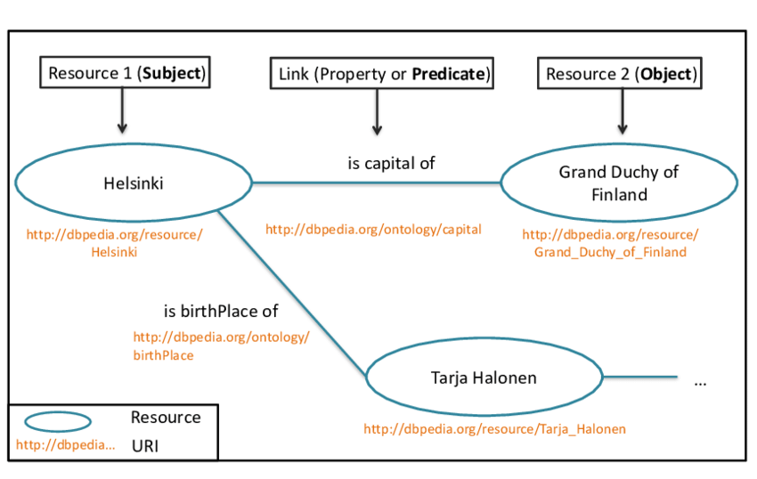

# L'oltretesto

## Lezione 09 del corso di _Digital Humanities e Data Management per i Beni Culturali_ (2024/2025)

###### Sebastian Barzaghi | [sebastian.barzaghi2@unibo.it](mailto:sebastian.barzaghi2@unibo.it) | [https://orcid.org/0000-0002-0799-1527](https://orcid.org/0000-0002-0799-1527) | [https://www.unibo.it/sitoweb/sebastian.barzaghi2/](https://www.unibo.it/sitoweb/sebastian.barzaghi2/)

---

## RDF

---

### Resource Description Framework

<div style="display: flex; align-items: center;">
  <div style="flex: 2;">
    <figure>
      
      <figcaption>
          Fonte: Bernard, C. (2019). Immersing evolving geographic divisions in the semantic Web (Doctoral dissertation, Université Grenoble Alpes). <a href="https://theses.hal.science/tel-02524361v1">https://theses.hal.science/tel-02524361v1</a>. 
      </figcaption>
    </figure>
  </div>
  <div style="flex: 1;">
    <p>
      Modello di dati standard che permette di rappresentare, descrivere, e pubblicare i dati sul Web in un formato accessibile e interpretabile dalle macchine tramite l'utilizzo di triple soggetto-predicato-oggetto.
    </p>
  </div>
</div>

<div class="footer">
Jonathan Blaney, "Introduction to the Principles of Linked Open Data," Programming Historian 6 (2017), <a href="https://doi.org/10.46430/phen0068">https://doi.org/10.46430/phen0068</a>. 
</div>

---

###  L’unità minima nei LOD: la tripla RDF

<div style="display: flex; align-items: center;">
  <div style="flex: 1;">
    <figure>
    
      <figcaption>
          Fonte: Jonathan Blaney, "Introduction to the Principles of Linked Open Data," Programming Historian 6 (2017), <a href="https://doi.org/10.46430/phen0068">https://doi.org/10.46430/phen0068</a>.
      </figcaption>
    </figure>
  </div>
  <div style="flex: 1;">
      <p>
        Un'asserzione informativa riguardante una risorsa che si articola in:
      </p>
      <p>
        <ul>
          <li>Soggetto: una risorsa trattata nell'asserzione;</li>
          <li>Predicato: una caratteristica del soggetto;</li>
          <li>Oggetto: una risorsa o un valore espresso dal predicato.</li>
        </ul>
      </p>
  </div>
</div>

<div class="footer">
Jonathan Blaney, "Introduction to the Principles of Linked Open Data," Programming Historian 6 (2017), <a href="https://doi.org/10.46430/phen0068">https://doi.org/10.46430/phen0068</a>. 
</div>

---

### Riprendiamo il nostro esempio con Neuromante

> <span class="entity">Neuromante</span>, <span class="relation">scritto da</span> <span class="entity">William Gibson</span> (una <span class="class">persona</span>) e <span class="attribute">pubblicato nel 1984</span>, <span class="relation">è un</span> <span class="class">libro</span> <span class="attribute">di 271 pagine</span> e <span class="relation">di genere</span> <span class="entity">cyberpunk</span> (un <span class="class">genere</span>).

Individuiamo <span class="class">classi</span>, <span class="entity">entità</span>, <span class="attribute">attributi</span> e <span class="relation">relazioni</span>.

---

### Riprendiamo il nostro esempio con Neuromante

* <span class="entity">Neuromante</span> <span class="relation">è un</span> <span class="class">libro</span>;
* <span class="entity">William Gibson</span> <span class="relation">è una</span> <span class="class">persona</span>;
* <span class="entity">cyberpunk</span> <span class="relation">è un</span> <span class="class">genere</span>;
* <span class="entity">Neuromante</span> <span class="relation">scritto da</span> <span class="entity">William Gibson</span>;
* <span class="entity">Neuromante</span> <span class="attribute">pubblicato nel</span> "1984";
* <span class="entity">Neuromante</span> <span class="attribute">ha pagine</span> "271";
* <span class="entity">Neuromante</span> <span class="relation">ha genere</span> <span class="entity">cyberpunk</span>.

---

### I dati in RDF formano un grafo

Le triple RDF sono rappresentabili in **nodi** e **archi** di un grafo:
- un nodo per il soggetto;
- un arco per il predicato, diretto dal soggetto all'oggetto;
- un nodo per l'oggetto.

---

### I dati in RDF formano un grafo

<div style="display: flex; align-items: center;">
  <div style="flex: 1;">
    <figure>
    
      <figcaption>
          Fonte: propria.
      </figcaption>
    </figure>
  </div>
  <div style="flex: 1;">
      <ul>
        <li><span class="entity">Neuromante</span> <span class="relation">è un</span> <span class="class">libro</span>;</li>
        <li><span class="entity">William Gibson</span> <span class="relation">è una</span> <span class="class">persona</span></li>
        <li><span class="entity">cyberpunk</span> <span class="relation">è un</span> <span class="class">genere</span>;</li>
        <li><span class="entity">Neuromante</span> <span class="relation">scritto da</span> <span class="entity">William Gibson</span>;</li>
        <li><span class="entity">Neuromante</span> <span class="attribute">pubblicato nel</span> "1984";</li>
        <li><span class="entity">Neuromante</span> <span class="attribute">ha pagine</span> "271";</li>
        <li><span class="entity">Neuromante</span> <span class="relation">ha genere</span> <span class="entity">cyberpunk</span>.</li>
      </ul>
  </div>
</div>

---

### Astrazione: dai dati particolari al modello generale

<div style="display: flex; align-items: center;">
  <div style="flex: 1;">
    <figure>
    
      <figcaption>
          Fonte: propria.
      </figcaption>
    </figure>
  </div>
  <div style="flex: 1;">
      <ul>
        <li><span class="class">Libro</span> <span class="relation">scritto da</span> <span class="class">Persona</span>;</li>
        <li><span class="class">Libro</span> <span class="relation">ha genere</span> <span class="class">Genere</span>;</li>
        <li><span class="class">Libro</span> <span class="attribute">pubblicato nel</span> "data";</li>
        <li><span class="class">Libro</span> <span class="attribute">ha pagine</span> "numero";</li>
      </ul>
  </div>
</div>

---

### Non dimentichiamoci gli URI!

Ricordiamoci che in RDF le risorse e le proprietà devono essere identificate univocamente tramite URI.

Inventiamoci un URI come base per il nostro modello (`http://example.org/dhdmch`) e identifichiamo classi e proprietà:

* <span class="class">Libro</span> diventa <http://example.org/dhdmch/Book>;
* <span class="class">Persona</span> diventa <http://example.org/dhdmch/Person>;
* <span class="class">Genere</span> diventa <http://example.org/dhdmch/Genre>;
* <span class="relation">scritto da</span> diventa <http://example.org/dhdmch/hasCreator>;
* <span class="relation">ha genere</span> diventa <http://example.org/dhdmch/hasGenre>;
* <span class="attribute">pubblicato nel</span> diventa <http://example.org/dhdmch/hasPublicationDate>;
* <span class="attribute">ha pagine</span> diventa <http://example.org/dhdmch/hasNumberOfPages>.

---

### Grafo del modello con URI

<div style="display: flex; align-items: center;">
  <div style="flex: 1;">
    <figure>
    
      <figcaption>
          Fonte: propria.
      </figcaption>
    </figure>
  </div>
  <div style="flex: 1;">
      <ul>
        <li><span class="class">Libro</span> diventa <strong>http://example.org/dhdmch/Book</strong>;</li>
        <li><span class="class">Persona</span> diventa <strong>http://example.org/dhdmch/Person</strong>;</li>
        <li><span class="class">Genere</span> diventa <strong>http://example.org/dhdmch/Genre</strong>;</li>
        <li><span class="relation">scritto da</span> diventa <strong>http://example.org/dhdmch/hasCreator</strong>;</li>
        <li><span class="relation">ha genere</span> diventa <strong>http://example.org/dhdmch/hasGenre</strong>;</li>
        <li><span class="attribute">pubblicato nel</span> diventa <strong>http://example.org/dhdmch/hasPublicationDate</strong>;</li>
        <li><span class="attribute">ha pagine</span> diventa <strong>http://example.org/dhdmch/hasNumberOfPages</strong>.</li>
      </ul>
  </div>
</div>

---

### Anche i dati hanno bisogno di URI

I dati (le istanze, ovvero le entità, come Neuromante e William Gibson), se vogliamo che siano LOD e se scegliamo RDF come strumento di modellazione, devono avere i propri URI.

Inventiamoci un URI per i nostri dati: `http://example.org/data`. 

Non useremo questo URI per <span class="entity">cyberpunk</span>, che invece manterrà l'URI del modello.

* <span class="entity">Neuromante</span> diventa <http://example.org/data/neuromancer>;
* <span class="entity">William Gibson</span> diventa <http://example.org/data/william-gibson>;
* <span class="entity">cyberpunk</span> diventa <http://example.org/dhdmch/cyberpunk>.

---

### Grafo dei dati con URI

<div style="display: flex; align-items: center;">
  <div style="flex: 2;">
    <figure>
    
      <figcaption>
          Fonte: propria.
      </figcaption>
    </figure>
  </div>
  <div style="flex: 1;">
      <ul>
        <li><span class="entity">Neuromante</span> diventa <strong>http://example.org/data/neuromancer</strong>;</li>
        <li><span class="entity">William Gibson</span> diventa <strong>http://example.org/data/william-gibson</strong>;</li>
        <li><span class="entity">cyberpunk</span> diventa <strong>http://example.org/dhdmch/cyberpunk</strong>.</li>
      </ul>
  </div>
</div>

---

### Una precisazione: i _literal_

Ciò che può essere l'oggetto di una tripla RDF e che abbiamo chiamato "valore" (testuale, numerico, temporale, ecc.).

In altre parole, i valori degli <span class="attribute">attributi</span>.

Due tipi:
- **Non tipizzati**: il loro _datatype_ non è specificato (es. `"271"`), e al massimo possono avere un **tag linguistico** reso combinando la stringa con `@` e il valore di una lingua espressa seguendo lo standard [ISO 639-1](https://it.wikipedia.org/wiki/ISO_639-1) (es. `"Stringa in italiano"@it`);
- **Tipizzati**: il loro _datatype_ è specificato combinando la stringa con due `^` e l'URI che identifica quel _datatype_ (es. `"271"^^http://www.w3.org/2001/XMLSchema#integer`).

---

### Una precisazione: come scrivere classi, proprietà ed entità nell'URI

RDF non dà regole vere e proprie su come scrivere, ma esistono convenzioni.

Esempio:
- Le <span class="class">classi</span> iniziano sempre con la lettera maiuscola (es. <span class="class">Book</span>);
- Le proprietà (<span class="relation">relazioni</span> e <span class="attribute">attributi</span>) iniziano sempre con la lettera minuscola (es. <span class="attribute">date</span>);
- Se classi o proprietà sono composti da più parole, in genere sono espresse in `CamelCase` (es. <span class="class">DigitizationProcess</span>, <span class="relation">hasCreator</span>);
- Le <span class="entity">entità</span> iniziano sempre con la lettera minuscola e, se sono composte da più parole, in genere sono tenute assieme dai trattini (es. <span class="entity">optical-scanner</span>).

---

### Una precisazione: i _namespace_

Cosa notate?

> _http://example.org/dhdmch_

> _http://example.org/dhdmch/Book_

---

### Uno è l'URI "del modello", l'altro è di una classe appartenente a quel modello

> _http://example.org/dhdmch_ (URI "del modello")

> _http://example.org/dhdmch/Book_ (URI della classe Book del modello)

---

### La parte di URI in comune fa da "base" per gli URI degli elementi (classi, proprietà, entità): fa cioè da _namespace_

> **_http://example.org/dhdmch_** (URI del modello)

> **_http://example.org/dhdmch_**_/Book_ (URI della classe Book del modello)

---

### L'ultima parte dell'URI dell'elemento si riferisce all'elemento

Inizia con un separatore (di solito un `/` o un `#`).

> _http://example.org/dhdmch_**_/Book_** (URI della classe Book del modello)

---

### Il discorso vale anche per i dati

> _http://example.org/data_
> _http://example.org/data/neuromante_

---

### Un piccolo limite di RDF in quanto modello di dati

Dice _cosa_ fare, ma non dice:
- _Come scrivere triple_: per questo ci sono le **serializzazioni** (es. RDF/XML, Turtle, ecc.) che specificano la **sintassi** da usare;
- _Come esprimere entità e proprietà_: per questo esistono i **modelli semantici** (es. vocabolari controllati, ontologie, ecc.) che specificano il **lessico** da usare.

---

## Turtle

---

### Turtle è una maniera accessibile e leggibile per scrivere triple in RDF

Una tripla in Turtle è scritta sequenziando soggetto, predicato e oggetto uno dopo l'altro e separati da uno spazio.

Una tripla finisce sempre con un punto.

> `[SOGGETTO]` `[PREDICATO]` `[OGGETTO]` .

---

### Anche altre serializzazioni fanno cose simili...

Esempio:
<span class="entity">Neuromante</span> è un <span class="class">libro</span> diventa  

> \<http://example.org/data/neuromancer\> \<http://www.w3.org/1999/02/22-rdf-syntax-ns#type\> \<http://example.org/dhdmch/Book\ >

---

### Ma Turtle è più leggibile, grazie ai _prefissi_

Turtle permette di usare **prefissi** per accorciare gli URI degli elementi (sostituendo la base offerta dai rispettivi modelli) e rendere le triple più leggibili.

`@prefix prefisso: <uri/del/modello/con/separatore/> .`

```
@prefix dhdmch: <http://example.org/dhdmch/> .  
@prefix ex: <http://example.org/data/> .  
@prefix rdf: <http://www.w3.org/1999/02/22-rdf-syntax-ns#> .  

...
```

---

### Turtle: prefissi

I prefissi ci permettono di evitare di dover ripetere l'URI completo ogni volta.

```
@prefix dhdmch: <http://example.org/dhdmch/> .  
@prefix ex: <http://example.org/data/> .  
@prefix rdf: <http://www.w3.org/1999/02/22-rdf-syntax-ns#> .  
@prefix xsd: <http://www.w3.org/2001/XMLSchema#>

ex:neuromante rdf:type dhdmch:Book .
```

---

### Turtle: triple

Per il resto, non è altro che una sequenza di triple.

Se ci dovessero essere URI completi, vanno racchiusi tra caporali.

```
@prefix dhdmch: <http://example.org/dhdmch/> .  
@prefix ex: <http://example.org/data/> .  
@prefix rdf: <http://www.w3.org/1999/02/22-rdf-syntax-ns#> .  
@prefix xsd: <http://www.w3.org/2001/XMLSchema#> .

ex:neuromante rdf:type dhdmch:Book .  
ex:neuromante dhdmch:publicationDate "1984"^^xsd:gYear .  
ex:neuromante dhdmch:genre dhdmch:cyberpunk .  
ex:neuromante dhdmch:creator ex:william-gibson .  
ex:neuromante dhdmch:pages "271"^^xsd:integer .  
ex:william-gibson rdf:type dhdmch:Person .
```

---

### Turtle: triple

Se abbiamo più triple con lo stesso soggetto, possiamo utilizzare una sintassi più elegante, con una prima tripla che esprime il soggetto e tutte le altre indentate sotto la prima che sottointendono il soggetto. 

Ogni tripla che non è l'ultima finisce con il punto e virgola.

```
@prefix dhdmch: <http://example.org/dhdmch/> .  
@prefix ex: <http://example.org/data/> .  
@prefix rdf: <http://www.w3.org/1999/02/22-rdf-syntax-ns#> .  
@prefix xsd: <http://www.w3.org/2001/XMLSchema#> .

ex:neuromante rdf:type dhdmch:Book ;  
  dhdmch:publicationDate "1984"^^xsd:gYear ;  
  dhdmch:genre dhdmch:cyberpunk ;  
  dhdmch:creator ex:william-gibson ;  
  dhdmch:pages "271"^^xsd:integer . 

ex:william-gibson rdf:type dhdmch:Person .
```

---

## Tutto bello... ma l'interoperabilità?

---

### Un ultimo passaggio

In un certo senso, abbiamo già riutilizzato dei modelli esistenti (es. per `xsd:gYear` o `rdf:type`).

Il nostro `dhdmch` è in sostanza la reinvenzione della ruota: esistono già molteplici modelli in grado di descrivere libri (e il dominio bibliografico in senso lato). 

Anche la classe `Persona` e il valore controllato di `cyberpunk`, probabilmente, esistono già.

---

### Riusiamo modelli esistenti, quando possibile

A patto di rispettare le costrizioni logiche dei  modelli esistenti che intendiamo riutilizzare, li possiamo combinare per fare una descrizione interoperabile dei dati diminuendo drasticamente lo sforzo di creazione e favorendo l'interoperabilità dei dati.

Alcuni modelli:
- **FaBiO** (<http://purl.org/spar/fabio>);
- **Dublin Core Terms** (<http://purl.org/dc/terms/>);
- **PRISM** (<http://prismstandard.org/namespaces/basic/2.0/>);
- **FOAF** (<http://xmlns.com/foaf/0.1/>);
- **LC Subject Headings** (<http://id.loc.gov/authorities/subjects>).

---

### Le triple, riscritte con modelli esistenti

- `dhdmch:Book` diventa <http://purl.org/spar/fabio/Book> (abbreviato in `fabio:Book`);
- `dhdmch:publicationDate` diventa <http://prismstandard.org/namespaces/basic/2.0/publicationDate> (abbreviato in `prism:publicationDate`);
- `dhdmch:genre` diventa <http://purl.org/dc/terms/type> (abbreviato in `dct:type`);
- `dhdmch:cyberpunk` diventa <http://id.loc.gov/authorities/subjects/sh2012000080> (abbreviato in `lcsh:sh2012000080`);
- `dhdmch:creator` diventa <http://purl.org/dc/terms/creator> (abbreviato in `dct:creator`);
- `dhdmch:pages` diventa <http://purl.org/spar/fabio/hasPageCount> (abbreviato in `fabio:hasPageCount`);
- `dhdmch:Person` diventa <http://xmlns.com/foaf/0.1/Person> (abbreviato in `foaf:Person`).

---

### Le triple, riscritte con modelli esistenti

```
@prefix ex: <http://example.org/data/> .
@prefix fabio: <http://purl.org/spar/fabio/> .
@prefix dct: <http://purl.org/dc/terms/> .
@prefix foaf: <http://xmlns.com/foaf/0.1/> .
@prefix prism: <http://prismstandard.org/namespaces/basic/2.0/> .
@prefix rdf: <http://www.w3.org/1999/02/22-rdf-syntax-ns#> .
@prefix lcsh: <http://id.loc.gov/authorities/subjects/> .

ex:neuromancer rdf:type fabio:Book ;  
  prism:publicationDate "1984" ;  
  dct:genre lcsh:sh2012000080 ;  
  dct:creator ex:william-gibson ;  
  fabio:hasPageCount "271" .

ex:william-gibson a foaf:Person .
```

---

### Il grafo, riscritto con modelli esistenti

<figure>
  
  <figcaption>
      Fonte: propria.
  </figcaption>
</figure>

---

## Attività pratica

---

### Il dataset Mythologiae è strutturato in 31 colonne

Alcune di questi metadati (es. `dcho_id`, `dcho_title`, `dcho_publication_date`) si riferiscono all' **oggetto digitale** (ovvero la rappresentazione dell'oggetto fisico, creata sul sito).

Altri (es. `cho_title`, `cho_author`, `cho_description`) si riferiscono all'**oggetto fisico**, l'opera reale che viene descritta.

---

### Modelliamo questi metadati usando RDF

- Link al sotto-dataset: <https://docs.google.com/spreadsheets/d/1hD9WdmjwvvfVXOK9iIrBJ9uHix-zcpF-72KCzIkUIDY/edit?usp=sharing> (su GitHub: `tutorial` > `data` > `rdf` > `README.md` > Fonti > Selezione dei dati);
  - 7 colonne: vedete il README per una breve descrizione di ogni colonna;
- Scegliamo una riga di dati;
- Partendo da questi dati, facciamo un piccolo modello in RDF che descrive un'opera, scritto in Turtle;
- Usate la bozza del modello come guida: <https://github.com/dhdmch/tutorial/blob/main/docs/img/draft-model.png> (su GitHub: `tutorial` > `doc` > `img` > `draft-model.png`).

---

### Modelliamo questi metadati usando RDF

- Riutilizziamo questi modelli:
  - **Dublin Core Terms** (<http://purl.org/dc/terms/>) (prefisso `dct`);
  - **Schema.org** (<http://schema.org/>) (prefisso `schema`);
  - **Friend Of A Friend** (<http://xmlns.com/foaf/0.1/>) (prefisso `foaf`);
  - **Art & Architecture Thesaurus** (<http://vocab.getty.edu/page/aat/>) (prefisso `aat`).
- Utilizziamo sempre <http://vscode.dev/> come strumento di scrittura;
- Una volta finito, salvate il file in locale, rinominatelo `[ID].ttl`, dove `[ID]` è l'identificativo dell'opera;
- Caricate il file sul vostro clone della repo `tutorial`, nella cartella `data` > `rdf`, e fate un pull request.

---

# Fine

## Lezione 09 del corso di _Digital Humanities e Data Management per i Beni Culturali_ (2024/2025)

###### Sebastian Barzaghi | [sebastian.barzaghi2@unibo.it](mailto:sebastian.barzaghi2@unibo.it) | [https://orcid.org/0000-0002-0799-1527](https://orcid.org/0000-0002-0799-1527) | [https://www.unibo.it/sitoweb/sebastian.barzaghi2/](https://www.unibo.it/sitoweb/sebastian.barzaghi2/)
