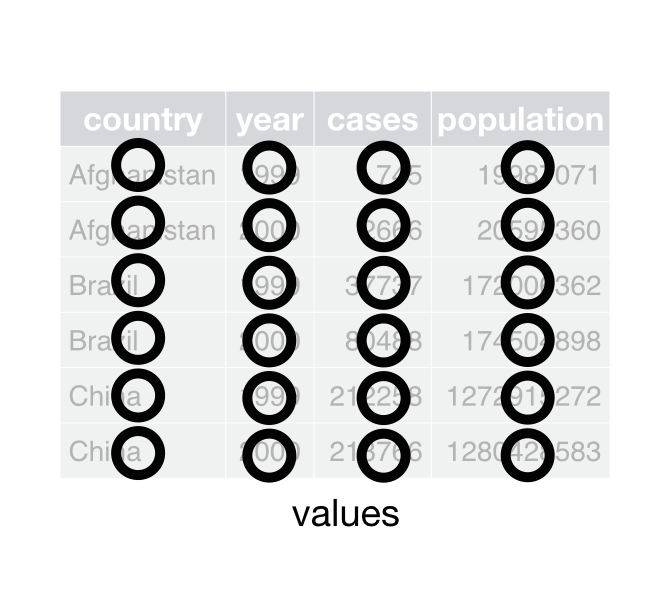
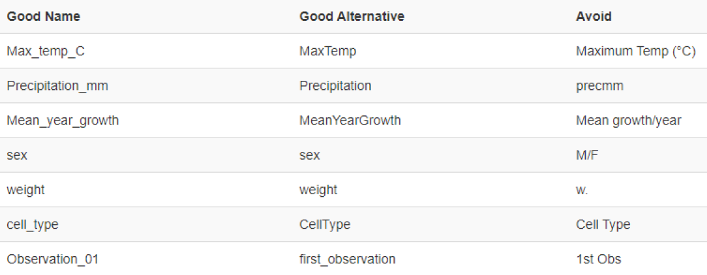

# PROCESS: preparare ed elaborare

## Lezione 10 del corso di _Digital Humanities e Data Management per i Beni Culturali_ (2024/2025)

###### Sebastian Barzaghi | [sebastian.barzaghi2@unibo.it](mailto:sebastian.barzaghi2@unibo.it) | [https://orcid.org/0000-0002-0799-1527](https://orcid.org/0000-0002-0799-1527) | [https://www.unibo.it/sitoweb/sebastian.barzaghi2/](https://www.unibo.it/sitoweb/sebastian.barzaghi2/)

---

### Produzione, raccolta e analisi

  

    <figure>
      
      <figcaption>
        Fonte: Gualandi, B., Caldoni, G., & Marino, M. (2022). Research Data Management: Data Lifecycle. Zenodo. <a href="https://doi.org/10.5281/zenodo.7249051">https://doi.org/10.5281/zenodo.7249051</a>.
      </figcaption>
    </figure>
  

  

      

        Azioni principali: raccogliere o creare i dati, <strong>elaborare i dati per renderli utilizzabili (pulizia, combinazione, trasformazione, controllo qualità)</strong>, analizzare i dati per generare risultati utili, produrre la documentazione dei dati e delle metodologie utilizzate.
      

  

---

### Capiamo i dati che abbiamo

Trovare o creare dei dati è una cosa, ma _capirli_ è un'altra.

Attraverso l'elaborazione di questi dati possiamo cercare di fornirgli un contesto e determinarne il significato. 

Però, anche la più semplice interrogazione richiede che abbiamo una certa comprensione di ciò che c'è in quel dataset, capire se si tratta di "dati buoni".

  University of York (2024). Data: A Practical Guide. <a href="https //subjectguides.york.ac.uk/data">https //subjectguides.york.ac.uk/data</a>.

---

### Capiamo i dati che abbiamo

> "L'appuntamento con il Dott. Watt è martedì alle 14:30 presso il centro medico di Heslington Lane."

Questo testo contiene i seguenti campi di dati:
- Con chi è l'appuntamento;
- Il giorno (data) dell'appuntamento;
- L'orario dell'appuntamento;
- La posizione dell'appuntamento.

Se volessimo registrare gli appuntamenti in un sistema informatico, dovremmo utilizzare _campi separati_ per questi dati — ad esempio, colonne separate in una tabella; elementi e attributi in TEI; classi, proprietà ed entità in RDF; ecc.

  University of York (2024). Data: A Practical Guide. <a href="https //subjectguides.york.ac.uk/data">https //subjectguides.york.ac.uk/data</a>.

---

### Capiamo se i dati che abbiamo sono di qualità

I sistemi informatici e i software sbagliano a leggere i nostri dati, se questi campi non sono separati bene (cioé come ne abbiamo veramente bisogno), oppure se i _datatype_ (stringa, numero, data, booleano, ecc.) sono errati (es. una data che viene riconosciuta come una stringa, oppure una stringa riconosciuta come un numero).

Perché un software possa analizzare correttamente i dati, questi devono essere formattati in modo che il programma possa interpretarli (essere cioé **di qualità**). 

Se i dati non sono di qualità, non sarà possibile eseguire operazioni come ordinare, sommare, calcolare medie, eseguire operazioni di NLP, ecc.

  University of York (2024). Data: A Practical Guide. <a href="https //subjectguides.york.ac.uk/data">https //subjectguides.york.ac.uk/data</a>.

---

### Per essere utilizzabili, i dati devono essere di qualità

... per essere compresi da te in futuro.

... per essere leggibili dalle macchine (_Interoperable_ secondo [FAIR](https://sba.unibo.it/it/almadl/open-access-e-open-science/dati-della-ricerca-aperti)).

... per essere compresi dagli altri (esseri umani e macchine) (_Reusable_ secondo [FAIR](https://sba.unibo.it/it/almadl/open-access-e-open-science/dati-della-ricerca-aperti)).

  UiT The Arctic University of Norway. (2023). Data Cleaning. Zenodo. <a href="https://doi.org/10.5281/zenodo.8375643">https://doi.org/10.5281/zenodo.8375643</a>

---



## Il caos regna

<!--
Photo by <a href="https://unsplash.com/@irfansimsar?utm_content=creditCopyText&utm_medium=referral&utm_source=unsplash">İrfan Simsar</a> on <a href="https://unsplash.com/photos/a-flock-of-birds-flying-over-a-building-Jfc5cBlRv3U?utm_content=creditCopyText&utm_medium=referral&utm_source=unsplash">Unsplash</a>
-->

---

### I dati sono spesso disordinati

Colonne o altri campi potrebbero contenere una miscela di testo e dati numerici, alcune righe potrebbero avere dati mancanti, oppure l'unione di due dataset separati è ostacolata dai nomi dei campi che non corrispondono esattamente.

Dobbiamo avere i dati in un formato utile per le nostre necessità: se stiamo analizzando o visualizzando dati, quali informazioni (e tipi di dati) richiede quell'analisi o visualizzazione?

L'80% del lavoro sui dati è dedicato al processo di pulizia dei dati e alla loro preparazione per ulteriori manipolazioni e analisi.

La pulizia e la preparazione dei dati sono operazioni continue ed iterative.

  University of York (2024). Data: A Practical Guide. <a href="https //subjectguides.york.ac.uk/data">https //subjectguides.york.ac.uk/data</a>.

---

### Il successo dell'elaborazione dei dati dipende dalla qualità dei dati di partenza

Si tratta di garantire che i tuoi dati siano validati e trattabili come vorremmo.

Se abbiamo un campo contenente date "vaghe" — date contenenti annotazioni di testo (ad esempio `c.1810` o `1990-1997`), potremmo volere invece delle date leggibili dalla macchina (ad esempio `1810`, `1990`, ecc.). 

Questo potrebbe significare perdere alcune informazioni e sfumature dai dati, e dovremo tenerne conto nell'analisi; ma almeno avremo dati _parsabili_ dalla macchina che potremo analizzare in modo efficace.

  University of York (2024). Data: A Practical Guide. <a href="https //subjectguides.york.ac.uk/data">https //subjectguides.york.ac.uk/data</a>.

---

### Esempio più semplice: le tabelle

---

### In un mondo perfetto...

Ogni **valore** appartiene a una **variabile** e a un'**osservazione**.

Ogni **variabile** forma una **colonna**.

Ogni **osservazione** forma una **riga**.

  S. Ciston, “A CRITICAL FIELD GUIDE FOR WORKING WITH MACHINE LEARNING DATASETS”, K. Crawford and M. Ananny, Eds., Knowing Machines project, Feb. 2023. <a href="https://knowingmachines.org/critical-field-guide">https://knowingmachines.org/critical-field-guide</a>.

---

### Una colonna per ogni variabile

<figure>
    
    <figcaption>
        Fonte: Wickham, H., Çetinkaya-Rundel, M., & Grolemund, G. (2023). R for data science. O'Reilly Media, Inc. <a href="https://r4ds.had.co.nz/tidy-data.html">https://r4ds.had.co.nz/tidy-data.html</a>.
    </figcaption>
</figure>

  UiT The Arctic University of Norway. (2023). Data Cleaning. Zenodo. <a href="https://doi.org/10.5281/zenodo.8375643">https://doi.org/10.5281/zenodo.8375643</a>.

---

### Una riga per ogni osservazione

<figure>
    
    <figcaption>
        Fonte: Wickham, H., Çetinkaya-Rundel, M., & Grolemund, G. (2023). R for data science. O'Reilly Media, Inc. <a href="https://r4ds.had.co.nz/tidy-data.html">https://r4ds.had.co.nz/tidy-data.html</a>.
    </figcaption>
</figure>

  UiT The Arctic University of Norway. (2023). Data Cleaning. Zenodo. <a href="https://doi.org/10.5281/zenodo.8375643">https://doi.org/10.5281/zenodo.8375643</a>.

---

### Una cella per ogni valore

<figure>
    
    <figcaption>
        Fonte: Wickham, H., Çetinkaya-Rundel, M., & Grolemund, G. (2023). R for data science. O'Reilly Media, Inc. <a href="https://r4ds.had.co.nz/tidy-data.html">https://r4ds.had.co.nz/tidy-data.html</a>.
    </figcaption>
</figure>

  UiT The Arctic University of Norway. (2023). Data Cleaning. Zenodo. <a href="https://doi.org/10.5281/zenodo.8375643">https://doi.org/10.5281/zenodo.8375643</a>.

---



## Errori comuni

<!--
Photo by <a href="https://unsplash.com/@rojekilian?utm_content=creditCopyText&utm_medium=referral&utm_source=unsplash">Sarah Kilian</a> on <a href="https://unsplash.com/photos/brown-ice-cream-cone-52jRtc2S_VE?utm_content=creditCopyText&utm_medium=referral&utm_source=unsplash">Unsplash</a>
-->

---

### La pulizia dei dati è difficile (ma ne vale la pena)!

Può essere riassunta in una serie di attività:
* Preparare i dati;
* Eliminare inutili ridondanze;
* Separare o combinare i valori;
* Gestire errori e incoerenze (es. duplicati, valori nulli, errori di ortografia o formattazione incoerenti, ecc.);
* Standardizzare quando possibile.

  UiT The Arctic University of Norway. (2023). Data Cleaning. Zenodo. <a href="https://doi.org/10.5281/zenodo.8375643">https://doi.org/10.5281/zenodo.8375643</a>

---

### Non modificare mai i dati originali

Fai sempre una copia prima di apportare modifiche.

Esegui il backup dei file.

Tieni traccia di tutti i passaggi.

Salva i tuoi file in codifiche permissive e largamente utilizzate, come [UTF-8](https://www.ionos.it/digitalguide/siti-web/creare-siti/utf-8-codifica-della-comunicazione-digitale-globale/).

Seth van Hooland, Ruben Verborgh, and Max De Wilde, "Cleaning Data with OpenRefine," Programming Historian 2 (2013), <a href="https://doi.org/10.46430/phen0023">https://doi.org/10.46430/phen0023</a>.

---

### Descrivi sempre i dati

Documenta tutto il necessario per capire cosa c'è nel dataset e come utilizzarlo.

Considera di indicare:
* Il "chi", "cosa", "quando", "dove" e "come" dei dati;
* Modalità di reperimento e accesso ai dati;
* Suggerimenti sull'idoneità dei dati per rispondere a domande specifiche;
* Avvertenze sui problemi o le incoerenze note nei dati;
* Informazioni per verificare che i dati siano importati correttamente.

White, E. P., Baldridge, E., Brym, Z. T., Locey, K. J., McGlinn, D. J., & Supp, S. R. (2013). Nine simple ways to make it easier to (re)use your data (e7v2). PeerJ Inc. <a href="https://doi.org/10.7287/peerj.preprints.7v2">https://doi.org/10.7287/peerj.preprints.7v2</a>.

---

### Evita di aggregare commenti e altre informazioni con i dati (1/2)

    

        <figure>
            
            <figcaption>
                Fonte: <a href="https://datacarpentry.org/spreadsheet-ecology-lesson/01-format-data.html">https://datacarpentry.org/spreadsheet-ecology-lesson/01-format-data.html</a>.
            </figcaption>
        </figure>
    

    

        
Inserimento di più di un tipo di informazione in una cella (es. commenti, unità di misura, metadati, ecc.).

    

  UiT The Arctic University of Norway. (2023). Data Cleaning. Zenodo. <a href="https://doi.org/10.5281/zenodo.8375643">https://doi.org/10.5281/zenodo.8375643</a>.

---

### Evita di aggregare commenti e altre informazioni con i dati (2/2)

    

        <figure>
            
            <figcaption>
                Fonte: <a href="https://datacarpentry.org/spreadsheet-ecology-lesson/01-format-data.html">https://datacarpentry.org/spreadsheet-ecology-lesson/01-format-data.html</a>.
            </figcaption>
        </figure>
    

    

        
Aggiungi le informazioni aggiuntive al titolo della colonna o in una colonna separata.

        
Aggiungi i metadati in un documento separato.

    

  UiT The Arctic University of Norway. (2023). Data Cleaning. Zenodo. <a href="https://doi.org/10.5281/zenodo.8375643">https://doi.org/10.5281/zenodo.8375643</a>.

---

### Non utilizzare la formattazione per trasmettere informazioni (1/2)

    

        <figure>
            
            <figcaption>
                Fonte: <a href="https://datacarpentry.org/spreadsheet-ecology-lesson/02-common-mistakes.html">https://datacarpentry.org/spreadsheet-ecology-lesson/02-common-mistakes.html</a>.
            </figcaption>
        </figure>
    

    

        
Es. evidenziare celle, righe o colonne che dovrebbero essere escluse da un'analisi; lasciare righe vuote per indicare separazioni nei dati, ecc.

    

  UiT The Arctic University of Norway. (2023). Data Cleaning. Zenodo. <a href="https://doi.org/10.5281/zenodo.8375643">https://doi.org/10.5281/zenodo.8375643</a>.

---

### Non utilizzare la formattazione per trasmettere informazioni (2/2)

    

        <figure>
            
            <figcaption>
                Fonte: <a href="https://datacarpentry.org/spreadsheet-ecology-lesson/02-common-mistakes.html">https://datacarpentry.org/spreadsheet-ecology-lesson/02-common-mistakes.html</a>.
            </figcaption>
        </figure>
    

    

        
Aggiungi le unità al titolo della colonna o in una colonna separata.

        
Aggiungi le informazioni in una colonna separata.

        
Aggiungi i metadati in un documento separato.

    

  UiT The Arctic University of Norway. (2023). Data Cleaning. Zenodo. <a href="https://doi.org/10.5281/zenodo.8375643">https://doi.org/10.5281/zenodo.8375643</a>.

---

### Non utilizzare più tabelle o più schede

    

        <figure>
            
            <figcaption>
                Fonte: <a href="https://datacarpentry.org/spreadsheet-ecology-lesson/01-format-data.html">https://datacarpentry.org/spreadsheet-ecology-lesson/01-format-data.html</a>.
            </figcaption>
        </figure>
    

    

        
Es. più di una tabella o scheda all'interno di un singolo foglio di calcolo.

        
Se possibile, combina tutto in una tabella unica o mantieni ogni tabella in un file separato.

    

  UiT The Arctic University of Norway. (2023). Data Cleaning. Zenodo. <a href="https://doi.org/10.5281/zenodo.8375643">https://doi.org/10.5281/zenodo.8375643</a>.

---

### Non utilizzare caratteri speciali

    

        <figure>
            
            <figcaption>
                Fonte: <a href="https://datacarpentry.org/spreadsheet-ecology-lesson/01-format-data.html">https://datacarpentry.org/spreadsheet-ecology-lesson/01-format-data.html</a>.
            </figcaption>
        </figure>
    

    

        
Se possibile, evita <a href="https://www.edatlas.it/scarica/1836/Capitolo5/ContenutiDigitali/2EntitaCarattere.pdf">caratteri speciali</a> almeno nelle intestazioni delle colonne: <code>/</code> <code>\</code> <code>:</code> <code>*</code> <code>.</code> <code>?</code> <code>‘</code> <code><</code> <code>></code> <code>[</code> <code>]</code> <code>(</code> <code>)</code> <code>&</code> <code>$</code> <code>æ</code> <code>Æ</code> ...

        
Evita sempre di utilizzare spazi nei titoli delle colonne: invece, utilizza underscore (<code>_</code>) o CamelCase (es. <code>TitoloPrincipale</code>).

    

  UiT The Arctic University of Norway. (2023). Data Cleaning. Zenodo. <a href="https://doi.org/10.5281/zenodo.8375643">https://doi.org/10.5281/zenodo.8375643</a>.

---

### Sii coerente

* Esempio 1: date visualizzate in molti formati diversi ("12 luglio 2024", "12/07/2024", "12-07-2024", ecc.);
  * Utilizza **standard internazionali** (es. [EDTF](https://www.loc.gov/standards/datetime/), [ISO-8601](https://www.ionos.it/digitalguide/siti-web/programmazione-del-sito-web/iso-8601/));
* Esempio 2: nomi visualizzati in molte varianti diverse ("Alessandro Manzoni", "A. Manzoni", "Manzoni", "Manzoni, Alessandro", ecc.);
  * Utilizza **record di autorità** (es. [VIAF](https://viaf.org/), possibilmente inserendo sia il nome leggibile per gli esseri umani sia l'URI al record, se esistente);
* Sii coerente anche nella **capitalizzazione** delle parole, nella scelta dei **delimitatori** e nelle convenzioni di **denominazione** per le variabili;
* Evita di utilizzare il delimitatore usato dal dataset (es. `,`, `;`, `/`, ecc.) nei dati stessi;
* Fai attenzione agli **spazi**!

  UiT The Arctic University of Norway. (2023). Data Cleaning. Zenodo. <a href="https://doi.org/10.5281/zenodo.8375643">https://doi.org/10.5281/zenodo.8375643</a>.

---

### Elimina la ridondanza (con cautela!)

In un'eventuale eliminazione dei dati includi:
* Duplicati;
* Osservazioni irrilevanti;
* Dati incompleti;
* Dati non validi;
* Dati in conflitto.

Sono tutte **interpretazioni**: considera sempre _molto attentamente_ se un'osservazione o una variabile debbano essere eliminate o meno!

  White, E. P., Baldridge, E., Brym, Z. T., Locey, K. J., McGlinn, D. J., & Supp, S. R. (2013). Nine simple ways to make it easier to (re)use your data (e7v2). PeerJ Inc. <a href="https://doi.org/10.7287/peerj.preprints.7v2">https://doi.org/10.7287/peerj.preprints.7v2</a>.

---

### Tratta sempre i valori _NULL_

Usa un metodo coerente che sia compatibile e che non causi errori (come lasciare la cella vuota).

Considera che:
* Può essere difficile sapere se un valore è mancante o è stato trascurato durante l'inserimento dei dati;
* Gli spazi vuoti possono essere confusi quando spazi (`  `) o tabs (`/`) sono usati come delimitatori;
* `NA` e `NULL` sono valori nulli ragionevoli.

  White, E. P., Baldridge, E., Brym, Z. T., Locey, K. J., McGlinn, D. J., & Supp, S. R. (2013). Nine simple ways to make it easier to (re)use your data (e7v2). PeerJ Inc. <a href="https://doi.org/10.7287/peerj.preprints.7v2">https://doi.org/10.7287/peerj.preprints.7v2</a>.

---

### Esegui sempre un controllo di qualità

Verifica:
* Errori grammaticali;
* Uso incoerente di maiuscole e minuscole;
* Titoli incoerenti per le colonne;
* Unità di misura incoerenti, tipi di dati incoerenti (es. numero, stringa), schemi di denominazione, ecc.;
* Valori fuori intervallo.

  White, E. P., Baldridge, E., Brym, Z. T., Locey, K. J., McGlinn, D. J., & Supp, S. R. (2013). Nine simple ways to make it easier to (re)use your data (e7v2). PeerJ Inc. <a href="https://doi.org/10.7287/peerj.preprints.7v2">https://doi.org/10.7287/peerj.preprints.7v2</a>.

---

### Quando hai finito, esporta e condividi

Utilizza una licenza aperta per far sapere agli altri esattamente cosa possono e non possono fare con i dati (es. [Creative Commons Zero (CC0)](https://creativecommons.org/publicdomain/zero/1.0/)).

Utilizza formati aperti per rendere i dati interoperabili (es. [CSV](https://en.wikipedia.org/wiki/Comma-separated_values)), quando possibile.

Considera di condividere i tuoi dati su [GitHub](https://github.com/) e/o di pubblicarli su un repository (es. [Zenodo](https://zenodo.org/), [Figshare](https://figshare.com/), ecc.) per renderli visibili, accessibili, e versionati.

  White, E. P., Baldridge, E., Brym, Z. T., Locey, K. J., McGlinn, D. J., & Supp, S. R. (2013). Nine simple ways to make it easier to (re)use your data (e7v2). PeerJ Inc. <a href="https://doi.org/10.7287/peerj.preprints.7v2">https://doi.org/10.7287/peerj.preprints.7v2</a>.

---

# Fine

## Lezione 10 del corso di _Digital Humanities e Data Management per i Beni Culturali_ (2024/2025)

###### Sebastian Barzaghi | [sebastian.barzaghi2@unibo.it](mailto:sebastian.barzaghi2@unibo.it) | [https://orcid.org/0000-0002-0799-1527](https://orcid.org/0000-0002-0799-1527) | [https://www.unibo.it/sitoweb/sebastian.barzaghi2/](https://www.unibo.it/sitoweb/sebastian.barzaghi2/)
