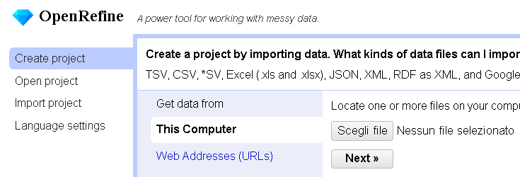
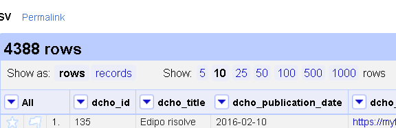
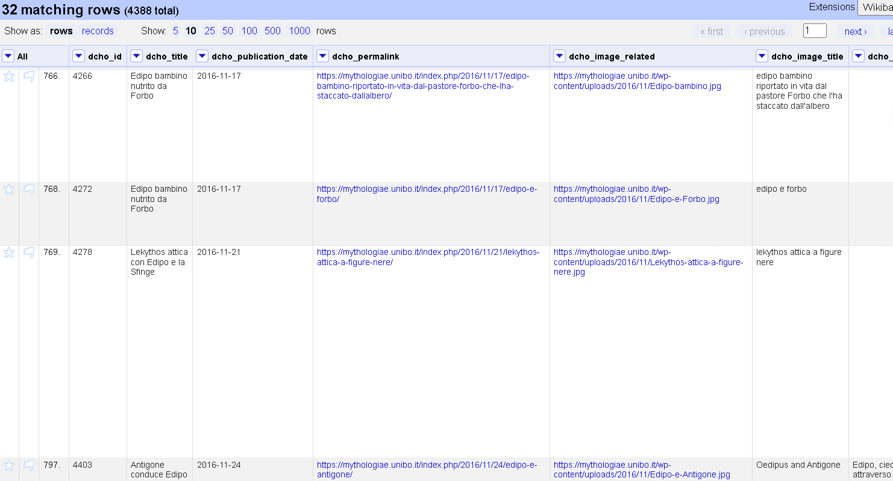
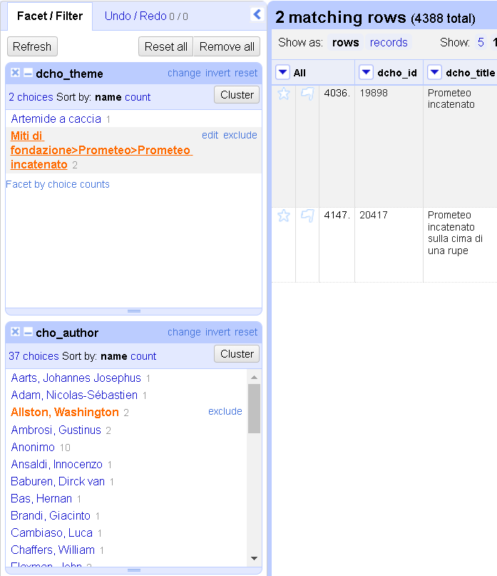
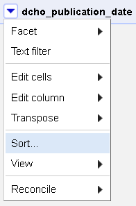
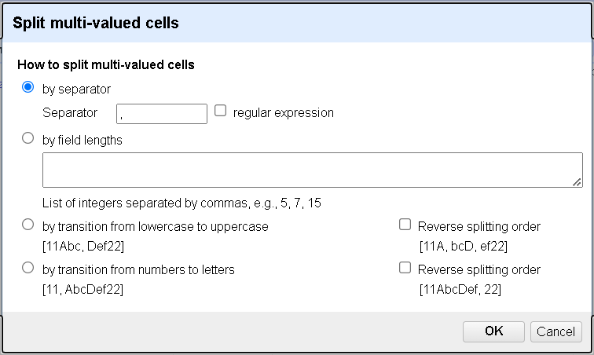

# Dai la cera, togli la cera 

## Lezione 11 del corso di _Digital Humanities e Data Management per i Beni Culturali_ (2024/2025)

###### Sebastian Barzaghi | [sebastian.barzaghi2@unibo.it](mailto:sebastian.barzaghi2@unibo.it) | [https://orcid.org/0000-0002-0799-1527](https://orcid.org/0000-0002-0799-1527) | [https://www.unibo.it/sitoweb/sebastian.barzaghi2/](https://www.unibo.it/sitoweb/sebastian.barzaghi2/)

---

## OpenRefine

---

### Uno strumento per la pulizia dei dati

OpenRefine permette di:
* Identificare e correggere errori;
* Combinare dati da diverse fonti;
* Non modifica il file originale;
* Tutte le azioni sono reversibili e tracciate;
* La documentazione può essere pubblicata insieme ai dati;
* Il flusso di lavoro può essere salvato e applicato a nuovi dataset.

  Baker, J., Moore, C., Priego, E., Alegre, R., Cope, J., Price, L., ... & Wilson, G. (2016). Library Carpentry: software skills training for library professionals. Liber Quarterly: The Journal of European Research Libraries, 26(3), 141-162. <a href="http://dx.doi.org/10.18352/lq.10176">http://dx.doi.org/10.18352/lq.10176</a>.

---

### Alcuni scenari di utilizzo

* Vuoi sapere quante volte un certo valore appare in una colonna in un dataset;
* Vuoi sapere come i valori sono distribuiti in tutto il dataset;
* Vuoi allineare date formattate in modi diversi ad un unico formato comune;
* Vuoi normalizzare nomi o termini che, pur riferendosi alle stesse entità, differiscono tra loro;
* Vuoi separare frammenti di dati combinati insieme in dati individuali;
* Vuoi riconciliare i dati ad una fonte esterna.

  Baker, J., Moore, C., Priego, E., Alegre, R., Cope, J., Price, L., ... & Wilson, G. (2016). Library Carpentry: software skills training for library professionals. Liber Quarterly: The Journal of European Research Libraries, 26(3), 141-162. <a href="http://dx.doi.org/10.18352/lq.10176">http://dx.doi.org/10.18352/lq.10176</a>.

---

### Installazione di OpenRefine

* Scarica OpenRefine: [https://openrefine.org/download.html](https://openrefine.org/download.html);
  * Dovrebbe già includere Java Runtime Environment;
  * Se non funziona, scarica e installa anche Java Runtime Environment: [https://www.java.com/it/](https://www.java.com/it/);
* Decomprimi il file scaricato;
* Fai doppio clic su `openrefine.exe` (su Windows), `openrefine.dmg` (su OS) o `refine.bat`;
* Accedi all'interfaccia su un browser web all'indirizzo [http://127.0.0.1:3333](http://127.0.0.1:3333).

---

### Creazione di un progetto (1/3)

    

        
    

    

      <ul>
        <li>Scarica il dataset su cui lavorare: <a href="https://docs.google.com/spreadsheets/d/1Gbzev9aD1z-uwklFN3ie92XA8dQdwI1hW7KFQX7OyN0/edit?usp=sharing">https://docs.google.com/spreadsheets/d/1Gbzev9aD1z-uwklFN3ie92XA8dQdwI1hW7KFQX7OyN0/edit?usp=sharing</a>;</li>
        <li>In <em>Create Project</em> > <em>This computer</em>, clicca su <em>Choose files</em> e carica il dataset appena scaricato;</li>
        <li>Clicca su <em>Next</em>.</li>
      </ul>
    

---

### Creazione di un progetto (2/3)

    

        
    

    

      <ul>
        <li>In <em>Parse data as</em> > <em>CSV / TSV / separator-based files</em>;</li>
        <li><em>Character encoding</em> deve avere <code>UTF-8</code> come valore;</li>
        <li>Seleziona <em>Columns are separated by</em> > <em>commas (CSV)</em>;</li>
        <li>Spunta <em>Use character <code>"</code> to enclose cells containing column separators</em>;</li>
        <li>Spunta <em>Trim leading & trailing whitespace from strings</em>.</li>
      </ul>
    

---

### Creazione di un progetto (3/3)

    

        
    

    

      <ul>
        <li>Seleziona <em>Parse next <code>1</code> line(s) as column headers</em>;</li>
        <li>Spunta <em>Store blank rows</em>;</li>
        <li>Spunta <em>Store blank cells as nulls</em>;</li>
        <li>Clicca su <em>Create project</em>.</li>
      </ul>
    

---

### Schermata del progetto (1/2)

    

        
    

    

      <ul>
        <li><code>Permalink</code> ti consente di tornare ad uno stato di visualizzazione specifico del progetto, con filtri e faccette applicati, inserendo informazioni specifiche della visualizzazione direttamente nell'URL.</li>
      </ul>
    

---

### Schermata del progetto (2/2)

    

        
    

    

      <ul>
        <li><code>Open</code> apre una nuova scheda del browser mostrando la schermata di creazione del progetto per modificare le impostazioni, avviare un nuovo progetto o aprire un progetto esistente;</li>
        <li><code>Export</code> ti consente di selezionare un formato per esportare il dataset;</li>
        <li><code>Help</code> apre una nuova scheda del browser contenente un manuale utente.</li>
      </ul>
    

---

### Schermata della griglia

    

        
    

    

      <ul>
        <li>Visualizzazione dei dati in formato tabellare;</li>
        <li>Numero totale di righe;</li>
        <li>Modalità rows vs modalità records;</li>
        <li>Numero di righe/record visibili su schermo contemporaneamente.</li>
      </ul>
    

---

### Facet/Filter

    

        
    

    

      
Modi principali per esplorare i dati, mostrando pattern, tendenze e sottogruppi;

      <ul>
        <li><code>Refresh</code> aggiorna ciascuna facet con le informazioni più recenti;</li>
        <li><code>Reset all</code> resetta tutte le faccette senza rimuoverle;</li>
        <li><code>Remove all</code> rimuove tutte le faccette.</li>
      </ul>
    

---

### Undo/Redo

    

        
    

    

      <ul>
        <li>Storico del progetto come elenco di modifiche in ordine cronologico;</li>
        <li>Salvataggio automatico ogni 5 minuti e alla chiusura con <code>CTRL + C</code>;</li>
        <li>Ogni attività che modifica i dati può essere annullata;</li>
        <li>La cronologia delle modifiche di ciascun progetto è salvata insieme al progetto stesso.</li>
      </ul>
    

---

### Modalità rows

    

        
    

    

      <ul>
        <li><strong>Row</strong>: una serie di celle, una cella per colonna;</li>
        <li>A volte, ci sono più informazioni in una singola cella (esempio: <code>dcho_keyword</code>);</li>
        <li>In questi casi, se riesci a dividere correttamente questi valori, puoi utilizzare la modalità <strong>records</strong> di OpenRefine per visualizzarli correttamente.</li>
      </ul>
    

---

### Modalità records

    

        
    

    

      <ul>
        <li><strong>Record</strong>: una collezione di una o più righe;</li>
        <li>Le molteplici informazioni in una singola cella (esempio: <code>dcho_keyword</code>), una volta divise, vengono visualizzate ognuna in una riga diversa, ma appartengono allo stesso record;</li>
        <li>Funziona dopo aver eseguito uno <emph>split</emph>, un'operazione che vedremo tra poco.</li>
      </ul>
    

---

### Esplora i dati con le Facet (1/2)

**Facet**: un aspetto della varianza dei dati in una colonna.

Fornisce una visione d'insieme dei dati.

Consente ulteriori operazioni, come il filtraggio e il clustering.

---

### Esplora i dati con le Facet (2/2)

    

        
    

    

      <ul>
        <li>Tipicamente, si crea una facet su una particolare colonna;</li>
        <li>Fai clic sul <em>triangolo</em> davanti al nome della colonna (esempio: <code>dcho_theme</code>);</li>
        <li>Seleziona <em>Facet</em>;</li>
        <li>Seleziona una facet a tua scelta (esempio: <em>Text facet</em>).</li>
      </ul>
    

---

### Text facet (1/2)

    

        
    

    

      <ul>
        <li>Prende il contenuto totale delle celle della colonna in questione e le abbina;</li>
        <li>Ordina per nome o conteggio;</li>
        <li>Modifica in massa ogni cella identica nella colonna;</li>
        <li>Ottimo per esaminare i dati e correggere errori di battitura, spazi in eccesso, ecc.</li>
      </ul>
    

---

### Text facet (2/2)

    

        
    

    

      <ul>
        <li>Molteplici facet sono impilate una sopra l'altra (esempio: nell'immagine viene aggiunta <code>cho_author</code>).</li>
      </ul>
    

---

### Filter (1/2)

    

        
    

    

      <ul>
        <li>I filtri possono essere aggiunti su una colonna;</li>
        <li>Utili per identificare più precisamente dei dati;</li>
        <li>Clicca sulla freccia e seleziona <em>Text filter</em>.</li>
      </ul>
    

---

### Filter (2/2)

    

        
    

    

      <ul>
        <li>I filtri condividono lo stesso spazio con le facet;</li>
        <li>Digita il testo da cercare (esempio: "edipo") per restituire le righe con quel testo contenuto in quella colonna;</li>
        <li>Sensibilità alle maiuscole e minuscole disattivata di default.</li>
      </ul>
    

---

### Filtrare con i Facet (1/3)

    

        
    

    

      <ul>
        <li>È possibile filtrare anche tramite facet;</li>
        <li>Clicca su qualsiasi voce in un filtro (esempio: "Allston, Washington" nella facet <code>cho_author</code>);</li>
        <li>Vengono visualizzate solo le righe con quel valore in quella colonna.</li>
      </ul>
    

---

### Filtrare con i Facet (2/3)

    

        
    

    

      <ul>
        <li>Puoi usare più facet per migliorare il filtraggio.</li>
      </ul>
    

---

### Filtrare con i Facet (3/3)

    

        
    

    

      <ul>
        <li>Puoi usare facet personalizzati per ottenere determinati effetti (esempio: filtrare le righe con celle vuote).</li>
      </ul>
    

---

### Sort (1/2)

    

        
    

    

      <ul>
        <li>Puoi determinare l'ordine in cui vengono mostrate le righe in base ad alcune condizioni.</li>
        <li>Clicca sulla freccia e seleziona <em>Sort</em>.</li>
      </ul>
    

---

### Sort (2/2)

    

        
    

    

      <ul>
        <li>Seleziona come trattare i valori delle celle durante l'ordinamento (esempio: se sono date, molto probabilmente vorrai selezionare <em>date</em>);</li>
        <li>Puoi anche selezionare l'ordine effettivo (esempio: prima tutti i valori validi, poi quelli errati, poi quelli mancanti);</li>
        <li>Clicca su <em>OK</em>.</li>
      </ul>
    

---

### Cluster (1/3)

    

        
    

    

      <ul>
        <li>Un ottimo modo per correggere le incongruenze trovate con le facet;</li>
        <li>Utilizza una varietà di metodi di confronto per trovare diciture simili ma non identiche, e mostrarle in modo da rendere possibile l'allineamento dei valori che dovrebbero essere uguali;</li>
        <li>Crea una facet;</li>
        <li>Clicca su <em>Cluster</em>.</li>
      </ul>
    

---

### Cluster (2/3)

    

        
    

    

      <ul>
        <li>Clicca su <em>Cluster</em>;</li>
        <li>Prova diversi algoritmi per rilevare vari cluster;</li>
        <li>Per ogni cluster, puoi unire i valori sostituendoli con un valore unico e coerente;</li>
        <li>Per impostazione predefinita, il valore più comune nel cluster viene utilizzato come nuovo valore, ma puoi cambiarlo.</li>
      </ul>
    

 

---

### Cluster (3/3)

    

        
    

    

      <ul>
        <li>Prova diversi algoritmi per rilevare vari cluster;</li>
        <li>Per ogni cluster, puoi unire i valori spuntando <em>Merge?</em>;</li>
        <li>Clicca su <em>Merge selected & re-cluster</em> per verificare e su <em>Merge selected & Close</em> per terminare.</li>
      </ul>
    

---

### Modifica delle celle

OpenRefine offre numerose funzionalità per modificare e migliorare il contenuto delle celle in modo automatico ed efficiente.

* Modifica tramite una facet di testo: clicca su _Edit_ a destra della facet e inserisci un nuovo valore;
* Utilizzo della funzione trova/sostituisci: seleziona _Edit cells_ > _Replace_ per inserire una stringa da cercare e una stringa da sostituire;
* Modifica delle singole celle: passa il mouse su una cella e clicca su _Edit_.

---

### Split (1/2)

    

        
    

    

      <ul>
        <li>A volte una cella può contenere più valori (esempio: colonna <code>dcho_keyword</code>, con più valori separati da virgole <code>,</code>);</li>
        <li>Fondamentale per la modalità <emph>records</emph>;</li>
        <li>Fai clic sulla freccia e seleziona <em>Edit cells</em>;</li>
        <li>Seleziona <em>Split multi-valued cells</em>.</li>
      </ul>
    

---

### Split (2/2)

    

        
    

    

      <ul>
        <li>Puoi decidere come dividere le celle;</li>
        <li>Idealmente, dovresti sempre usare nel testo un separatore (esempio: <code>,</code>, <code>|</code>, <code>;</code>, ecc.), e indicarlo qui;</li>
        <li>Clicca su <em>OK</em>.</li>
      </ul>
    

---

### Transform

Un meccanismo potente per applicare modifiche che non possono essere ottenute tramite semplici facet, filtri o cluster.

* Eliminare spazi bianchi iniziali e finali;
* Dividere i dati in più colonne;
* Rimuovere la punteggiatura;
* Standardizzare un formato di dati;
* Estrarre un particolare tipo di dati da una stringa di testo.

Possono essere preimpostate o scritte ad hoc in un linguaggio chiamato GREL.

---

### Reconcile (1/5)

Processo semi-automatico di allineamento dei dati a fonti esterne.

Utile per:
* Correggere errori di ortografia o variazioni nei nomi propri;
* Pulire i valori inseriti manualmente confrontandoli con file di autorità;
* Collegare i tuoi dati a un dataset esistente.

È necessario il giudizio umano per rivedere e approvare i risultati.

Avviene di default tramite ricerca di stringhe, quindi pulisci e raggruppa i dati prima di riconciliarli!

---

### Reconcile (2/5)

    

        
    

    

      <ul>
        <li>Clicca sulla freccia e seleziona <em>Reconcile</em>;</li>
        <li>Seleziona <em>Start reconciling</em>.</li>
      </ul>
    

---

### Reconcile (3/5)

    

        
    

    

      <ul>
        <li>Seleziona il servizio di riconciliazione (esempio: <code>VIAF</code>);</li>
        <li>Clicca su <em>Next</em>.</li>
      </ul>
    

---

### Reconcile (4/5)

    

        
    

    

      <ul>
        <li>A seconda della colonna e del servizio di riconciliazione selezionato, scegli il tipo di entità che desideri riconciliare (esempio: <code>Person</code>);</li>
        <li>Clicca su <em>Start reconciling</em>.</li>
      </ul>
    

---

### Reconcile (5/5)

    

        
    

    

      <ul>
        <li>Alcuni valori delle celle vengono riconciliati direttamente (esempio: <em>Houdon, Jean Antoine</em>);</li>
        <li>Altri richiedono una validazione manuale (esempio: <em>Gérard, Francois Baron</em>);</li>
        <li>Cliccare sul <em>segno di spunta singolo</em> per riconciliare solo quella cella, o sul <em>segno di spunta doppio</em> per estenderlo a tutte le celle identiche.</li>
      </ul>
    

---

## Attività pratica

---

### Alcune colonne problematiche in Mythologiae

* Link al sotto-dataset: <https://docs.google.com/spreadsheets/d/1Gbzev9aD1z-uwklFN3ie92XA8dQdwI1hW7KFQX7OyN0/edit?usp=sharing>;
* Su GitHub: `tutorial` > `data` > `csv` > `README.md` > 3. Dataset Keyword e Autori > Fonti > Selezione di colonne.

Le colonne sono:
* `dcho_keyword`: parole chiave assegnate alla rappresentazione digitale dell'opera;
* `cho_author`: creatore dell'opera.

---

### dcho_keyword

* Impostare un separatore comune (`|`), sostituendo quindi quelli (plurale!) esistenti (ricordati di rimuovere anche gli spazi vuoti, prima e/o dopo!);
* Dividere i valori (_split_);
* Raggruppare i valori (_cluster_);
* Correggere eventuali valori;
* Normalizzare i valori NULL (esempio: cella vuota &rarr; `NULL`);
  * Attenzione: usa `NULL` solo per le celle già vuote, prima dello split; se tra più parole chiave ne hai una vuota, elimina solo quella e mantieni le altre.

---

### cho_author

* Raggruppare i valori (_cluster_);
* Correggere eventuali valori;
* Normalizzare i valori NULL (esempio: cella vuota &rarr; `NULL`);
* Riconciliare i valori con VIAF ("Person").

---

### Cos'altro fare

* Salvare il dataset ripulito in formato `.csv`;
* Salvare i passaggi in un file `.json` separato;
* Caricare entrambi in una cartella `mythologiae_keyword_author_v0.1.0` da mettere in `tutorial` > `data` > `csv`.

---

# Fine

## Lezione 11 del corso di _Digital Humanities e Data Management per i Beni Culturali_ (2024/2025)

###### Sebastian Barzaghi | [sebastian.barzaghi2@unibo.it](mailto:sebastian.barzaghi2@unibo.it) | [https://orcid.org/0000-0002-0799-1527](https://orcid.org/0000-0002-0799-1527) | [https://www.unibo.it/sitoweb/sebastian.barzaghi2/](https://www.unibo.it/sitoweb/sebastian.barzaghi2/)
