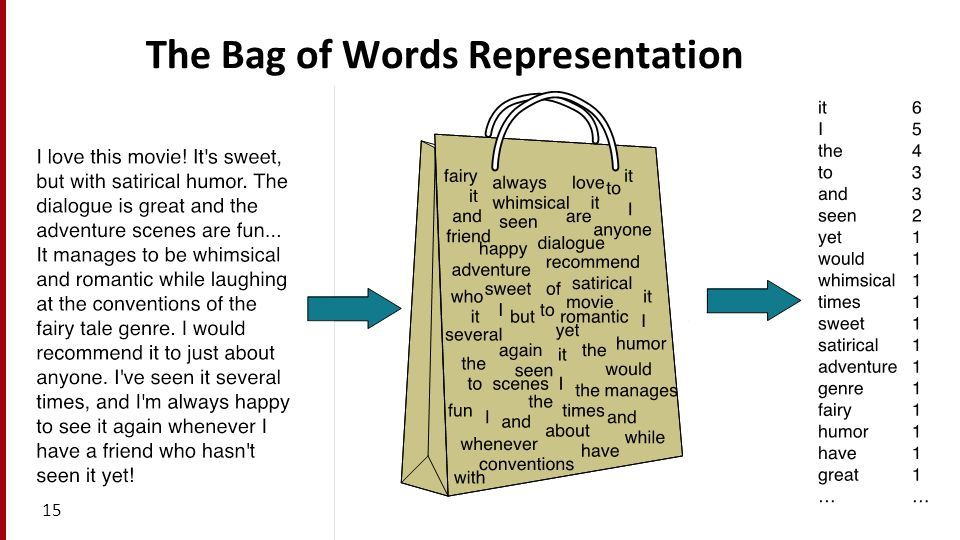
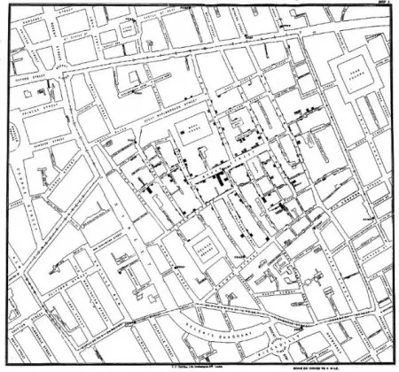
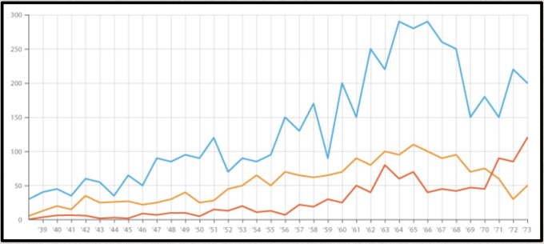
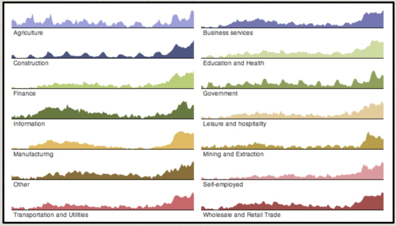
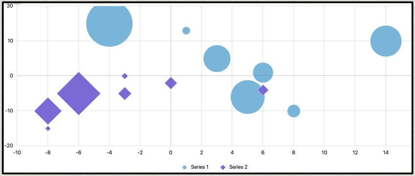
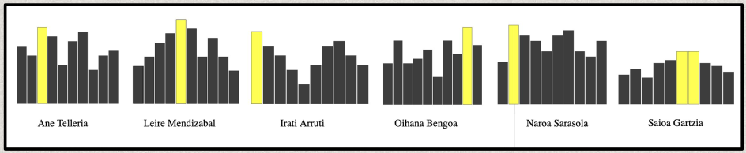
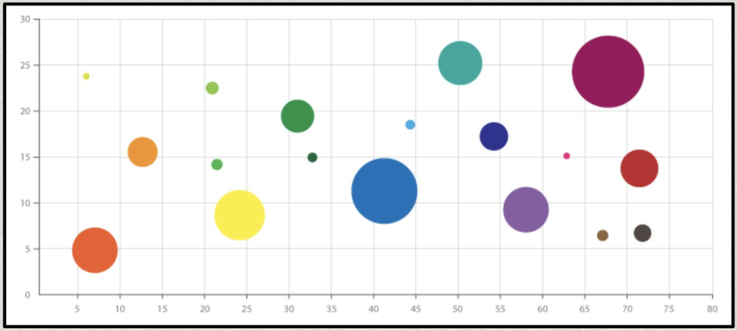
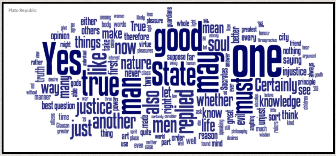
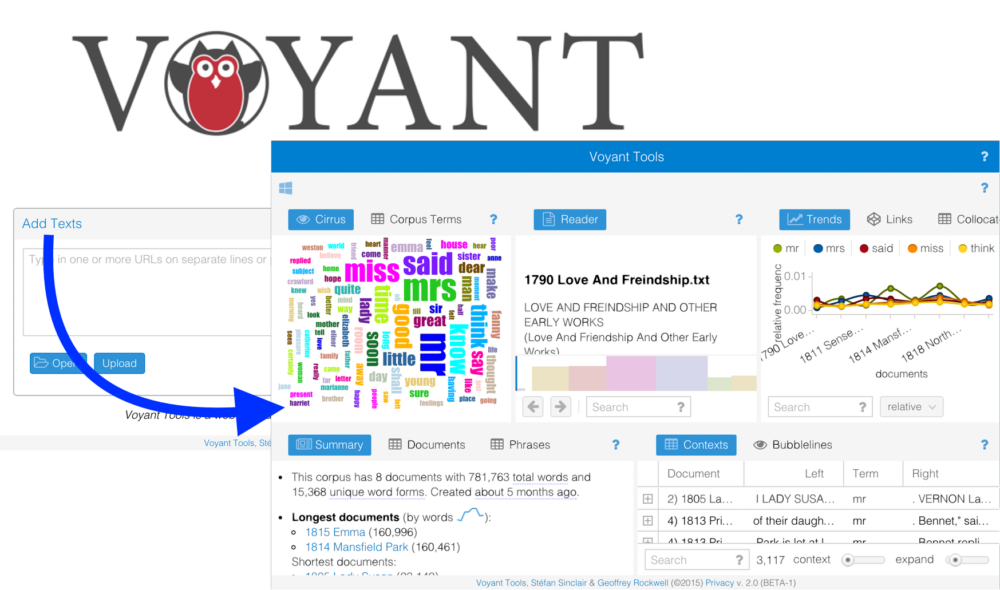
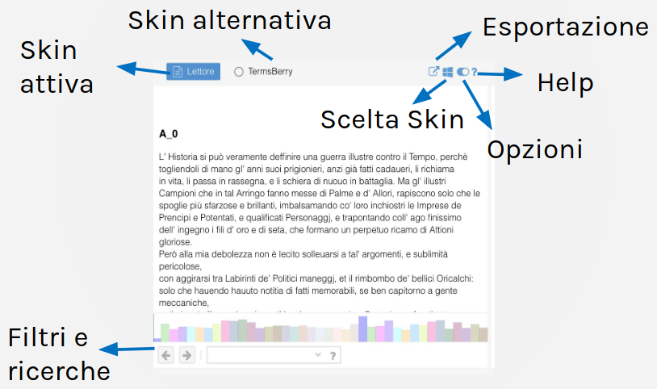

# ANALYZE: Analizzare

## Lezione 12 del corso di _Digital Humanities e Data Management per i Beni Culturali_ (2024/2025)

###### Sebastian Barzaghi | [sebastian.barzaghi2@unibo.it](mailto:sebastian.barzaghi2@unibo.it) | [https://orcid.org/0000-0002-0799-1527](https://orcid.org/0000-0002-0799-1527) | [https://www.unibo.it/sitoweb/sebastian.barzaghi2/](https://www.unibo.it/sitoweb/sebastian.barzaghi2/)

---

### Produzione, raccolta e analisi

  

    <figure>
      
      <figcaption>
        Fonte: Gualandi, B., Caldoni, G., & Marino, M. (2022). Research Data Management: Data Lifecycle. Zenodo. <a href="https://doi.org/10.5281/zenodo.7249051">https://doi.org/10.5281/zenodo.7249051</a>.
      </figcaption>
    </figure>
  

  

      

        Azioni principali: raccogliere o creare i dati, elaborare i dati per renderli utilizzabili (pulizia, combinazione, trasformazione, controllo qualità), <strong>analizzare i dati per generare risultati utili</strong>, produrre la documentazione dei dati e delle metodologie utilizzate.
      

  

---

## Per capire bisogna analizzare

---

### Parte tutto dalla _data literacy_ 

La capacità di leggere, creare, usare, comunicare e criticare i dati.

Dipende dalla qualità, accessibilità, usabilità e comprensibilità dei dati, sulla base del loro contenuto e contesto.

Per esempio, nell'ambito umanistico, consiste nel riconoscimento delle potenzialità della ricerca che si sta portando avanti, essere cosciente dei metodi di ricerca che si sta utilizzando, e comprendere il contesto e la provenienza dei dati.

Koltay, T. (2017). Data literacy for researchers and data librarians. Journal of Librarianship and Information Science, 49(1), 3-14. <a href="https://doi.org/10.1177/0961000615616450">https://doi.org/10.1177/0961000615616450</a>.

---

### La _data analysis_ è lo strumento

Processo di esplorazione ed elaborazione dei dati per identificare pattern e tendenze nei dati.

Obiettivo: trasformare i dati grezzi in informazioni utili.

Processo:
    - Raccolta dei dati
    - Pulizia dei dati
    - **Esplorazione ed elaborazione dei dati**
    - **Interpretazione e comunicazione dei risultati**

Graham, E. (2017). Introduction: Data visualisation and the humanities. English Studies, 98(5), 449-458. <a href="https://doi.org/10.1080/0013838X.2017.1332021">https://doi.org/10.1080/0013838X.2017.1332021</a>.

---

### Altre tipologie di dati

1. Dati
    - **Testuali**: stringhe di testo (es. descrizioni di opere d'arte) che possono essere utilizzate per analizzare il linguaggio utilizzato, identificare parole chiave, o esplorare il contenuto di testi storici attraverso l'analisi di frequenze o sentimenti;
    - **Numerici**: quantità fisiche (es. altezza e larghezza) che possono essere utilizzate per analisi statistiche e calcoli;
    - **Spaziali**: posizioni geografiche di oggetti o eventi (es. localizzazione di opere d'arte) che possono essere utilizzate per analizzare distribuzioni geografiche;
    - **Temporali**: espressioni di temporalità (es. date, periodi) che possono essere utilizzate per analizzare tendenze e cambiamenti nel tempo.

---

### Altre tipologie di dati

2. Dati
    - **Strutturati**: organizzati in formati rigorosi (es. fogli di calcolo, tabelle di database);
    - **Semi-strutturati**: organizzati in strutture più flessibili (es. XML, RDF);
    - **Non strutturati**: non seguono alcuna struttura predefinita (es. testo, immagini, audio, video).

---

### Altre tipologie di dati

3. Dati
    - **Qualitativi**: descrivono caratteristiche non misurabili numericamente (es. descrizioni, interpretazioni, classificazioni) e sono analizzati usando tecniche di analisi del contenuto e di codifica;
    - **Quantitativi**: descrivono caratteristiche misurabili numericamente (es. misure, età), che possono essere discrete o continue, e sono analizzati per esaminare tendenze, fare previsioni, e confrontare oggetti ed eventi su scala quantitativa.

---

### Altre tipologie di dati

4. Dati 
    - **Numerici**: possono essere espressi numericamente e hanno un significato quantitativo diretto (es. misure, età), usati per calcolare medie, deviazioni standard, correlazioni;
    - **Categorici**: appartengono a categorie distinte e non hanno un ordine intrinseco (es. titolo, tipologia di opera d'arte, genere), usati per classificare gli oggetti e determinare la distribuzione tra le categorie;
    - **Ordinali**: simili a numerici e categorici, ma con un ordine implicito (es. anni, valori Likert).

---

### Il punto di inizio è l'EDA

**Exploratory Data Analysis**: Passo iniziale nel processo di analisi dei dati, che si concentra sull'esplorazione e sulla comprensione dei dati attraverso un'elaborazione e visualizzazione veloce dei dati. 

Lo scopo principale dell'EDA è fornire un'evidenza delle particolarità di un fenomeno descritto nei dati, partendo da una qualche domanda di ricerca.

Behrens, J. T. (1997). Principles and procedures of exploratory data analysis. Psychological Methods, 2(2), 131–160. <a href="https://psycnet.apa.org/doi/10.1037/1082-989X.2.2.131">https://psycnet.apa.org/doi/10.1037/1082-989X.2.2.131</a>.

---

### Alcuni tipi di analisi

- **Statistica**: fondamentale per comprendere la struttura e le caratteristiche di un dataset a livello micro (es. singola opera), meso (es. un gruppo di opere) e macro (es. evoluzione delle tendenze artistiche nel corso dei secoli);
- **Temporale**: esplora come le variabili cambiano nel tempo (es. numero di visitatori di un museo nell'arco di cinque anni);
- **Geospaziale**: si occupa della distribuzione spaziale e geografica dei dati (es. mappatura della posizione di beni culturali sul terriorio);
- **Tematica**: si concentra sull'esame delle variabili categoriche, cioè su quelle che appartengono a gruppi distinti senza un ordine intrinseco (es. analisi di categorie, classificazione dei beni in base al periodo storico o alla regione geografica di origine);
- **Network**: riguarda lo studio delle relazioni tra entità presenti nei dati (es. analizzare la rete di influenze tra artisti e movimenti culturali).

Behrens, J. T. (1997). Principles and procedures of exploratory data analysis. Psychological Methods, 2(2), 131–160. <a href="https://psycnet.apa.org/doi/10.1037/1082-989X.2.2.131">https://psycnet.apa.org/doi/10.1037/1082-989X.2.2.131</a>.

---

## Un esempio: _Text analysis_

---

### L'analisi del testo è un processo per derivare informazioni dai testi

Consiste nel "fare a pezzi" il testo in modo da avere dati facilmente gestibili e utilizzabili.

In generale, implica l'identificazione di pattern all'interno di uno o più testi (es. frequenza delle parole, legami associativi tra parole, assenza o presenza di parolem ecc.).

Particolarmente utile per elaborare grandi volumi di dati basati su testo.

Integra approcci qualitativi e quantitativi.

Ittoo, A., & van den Bosch, A. (2016). Text analytics in industry: Challenges, desiderata and trends. Computers in Industry, 78, 96-107. <a href="https://doi.org/10.1016/j.compind.2015.12.001">https://doi.org/10.1016/j.compind.2015.12.001</a>.

---

### Alcune operazioni molto comuni

- Calcolo della frequenza delle parole;
- Calcolo della frequenza di N-gram (sequenze di parole che co-occorrono insieme in maniera significativa);
- Analisi delle concordanze (liste di occorrenza di una o più parole assieme alle parole vicine);
- Classificazione dei documenti;
- Riconoscimento automatico delle entità;
- _Sentiment analysis_;
- ...

---

### Un esempio di approccio: Bag of Words

  

    <figure>
      
      <figcaption>
        Fonte: <a href="https://www.programmersought.com/article/4304366575/">https://www.programmersought.com/article/4304366575/</a>.
      </figcaption>
    </figure>
  

  

      

        Secondo l'approccio BoW, quasi tutta la struttura "innata" viene rimossa dal testo (inclusi punteggiatura, spazi bianchi e paragrafi, l'ordine in cui le parole appaiono, ecc.), ritrovandoci così con un ammasso disordinato di parole.
      

  

Zhang, Y., Jin, R., & Zhou, Z. H. (2010). Understanding bag-of-words model: a statistical framework. International journal of machine learning and cybernetics, 1, 43-52. <a href="https://doi.org/10.1007/s13042-010-0001-0">https://doi.org/10.1007/s13042-010-0001-0</a>.

---

### Il preprocessing

Per poter avere questo "sacchetto di parole" e poterci operare sopra con le dovute analisi, è necessario preparare i dati per la loro elaborazione effettiva.

Tipiche attività di preprocessing includono:
- **Tokenizzazione**: suddivisione di uno o più testi in pezzi più piccoli (_token_) che diventano l'unità di analisi (es. "Questa è una frase." => `Questa`, `è`, `una`, `frase`);
- **Rimozione di _stopword_** (lista di parole estremamente comuni che tendono a non essere informative) (es. pronomi, articoli, ecc.);
- **Stemming**/**Lemmatizzazione**: rimozione di certe terminazioni delle parole per facilitare l'aggregazione di alcune parole simili (ma non uguali, per come sono scritte) (es. "calciatori" => "calciatore").

Zhang, Y., Jin, R., & Zhou, Z. H. (2010). Understanding bag-of-words model: a statistical framework. International journal of machine learning and cybernetics, 1, 43-52. <a href="https://doi.org/10.1007/s13042-010-0001-0">https://doi.org/10.1007/s13042-010-0001-0</a>.

---

## Anche l'occhio vuole la sua parte

---

### Cos'è la _data visualization_?

  

    <figure>
      
      <figcaption>
        Visualizzazione originale di John Snow che mostra i casi di colera durante l'epidemia di Londra del 1854. Fonte: <a href="https://medium.com/@juniageisler/lesson-on-infographics-from-john-snow-no-not-that-jon-snow-4ae6672bb64">https://medium.com/@juniageisler/lesson-on-infographics-from-john-snow-no-not-that-jon-snow-4ae6672bb64</a>.
      </figcaption>
    </figure>
  

  

      

        Processo di rappresentazione visiva dei dati per facilitarne la comprensione e la comunicazione.
      

  

---

### La visualizzazione dei dati esiste da tanto tempo

Alla fine del XVIII secolo, [William Playfair](https://en.wikipedia.org/wiki/William_Playfair) inventò la rappresentazione grafica nell'ambito della statistica.

La visualizzazione dei dati può essere uno strumento fondamentale in tutte le fasi della ricerca: esplorazione, comprensione, presentazione. 

Progettò (probabilmente per la prima volta):
- grafici a linee e grafici ad area (dati temporali);
- grafici a barre (confronto quantitativo o categoriale);
- grafici a torta (proporzioni all'interno di un insieme di dati).

---

### Una breve lista di proprietà grafiche

Proprietà di una visualizzazione dei dati che aiutano la creazione di elementi grafici funzionali alla descrizione e comprensione dei dati.

- Assi;
- Layout;
- Colore;
- Forma;
- Dimensione;
- Tipografia.

---

### Assi

  

    <figure>
      
    </figure>
  

  

      

        Una guida visiva per il posizionamento degli elementi che compongono la visualizzazione.
      

  

---

### Layout

  

    <figure>
      
    </figure>
  

  

      

        Il formato e la simmetria della visualizzazione cambiano in base al volume dei dati e al numero di attributi da mostrare. 
      

      

        Più visualizzazioni in contemporanea aiutano il confronto, ma nascondono la visione d'insieme.
      

  

---

### Forma

  

    <figure>
      
    </figure>
  

  

      

        La forma degli elementi aiuta a distinguere le informazioni espresse.
      

  

---

### Colore

  

    <figure>
      
    </figure>
  

  

      

        Le differenze di colore vengono percepite quasi immediatamente. 
      

      

        Il colore è utile per distinguere gli elementi o i pattern diversi, ma dipende dalla grandezza del dataset. 
      

      

        La luminosità evidenzia i pattern rilevanti.
      

  

---

### Dimensione

  

    <figure>
      
    </figure>
  

  

      

        La dimensione degli elementi può essere usata per evidenziarne la varietà in base ad una qualche altra caratteristica.
      

  

---

### Tipografia

  

    <figure>
      
    </figure>
  

  

      

        Il testo e le sue caratteristiche (es. font, grandezza, colore) possono rappresentare un aspetto primario, come vera e propria visualizzazione, oppure secondario, come descrizione di una visualizzazione.
      

  

---

## Voyant Tools

---

### Un ambiente Web di analisi del testo

Link: <https://voyant-tools.org/>.

- Accetta vari formati (TXT, PDF, HTML, XML...);
- Può essere integrato su altri siti;
- Ambiente interattivo;
- Permette una lettura scalabile;
- Indipendente dalla lingua;
- Numerose opzioni di visualizzazione dei dati.

---

### Cosa potete caricare

Formati accettati: TXT, HTML, XML, TEI, PDF, RTF, MS Word, JSON, CSV.

Per gestire i PDF, VT contiene ed utilizza un meccanismo di riconoscimento automatico del testo (OCR), ma il risultato può variare molto a seconda della qualità del documento.

Il formato e il modo in cui vengono caricati i file influenza il tipo di analisi successiva (es. testo unico vs. divisione in capitoli).

---

### Struttura generale

<figure>
    
</figure>

---

### I blocchi (skin)

<figure>
    
</figure>

---

### Funzioni principali

- **READER**: lettore del testo, permette il close reading;
- **CIRRUS**: visualizzatore frequenza dei termini;
- **BUBBLES**: visualizzatore frequenza dei termini;
- **TERMS**: analisi della frequenza dei termini;
- **TRENDS**: andamento delle frequenza dei termini;
- **BUBBLELINES**: frequenza e distribuzione dei termini;
- **MICROSEARCH**: frequenza e distribuzione dei termini;
- **CONTEXT**: contesti di occorrenza dei termini;

---

### Funzioni principali

- **PHRASES**: sequenze di parole che co-occorrono;
- **COLLOCATES**: termini che appaiono vicino ad altri termini;
- **CORRELATIONS**: termini la cui frequenza varia in sintonia;
- **MANDALA**: relazioni tra termini e documenti;
- **SUMMARY**: informazioni sul corpus;
- **DOCUMENTS**: informazioni sui singoli documenti;
- **TOPICS**: topic modeling.

Documentazione: <https://voyant-tools.org/docs/#!/guide/tools>.

---

### Come e cosa esportare

L’esportazione si può applicare all'intero progetto o a una singola skin.

Puoi esportare una URL, uno strumento incorporabile (interattivo) o un riferimento bibliografico.

Puoi anche esportare un file .png statico nel caso delle visualizzazioni.

Puoi esportare i dati dagli skin sotto forma di tabella in vari formati.

---

# Fine

## Lezione 12 del corso di _Digital Humanities e Data Management per i Beni Culturali_ (2024/2025)

###### Sebastian Barzaghi | [sebastian.barzaghi2@unibo.it](mailto:sebastian.barzaghi2@unibo.it) | [https://orcid.org/0000-0002-0799-1527](https://orcid.org/0000-0002-0799-1527) | [https://www.unibo.it/sitoweb/sebastian.barzaghi2/](https://www.unibo.it/sitoweb/sebastian.barzaghi2/)
