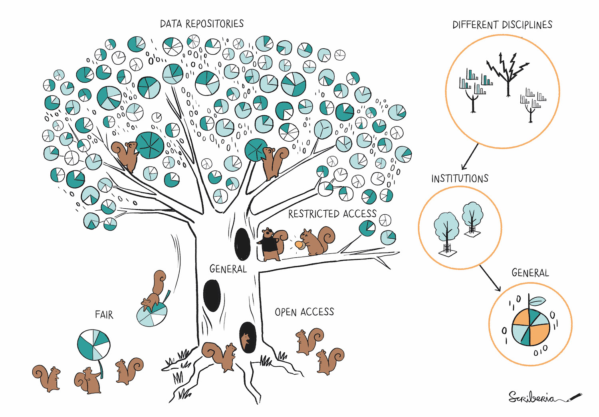
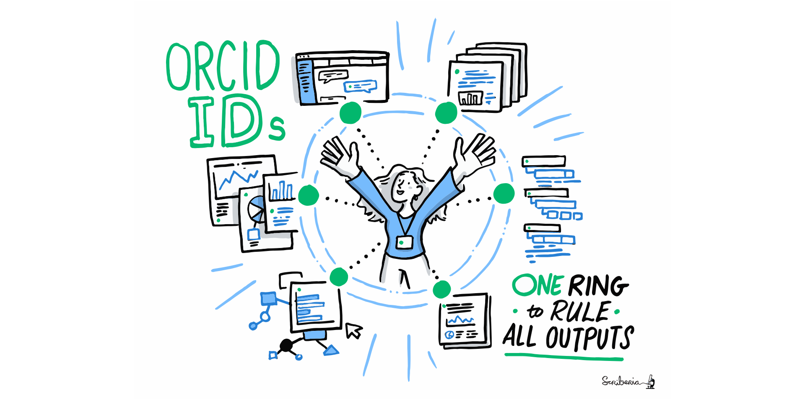
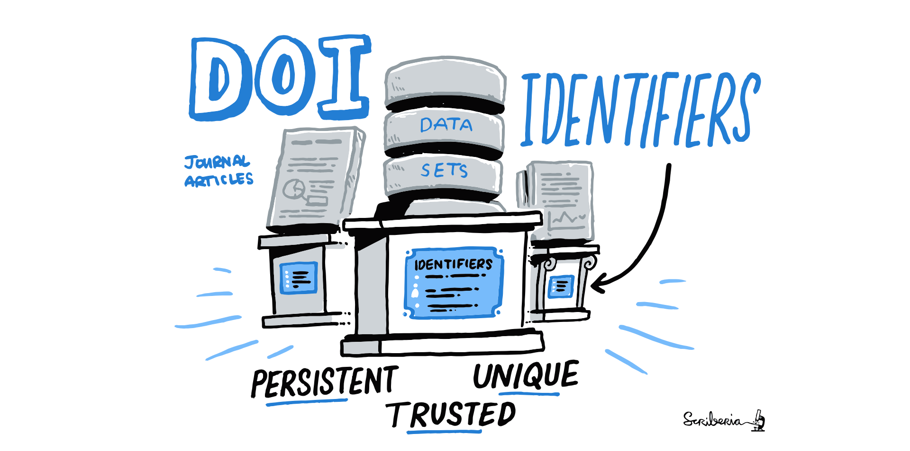
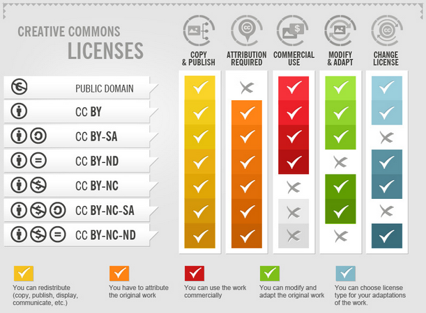

# SHARE: Condividere e riutilizzare

## Lezione 14 del corso di _Digital Humanities e Data Management per i Beni Culturali_ (2024/2025)

###### Sebastian Barzaghi | [sebastian.barzaghi2@unibo.it](mailto:sebastian.barzaghi2@unibo.it) | [https://orcid.org/0000-0002-0799-1527](https://orcid.org/0000-0002-0799-1527) | [https://www.unibo.it/sitoweb/sebastian.barzaghi2/](https://www.unibo.it/sitoweb/sebastian.barzaghi2/)

---

### Preservazione e condivisione

  

    <figure>
      
      <figcaption>
        Fonte: Gualandi, B., Caldoni, G., & Marino, M. (2022). Research Data Management: Data Lifecycle. Zenodo. <a href="https://doi.org/10.5281/zenodo.7249051">https://doi.org/10.5281/zenodo.7249051</a>.
      </figcaption>
    </figure>
  

  

    

      Azioni principali: valutare quali dati depositare, scegliere la repository, depositare i dati, applicare una licenza ai dati.
    

  

---



## Ogni cosa al suo posto

<!--
Photo by <a href="https://unsplash.com/@viswanathd_11?utm_content=creditCopyText&utm_medium=referral&utm_source=unsplash">Viswanath D</a> on <a href="https://unsplash.com/photos/red-blue-and-black-wooden-board-0dS9MGGKAxg?utm_content=creditCopyText&utm_medium=referral&utm_source=unsplash">Unsplash</a>
-->

---

### Selezioniamo i dati che vogliamo depositare

Non tutti i dati devono essere condivisi (per vari motivi, es. etici, commerciali, legali, tecnici).

Quali dati sono necessari per la validazione e riproducibilità del nostro progetto?

Dobbiamo per forza conservare anche i dati intermedi, se sono facilmente ottenibili?

Ovviamente, non dobbiamo depositare i dati già disponibili (cioé pubblicati da altri).

---

### Una repository è un luogo in cui gli oggetti digitali di ricerca sono archiviati per la loro preservazione e condivisione a lungo termine

    

      <figure>
        
        <figcaption>
          Fonte: The Turing Way Community, & Scriberia. (2024). Illustrations from The Turing Way: Shared under CC-BY 4.0 for reuse. Zenodo. <a href="https://doi.org/10.5281/zenodo.13882307">https://doi.org/10.5281/zenodo.13882307</a>.
        </figcaption>
      </figure>
    

    

        

            Progettate per essere affidabili e stabili, tramite l'utilizzo di identificatori persistenti (PID), meccanismi di assegnazione di metadati (secondo standard internazionali) e di licenze ai dataset, e la presenza di policy di preservazione stringenti (es. formati permessi).
        

    

Alma Mater Studiorum – Università di Bologna & ARIC – Area Ricerca, Settore Coordinamento Servizi Ricerca e Progetti di Area, Data Steward (2024). Linee guida di Ateneo per la gestione dei dati della ricerca. <a href="https://www.unibo.it/it/allegati/Lineeguidaricerca_v4_HR.pdf/@@download/file/Lineeguidaricerca_v4_HR.pdf">https://www.unibo.it/it/allegati/Lineeguidaricerca_v4_HR.pdf/@@download/file/Lineeguidaricerca_v4_HR.pdf</a>.

---

### Come scegliamo?

- Utilizzo di registri come [re3data](https://www.re3data.org/) e [FAIRsharing](https://fairsharing.org/) per cercare uno o più repository che si adattino alle nostre necessità e alle tipologie di dato che vogliamo depositare;
  - Esistono repository disciplinari che ci permettono di descrivere i dati usando schemi di metadati specifici alla nostra disciplina e li rende più visibili alla nostra comunità?
  - Esistono repository istituzionali a cui possiamo fare affidamento per particolari servizi di supporto, validazione e curatela? (es. AMS Acta e AMS Historica)
  - Esistono anche repository generalisti (es. Zenodo, figshare) per dati di ricerca eterogenei;

Altri fattori: grandezza dei file, requisiti istituzionali, restrizioni di accesso...

Alma Mater Studiorum – Università di Bologna & ARIC – Area Ricerca, Settore Coordinamento Servizi Ricerca e Progetti di Area, Data Steward (2024). Linee guida di Ateneo per la gestione dei dati della ricerca. <a href="https://www.unibo.it/it/allegati/Lineeguidaricerca_v4_HR.pdf/@@download/file/Lineeguidaricerca_v4_HR.pdf">https://www.unibo.it/it/allegati/Lineeguidaricerca_v4_HR.pdf/@@download/file/Lineeguidaricerca_v4_HR.pdf</a>.

---

### Usare una repository è un elemento fondamentale di FAIRness

- Ogni dataset depositato è accompagnato da metadati, tra cui un identificativo persistente (PID) e una licenza (trovabilità, accessibilità, e riusabilità);
- I dataset devono essere in formati standard e aperti e sono descritti, dove possibile, da vocabolari, ontologie e tassonomie (interoperabilità).

Alma Mater Studiorum – Università di Bologna & ARIC – Area Ricerca, Settore Coordinamento Servizi Ricerca e Progetti di Area, Data Steward (2024). Linee guida di Ateneo per la gestione dei dati della ricerca. <a href="https://www.unibo.it/it/allegati/Lineeguidaricerca_v4_HR.pdf/@@download/file/Lineeguidaricerca_v4_HR.pdf">https://www.unibo.it/it/allegati/Lineeguidaricerca_v4_HR.pdf/@@download/file/Lineeguidaricerca_v4_HR.pdf</a>.

---

### Scegliere il livello di accesso è un punto essenziale

Scegliere un repository che consenta di depositare i dati secondo pratiche di Scienza Aperta, ma anche di avere maggiori restrizioni dove necessario.

Il livello di accesso può essere descritto come:
- **Aperto**, ovvero il dataset è apertamente accessibile a chiunque lo voglia consultare, scaricare e riutilizzare;
- **Ristretto**, ovvero chi vuole consultare o scaricare il dataset depositato deve richiedere un’autorizzazione. Questa richiesta può essere fatta direttamente al ricercatore che ha depositato il dataset oppure, nel caso di alcuni specifici repository, ad un comitato di accesso deputato a valutare la legittimità della richiesta;
- **Embargo**, un tipo di restrizione dell’accesso temporanea. Permette di depositare i dataset mantenendoli privati per un tempo limitato, scaduto il quale l’embargo scade e il dataset diventa aperto.

Alma Mater Studiorum – Università di Bologna & ARIC – Area Ricerca, Settore Coordinamento Servizi Ricerca e Progetti di Area, Data Steward (2024). Linee guida di Ateneo per la gestione dei dati della ricerca. <a href="https://www.unibo.it/it/allegati/Lineeguidaricerca_v4_HR.pdf/@@download/file/Lineeguidaricerca_v4_HR.pdf">https://www.unibo.it/it/allegati/Lineeguidaricerca_v4_HR.pdf/@@download/file/Lineeguidaricerca_v4_HR.pdf</a>.

---



## Sharing is caring

<!--
Photo by <a href="https://unsplash.com/@seljansalim?utm_content=creditCopyText&utm_medium=referral&utm_source=unsplash">Seljan Salimova</a> on <a href="https://unsplash.com/photos/two-people-reaching-out-their-hands-to-touch-each-other-X2ZjmgOrH-I?utm_content=creditCopyText&utm_medium=referral&utm_source=unsplash">Unsplash</a>
-->

---

### Ci sono molte ragioni per condividere pubblicamente i dati della propria ricerca

- Rendere più riproducibile il nostro lavoro;
- Prevenire sforzi inutili di "re-invenzione della ruota";
- Facilitare la collaborazione;
- Aumentare l'impatto della nostra ricerca;
- Aumentare la qualità della nostra ricerca;
- Riconoscere i risultati della nostra ricerca come bene pubblico.

Alma Mater Studiorum – Università di Bologna & ARIC – Area Ricerca, Settore Coordinamento Servizi Ricerca e Progetti di Area, Data Steward (2024). Linee guida di Ateneo per la gestione dei dati della ricerca. <a href="https://www.unibo.it/it/allegati/Lineeguidaricerca_v4_HR.pdf/@@download/file/Lineeguidaricerca_v4_HR.pdf">https://www.unibo.it/it/allegati/Lineeguidaricerca_v4_HR.pdf/@@download/file/Lineeguidaricerca_v4_HR.pdf</a>.

---

### Usiamo ORCID per identificarci

    

      <figure>
        
        <figcaption>
          Fonte: The Turing Way Community, & Scriberia. (2024). Illustrations from The Turing Way: Shared under CC-BY 4.0 for reuse. Zenodo. <a href="https://doi.org/10.5281/zenodo.13882307">https://doi.org/10.5281/zenodo.13882307</a>.
        </figcaption>
      </figure>
    

    

        

            PID per l'individuo che lavora nella ricerca.
        

        

            Fornisce un'identità unica a cui associare il proprio lavoro, indipendentemente dal nome completo.
        

        

            Inoltre, è molto utile per accedere o registrarsi a servizi che lo utilizzano come sistema di autenticazione o applicativo di supporto per ulteriori funzionalità (es. Zenodo).
        

    

---

### Usiamo DOI per identificare i nostri dataset

    

      <figure>
        
        <figcaption>
          Fonte: The Turing Way Community, & Scriberia. (2024). Illustrations from The Turing Way: Shared under CC-BY 4.0 for reuse. Zenodo. <a href="https://doi.org/10.5281/zenodo.13882307">https://doi.org/10.5281/zenodo.13882307</a>.
        </figcaption>
      </figure>
    

    

        

            PID per un oggetto digitale di ricerca, pubblicato sul Web.
        

        

            Rende molto più facile per gli altri citare i dati, riduce il rischio di <emph>link rot</emph> e consente di tracciare come la nostra ricerca venga utilizzata e citata.
        

        

            Esistono server che associano DOI al momento della pubblicazione (es. Zenodo, FigShare, Dryad).
        

    

---

### Citiamo e rendiamoci citabili

Quando usiamo degli oggetti di ricerca (es. un dataset, un software, un articolo, una monografia, una metodologia, ecc.), citiamoli direttamente nell'articolo nei punti in cui sono rilevanti. 

In generale, una citazione include le seguenti informazioni:
- Autore;
- Titolo;
- Anno di pubblicazione;
- Editore;
- Informazioni di accesso (URL o DOI);
- ...

Link alla guida agli stili di citazione su Scribbr: <https://www.scribbr.com/citing-sources/citation-styles/>.

---



## Diritti e doveri

<!--
Photo by <a href="https://unsplash.com/@vinayak10?utm_content=creditCopyText&utm_medium=referral&utm_source=unsplash">Vinayak Sood</a> on <a href="https://unsplash.com/photos/a-mountain-range-with-snow-capped-mountains-in-the-distance-fcJaN02wu70?utm_content=creditCopyText&utm_medium=referral&utm_source=unsplash">Unsplash</a>
-->

---

### I dati possono essere soggetti a diritto d'autore...

... Quando sono opere dell’ingegno di carattere creativo (es. testi, immagini, tabelle, database, software, ecc.).

MA: il diritto d’autore tutela la forma espressiva di un’opera dell’ingegno, e non i dati.

La tutela autoriale non copre le idee, i procedimenti, i metodi di funzionamento o i concetti matematici in quanto tali.

Alma Mater Studiorum – Università di Bologna & ARIC – Area Ricerca, Settore Coordinamento Servizi Ricerca e Progetti di Area, Data Steward (2024). Linee guida di Ateneo per la gestione dei dati della ricerca. <a href="https://www.unibo.it/it/allegati/Lineeguidaricerca_v4_HR.pdf/@@download/file/Lineeguidaricerca_v4_HR.pdf">https://www.unibo.it/it/allegati/Lineeguidaricerca_v4_HR.pdf/@@download/file/Lineeguidaricerca_v4_HR.pdf</a>.

---

### All'autore spettano diritti morali e patrimoniali

- Diritti **morali**: irrinunciabili, inalienabili, imprescrittibili, possono essere fatti valere senza limiti di tempo dopo la morte dell’autore (es. il diritto di rivendicare la paternità dell’opera, il diritto di inedito e il diritto all’integrità dell’opera);
- Diritti **patrimoniali**: cedibili a titolo oneroso o gratuito, in via esclusiva o non esclusiva, ed esercitabili fino a 70 anni dopo la morte dell’autore (es. il diritto di sfruttamento economico dell’opera in esclusiva, il diritto di pubblicare, il diritto di digitalizzare, il diritto di modificare, il diritto di tradurre, ecc.).

Alma Mater Studiorum – Università di Bologna & ARIC – Area Ricerca, Settore Coordinamento Servizi Ricerca e Progetti di Area, Data Steward (2024). Linee guida di Ateneo per la gestione dei dati della ricerca. <a href="https://www.unibo.it/it/allegati/Lineeguidaricerca_v4_HR.pdf/@@download/file/Lineeguidaricerca_v4_HR.pdf">https://www.unibo.it/it/allegati/Lineeguidaricerca_v4_HR.pdf/@@download/file/Lineeguidaricerca_v4_HR.pdf</a>.

---

### Nel caso delle banche dati, si applica il diritto _sui generis_

Le banche di dati sono raccolte di opere, dati o altri elementi che sono organizzati in modo sistematico o metodico, in modo che possano essere facilmente accessibili.

Le banche di dati possono essere protette dal diritto d’autore se rappresentano una creazione intellettuale dell’autore, cioè se l’organizzazione e la disposizione delle informazioni sono frutto di un lavoro creativo.

La protezione non riguarda il contenuto della banca di dati, ma solo la sua struttura e organizzazione. I diritti sui dati stessi (se appartengono a terzi) restano separati e non sono influenzati dalla protezione.

Alma Mater Studiorum – Università di Bologna & ARIC – Area Ricerca, Settore Coordinamento Servizi Ricerca e Progetti di Area, Data Steward (2024). Linee guida di Ateneo per la gestione dei dati della ricerca. <a href="https://www.unibo.it/it/allegati/Lineeguidaricerca_v4_HR.pdf/@@download/file/Lineeguidaricerca_v4_HR.pdf">https://www.unibo.it/it/allegati/Lineeguidaricerca_v4_HR.pdf/@@download/file/Lineeguidaricerca_v4_HR.pdf</a>.

---

### Nel caso delle banche dati, si applica il diritto _sui generis_

Oltre alla protezione da diritto d’autore, esiste anche un diritto sui generis che tutela gli investimenti fatti per creare, verificare o presentare la banca di dati (come risorse finanziarie, tempo e lavoro). Questo diritto impedisce ad altri di estrarre o riutilizzare parti sostanziali della banca di dati senza permesso.

Il diritto sui generis dura 15 anni, a partire dal primo gennaio dell’anno successivo alla completazione della banca di dati o dalla prima messa a disposizione del pubblico.

Il titolare dei diritti può stabilire condizioni di utilizzo della banca di dati tramite licenze d'uso, specificando come altri possono utilizzare la banca di dati.

Alma Mater Studiorum – Università di Bologna & ARIC – Area Ricerca, Settore Coordinamento Servizi Ricerca e Progetti di Area, Data Steward (2024). Linee guida di Ateneo per la gestione dei dati della ricerca. <a href="https://www.unibo.it/it/allegati/Lineeguidaricerca_v4_HR.pdf/@@download/file/Lineeguidaricerca_v4_HR.pdf">https://www.unibo.it/it/allegati/Lineeguidaricerca_v4_HR.pdf/@@download/file/Lineeguidaricerca_v4_HR.pdf</a>.

---

### Usiamo le licenze per far sapere alle altre persona cosa possono e non possono fare

Un autore può concedere i propri diritti patrimoniali attraverso un contratto di concessione d’uso (licenza), permettendo a terzi di utilizzare l'opera alle condizioni stabilite.

I dati ad accesso aperto (Open Data) sono distribuiti con licenze che garantiscono libertà di accesso, utilizzo, modifica e condivisione, con eventuali restrizioni per attribuire la paternità e limitare usi specifici, come nel caso del diritto d'autore.

La scelta della licenza deve basarsi sul principio “as open as possible, as closed as necessary”.

Alma Mater Studiorum – Università di Bologna & ARIC – Area Ricerca, Settore Coordinamento Servizi Ricerca e Progetti di Area, Data Steward (2024). Linee guida di Ateneo per la gestione dei dati della ricerca. <a href="https://www.unibo.it/it/allegati/Lineeguidaricerca_v4_HR.pdf/@@download/file/Lineeguidaricerca_v4_HR.pdf">https://www.unibo.it/it/allegati/Lineeguidaricerca_v4_HR.pdf/@@download/file/Lineeguidaricerca_v4_HR.pdf</a>.

---

### Facciamo attenzione!

Se non ci sono problemi legali o economici, è preferibile rendere i dati accessibili a tutti.

È consigliato scegliere licenze permissive che permettano l'uso libero dei dati in qualsiasi formato, per qualsiasi scopo, anche commerciale (es. CC0 1.0, CC BY 4.0 e CC BY-SA 4.0).

Alma Mater Studiorum – Università di Bologna & ARIC – Area Ricerca, Settore Coordinamento Servizi Ricerca e Progetti di Area, Data Steward (2024). Linee guida di Ateneo per la gestione dei dati della ricerca. <a href="https://www.unibo.it/it/allegati/Lineeguidaricerca_v4_HR.pdf/@@download/file/Lineeguidaricerca_v4_HR.pdf">https://www.unibo.it/it/allegati/Lineeguidaricerca_v4_HR.pdf/@@download/file/Lineeguidaricerca_v4_HR.pdf</a>.

---

### Facciamo attenzione!

Per usare opere o materiali protetti dal diritto d'autore o da diritti connessi, è necessario ottenere il consenso preventivo del titolare dei diritti.

- Diritti patrimoniali: Questi diritti proteggono l'intera opera e anche le sue singole parti. Quindi, anche l'uso di parti di un'opera richiede l'autorizzazione dell'autore;
- I diritti patrimoniali sono indipendenti, quindi ogni diritto (ad esempio, il diritto di riproduzione o distribuzione) può essere trasferito separatamente;
- L'uso di un'opera senza autorizzazione è consentito solo in caso di eccezioni previste dalla legge (come l'uso per scopi educativi o di critica).

È sempre necessario verificare i termini della licenza d’uso associata alla pubblicazione e/o messa a disposizione di un’opera.

Alma Mater Studiorum – Università di Bologna & ARIC – Area Ricerca, Settore Coordinamento Servizi Ricerca e Progetti di Area, Data Steward (2024). Linee guida di Ateneo per la gestione dei dati della ricerca. <a href="https://www.unibo.it/it/allegati/Lineeguidaricerca_v4_HR.pdf/@@download/file/Lineeguidaricerca_v4_HR.pdf">https://www.unibo.it/it/allegati/Lineeguidaricerca_v4_HR.pdf/@@download/file/Lineeguidaricerca_v4_HR.pdf</a>.

---

### Le licenze Creative Commons (CC) sono le licenze maggiormente utilizzate per le opere digitali

L’autore concede ad una generalità di soggetti indefiniti l’autorizzazione all’uso dell’opera a determinate condizioni, decidendo quali diritti riservare e quali concedere in uso.

I sei schemi di licenza disponibili si articolano sulla combinazione di quattro clausole base che l’autore può scegliere e combinare, esplicando così le modalità d’uso della propria opera da parte degli utilizzatori finali:
- **BY** (Attribuzione): l'attribuzione all'autore dell'opera originale deve essere presente;
- **NC** (Non Commercial): non è consentito l’uso commerciale;
- **SA** (Share Alike): le opere derivate devono essere condivise con la medesima licenza;
- **ND** (Non Derivates): non sono consentite opere derivate;

Alma Mater Studiorum – Università di Bologna & ARIC – Area Ricerca, Settore Coordinamento Servizi Ricerca e Progetti di Area, Data Steward (2024). Linee guida di Ateneo per la gestione dei dati della ricerca. <a href="https://www.unibo.it/it/allegati/Lineeguidaricerca_v4_HR.pdf/@@download/file/Lineeguidaricerca_v4_HR.pdf">https://www.unibo.it/it/allegati/Lineeguidaricerca_v4_HR.pdf/@@download/file/Lineeguidaricerca_v4_HR.pdf</a>.

---

### Le licenze Creative Commons (CC) sono le licenze maggiormente utilizzate per le opere digitali

<figure>
  
  <figcaption>
    Fonte: JoKalliauer; foter, CC BY-SA 3.0 <a href="https://foter.com/blog/how-to-attribute-creative-commons-photos/">https://foter.com/blog/how-to-attribute-creative-commons-photos/</a> via Wikimedia Commons.
  </figcaption>
</figure>

---

# Fine

## Lezione 14 del corso di _Digital Humanities e Data Management per i Beni Culturali_ (2024/2025)

###### Sebastian Barzaghi | [sebastian.barzaghi2@unibo.it](mailto:sebastian.barzaghi2@unibo.it) | [https://orcid.org/0000-0002-0799-1527](https://orcid.org/0000-0002-0799-1527) | [https://www.unibo.it/sitoweb/sebastian.barzaghi2/](https://www.unibo.it/sitoweb/sebastian.barzaghi2/)
