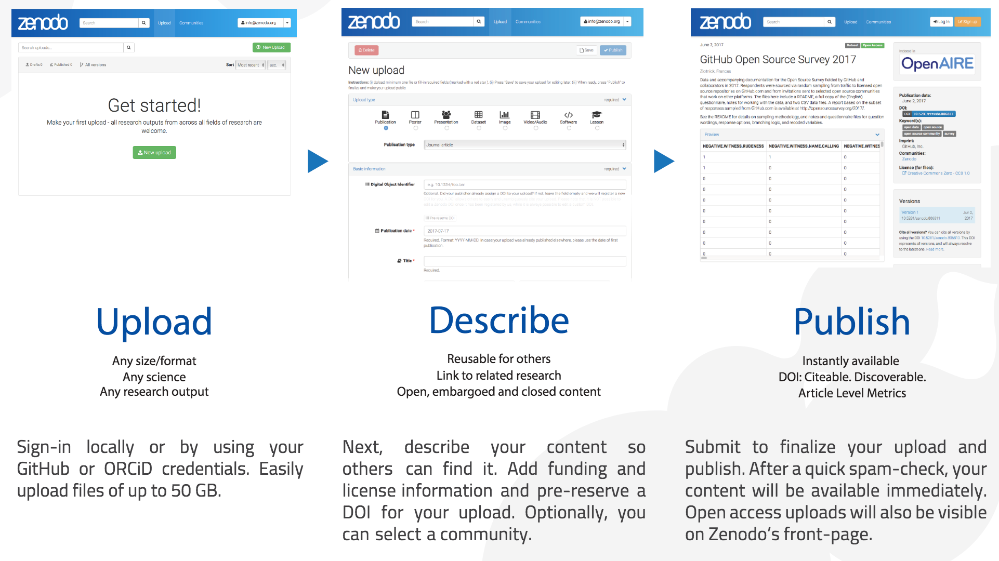
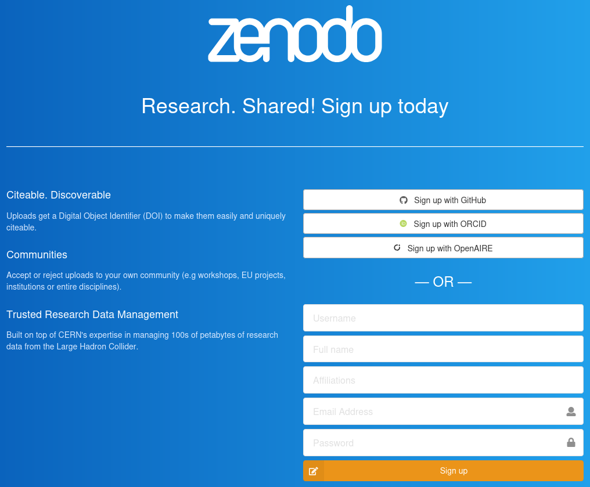
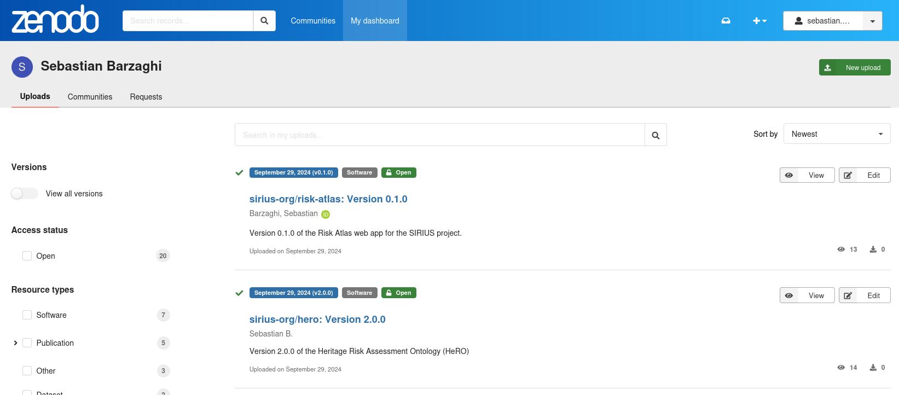
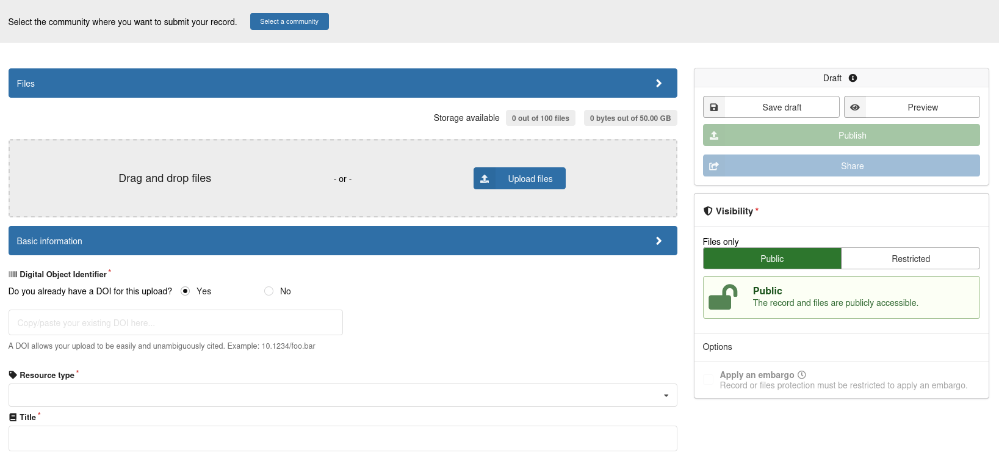
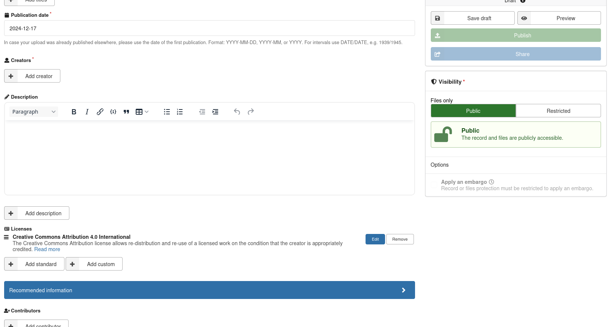
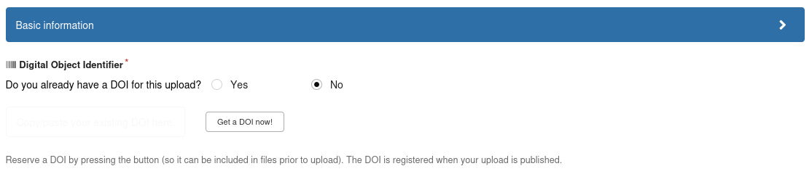
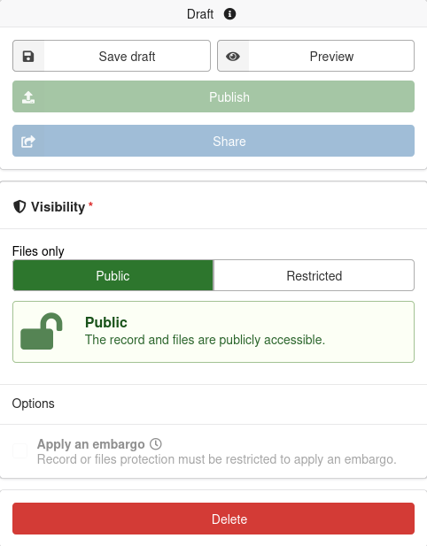
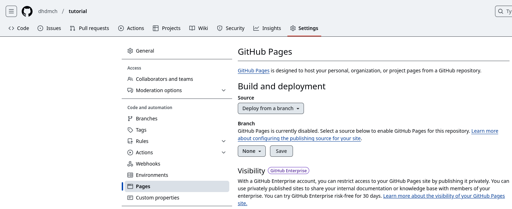
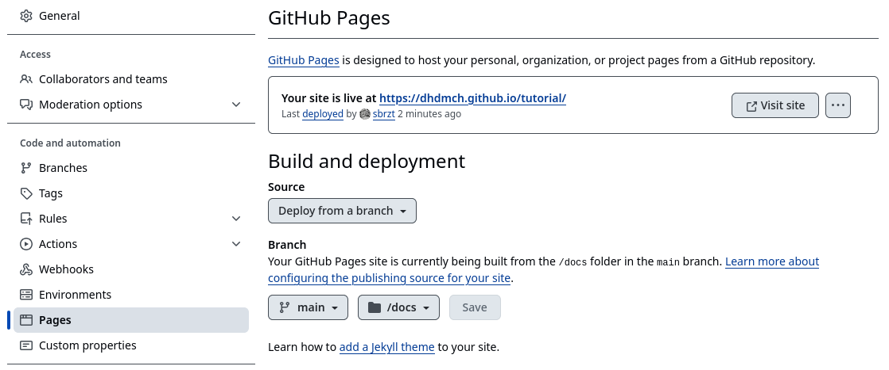
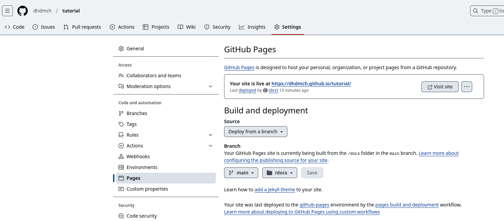

# L'Eredità di Alessandria

## Lezione 15 del corso di _Digital Humanities e Data Management per i Beni Culturali_ (2024/2025)

###### Sebastian Barzaghi | [sebastian.barzaghi2@unibo.it](mailto:sebastian.barzaghi2@unibo.it) | [https://orcid.org/0000-0002-0799-1527](https://orcid.org/0000-0002-0799-1527) | [https://www.unibo.it/sitoweb/sebastian.barzaghi2/](https://www.unibo.it/sitoweb/sebastian.barzaghi2/)

---

## Zenodo

---

### Una repository generalista aperta ospitata dal CERN

Link: <https://zenodo.org/>.

Consente ai ricercatori di tutte le discipline di condividere e preservare gratuitamente i loro risultati di ricerca, in generale indipendentemente dalle dimensioni o dal formato dei propri dati.

---

### Alcune caratteristiche

- Condivisione e collegamento degli oggetti di ricerca;
- Citabilità dei dati;
- Reperibilità dei dati;
- Versioning dei dati;
- Affidabilità e sicurezza dell'infrastruttura;
- Flessibilità delle licenze;
- Flessibilità del livello di accesso;
- Integrazione con altri servizi (es. ORCID e GitHub).

---

### Come si usa

<figure>
  
  <figcaption>
    Fonte: <a href="https://www.openaire.eu/zenodo-guide">https://www.openaire.eu/zenodo-guide</a>.
  </figcaption>
</figure>

---

### Se avete già un ORCID, usatelo per iscrivervi

<figure>
  
  <figcaption>
    Fonte: propria.
  </figcaption>
</figure>

---

### I nostri dati sono elencati nella _dashboard_

<figure>
  
  <figcaption>
    Fonte: propria.
  </figcaption>
</figure>

---

### Tramite _New upload_ possiamo depositare un nuovo oggetto di ricerca

<figure>
  
  <figcaption>
    Fonte: propria.
  </figcaption>
</figure>

---

### In questa pagina inseriamo una serie di metadati obbligatori e facoltativi

<figure>
  
  <figcaption>
    Fonte: propria.
  </figcaption>
</figure>

---

### Possiamo generare e prenotare un DOI per il nostro oggetto

<figure>
  
  <figcaption>
    Fonte: propria.
  </figcaption>
</figure>

---

### Possiamo salvare il nostro oggetto in formato _draft_ e deciderne il livello di accesso, prima di pubblicarlo definitivamente

<figure>
  
  <figcaption>
    Fonte: propria.
  </figcaption>
</figure>

---

## GitHub Pages (o quello che ne rimane...)

---

### Funzionalità di GitHub che permette di esporre file README.md sotto forma di pagine Web statiche

Fino a pochissimo tempo fa, era anche possibile stilizzare in maniera semplice e veloce queste pagine secondo template esistenti.

Ora è molto più complesso e richiede un certo margine di "smanettamento" (istruzioni: <https://docs.github.com/pages/setting-up-a-github-pages-site-with-jekyll/adding-a-theme-to-your-github-pages-site-using-jekyll>).

A questo punto, ci limitiamo ad esporre delle semplici pagine Web statiche con lo stile predefinito di GitHub.

---

### Nella repo che vogliamo esporre, andiamo su _Settings_ > _Pages_

<figure>
  
  <figcaption>
    Fonte: propria.
  </figcaption>
</figure>

---

### Sotto _Branch_, cambia la selezione da `None` a `main` e da `/(root)` a `/docs`, poi clicca su _Save_

<figure>
  
  <figcaption>
    Fonte: propria.
  </figcaption>
</figure>

---

### Dopo un paio di minuti, la pagina Web sarà raggiungibile al link visualizzato

<figure>
  
  <figcaption>
    Fonte: propria.
  </figcaption>
</figure>

---

# Fine

## Lezione 15 del corso di _Digital Humanities e Data Management per i Beni Culturali_ (2024/2025)

###### Sebastian Barzaghi | [sebastian.barzaghi2@unibo.it](mailto:sebastian.barzaghi2@unibo.it) | [https://orcid.org/0000-0002-0799-1527](https://orcid.org/0000-0002-0799-1527) | [https://www.unibo.it/sitoweb/sebastian.barzaghi2/](https://www.unibo.it/sitoweb/sebastian.barzaghi2/)

