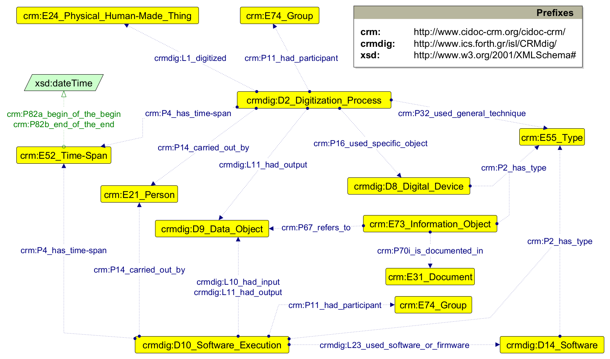

# Dati culturali e sostenibilità

## Modellare le connessioni tra beni culturali e gli obiettivi dell'Agenda 2030

###### Sebastian Barzaghi | [sebastian.barzaghi2@unibo.it](mailto:sebastian.barzaghi2@unibo.it) | [https://orcid.org/0000-0002-0799-1527](https://orcid.org/0000-0002-0799-1527) | [https://www.unibo.it/sitoweb/sebastian.barzaghi2/](https://www.unibo.it/sitoweb/sebastian.barzaghi2/)

---

### Piacere!

Assegnista di ricerca presso il Dipartimento di Beni Culturali dell'Università di Bologna.

I miei interessi si concentrano sullo studio e l'implementazione di strumenti e metodologie computazionali per una corretta gestione dei dati nei settori delle discipline umanistiche e del patrimonio culturale.

---

### Il contesto in brevissimo: SDG

<figure>
    
    <figcaption>
        Fonte: <a href="https://worldsustainabilitycollective.com/the-17-un-sdgs/">https://worldsustainabilitycollective.com/the-17-un-sdgs/</a>.
    </figcaption>
</figure>

---



## Partiamo dai dati

<!--
Photo by <a href="https://unsplash.com/@gregbecker?utm_content=creditCopyText&utm_medium=referral&utm_source=unsplash">Greg Becker</a> on <a href="https://unsplash.com/photos/body-of-water-under-clear-blue-sky-sYzFIusQp3Q?utm_content=creditCopyText&utm_medium=referral&utm_source=unsplash">Unsplash</a>
-->

---

### Un dato è una fonte di conoscenza

<figure>
    
    <figcaption>
        Fonte: Noppe, N., Vanvelk, J., & Callens, N. (2023). The hands-on guide to research data management for KU Leuven researchers, students, and research support staff in the humanities and social sciences. Zenodo. <a href="https://doi.org/10.5281/zenodo.8010618">https://doi.org/10.5281/zenodo.8010618</a>.
    </figcaption>
</figure>

---



## Semplifichiamo

<!--
Photo by <a href="https://unsplash.com/@spaceboy?utm_content=creditCopyText&utm_medium=referral&utm_source=unsplash">Henrik Dønnestad</a> on <a href="https://unsplash.com/photos/abstract-painting-t2Sai-AqIpI?utm_content=creditCopyText&utm_medium=referral&utm_source=unsplash">Unsplash</a>
-->

---

### Il dilemma del porcospino

<figure>
    
    <figcaption>
        Fonte: <a href="https://pin.it/5X5gEQI">https://pin.it/5X5gEQI</a>.
    </figcaption>
</figure>

---

### I dati sono descritti e rappresentati da modelli

<figure>
    
    <figcaption>
        Fonte: Barzaghi, S., Heibi, I., Moretti, A., & Peroni, S. (2024). Developing Application Profiles for Enhancing Data and Workflows in Cultural Heritage Digitisation Processes. arXiv preprint arXiv:2404.12069. <a href="https://doi.org/10.48550/arXiv.2404.12069">https://doi.org/10.48550/arXiv.2404.12069</a>.
    </figcaption>
</figure>

---

## Facciamo un po' di pratica

---

### Obiettivo

Modellare come le caratteristiche di un bene culturale possono avere un impatto sugli SDG.

---

### Task 1

Scegliete un bene culturale e descrivetelo in 3 o 4 frasi. Partite da un esempio concreto, e generalizzate.

Esempio:  
_Il Museo d'Arte della città di Ravenna è situato nel centro della città, in un edificio storico che ospita una vasta collezione di opere che vanno dal periodo tardo-antico al contemporaneo. La sua funzione principale è quella di conservare, valorizzare e promuovere il patrimonio artistico locale e nazionale._

Quindi, un museo 
* ha una posizione geografica;
* ha una funzione;
* contiene delle collezioni;
* ogni collezione contiene delle opere;
* ogni opera appartiene ad un periodo storico.

Qui state modellando un bene culturale come un insieme di dati (caratteristiche).

---

### Task 2

Discutete sulla descrizione ed identificate 2 o 3 caratteristiche fondamentali per quel tipo di bene culturale (aiutandovi anche con le carte).

Esempio:  
Un museo 
- ha una `posizione geografica`;
- ha una `funzione`.

---

### Task 3

Identificate come queste caratteristiche possono interagire con o avere un impatto su determinati obiettivi (aiutandovi anche con le carte).

Esempio:  
- La `posizione geografica` di un `museo` può influire sull'`Obiettivo 11` (Città e comunità sostenibili). Un museo situato in un'area urbana può contribuire alla rigenerazione di quartieri, stimolando il turismo e le attività economiche locali.
- La `funzione` educativa del `museo` ha un impatto diretto sull'`Obiettivo 4` (Istruzione di qualità). I musei offrono opportunità di apprendimento e promozione della conoscenza della storia, dell'arte e della cultura.

---

### Task 4

  

    <figure>
    
    <figcaption>
        Fonte: propria.
    </figcaption>
</figure>
  

  

    

      Infine, rappresentate i vostri ragionamenti su un foglio usando un diagramma o mappa concettuale, collegando beni culturali, caratteristiche, e obiettivi di sostenibilità.
    

  

---

### Ricapitolando

* Descrizione breve di un bene culturale;
* Caratteristiche importanti;
* Collegamenti con SDG;
* Mappa concettuale.

Potete usare le **carte** che ho predisposto per voi per aiutarvi nelle riflessioni.

---

### Conclusioni?

* Siamo pieni di dati molto complessi!
* I dati sono compresi dai computer tramite modelli (~metafore);
* I modelli sono molto utili anche per noi: semplificano, documentano, ci aiutano a riflettere;
* Ragionare in temrini di dati e di modellazione dei dati ci ha aiutato a capire meglio come un bene culturale possa impattare sugli SDG.

---

# Fine

## Modellare le connessioni tra beni culturali e gli obiettivi dell'Agenda 2030

###### Sebastian Barzaghi | [sebastian.barzaghi2@unibo.it](mailto:sebastian.barzaghi2@unibo.it) | [https://orcid.org/0000-0002-0799-1527](https://orcid.org/0000-0002-0799-1527) | [https://www.unibo.it/sitoweb/sebastian.barzaghi2/](https://www.unibo.it/sitoweb/sebastian.barzaghi2/)
