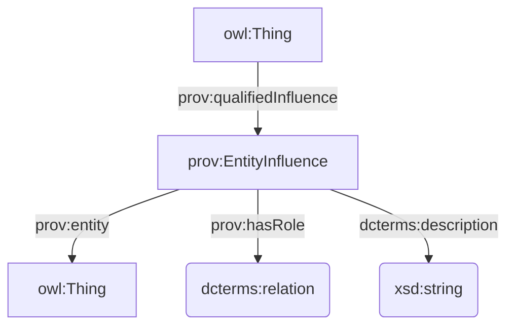

## DataCite

### Reificazione di `dcterms:relation`

Prima ho pensato di usare CiTO, ma questa dicitura nella [documentazione dello schema di DataCite](https://datacite-metadata-schema.readthedocs.io/en/4.7/properties/relatedidentifier/#b-relationtype)

    Note: Some relationTypes are processed as citations and references. Read more about [Contributing Citations and References](https://support.datacite.org/docs/contributing-citations-and-references) on the DataCite support site.

e il riferimento in CiTO stesso all'utilizzo solo delle proprietà di CiTO per il punning con `cito:hasCitationCharacterization` (pur non essendoci particolari constraint, da quello che mi risulta), mi ha dissuaso dall'utilizzarlo.

Ho cercato disperatamente tra gli ODP su https://odpa.github.io/patterns-repository/, ma non ho cavato un ragno dal buco.

Alla fine, ho optato per [PROV-O](https://www.w3.org/TR/prov-o/#description-qualified-terms) e, in particolare, sulla sua applicazione del _**Qualification Pattern**_, ovvero una forma di reificazione di una relazione intesa come un'influenza tra due entità (vedi anche [Qualified Relation](https://patterns.dataincubator.org/book/qualified-relation.html) e [N-ary Relation](https://www.w3.org/TR/swbp-n-aryRelations/)).



Una risorsa ha una certa relazione (`prov:qualifiedInfluence`) con un'altra risorsa. Questa relazione (`prov:EntityInfluence`) è caratterizzata da un tipo (`prov:hasRole`) il cui valore è definito con l'utilizzo di una Object Property tramite punning, e potenzialmente anche da una descrizione testuale(`dcterms:description`).

### Aggiunta di RightsIdentifier e RightsIdentifierScheme

Le due nuove classi e il nuovo individual sono documentati qui: https://docs.google.com/spreadsheets/d/1hYH1EDWG0LBdNagpbw8GJThhK4KnP0gUxjcHVq5QC3c/edit?usp=sharing

### Nuove classi (?) e individuals

- `DataPaper` equivale a `fabio:ResourcePaper`
- `PeerReview` equivale a `?`
- `Award` equivale a `?`
- `Instrument` equivale a `?`

I nuovi individuals `datacite:cstr`, `datacite:igsn`, `datacite:rrid` sono documentati qui: https://docs.google.com/spreadsheets/d/1hYH1EDWG0LBdNagpbw8GJThhK4KnP0gUxjcHVq5QC3c/edit?usp=sharing

Per raccogliere informazioni utili sui nuovi individuals ho utilizzato https://registry.identifiers.org/registry/.

### Domande

***

## CiTO

### Sperimentazione con `codespell`

Ho ripreso la versione più recente di HeRO e dal `venv` ho installato `codespell` (v2.4.2).

```bash
pip install codespell
```

Provo un dry run per fare solo reporting.

```bash
codespell docs/current/hero.ttl
```

Funziona! Mostra i typo sospettati con anche il file e la riga nel codice.

```bash
docs/current/hero.ttl:51: activites ==> activities, activates
docs/current/hero.ttl:59: Intension ==> Intention
docs/current/hero.ttl:72: exemple ==> example
docs/current/hero.ttl:751: occurence ==> occurrence
```

Un esempio del discorso fatto in precedenza rispetto alla particolarità delle terminologie di dominio: `Intension` **è** corretto, poiché è parte del nome di un OPD (_Intension Extension ODP_) che si basa su un termine della logica (_intension_) molto specialistico e piuttosto desueto, facilmente fraintendibile con _intention_.

Provo a testare il tuning della configurazione tramite `.codespellrc`. Creo il file nella root della repo, con il seguente contenuto:

```ini
[codespell]
skip = .git*,*.css,*.min.*,.codespellrc
check-hidden = true
ignore-words-list = intension
```

Funziona, ora ignora `Intension`:

```bash
docs/current/hero.ttl:51: activites ==> activities, activates
docs/current/hero.ttl:72: exemple ==> example
docs/current/hero.ttl:751: occurence ==> occurrence
```

Su un branch di `development` provo il comando per la correzione automatica degli errori individuati:

```bash
codespell -w docs/current/hero.ttl
```

Funziona, ma il caso con due possibili correzioni non viene risolto automaticamente. Meglio così, si risolve correggendo manualmente caso per caso.

Per quanto riguarda il testing di GitHub Actions, ho optato per il workflow aggiunto nel pull request che si limita a leggere tutti i file non ignorati e a ritornare in un messaggio di run failure l'elenco di errori individuati all'interno del codice. L'ho aggiunto nel file `.github/workflows/codespell.yml`:

```yaml
# Codespell configuration is within .codespellrc
---
name: Codespell

on:
  push:
    branches: [main, development]
  pull_request:
    branches: [main, development]

permissions:
  contents: read

jobs:
  codespell:
    name: Check for spelling errors
    runs-on: ubuntu-latest

    steps:
      - name: Checkout
        uses: actions/checkout@v4
      - name: Codespell
        uses: codespell-project/actions-codespell@v2
```

Quindi:

- si aggiunge `codespell` al venv tramite `uv add codespell` (se si utilizza `uv`) o `pip install codespell`;
- si aggiunge nella root di progetto il file di configurazione `.codespellrc` con almeno questo contenuto

    ```ini
    [codespell]
    skip = .git*,*.css,*.min.*,.codespellrc, ./venv, ./.venv
    check-hidden = true
    ignore-words-list = ""
    ```

- si aggiunge il workflow in `.github/workflow/codespell.yml` con questo contenuto:

    ```yaml
    # Codespell configuration is within .codespellrc
    ---
    name: Codespell

    on:
    push:
        branches: [main, development]
    pull_request:
        branches: [main, development]

    permissions:
    contents: read

    jobs:
    codespell:
        name: Check for spelling errors
        runs-on: ubuntu-latest

        steps:
        - name: Checkout
            uses: actions/checkout@v4
        - name: Codespell
            uses: codespell-project/actions-codespell@v2
    ```

- ad ogni push o pull request, il workflow può fallire (indicando quindi la presenza di typo o presunti tali), oppure avere successo (certificando quindi la correttezza sintattica dei termini usati nel codice);
- è possibile ottenere un elenco degli errori individuati in qualsiasi momento tramite il comando

    ```bash
    codespell .
    ```

- è possibile correggere gli errori manualmente oppure automaticamente utilizzando il seguente comando, **facendo molta attenzione all'impatto della correzione automatica** (che potrebbe intaccare pezzi di codice individuando e trattando falsi positivi)!
    
    ```bash
    codespell -w .
    ```

### Altri issues

- [x] https://github.com/SPAROntologies/cito/issues/5 (unavailable import of Situation ODP): mi sembra risolto
- [] https://github.com/SPAROntologies/cito/issues/4 (unresolvable URL to FOCO)
- [] https://github.com/SPAROntologies/cito/issues/3 (misspelling in `isCitedAsPontentialSolutionBy`)
- [x] https://github.com/SPAROntologies/cito/issues/2 (inverse properties): già risolto
- [x] https://github.com/SPAROntologies/cito/issues/1 (missing domain): già risolto

### Domande

* Che facciamo con FOCO?
* Come gestiamo i typo in elementi ontologici già esistenti (e con tutta probabilità già ampiamente utilizzati in OC e altri dataset)?

***

## FaBiO

### Issues

- [] https://github.com/SPAROntologies/fabio/issues/5 (semantics of storage media): da indagare
- [] https://github.com/SPAROntologies/fabio/issues/4 (label of `fabio:hasSequenceIdentifier`): da fare
- [] https://github.com/SPAROntologies/fabio/issues/3 (FaBiO vs. BIBO): boh, si chiede in che modo la complessità di FaBiO introdotta con FRBR/LRM sia giustificabile a fronte di un modello bibliografico molto più semplice come BIBO

### Domande

***

## AMO

### Issues

- [] https://github.com/SPAROntologies/amo/issues/1 (add LICENSE): ci sta, da aggiungere

### Domande

***

## FRBR

### Issues

- [] https://github.com/SPAROntologies/frbr/issues/1 (relation to FRBRcore): la risposta sarebbe "lo specializza nell'ambito bibliografico", ma c'è di mezzo la questione relativa alla necessità di sviluppare/riutilizzare un modello in linea con LRM

***

## BiRO

### Issues

- [] https://github.com/SPAROntologies/biro/issues/1 (definition of `biro:BibliographicReference`): da fare

***

## DEO

### Issues

- [] https://github.com/SPAROntologies/deo/issues/2 (error in documentation): da fare

***

## FR

### Issues

- https://github.com/SPAROntologies/fr/issues/1

***

### sparontologies.github.io

#### Issues

- [] https://github.com/SPAROntologies/sparontologies.github.io/issues/8 (proposal for `DataAnalysisWorkflow`): da indagare ma mi sembra che il proponente non abbia ben capito come funzionano le SPAR o le ontologie in generale
- [] https://github.com/SPAROntologies/sparontologies.github.io/issues/7 (desc MiTO): esiste una descrizione qui https://www.sparontologies.net/ontologies, ma non so se ci si sta riferendo a questa descrizione
- [x] https://github.com/SPAROntologies/sparontologies.github.io/issues/5 (NEW MiTO): già risolto
- [] https://github.com/SPAROntologies/sparontologies.github.io/issues/4 (PO vs. DoCO): da indagare
- [] https://github.com/SPAROntologies/sparontologies.github.io/pull/3 (hyperlink DOI to preferred resolver): da indagare


***

## VAULT

### Integrazione con LOV

### Integrazione con OpenAlex

### Ulteriori sviluppi

#### Aggiunta licenza

Sto esplorando l'utilizzo della [specifica REUSE](https://fedoramagazine.org/beginners-guide-for-open-source-developers-for-software-licensing-with-fsfe-reuse/) introdotta da Arca durante il meeting scorso, dando un occhio al loro [tutorial](https://reuse.software/tutorial/). Mi piace la soluzione offerta dal file `REUSE.toml`.

Sto pensando di usare [ISC](https://spdx.org/licenses/ISC.html), licenza approvata dall'Open Source Initiative e dalla Free Software Foundation.

#### Integrazione con Zenodo

#### Integrazione con OpenCitations

### Domande