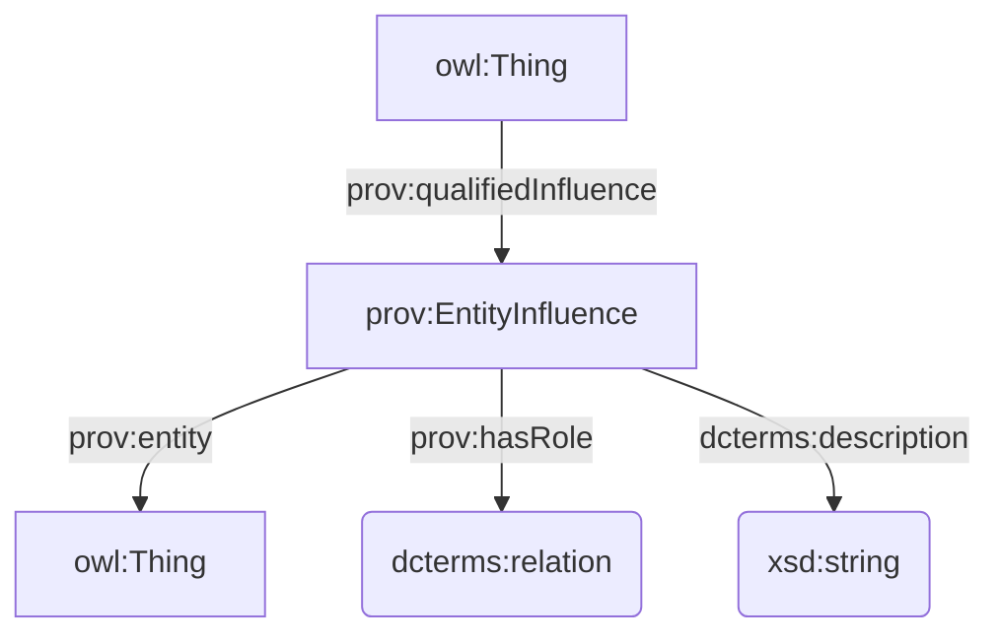

## DataCite

### Reificazione di `dcterms:relation`

Prima ho pensato di usare CiTO, ma questa dicitura nella [documentazione dello schema di DataCite](https://datacite-metadata-schema.readthedocs.io/en/4.7/properties/relatedidentifier/#b-relationtype)

    Note: Some relationTypes are processed as citations and references. Read more about [Contributing Citations and References](https://support.datacite.org/docs/contributing-citations-and-references) on the DataCite support site.

e il riferimento in CiTO stesso all'utilizzo solo delle proprietà di CiTO per il punning con `cito:hasCitationCharacterization` (pur non essendoci particolari constraint, da quello che mi risulta), mi ha dissuaso dall'utilizzarlo.

Ho cercato disperatamente tra gli ODP su https://odpa.github.io/patterns-repository/, ma non ho cavato un ragno dal buco.

Alla fine, ho optato per [PROV-O](https://www.w3.org/TR/prov-o/#description-qualified-terms) e, in particolare, sulla sua applicazione del _**Qualification Pattern**_, ovvero una forma di reificazione di una relazione intesa come un'influenza tra due entità (vedi anche [Qualified Relation](https://patterns.dataincubator.org/book/qualified-relation.html) e [N-ary Relation](https://www.w3.org/TR/swbp-n-aryRelations/)).



Una risorsa ha una certa relazione (`prov:qualifiedInfluence`) con un'altra risorsa. Questa relazione (`prov:EntityInfluence`) è caratterizzata da un tipo (`prov:hasRole`) il cui valore è definito con l'utilizzo di una Object Property tramite punning, e potenzialmente anche da una descrizione testuale(`dcterms:description`).

### Aggiunta di RightsIdentifier e RightsIdentifierScheme

Le due nuove classi e il nuovo individual sono documentati qui: https://docs.google.com/spreadsheets/d/1hYH1EDWG0LBdNagpbw8GJThhK4KnP0gUxjcHVq5QC3c/edit?usp=sharing

### Nuove classi (?) e individuals

- `DataPaper` equivale a `fabio:ResourcePaper`
- `PeerReview` equivale a `?`
- `Award` equivale a `?`
- `Instrument` equivale a `?`

I nuovi individuals `datacite:cstr`, `datacite:igsn`, `datacite:rrid` sono documentati qui: https://docs.google.com/spreadsheets/d/1hYH1EDWG0LBdNagpbw8GJThhK4KnP0gUxjcHVq5QC3c/edit?usp=sharing

Per raccogliere informazioni utili sui nuovi individuals ho utilizzato https://registry.identifiers.org/registry/.

### Domande

***

## CiTO

### Sperimentazione con `codespell`

Ho ripreso la versione più recente di HeRO e dal `venv` ho installato `codespell` (v2.4.2).

```bash
pip install codespell
```

Provo un dry run per fare solo reporting.

```bash
codespell docs/current/hero.ttl
```

Funziona! Mostra i typo sospettati con anche il file e la riga nel codice.

```bash
docs/current/hero.ttl:51: activites ==> activities, activates
docs/current/hero.ttl:59: Intension ==> Intention
docs/current/hero.ttl:72: exemple ==> example
docs/current/hero.ttl:751: occurence ==> occurrence
```

Un esempio del discorso fatto in precedenza rispetto alla particolarità delle terminologie di dominio: `Intension` **è** corretto, poiché è parte del nome di un OPD (_Intension Extension ODP_) che si basa su un termine della logica (_intension_) molto specialistico e piuttosto desueto, facilmente fraintendibile con _intention_.

Provo a testare il tuning della configurazione tramite `.codespellrc`. Creo il file nella root della repo, con il seguente contenuto:

```ini
[codespell]
skip = .git*,*.css,*.min.*,.codespellrc
check-hidden = true
ignore-words-list = intension
```

Funziona, ora ignora `Intension`:

```bash
docs/current/hero.ttl:51: activites ==> activities, activates
docs/current/hero.ttl:72: exemple ==> example
docs/current/hero.ttl:751: occurence ==> occurrence
```

Su un branch di `development` provo il comando per la correzione automatica degli errori individuati:

```bash
codespell -w docs/current/hero.ttl
```

Funziona, ma il caso con due possibili correzioni non viene risolto automaticamente. Cerco di capire come fare.

### Altri issues

- https://github.com/SPAROntologies/cito/issues/5
- https://github.com/SPAROntologies/cito/issues/4
- https://github.com/SPAROntologies/cito/issues/3
- https://github.com/SPAROntologies/cito/issues/2
- https://github.com/SPAROntologies/cito/issues/1

### Domande

***

## FaBiO

### Issues

- https://github.com/SPAROntologies/fabio/issues/5
- https://github.com/SPAROntologies/fabio/issues/4
- https://github.com/SPAROntologies/fabio/issues/3

### Domande

***

## AMO

### Issues

- https://github.com/SPAROntologies/amo/issues/1

### Domande

***

## FRBR

### Issues

- https://github.com/SPAROntologies/frbr/issues/1

***

## BiRO

### Issues

- https://github.com/SPAROntologies/biro/issues/1

***

## DEO

### Issues

- https://github.com/SPAROntologies/deo/issues/2

***

## FR

### Issues

- https://github.com/SPAROntologies/fr/issues/1

***

## VAULT

### Integrazione con LOV

### Integrazione con OpenAlex

### Ulteriori sviluppi

#### Aggiunta licenza

Sto esplorando l'utilizzo della specifica REUSE introdotta da Arca durante il meeting scorso, dando un occhio al loro [tutorial](https://reuse.software/tutorial/). Mi piace la soluzione offerta dal file `REUSE.toml`.

Sto pensando di usare [ISC](https://spdx.org/licenses/ISC.html), licenza approvata dall'Open Source Initiative e dalla Free Software Foundation.

#### Integrazione con Zenodo

#### Integrazione con OpenCitations

### Domande