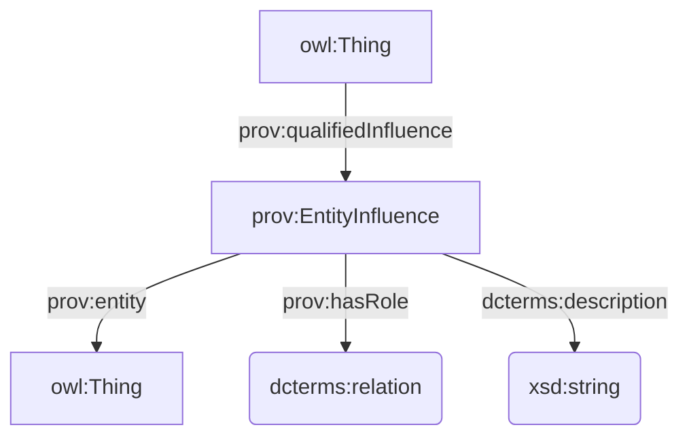

## DataCite

### Reificazione di `dcterms:relation`

Prima ho pensato di usare CiTO, ma questa dicitura nella [documentazione dello schema di DataCite](https://datacite-metadata-schema.readthedocs.io/en/4.7/properties/relatedidentifier/#b-relationtype)

    Note: Some relationTypes are processed as citations and references. Read more about [Contributing Citations and References](https://support.datacite.org/docs/contributing-citations-and-references) on the DataCite support site.

e il riferimento in CiTO stesso all'utilizzo solo delle proprietà di CiTO per il punning con `cito:hasCitationCharacterization` (pur non essendoci particolari constraint, da quello che mi risulta), mi ha dissuaso dall'utilizzarlo.

Ho cercato disperatamente tra gli ODP su https://odpa.github.io/patterns-repository/, ma non ho cavato un ragno dal buco.

Alla fine, ho optato per [PROV-O](https://www.w3.org/TR/prov-o/#description-qualified-terms) e, in particolare, sulla sua applicazione del _**Qualification Pattern**_, ovvero una forma di reificazione di una relazione intesa come un'influenza tra due entità (vedi anche [Qualified Relation](https://patterns.dataincubator.org/book/qualified-relation.html) e [N-ary Relation](https://www.w3.org/TR/swbp-n-aryRelations/)).

Una risorsa ha una certa relazione (`prov:qualifiedInfluence`) con un'altra risorsa. Questa relazione (`prov:EntityInfluence`) è caratterizzata da un tipo (`prov:hasRole`) il cui valore è definito con l'utilizzo di una Object Property tramite punning, e potenzialmente anche da una descrizione testuale(`dcterms:description`).

### Aggiunta di RightsIdentifier e RightsIdentifierScheme

### Nuove classi (?) e individuals

### Domande

## CiTO

### Sperimentazione con `codespell`

### Altri issues

- https://github.com/SPAROntologies/cito/issues/5
- https://github.com/SPAROntologies/cito/issues/4
- https://github.com/SPAROntologies/cito/issues/3
- https://github.com/SPAROntologies/cito/issues/2
- https://github.com/SPAROntologies/cito/issues/1

### Domande

## FaBiO

### Issues

- https://github.com/SPAROntologies/fabio/issues/5
- https://github.com/SPAROntologies/fabio/issues/4
- https://github.com/SPAROntologies/fabio/issues/3

### Domande

## AMO

### Issues

- https://github.com/SPAROntologies/amo/issues/1

### Domande

## FRBR

### Issues

- https://github.com/SPAROntologies/frbr/issues/1

## BiRO

### Issues

- https://github.com/SPAROntologies/biro/issues/1

## DEO

### Issues

- https://github.com/SPAROntologies/deo/issues/2

## FR

### Issues

- https://github.com/SPAROntologies/fr/issues/1

## VAULT

### Domande