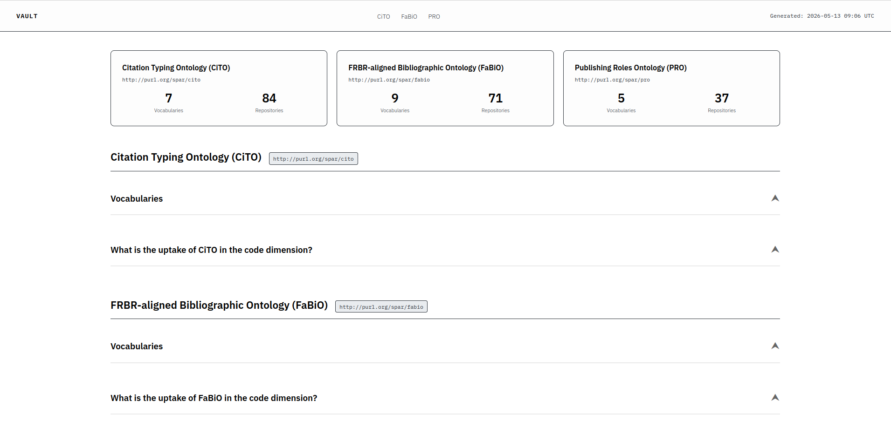
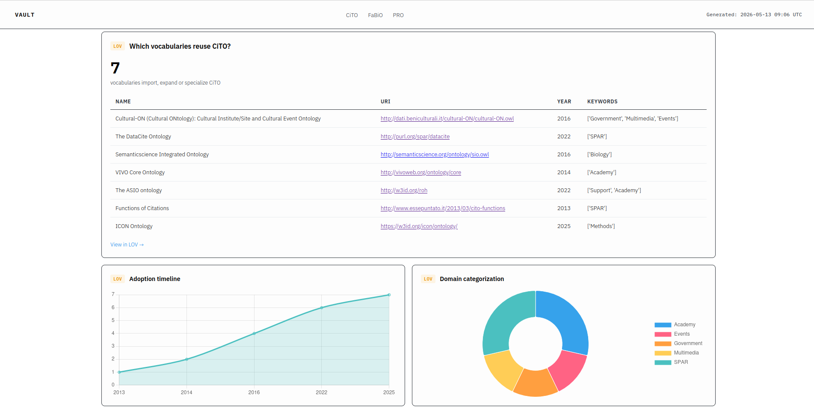
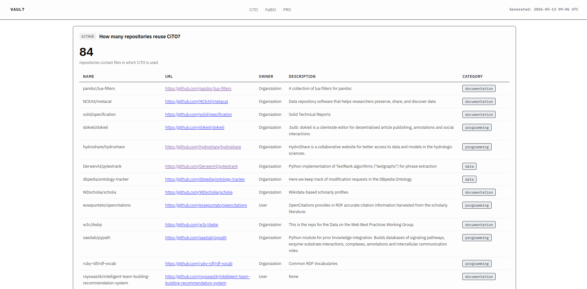
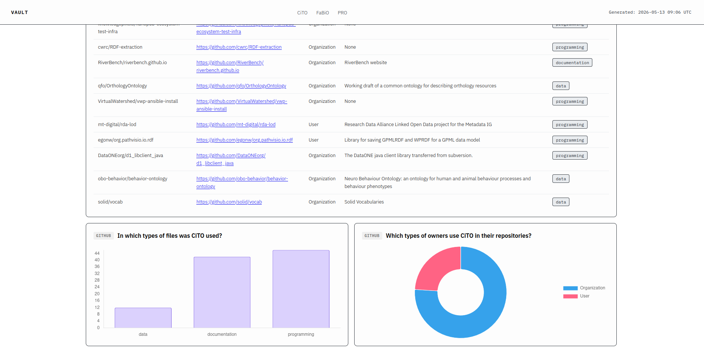

## GRAPHIA

Query SPARQL con priorità "high" fatte, con commenti e osservazioni in tabella

Appena ho tempo lavoro sulla produzione di dati realistici (a meno che non ne abbiamo già così posso usare direttamente quelli) e testo le query.

***

## Datacite

Prova: https://sbrzt.github.io/datacite/current/datacite.html

Ho aggiunto metadati per documentare meglio l'ontologia, ho aggiunto proprietà come `vann:example` per documentare meglio i termini, ho usato Widoco per generare la documentazione (per ora, poi passeremo a LODE2 ovviamente <3)

Esiste una documentazione di SAMOD per le versioni precedenti? Per quest'ultima versione potrei generare un paio di iterazioni (una per `datacite:RightsIdentifier` e una per `datacite:QualifiedRelation`), ma per quelle prima non so. Non so nemmeno quanto senso abbia, ma magari nel contesto di un articolo da pubblicare potrebbe essere utile.

***

## Aldrovandi

Modello aggiornato con constraint rilassati ed estensione riguardante gli agenti

Stiamo lavorando sull'estensione dell'articolo per IJDL

**Domanda su Special Issue**: nella mail ci davano come deadline il 30 aprile. Noi abbiamo chiesto un'estensione di 2 settimana, e loro ci hann oconfermato che non ci sarebbe stato nessun problema. Se guardo le info della SI (https://link.springer.com/journal/799/updates/25330448), si parla però del 30 maggio 2026 come submission deadline. Se invece cerco il nome della SI su Google trovo questa pagina (https://link.springer.com/collections/ahchejbbgc) in cui mi dice che non accettano submission. Sono confuso?

***

## FaBiO e FRBR-LRM

Articolo su OpenWEMI: https://journal.code4lib.org/articles/16491

Finita documentazione aggiuntiva per FaBiO, sto facendo un ultimo giro di controllo prima dell'implementazione.

Iniziata documentazione aggiuntiva per FRBR.

***

## VAULT

Finita rifattorizzazione del modulo GitHub, ora visualizzo la frequenza delle tipologie di file in cui viene menzionata l'ontologia (data/documentation/programming) e la quantità di user vs. organization come owner delle repo che menzionano l'ontologia. Inoltre adesso mostro la lista di repo completa. 

Da implementare un modo carino per rivelare gradualmente le liste lunghe. 

Da ignorare i microtesti terribili e i colori a caso.

