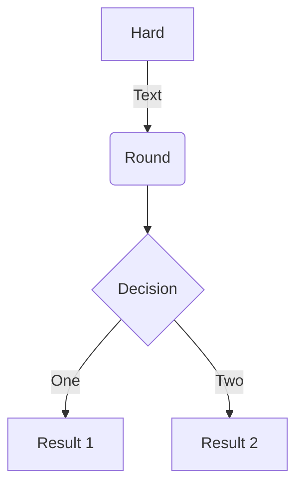
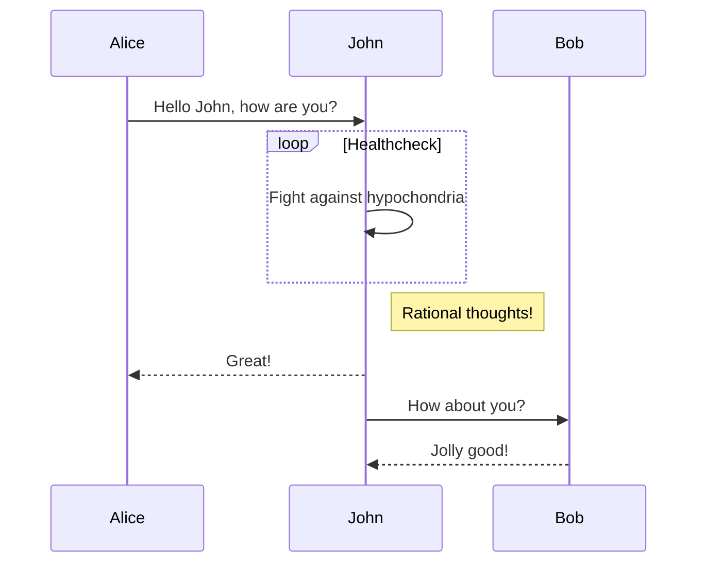
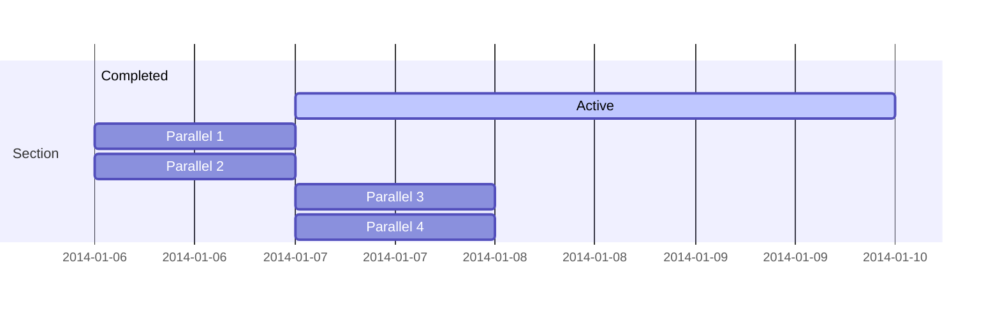
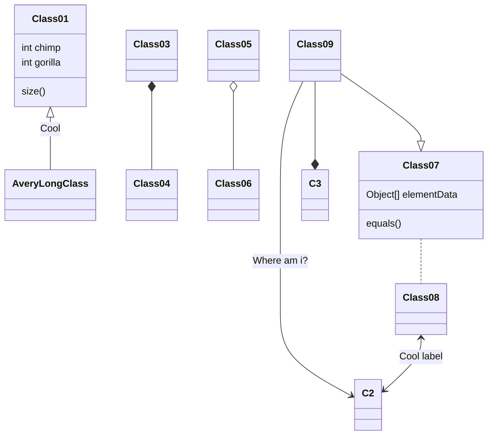
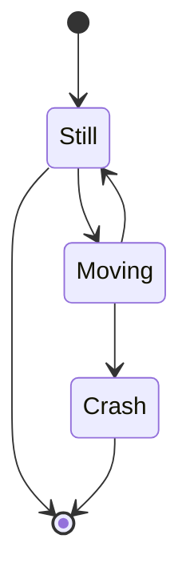

text 

## Examples

`highlight`

```python
def hello_world(par):
  print("Hello world")
```

```markmap {height="200px"}
- Hugo Modules
  - wowchemy
  - blox-plugins-netlify
  - blox-plugins-netlify-cms
  - blox-plugins-reveal
```

```markmap
- Mindmaps
  - Links
    - [Wowchemy Docs](https://docs.hugoblox.com/)
    - [Discord Community](https://discord.gg/z8wNYzb)
    - [GitHub](https://github.com/HugoBlox/hugo-blox-builder)
  - Features
    - Markdown formatting
    - **inline** ~~text~~ *styles*
    - multiline
      text
    - `inline code`
    -
      ```js
      console.log('hello');
      console.log('code block');
      ```
    - Math: $x = {-b \pm \sqrt{b^2-4ac} \over 2a}$
```














- [x] Write math example
  - [x] Write diagram example
- [ ] Do something else



{}
A Markdown aside is useful for displaying notices, hints, or definitions to your readers.
{}

 You found me! 

 Terminal  
 Python  
 R

## Organize your notebooks
Place the notebooks that you would like to publish in a `notebooks` folder at the root of your website.

## Import the notebooks into your site
```bash
pipx install academic
academic import 'notebooks/**.ipynb' content/post/ --verbose
```

## References
- Jonathan Blaney, "Introduction to the Principles of Linked Open Data," Programming Historian 6 (2017), https://doi.org/10.46430/phen0068.
- Tom Heath and Christian Bizer (2011) Linked Data: Evolving the Web into a Global Data Space (1st edition). Synthesis Lectures on the Semantic Web: Theory and Technology, 1:1, 1-136. Morgan & Claypool.

### Did you find this page helpful? Consider sharing it 🙌
